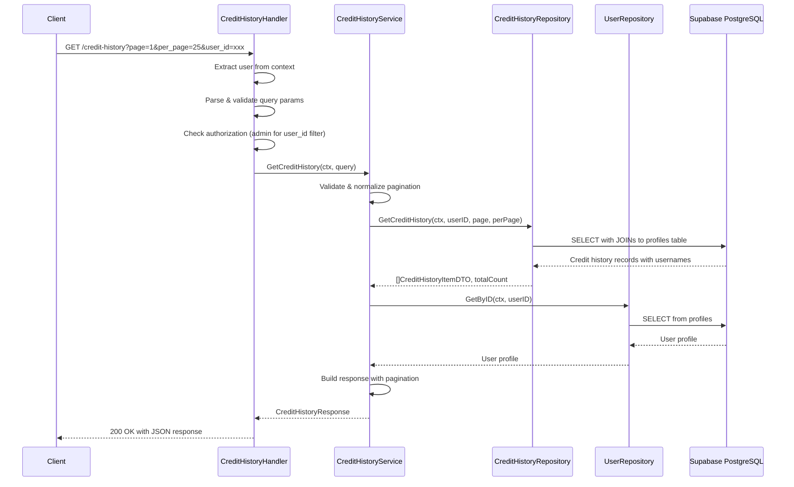

# API Endpoint Implementation Plan: GET /credit-history

## 1. Endpoint Overview

This endpoint retrieves a paginated list of credit transaction history records. The endpoint implements role-based access control:
- **Regular users** can only view their own credit transaction history
- **Admins/Super admins** can view all users' credit history and filter by specific user ID

The endpoint returns enriched credit history data including usernames and admin usernames (via joins), alongside the user's current credit balance from their profile.

## 2. Request Details

- **HTTP Method**: `GET`
- **URL Structure**: `/credit-history`
- **Parameters**:
  - **Optional Query Parameters**:
    - `page` (integer, default: 1): Page number for pagination
    - `per_page` (integer, default: 25, allowed values: 10/25/50/100): Number of items per page
    - `user_id` (UUID, admin only): Filter credit history by specific user ID
  
- **Request Headers**:
  - `Authorization: Bearer <JWT_TOKEN>` (Required for authentication)

- **Request Body**: None (GET request)

## 3. Used Types

### DTOs (to be created in `backend/internal/types/credit_types.go`)

```go
// CreditHistoryItemDTO represents a single credit transaction record with enriched user data
type CreditHistoryItemDTO struct {
    ID              string  `json:"id"`
    UserID          string  `json:"user_id"`
    Username        string  `json:"username"`
    Amount          int32   `json:"amount"`
    Reason          string  `json:"reason"`
    Description     *string `json:"description"`
    ReservationID   *string `json:"reservation_id"`
    AdminID         *string `json:"admin_id"`
    AdminUsername   *string `json:"admin_username"`
    CreatedAt       string  `json:"created_at"`
}

// CreditHistoryResponse represents the paginated credit history response
type CreditHistoryResponse struct {
    CreditHistory  []CreditHistoryItemDTO `json:"credit_history"`
    Pagination     Pagination             `json:"pagination"`
    CurrentBalance int32                  `json:"current_balance"`
}

// GetCreditHistoryQuery encapsulates query parameters for credit history retrieval
type GetCreditHistoryQuery struct {
    Page    int
    PerPage int
    UserID  *string
}
```

### Existing Types (already available)

- `types.PublicCreditHistorySelect` - Database entity from `database_types.go`
- `types.PublicProfilesSelect` - For user profile data
- `types.Pagination` - From `api.types.go`
- `types.NotFoundError` - Error type
- `types.ValidationError` - Error type
- `types.ForbiddenError` - Error type

## 4. Response Details

### Success Response (200 OK)

```json
{
  "credit_history": [
    {
      "id": "uuid",
      "user_id": "uuid",
      "username": "john_doe",
      "amount": -20,
      "reason": "reservation_charge",
      "description": "Kayak rental Dec 1-5",
      "reservation_id": "uuid",
      "admin_id": null,
      "admin_username": null,
      "created_at": "2025-11-27T19:56:29Z"
    }
  ],
  "pagination": {
    "page": 1,
    "per_page": 25,
    "total_items": 45,
    "total_pages": 2
  },
  "current_balance": 150
}
```

### Error Responses

| Status Code | Scenario | Response Body |
|-------------|----------|---------------|
| 401 | Not authenticated | `{"error": "Unauthorized"}` |
| 403 | Non-admin trying to filter by user_id | `{"error": "Only admins can filter by user_id"}` |
| 400 | Invalid pagination parameters | `{"error": "Invalid per_page value. Allowed: 10, 25, 50, 100"}` |
| 404 | User ID not found (when filtering) | `{"error": "User with ID {id} not found"}` |
| 500 | Database or internal error | `{"error": "Internal Server Error"}` |

## 5. Data Flow



### Database Query Strategy

The repository will execute a JOIN query to fetch credit history with user and admin usernames in a single query:

```sql
SELECT 
    ch.id, ch.user_id, ch.amount, ch.reason, ch.description,
    ch.reservation_id, ch.admin_id, ch.created_at,
    u.username as username,
    a.username as admin_username
FROM credit_history ch
INNER JOIN profiles u ON ch.user_id = u.id
LEFT JOIN profiles a ON ch.admin_id = a.id
WHERE ch.user_id = $1  -- or omit for admin viewing all
ORDER BY ch.created_at DESC
LIMIT $2 OFFSET $3
```

A separate query will count total items for pagination.

## 6. Security Considerations

### Authentication
- JWT token validation via existing middleware
- Extract authenticated user from request context using `common.GetUserIDFromContext(r)`

### Authorization Rules

| User Role | Allowed Actions |
|-----------|----------------|
| Unauthenticated | ❌ Deny access (401) |
| Regular User | ✅ View own credit history<br>❌ Cannot use `user_id` filter (403) |
| Admin/Super Admin | ✅ View all credit history<br>✅ Filter by `user_id` parameter |

### Implementation

```go
// In handler
authenticatedUserID := common.GetUserIDFromContext(r)
if authenticatedUserID == "" {
    common.RespondUnauthorized(ctx, w)
    return
}

userIDFilter := r.URL.Query().Get("user_id")
authenticatedUser := common.GetUserFromContext(r)

// If regular user tries to filter by user_id
if userIDFilter != "" && !isAdmin(authenticatedUser.Role) {
    common.RespondError(ctx, w, http.StatusForbidden, "Only admins can filter by user_id")
    return
}

// If regular user, force filter to their own ID
if !isAdmin(authenticatedUser.Role) {
    userIDFilter = authenticatedUserID
}
```

### Data Exposure Prevention
- Regular users cannot see other users' credit transactions
- RLS policies on database level provide defense-in-depth
- No sensitive data (passwords, tokens) exposed in responses

## 7. Error Handling

### Validation Errors (400 Bad Request)

| Scenario | Validation | Error Message |
|----------|------------|---------------|
| Invalid `per_page` | Must be one of: 10, 25, 50, 100 | "Invalid per_page value. Allowed: 10, 25, 50, 100" |
| Invalid `page` | Must be >= 1 | "Page must be at least 1" |
| Invalid `user_id` format | Must be valid UUID | "Invalid user_id format" |

### Authorization Errors

| Scenario | Status Code | Error Message |
|----------|-------------|---------------|
| Missing JWT token | 401 | "Unauthorized" |
| Regular user using `user_id` filter | 403 | "Only admins can filter by user_id" |

### Not Found Errors (404)

| Scenario | Check | Error Message |
|----------|-------|---------------|
| Filtered user doesn't exist | When admin filters by `user_id` | "User with ID {id} not found" |

### Internal Errors (500)

- Database connection failures
- Query execution errors
- Unexpected errors during processing

All internal errors should be logged with context using `logger.Errorf(ctx, ...)` before returning generic "Internal Server Error" to client.

## 8. Performance Considerations

### Database Optimization

1. **Use of Indexes** (from db-plan.md):
   - Credit history queries will benefit from index on `(user_id, created_at)` for efficient filtering and sorting
   - Primary key index on `id` for lookups
   
2. **Query Optimization**:
   - Single JOIN query to fetch credit history with usernames (avoid N+1 queries)
   - Use `LIMIT` and `OFFSET` for pagination
   - Separate optimized `COUNT(*)` query for total items

3. **Pagination Best Practices**:
   - Enforce maximum `per_page` limit (100) defined in constants
   - Default to reasonable page size (25) to balance UX and performance
   - Return empty array for out-of-bounds pages rather than error

### Caching Considerations

- Credit history is append-only (immutable), making it cache-friendly
- Consider HTTP cache headers (`Cache-Control: private, max-age=60`) for user-specific data
- Current balance changes frequently, so avoid caching response with balance included

### Response Size

- Maximum response size with `per_page=100`: ~10-15KB (reasonable for HTTP)
- JSON serialization is fast with standard library

## 9. Implementation Steps

### Step 1: Create Type Definitions [DONE]
**File**: `backend/internal/types/credit_types.go` (new file)

1. Define `CreditHistoryItemDTO` with all required fields matching API spec
2. Define `CreditHistoryResponse` with array, pagination, and current balance
3. Define `GetCreditHistoryQuery` for internal query parameters

### Step 2: Create Repository Interface & Implementation [DONE]
**File**: `backend/internal/repository/credit_history.go` (new file)

1. Define `CreditHistoryRepository` interface:
   ```go
   type CreditHistoryRepository interface {
       GetCreditHistory(ctx context.Context, userID string, page, perPage int) ([]types.CreditHistoryItemDTO, int64, error)
   }
   ```

**File**: `backend/internal/repository/supabase/credit_history_repository.go` (new file)

2. Implement the repository using Supabase client:
   - Execute JOIN query with `credit_history`, `profiles` (for user), and `profiles` (for admin)
   - Map database rows to `CreditHistoryItemDTO`
   - Execute separate COUNT query for total items
   - Handle nullable fields (`description`, `reservation_id`, `admin_id`, `admin_username`)
   - Order by `created_at DESC` for most recent first

3. Add unit tests in `backend/internal/repository/supabase/credit_history_repository_test.go`

### Step 3: Create Service Layer [DONE]
**File**: `backend/internal/service/credit/credit_service.go` (new file or add to existing)

1. Define `CreditHistoryService` interface:
   ```go
   type CreditHistoryService interface {
       GetCreditHistory(ctx context.Context, query types.GetCreditHistoryQuery, requestingUserID string, isAdmin bool) (*types.CreditHistoryResponse, error)
   }
   ```

2. Implement service logic:
   - Validate and normalize pagination parameters (use constants from `internal/constants`)
   - Enforce `per_page` allowed values (10, 25, 50, 100)
   - Determine target user ID based on role and query
   - Call repository to fetch credit history
   - Call user repository to fetch current credit balance
   - Calculate `total_pages` using `math.Ceil`
   - Build and return `CreditHistoryResponse`

3. Error handling:
   - Return `ValidationError` for invalid pagination parameters
   - Return `NotFoundError` if admin filters by non-existent user
   - Return `InternalError` for database failures

4. Add unit tests in `backend/internal/service/credit/credit_service_test.go`:
   - Test regular user can only see own history
   - Test admin can filter by user_id
   - Test pagination calculations
   - Test error scenarios

### Step 4: Create HTTP Handler [DONE]
**File**: `backend/internal/handler/credit/credit_handler.go` (new file)

1. Define `CreditHistoryHandler` struct with service dependency
2. Implement `HandleGetCreditHistory(w http.ResponseWriter, r *http.Request)`:
   - Extract authenticated user from context
   - Parse query parameters (`page`, `per_page`, `user_id`)
   - Validate `user_id` format if provided (UUID validation)
   - Check authorization (forbid regular users from using `user_id` filter)
   - Build `GetCreditHistoryQuery`
   - Call service layer
   - Handle errors with appropriate HTTP status codes
   - Return JSON response with 200 OK

3. Implement `handleError()` helper function to map service errors:
   - `ValidationError` → 400
   - `NotFoundError` → 404
   - `ForbiddenError` → 403
   - Default → 500 (with logging)

### Step 5: Register Route and Wire Dependencies [DONE]
**File**: `backend/cmd/server/main.go`

1. Import credit handler package
2. Initialize repository: `creditRepo := supabase.NewCreditHistoryRepository(supabaseClient)`
3. Initialize service: `creditService := credit.NewCreditHistoryService(creditRepo, userRepo)`
4. Initialize handler: `creditHandler := credit.NewCreditHistoryHandler(creditService)`
5. Register route with auth middleware:
   ```go
   router.HandleFunc("GET /credit-history", 
       authMiddleware.RequireAuth(creditHandler.HandleGetCreditHistory))
   ```

### Step 6: Add Constants [DONE]
**File**: `backend/internal/constants/pagination.go` (if not exists, or add to existing constants file)

```go
const (
    DefaultPage              = 1
    DefaultPerPage           = 25
    MaxPerPage               = 100
    AllowedPerPageValues     = []int{10, 25, 50, 100}
)
```

### Step 7: Create Integration Tests [DONE]
**File**: `backend/internal/handler/credit/credit_handler_test.go`

1. Test scenarios:
   - ✅ Authenticated user retrieves own credit history
   - ✅ Admin retrieves all credit history
   - ✅ Admin filters by specific user_id
   - ✅ Pagination works correctly
   - ❌ Unauthenticated request returns 401
   - ❌ Regular user cannot use user_id filter (403)
   - ❌ Invalid per_page returns 400
   - ❌ Non-existent user_id returns 404 for admin

2. Use `httptest.NewRecorder()` and `httptest.NewRequest()` for HTTP testing
3. Mock service layer using testify/mock
4. Verify response status codes, JSON structure, and error messages

### Step 8: Update API Documentation
**File**: `documentation/api-plan.md`

1. Mark the credit history endpoint as implemented
2. Add link to implementation files
3. Note any deviations from spec (if any)

### Step 9: Manual Testing Checklist

- [ ] Test with valid credentials and various pagination parameters
- [ ] Test as regular user (should only see own history)
- [ ] Test as admin with `user_id` filter
- [ ] Test with invalid/missing authentication
- [ ] Test with invalid query parameters
- [ ] Verify response matches specification exactly
- [ ] Check current_balance is accurate
- [ ] Verify usernames are properly populated
- [ ] Test with empty credit history (new user)
- [ ] Load test with maximum `per_page=100`

### Step 10: Code Review

Before finalizing:
- [ ] All code follows Godoc commenting standards (from `.agent/rules/good-practises.md`)
- [ ] No hardcoded values; use constants
- [ ] DRY principle applied (no code duplication)
- [ ] Error handling follows established patterns
- [ ] Tests have good coverage and follow guidelines from `backend/docs/rules/go-testing.md`
- [ ] All linters pass without warnings
