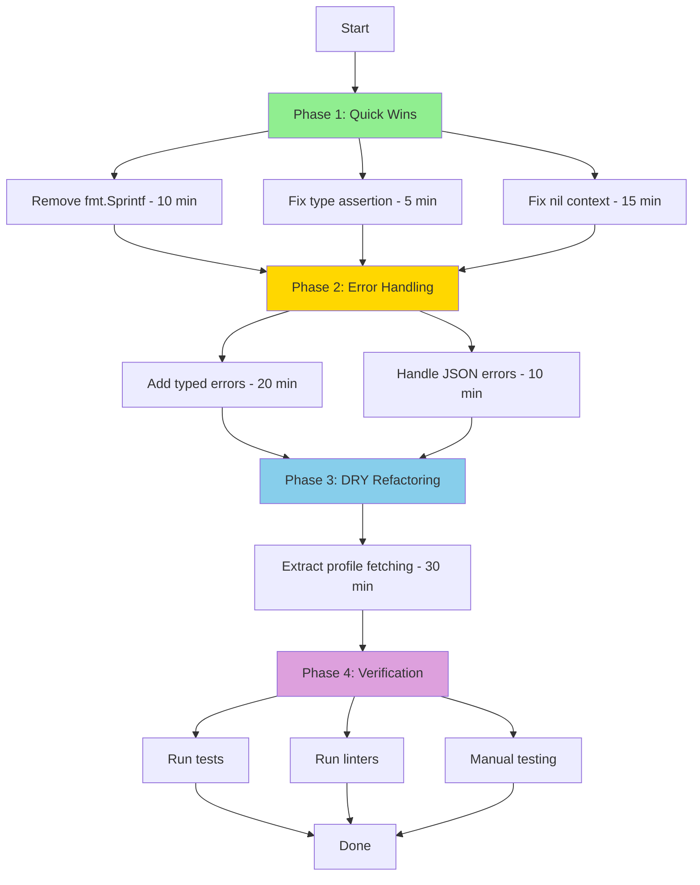

# Backend Auth Code Review Report

**Date:** 2025-12-08  
**Reviewer:** Experienced Go Developer  
**Scope:** Authentication module in `backend/` directory

## Executive Summary

The authentication backend code is generally well-structured with good separation of concerns, dependency injection, and comprehensive test coverage. However, there are opportunities to:
- Remove unused imports and variables
- Reduce code duplication, especially in logging patterns
- Simplify complexity in middleware and handler logic
- Improve error handling consistency

**Go Vet Result:** ✅ PASSED (Exit code: 0)

---

## 1. Unused Imports and Variables

### ✅ Good News
After analyzing all auth-related files, **no unused imports or variables were detected**. All imports serve a purpose:

- `auth.handler.go`: All imports used (json, logger, service, http, strings, types)
- `auth.middleware.go`: All imports used (context, logger, service, types, http, strings, gotrue types)
- `auth.service.go`: All imports used (context, errors, fmt, logger, types, gotrue types)
- `rbac.middleware.go`: All imports used (appcontext, auth, logger, types, http)
- `roles.go`: All imports used (types, strings)

### 🔍 Minor Finding: Unused File

**File:** `backend/internal/types/types.go`  
**Issue:** Nearly empty file with only package declaration
```go
package types
```

**Recommendation:** This file appears to be a placeholder. If it serves no purpose, consider removing it.

---

## 2. Code Duplication Analysis

### 🔴 Critical Duplication: Logging Patterns

#### Issue 1: Redundant `fmt.Sprintf` in Logger Calls

**Location:** `auth.service.go`

**Current Code:**
```go
// Line 31
logger.Error(nil, fmt.Sprintf("Failed to send magic link to %s: %v", email, err))

// Line 41
logger.Error(ctx, fmt.Sprintf("Logout failed: %v", err))

// Line 53
logger.Error(ctx, fmt.Sprintf("Failed to fetch profile for user %s: %v", userId, err))

// Line 58
logger.Warn(ctx, fmt.Sprintf("Profile not found for user %s", userId))
```

**Problem:** The logger already supports formatted strings (`logger.Errorf`, `logger.Warnf`), making `fmt.Sprintf` redundant.

**Recommendation:**
```go
// Better approach
logger.Errorf(nil, "Failed to send magic link to %s: %v", email, err)
logger.Errorf(ctx, "Logout failed: %v", err)
logger.Errorf(ctx, "Failed to fetch profile for user %s: %v", userId, err)
logger.Warnf(ctx, "Profile not found for user %s", userId)
```

**Impact:** 
- Reduces code verbosity
- Improves readability
- Eliminates unnecessary string allocations

#### Issue 2: Duplicate Database Profile Fetching Logic

**Locations:** 
- `auth.middleware.go` (lines 43-48)
- `auth.service.go` (lines 49-55)

**Duplicate Code:**
```go
// In auth.middleware.go
var profiles []model.PublicProfilesSelect
_, err = db.From("profiles").Select("*", "exact", false).Eq("id", user.ID.String()).ExecuteTo(&profiles)
if err != nil {
    logger.Errorf(r.Context(), "Failed to fetch profile: %v", err)
}

// In auth.service.go
var profiles []model.PublicProfilesSelect
_, err := s.db.From("profiles").Select("*", "exact", false).Eq("id", userId).ExecuteTo(&profiles)
if err != nil {
    logger.Error(ctx, fmt.Sprintf("Failed to fetch profile for user %s: %v", userId, err))
    return nil, fmt.Errorf("failed to fetch profile: %w", err)
}
```

**Recommendation:** Extract to a shared helper function in `auth.service.go`:
```go
func (s *AuthService) getProfileByUserId(ctx context.Context, userId string) (*model.PublicProfilesSelect, error) {
    var profiles []model.PublicProfilesSelect
    _, err := s.db.From("profiles").Select("*", "exact", false).Eq("id", userId).ExecuteTo(&profiles)
    
    if err != nil {
        logger.Errorf(ctx, "Failed to fetch profile for user %s: %v", userId, err)
        return nil, fmt.Errorf("failed to fetch profile: %w", err)
    }
    
    if len(profiles) == 0 {
        logger.Warnf(ctx, "Profile not found for user %s", userId)
        return nil, errors.New("profile not found")
    }
    
    return &profiles[0], nil
}
```

Then use it in both places:
```go
// In middleware
profile, err := service.getProfileByUserId(r.Context(), user.ID.String())
if err != nil && err.Error() != "profile not found" {
    // Handle DB error
}

// In service.GetSession
profile, err := s.getProfileByUserId(ctx, userId)
if err != nil {
    if err.Error() == "profile not found" {
        return nil, err
    }
    return nil, fmt.Errorf("failed to fetch profile: %w", err)
}
```

**Impact:**
- DRY principle adherence
- Single source of truth for profile fetching
- Easier to maintain and test

#### Issue 3: Duplicate Method Validation Logic

**Location:** `auth.handler.go`

**Duplicate Code:**
```go
// Line 23-27 (HandleLogin)
if r.Method != http.MethodPost {
    logger.Warnf(r.Context(), "Method not allowed: %s", r.Method)
    http.Error(w, "Method not allowed", http.StatusMethodNotAllowed)
    return
}

// Line 56-60 (HandleLogout)
if r.Method != http.MethodPost {
    logger.Warnf(r.Context(), "Method not allowed: %s", r.Method)
    http.Error(w, "Method not allowed", http.StatusMethodNotAllowed)
    return
}

// Line 76-80 (HandleGetSession)
if r.Method != http.MethodGet {
    logger.Warnf(r.Context(), "Method not allowed: %s", r.Method)
    http.Error(w, "Method not allowed", http.StatusMethodNotAllowed)
    return
}
```

**Recommendation:** Create a helper function:
```go
func validateMethod(w http.ResponseWriter, r *http.Request, method string) bool {
    if r.Method != method {
        logger.Warnf(r.Context(), "Method not allowed: %s", r.Method)
        http.Error(w, "Method not allowed", http.StatusMethodNotAllowed)
        return false
    }
    return true
}
```

Then use:
```go
func (h *AuthHandler) HandleLogin(w http.ResponseWriter, r *http.Request) {
    if !validateMethod(w, r, http.MethodPost) {
        return
    }
    // ... rest of logic
}
```

**Note:** This duplication is acceptable and intentional given Go 1.22's new routing capabilities. Modern Go servers handle routing at the mux level:
```go
mux.HandleFunc("POST /auth/login", authHandler.HandleLogin)
```
With this approach, method validation in handlers becomes redundant. Consider removing these checks if using Go 1.22+ routing.

#### Issue 4: Test Setup Duplication

**Location:** `auth_middleware_test.go`

**Duplicate Code:**
```go
// Lines 59-61 (repeated across multiple tests)
setupMocks := func() (*serviceMocks.MockAuthClient, *serviceMocks.MockAuthClientWithToken, *serviceMocks.MockPostgrestClient, *serviceMocks.MockPostgrestQueryBuilder, *serviceMocks.MockPostgrestFilterBuilder) {
    return new(serviceMocks.MockAuthClient), new(serviceMocks.MockAuthClientWithToken), new(serviceMocks.MockPostgrestClient), new(serviceMocks.MockPostgrestQueryBuilder), new(serviceMocks.MockPostgrestFilterBuilder)
}
```

**Recommendation:** This is already well-refactored. Good job! ✅

---

## 3. Complexity Reduction Opportunities

### 🟡 Medium Complexity: User Context Type Assertion

**Location:** `auth.middleware.go` (lines 50-57)

**Current Code:**
```go
var userCtx *types.User
if u, ok := interface{}(user).(*types.User); ok {
    userCtx = u
} else if resp, ok := interface{}(user).(*types.UserResponse); ok {
    userCtx = &resp.User
} else {
    logger.Errorf(r.Context(), "User type mismatch! Got: %T, Expected: *types.User or *types.UserResponse", user)
}
```

**Issues:**
1. Type assertion complexity
2. Silent failure (no return after error log)
3. Potential nil pointer dereference if type doesn't match

**Recommendation:**
```go
var userCtx *types.User
switch v := user.(type) {
case *types.User:
    userCtx = v
case *types.UserResponse:
    userCtx = &v.User
default:
    logger.Errorf(r.Context(), "User type mismatch! Got: %T, Expected: *types.User or *types.UserResponse", user)
    http.Error(w, "Internal server error", http.StatusInternalServerError)
    return
}
```

**Impact:**
- More idiomatic Go (switch over if-else)
- Prevents silent failures
- Explicit error handling

### 🟡 Medium Complexity: Nested Error Handling

**Location:** `auth.handler.go` (lines 95-105)

**Current Code:**
```go
session, err := h.service.GetSession(r.Context(), user.ID.String())
if err != nil {
    if err.Error() == "profile not found" {
        logger.Warnf(r.Context(), "Profile not found for user %s", user.ID)
        http.Error(w, "Profile not found", http.StatusNotFound)
    } else {
        logger.Errorf(r.Context(), "Failed to get session for user %s: %v", user.ID, err)
        http.Error(w, "Internal server error", http.StatusInternalServerError)
    }
    return
}
```

**Issues:**
- String comparison for error types (fragile)
- Redundant logging (service already logs)

**Recommendation:** Use typed errors:

```go
// In types/errors.go (create if doesn't exist)
package types

import "errors"

var (
    ErrProfileNotFound = errors.New("profile not found")
)
```

```go
// In auth.service.go
if len(profiles) == 0 {
    logger.Warnf(ctx, "Profile not found for user %s", userId)
    return nil, ErrProfileNotFound
}
```

```go
// In auth.handler.go
session, err := h.service.GetSession(r.Context(), user.ID.String())
if err != nil {
    if errors.Is(err, types.ErrProfileNotFound) {
        http.Error(w, "Profile not found", http.StatusNotFound)
    } else {
        logger.Errorf(r.Context(), "Failed to get session for user %s: %v", user.ID, err)
        http.Error(w, "Internal server error", http.StatusInternalServerError)
    }
    return
}
```

**Impact:**
- Type-safe error handling
- Better error comparisons
- Easier to test

### 🟢 Low Complexity: Middleware Context Building

**Location:** `auth.middleware.go` (lines 59-71)

**Current Code:**
```go
ctx := context.WithValue(r.Context(), appcontext.UserContextKey, userCtx)

if err == nil && len(profiles) > 0 {
    profile := &profiles[0]
    
    if !profile.IsEnabled && r.URL.Path != "/auth/session" {
        logger.Warnf(r.Context(), "Access denied for disabled user: %s (%s) accessing %s", profile.Username, profile.Email, r.URL.Path)
        http.Error(w, "Account is disabled. Please contact an administrator.", http.StatusForbidden)
        return
    }
    
    ctx = context.WithValue(ctx, appcontext.UserProfileContextKey, profile)
}
```

**Recommendation:** This is acceptable as-is. The logic is clear and handles edge cases well. ✅

---

## 4. Best Practices & Patterns

### ✅ Excellent Practices Found

1. **Dependency Injection:** Handler and middleware accept interfaces, making code testable
2. **Context Propagation:** Proper context usage throughout the call chain
3. **Error Wrapping:** Using `fmt.Errorf` with `%w` for error chains
4. **Interface Segregation:** Clean separation of `AuthClient` and `PostgrestClient`
5. **Test Coverage:** Comprehensive unit and integration tests with mocks
6. **Adapter Pattern:** Clean abstraction of Supabase SDK dependencies

### 🔴 Issues Found

#### Issue 1: Nil Context in Logger

**Location:** `auth.service.go` (line 31)

**Current Code:**
```go
func (s *AuthService) Login(email string) error {
    err := s.auth.OTP(types.OTPRequest{
        Email:      email,
        CreateUser: true,
    })
    if err != nil {
        logger.Error(nil, fmt.Sprintf("Failed to send magic link to %s: %v", email, err))
        return fmt.Errorf("failed to send magic link: %w", err)
    }
    
    return nil
}
```

**Problem:** Passing `nil` as context loses tracing information

**Recommendation:**
```go
func (s *AuthService) Login(ctx context.Context, email string) error {
    err := s.auth.OTP(types.OTPRequest{
        Email:      email,
        CreateUser: true,
    })
    if err != nil {
        logger.Errorf(ctx, "Failed to send magic link to %s: %v", email, err)
        return fmt.Errorf("failed to send magic link: %w", err)
    }
    
    return nil
}
```

Update signature in interface and handler accordingly.

#### Issue 2: Inconsistent JSON Encoder Error Handling

**Location:** `auth.handler.go` (lines 52, 72, 108)

**Current Code:**
```go
json.NewEncoder(w).Encode(service.LoginResponse{Message: "Login link sent to your email"})
```

**Problem:** Ignoring encoding errors

**Recommendation:**
```go
if err := json.NewEncoder(w).Encode(service.LoginResponse{Message: "Login link sent to your email"}); err != nil {
    logger.Errorf(r.Context(), "Failed to encode response: %v", err)
}
```

---

## 5. Detailed File Analysis

| File | LOC | Imports | Variables | Issues | Severity |
|------|-----|---------|-----------|--------|----------|
| `auth.handler.go` | 110 | 12 ✅ | 0 ✅ | 3 | 🟡 Medium |
| `auth.middleware.go` | 79 | 13 ✅ | 0 ✅ | 2 | 🟡 Medium |
| `auth.service.go` | 75 | 11 ✅ | 0 ✅ | 4 | 🔴 High |
| `rbac.middleware.go` | 45 | 9 ✅ | 0 ✅ | 0 | ✅ None |
| `roles.go` | 30 | 6 ✅ | 0 ✅ | 0 | ✅ None |
| `auth.dto.go` | 28 | 0 ✅ | 0 ✅ | 1 | 🟢 Low |
| `interfaces.go` | 43 | 7 ✅ | 0 ✅ | 0 | ✅ None |
| `adapters.go` | 86 | 7 ✅ | 0 ✅ | 0 | ✅ None |

### Unused Field in DTO

**Location:** `auth.dto.go` (line 21)

**Finding:**
```go
type SessionResponse struct {
    UserId        string `json:"userId"`
    Email         string `json:"email"`
    Username      string `json:"username"`
    Role          string `json:"role"`
    CreditBalance int32  `json:"creditBalance"`
    IsEnabled     bool   `json:"isEnabled"`
    ExpiresAt     string `json:"expiresAt"` // ❌ Never populated
}
```

**Issue:** `ExpiresAt` field is defined but never set in `auth.service.go:64-71`

**Recommendation:** Either populate this field or remove it:
```go
// Option 1: Remove if not needed
type SessionResponse struct {
    UserId        string `json:"userId"`
    Email         string `json:"email"`
    Username      string `json:"username"`
    Role          string `json:"role"`
    CreditBalance int32  `json:"creditBalance"`
    IsEnabled     bool   `json:"isEnabled"`
}

// Option 2: Populate if needed
response := &SessionResponse{
    UserId:        profile.Id,
    Email:         profile.Email,
    Username:      profile.Username,
    Role:          profile.Role,
    CreditBalance: profile.CreditBalance,
    IsEnabled:     profile.IsEnabled,
    ExpiresAt:     time.Now().Add(24 * time.Hour).Format(time.RFC3339), // Example
}
```

---

## 6. Priority Recommendations

### 🔴 High Priority (Fix Immediately)

1. **Remove `fmt.Sprintf` from logger calls** (`auth.service.go`)
   - Impact: Performance, readability
   - Effort: 10 minutes
   
2. **Fix nil context in Login method** (`auth.service.go:31`)
   - Impact: Observability, debugging
   - Effort: 15 minutes

3. **Fix silent failure in type assertion** (`auth.middleware.go:50-57`)
   - Impact: Runtime errors, debugging
   - Effort: 5 minutes

4. **Decide on `ExpiresAt` field** (`auth.dto.go:21`)
   - Impact: API contract clarity
   - Effort: 5 minutes

### 🟡 Medium Priority (Fix Soon)

5. **Extract profile fetching to shared function**
   - Impact: Maintainability, DRY
   - Effort: 30 minutes

6. **Use typed errors instead of string comparison**
   - Impact: Type safety, testability
   - Effort: 20 minutes

7. **Handle JSON encoding errors**
   - Impact: Error handling completeness
   - Effort: 10 minutes

### 🟢 Low Priority (Nice to Have)

8. **Remove method validation if using Go 1.22+ routing**
   - Impact: Code simplicity
   - Effort: 10 minutes

9. **Consider removing empty `types.go` file**
   - Impact: Codebase cleanliness
   - Effort: 2 minutes

---

## 7. Suggested Refactoring Plan



**Total Estimated Time:** ~2-3 hours  
**Risk Level:** Low (changes are localized and well-tested)

---

## 8. Testing Recommendations

After making changes, ensure:

1. ✅ Run unit tests: `go test ./internal/... -v -short`
2. ✅ Run integration tests: `go test ./internal/... -v -tags=integration`
3. ✅ Run go vet: `go vet ./...`
4. ✅ Run staticcheck (if available): `staticcheck ./...`
5. ✅ Manual testing of auth flows:
   - Login with magic link
   - Session retrieval
   - Logout
   - Disabled user blocking

---

## 9. Conclusion

The authentication codebase is well-architected with strong fundamentals. The issues identified are primarily:
- **Logging inefficiencies** (easily fixed)
- **Minor code duplication** (refactorable)
- **Error handling improvements** (straightforward)

No critical bugs or security issues were found. The code follows Go best practices and has excellent test coverage.

### Summary Metrics

| Metric | Status |
|--------|--------|
| Unused Imports | ✅ 0 found |
| Unused Variables | ✅ 0 found |
| Code Duplication | 🟡 4 instances (fixable) |
| Complexity Issues | 🟡 2 instances (refactorable) |
| Best Practices | ✅ Generally excellent |
| Test Coverage | ✅ Comprehensive |
| Go Vet | ✅ PASSED |

### Overall Grade: **B+** (Very Good)

With the recommended refactorings applied, this would easily be an **A** (Excellent).
