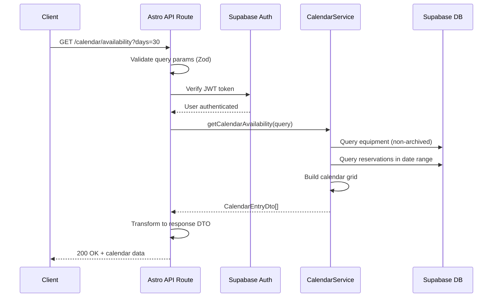
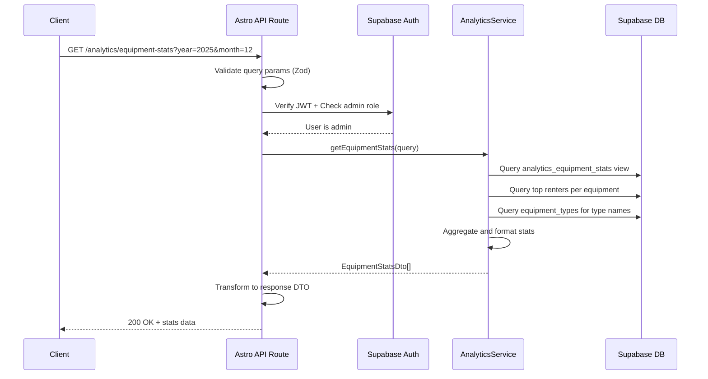
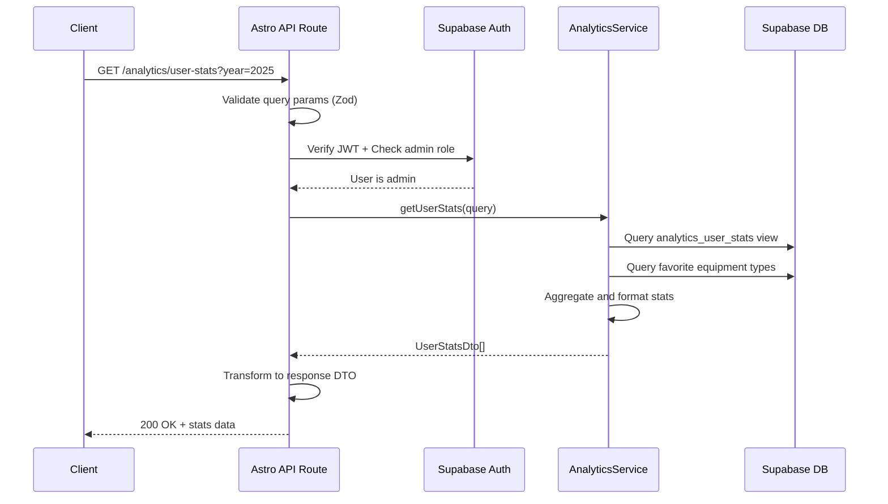

# API Endpoint Implementation Plan: Calendar & Analytics

## 1. Endpoint Overview

This plan covers the implementation of three REST API endpoints for calendar and analytics functionality:

### GET /calendar/availability
Provides equipment availability calendar data across a specified date range. Returns daily availability status for equipment, including reservation information when items are unavailable.

### GET /analytics/equipment-stats
Admin-only endpoint providing aggregated equipment usage statistics, including total reservations, rental days, utilization rates, and top renters per equipment item.

### GET /analytics/user-stats
Admin-only endpoint providing aggregated user activity statistics, including reservation counts, credit spending, and favorite equipment types.

## 2. Request Details

### GET /calendar/availability

- **HTTP Method**: GET
- **URL Structure**: `/calendar/availability`
- **Parameters**:
  - **Optional**:
    - `equipment_id` (uuid): Filter for specific equipment
    - `start_date` (date, ISO 8601 format): Calendar start date (default: today)
    - `days` (integer): Number of days to show (default: 30, max: 90)
- **Request Body**: None
- **Authentication**: Required (Supabase JWT)

### GET /analytics/equipment-stats

- **HTTP Method**: GET
- **URL Structure**: `/analytics/equipment-stats`
- **Parameters**:
  - **Optional**:
    - `year` (integer): Filter by year (e.g., 2025)
    - `month` (integer): Filter by month (1-12)
    - `equipment_id` (uuid): Specific equipment filter
- **Request Body**: None
- **Authentication**: Required (Supabase JWT)
- **Authorization**: Admin or SuperAdmin role required

### GET /analytics/user-stats

- **HTTP Method**: GET
- **URL Structure**: `/analytics/user-stats`
- **Parameters**:
  - **Optional**:
    - `year` (integer): Filter by year
    - `month` (integer): Filter by month (1-12)
- **Request Body**: None
- **Authentication**: Required (Supabase JWT)
- **Authorization**: Admin or SuperAdmin role required

## 3. Used Types

### DTOs (Response Types)

```typescript
// Calendar Types
export interface CalendarEntryDto {
  date: string; // ISO 8601 date format (YYYY-MM-DD)
  equipmentId: string;
  equipmentName: string;
  isAvailable: boolean;
  reservationId?: string | null;
  reservationStatus?: 'PENDING' | 'RENTED' | 'RETURNED' | 'DENIED';
}

export interface GetCalendarAvailabilityResponseDto {
  calendar: CalendarEntryDto[];
}

// Analytics Types
export interface TopRenterDto {
  userId: string;
  username: string;
  reservationCount: number;
  daysRented: number;
}

export interface EquipmentStatsDto {
  equipmentId: string;
  equipmentName: string;
  equipmentType: string;
  totalReservations: number;
  totalDaysRented: number;
  utilizationRate: number; // 0.0 to 1.0
  topRenters: TopRenterDto[];
}

export interface PeriodDto {
  year?: number;
  month?: number;
}

export interface GetEquipmentStatsResponseDto {
  equipmentStats: EquipmentStatsDto[];
  period: PeriodDto;
}

export interface UserStatsDto {
  userId: string;
  username: string;
  totalReservations: number;
  totalCreditsSpent: number;
  lastReservationDate: string | null; // ISO 8601 date format
  favoriteEquipmentType: string | null;
}

export interface GetUserStatsResponseDto {
  userStats: UserStatsDto[];
  period: PeriodDto;
}
```

### Query Parameter Validation Schemas (Zod)

```typescript
import { z } from 'zod';

// Calendar Query Schema
export const GetCalendarAvailabilityQuerySchema = z.object({
  equipmentId: z.string().uuid().optional(),
  startDate: z.string().regex(/^\d{4}-\d{2}-\d{2}$/).optional(),
  days: z.coerce.number().int().min(1).max(90).default(30),
});

export type GetCalendarAvailabilityQuery = z.infer<typeof GetCalendarAvailabilityQuerySchema>;

// Equipment Stats Query Schema
export const GetEquipmentStatsQuerySchema = z.object({
  year: z.coerce.number().int().positive().optional(),
  month: z.coerce.number().int().min(1).max(12).optional(),
  equipmentId: z.string().uuid().optional(),
});

export type GetEquipmentStatsQuery = z.infer<typeof GetEquipmentStatsQuerySchema>;

// User Stats Query Schema
export const GetUserStatsQuerySchema = z.object({
  year: z.coerce.number().int().positive().optional(),
  month: z.coerce.number().int().min(1).max(12).optional(),
});

export type GetUserStatsQuery = z.infer<typeof GetUserStatsQuerySchema>;
```

## 4. Response Details

### GET /calendar/availability

**Success Response (200 OK)**:
```json
{
  "calendar": [
    {
      "date": "2025-12-05",
      "equipmentId": "123e4567-e89b-12d3-a456-426614174000",
      "equipmentName": "Red Kayak",
      "isAvailable": true,
      "reservationId": null
    },
    {
      "date": "2025-12-06",
      "equipmentId": "123e4567-e89b-12d3-a456-426614174000",
      "equipmentName": "Red Kayak",
      "isAvailable": false,
      "reservationId": "789e4567-e89b-12d3-a456-426614174111",
      "reservationStatus": "PENDING"
    }
  ]
}
```

**Error Responses**:
- `400 Bad Request`: Invalid query parameters (malformed UUID, invalid date, days out of range)
- `401 Unauthorized`: Missing or invalid authentication token

### GET /analytics/equipment-stats

**Success Response (200 OK)**:
```json
{
  "equipmentStats": [
    {
      "equipmentId": "123e4567-e89b-12d3-a456-426614174000",
      "equipmentName": "Red Kayak",
      "equipmentType": "Kayak",
      "totalReservations": 25,
      "totalDaysRented": 120,
      "utilizationRate": 0.65,
      "topRenters": [
        {
          "userId": "user-uuid-1",
          "username": "john_doe",
          "reservationCount": 8,
          "daysRented": 35
        }
      ]
    }
  ],
  "period": {
    "year": 2025,
    "month": 12
  }
}
```

**Error Responses**:
- `400 Bad Request`: Invalid query parameters
- `401 Unauthorized`: Missing or invalid authentication token
- `403 Forbidden`: User is not an admin

### GET /analytics/user-stats

**Success Response (200 OK)**:
```json
{
  "userStats": [
    {
      "userId": "user-uuid-1",
      "username": "john_doe",
      "totalReservations": 15,
      "totalCreditsSpent": 180,
      "lastReservationDate": "2025-12-01",
      "favoriteEquipmentType": "Kayak"
    }
  ],
  "period": {
    "year": 2025,
    "month": 12
  }
}
```

**Error Responses**:
- `400 Bad Request`: Invalid query parameters
- `401 Unauthorized`: Missing or invalid authentication token
- `403 Forbidden`: User is not an admin

## 5. Data Flow

### GET /calendar/availability



**Detailed Flow**:
1. Parse and validate query parameters using Zod schema
2. Set default values (`start_date` = today, `days` = 30)
3. Verify user authentication via `context.locals.supabase`
4. Call `CalendarService.getCalendarAvailability(query)`
5. Service layer:
   - Generate date range array from `start_date` to `start_date + days`
   - Query equipment table (filter by `equipment_id` if provided, exclude archived)
   - Query reservations that overlap with date range
   - For each equipment and each date:
     - Check if any reservation overlaps that specific date
     - Set `isAvailable` based on reservation existence
     - Include reservation details if unavailable
6. Transform database results to DTOs
7. Return 200 OK with calendar data

### GET /analytics/equipment-stats



**Detailed Flow**:
1. Parse and validate query parameters using Zod schema
2. Verify user authentication via `context.locals.supabase`
3. Check user role (must be 'admin' or 'super_admin') - return 403 if not
4. Call `AnalyticsService.getEquipmentStats(query)`
5. Service layer:
   - Query `analytics_equipment_stats` view
   - Apply filters (year, month, equipment_id)
   - For each equipment, query top renters:
     - Join reservations with profiles
     - Filter by time period
     - Group by user
     - Calculate reservation count and total days rented
     - Sort by reservation count DESC
     - Limit to top 5 renters
   - Join with equipment_types to get type names
6. Transform database results to DTOs
7. Return 200 OK with equipment stats and period information

### GET /analytics/user-stats



**Detailed Flow**:
1. Parse and validate query parameters using Zod schema
2. Verify user authentication via `context.locals.supabase`
3. Check user role (must be 'admin' or 'super_admin') - return 403 if not
4. Call `AnalyticsService.getUserStats(query)`
5. Service layer:
   - Query `analytics_user_stats` view
   - Apply filters (year, month)
   - For each user, calculate favorite equipment type:
     - Join reservations with equipment and equipment_types
     - Filter by time period
     - Group by equipment type
     - Count reservations per type
     - Select most frequent type
6. Transform database results to DTOs
7. Return 200 OK with user stats and period information

## 6. Security Considerations

### Authentication
- **All endpoints** require valid Supabase JWT token
- Extract user from `context.locals.supabase.auth.getUser()`
- Return 401 if authentication fails

### Authorization
- **Calendar endpoint**: Any authenticated user can access
- **Analytics endpoints**: Only users with role 'admin' or 'super_admin' can access
- Query user profile from database to check role
- Return 403 Forbidden if user lacks required role

### Data Validation
- Use Zod schemas for all query parameter validation
- Validate UUID format using `z.string().uuid()`
- Validate date format using regex pattern `^\d{4}-\d{2}-\d{2}$`
- Enforce min/max constraints on numeric parameters
- Return 400 Bad Request with validation error details

### SQL Injection Prevention
- Use Supabase client's parameterized queries
- Never concatenate user input into SQL strings
- Leverage TypeScript type safety with Supabase types

### Data Exposure
- Calendar endpoint: Only show availability status and reservation ID/status, not sensitive user details
- Analytics endpoints: Admin-only, aggregate data is safe to expose
- Use Row Level Security (RLS) policies as additional layer

### Rate Limiting
- Consider implementing rate limiting for analytics endpoints (can be heavy queries)
- Use Astro middleware for rate limiting if needed

## 7. Error Handling

### Validation Errors (400 Bad Request)

**Scenarios**:
- Invalid UUID format for `equipment_id`
- Invalid date format for `start_date` (not YYYY-MM-DD)
- `days` parameter < 1 or > 90
- `month` parameter < 1 or > 12
- `year` parameter is negative or non-integer

**Response Format**:
```json
{
  "error": "Validation failed",
  "details": [
    {
      "field": "days",
      "message": "Number must be less than or equal to 90"
    }
  ]
}
```

### Authentication Errors (401 Unauthorized)

**Scenarios**:
- Missing Authorization header
- Invalid JWT token
- Expired JWT token

**Response Format**:
```json
{
  "error": "Unauthorized",
  "message": "Valid authentication required"
}
```

### Authorization Errors (403 Forbidden)

**Scenarios**:
- Non-admin user attempting to access analytics endpoints

**Response Format**:
```json
{
  "error": "Forbidden",
  "message": "Admin role required"
}
```

### Server Errors (500 Internal Server Error)

**Scenarios**:
- Database connection failures
- Unexpected query errors
- Service layer exceptions

**Response Format**:
```json
{
  "error": "Internal server error",
  "message": "An unexpected error occurred"
}
```

**Error Logging**:
- Log all server errors with stack traces
- Include request context (endpoint, user ID, timestamp)
- Use structured logging for easier debugging

## 8. Performance Considerations

### Database Optimization

1. **Use Existing Views**:
   - `analytics_equipment_stats` view pre-aggregates equipment statistics
   - `analytics_user_stats` view pre-aggregates user statistics
   - These views should be materialized or indexed for better performance

2. **Indexes Required**:
   - `reservations(equipment_id, start_date, end_date)` - for calendar queries
   - `reservations(user_id, start_date)` - for user stats
   - `equipment(is_archived)` - for filtering active equipment
   - `profiles(role)` - for authorization checks

3. **Query Optimization**:
   - Calendar: Use single query with LEFT JOIN instead of N+1 queries
   - Analytics: Leverage database views instead of computing on-the-fly
   - Limit top renters query to top 5-10 to reduce data transfer

### Caching Strategy

1. **Calendar Availability**:
   - Cache calendar data for 5-15 minutes (availability doesn't change frequently)
   - Use query parameters as cache key
   - Invalidate cache when reservations change

2. **Analytics Data**:
   - Cache analytics for 1-24 hours (historical data changes slowly)
   - Use period parameters as cache key
   - Consider background refresh for popular time periods

### Response Size Management

1. **Pagination** (Future Enhancement):
   - Analytics endpoints could benefit from pagination if data grows large
   - Consider adding `limit` and `offset` parameters

2. **Data Filtering**:
   - Only return non-archived equipment in calendar
   - Limit top renters to top 5
   - Allow filtering by equipment_id to reduce response size

### Load Testing Considerations

- Calendar endpoint with 90 days and all equipment could be expensive
- Analytics queries joining multiple tables need monitoring
- Consider background job for pre-computing daily/monthly analytics

## 9. Implementation Steps

### Step 1: Create Type Definitions
1. Add DTO types to `frontend/src/types.ts`:
   - `CalendarEntryDto`
   - `GetCalendarAvailabilityResponseDto`
   - `TopRenterDto`
   - `EquipmentStatsDto`
   - `PeriodDto`
   - `GetEquipmentStatsResponseDto`
   - `UserStatsDto`
   - `GetUserStatsResponseDto`
2. Add Zod validation schemas:
   - `GetCalendarAvailabilityQuerySchema`
   - `GetEquipmentStatsQuerySchema`
   - `GetUserStatsQuerySchema`

### Step 2: Create Service Layer
1. Create `frontend/src/lib/services/calendar.service.ts`:
   - `getCalendarAvailability(supabase, query)` function
   - Generate date range helper
   - Query equipment and reservations
   - Build calendar grid with availability status
2. Create `frontend/src/lib/services/analytics.service.ts`:
   - `getEquipmentStats(supabase, query)` function
   - `getUserStats(supabase, query)` function
   - Query analytics views
   - Calculate top renters and favorite equipment types

### Step 3: Create API Routes
1. Create `frontend/src/pages/api/calendar/availability.ts`:
   - Add `export const prerender = false`
   - Implement GET handler
   - Validate query parameters with Zod
   - Authenticate user via `context.locals.supabase`
   - Call `CalendarService.getCalendarAvailability`
   - Transform response to DTO format
   - Handle errors with appropriate status codes

2. Create `frontend/src/pages/api/analytics/equipment-stats.ts`:
   - Add `export const prerender = false`
   - Implement GET handler
   - Validate query parameters with Zod
   - Authenticate user and verify admin role
   - Call `AnalyticsService.getEquipmentStats`
   - Transform response to DTO format
   - Handle errors with appropriate status codes

3. Create `frontend/src/pages/api/analytics/user-stats.ts`:
   - Add `export const prerender = false`
   - Implement GET handler
   - Validate query parameters with Zod
   - Authenticate user and verify admin role
   - Call `AnalyticsService.getUserStats`
   - Transform response to DTO format
   - Handle errors with appropriate status codes

### Step 4: Implement Helper Utilities
1. Create authentication/authorization helper in `frontend/src/lib/auth-utils.ts`:
   - `requireAuth(context)` - verify JWT and return user
   - `requireAdmin(context)` - verify JWT and check admin role
2. Create error response helper in `frontend/src/lib/error-utils.ts`:
   - `handleValidationError(error)` - format Zod errors as 400 response
   - `handleAuthError()` - return 401 response
   - `handleForbiddenError()` - return 403 response
   - `handleServerError(error)` - log and return 500 response

### Step 5: Database Verification
1. Verify that database views exist:
   - `analytics_equipment_stats`
   - `analytics_user_stats`
2. Verify required indexes exist (see Performance section)
3. Test view queries manually to ensure they return expected data
4. Consider adding materialized views if queries are slow

### Step 6: Testing
1. **Manual Testing**:
   - Test each endpoint with valid parameters
   - Test with invalid parameters (wrong types, out of range values)
   - Test authentication (with/without token)
   - Test authorization (admin vs regular user for analytics)
   - Test edge cases (no equipment, no reservations, future dates)

2. **Integration Testing**:
   - Create test data in database
   - Test calendar availability across date ranges
   - Test equipment stats with known data
   - Test user stats with known data
   - Verify response formats match specification

3. **Performance Testing**:
   - Test calendar with maximum days (90)
   - Test analytics with large datasets
   - Monitor query execution times
   - Verify indexes are being used

### Step 7: Documentation
1. Update API documentation with:
   - Endpoint URLs and methods
   - Request/response examples
   - Error response examples
   - Authentication requirements
2. Add JSDoc comments to service functions
3. Document any caching strategies implemented

### Step 8: Security Review
1. Verify RLS policies on all tables
2. Test authorization logic thoroughly
3. Review all query parameters for injection vulnerabilities
4. Ensure no sensitive data is exposed in responses
5. Test with different user roles (user, admin, super_admin)

## 10. Verification Plan

### Automated Tests

> [!NOTE]
> This section will be completed after discovery of existing test infrastructure.

### Manual Verification

1. **Calendar Availability Endpoint**:
   - Start dev server: `npm run dev` in frontend directory
   - Use API client (Postman/Thunder Client) or curl:
     ```bash
     # Get token from Supabase dashboard or login flow
     export TOKEN="your-supabase-jwt-token"
     
     # Test default parameters
     curl -H "Authorization: Bearer $TOKEN" \
       "http://localhost:4321/api/calendar/availability"
     
     # Test with specific equipment and date range
     curl -H "Authorization: Bearer $TOKEN" \
       "http://localhost:4321/api/calendar/availability?equipment_id=<uuid>&start_date=2025-12-01&days=7"
     
     # Test invalid parameters (should return 400)
     curl -H "Authorization: Bearer $TOKEN" \
       "http://localhost:4321/api/calendar/availability?days=100"
     
     # Test unauthenticated (should return 401)
     curl "http://localhost:4321/api/calendar/availability"
     ```
   - Verify response format matches specification
   - Verify availability status is correct based on database reservations

2. **Equipment Stats Endpoint**:
   - Use API client or curl:
     ```bash
     # Admin user token required
     export ADMIN_TOKEN="your-admin-jwt-token"
     
     # Test equipment stats
     curl -H "Authorization: Bearer $ADMIN_TOKEN" \
       "http://localhost:4321/api/analytics/equipment-stats?year=2025&month=12"
     
     # Test with specific equipment
     curl -H "Authorization: Bearer $ADMIN_TOKEN" \
       "http://localhost:4321/api/analytics/equipment-stats?equipment_id=<uuid>"
     
     # Test with non-admin user (should return 403)
     curl -H "Authorization: Bearer $TOKEN" \
       "http://localhost:4321/api/analytics/equipment-stats"
     ```
   - Verify stats calculations match database records
   - Verify top renters are correctly ordered

3. **User Stats Endpoint**:
   - Use API client or curl:
     ```bash
     # Test user stats
     curl -H "Authorization: Bearer $ADMIN_TOKEN" \
       "http://localhost:4321/api/analytics/user-stats?year=2025"
     
     # Test with month filter
     curl -H "Authorization: Bearer $ADMIN_TOKEN" \
       "http://localhost:4321/api/analytics/user-stats?year=2025&month=12"
     ```
   - Verify user stats match database records
   - Verify favorite equipment type calculation

4. **Database Query Verification**:
   - Connect to Supabase dashboard
   - Run sample queries from services manually
   - Compare manual query results with API responses
   - Verify views return expected data

5. **Error Handling**:
   - Test each error scenario documented in section 7
   - Verify error response format and status codes
   - Check server logs for proper error logging

> [!IMPORTANT]
> Before executing manual tests, ensure:
> - Database has test data (equipment, reservations, users)
> - At least one admin user exists for authorization testing
> - Dev server is running on expected port (typically 4321 for Astro)
> - Supabase JWT tokens are fresh (not expired)
