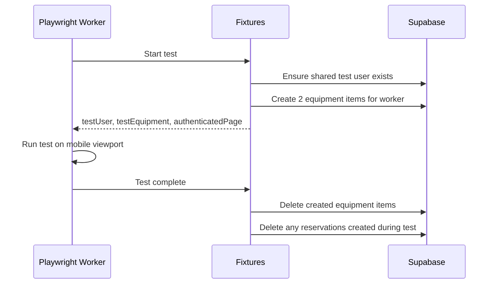

# Parallel-Isolated E2E Tests Refactor - Reservation Tests

Refactor reservation E2E tests to run fully in parallel with complete worker isolation via dynamic test data creation.

## Goals

1. **Full Parallelism** - Each worker runs independently without shared state
2. **Test Consolidation** - Merge overlapping tests into comprehensive scenarios
3. **Dynamic Isolation** - Each worker gets its own dedicated equipment
4. **Mobile-First Testing** - Tests run on mobile viewport (primary target device)

---

## User Decisions

> Confirmed answers to pending questions:

1. **Test User Strategy**: Reuse shared test user (no worker-specific users) - simplifies and doesn't cause race conditions
2. **Equipment Type**: Use first available equipment type from database

---

## Mobile-First Configuration

> [!IMPORTANT]
> This application is **primarily designed for phones**. All E2E tests run on mobile viewport.

### Playwright Config Changes

```typescript
// playwright.config.ts
projects: [
  {
    name: 'Mobile Chrome',
    use: { ...devices['Pixel 5'] },  // Mobile viewport (393x851)
  },
]
```

---

## Coding Standards (from project rules)

### TSDoc Documentation

All exported functions must use TSDoc format:

```typescript
/**
 * Creates test equipment for a worker.
 *
 * @param supabaseAdmin - Supabase client with admin privileges
 * @param workerIndex - Worker index for unique naming
 * @param count - Number of equipment items to create
 * @returns Array of created equipment IDs and type IDs
 */
export async function createTestEquipment(
  supabaseAdmin: SupabaseClient,
  workerIndex: number,
  count: number = 2
): Promise<{ id: string; typeId: string }[]>
```

### Constants over Hardcoded Values

Use constants from `e2e/constants/`:

```typescript
import { E2E_CONFIG } from '../constants';
const uniqueId = `${E2E_CONFIG.TEST_EQUIPMENT_PREFIX}W${workerIndex}-${i}`;
```

### Error Handling

- Use early returns for error conditions
- Guard clauses for preconditions
- Proper error logging with context

### Playwright E2E Guidelines

- Use **Page Object Model** for maintainable tests
- Use **browser contexts** for isolating test environments
- Use **locators** for resilient element selection
- Implement **test hooks** for setup and teardown
- Leverage **parallel execution** for faster test runs

---

## Proposed Changes

### Playwright Config (`playwright.config.ts`)

#### [MODIFY] [playwright.config.ts](file:///e:/bystrze/Magazyn/frontend/playwright.config.ts)

Change from Desktop Chrome to mobile device:

```diff
- {
-   name: 'chromium',
-   use: { ...devices['Desktop Chrome'] },
-   dependencies: ['setup'],
- },
+ {
+   name: 'Mobile Chrome',
+   use: { ...devices['Pixel 5'] },
+   dependencies: ['setup'],
+ },
```

---

### Constants (`constants/config.ts`)

#### [MODIFY] [config.ts](file:///e:/bystrze/Magazyn/frontend/e2e/constants/config.ts)

Add test data configuration:

```typescript
export const E2E_CONFIG = {
  // ... existing config ...
  
  /** Prefix for test equipment names (for cleanup identification) */
  TEST_EQUIPMENT_PREFIX: 'E2E-Test-',
};
```

---

### Test Fixtures (`fixtures/index.ts`)

#### [MODIFY] [index.ts](file:///e:/bystrze/Magazyn/frontend/e2e/fixtures/index.ts)

Add worker-isolated fixtures:

```typescript
/** Test-scoped fixtures */
interface AuthFixtures {
  authenticatedPage: Page;
  supabaseAdmin: SupabaseClient;
  testUser: { id: string; email: string };
  testEquipment: { id: string; typeId: string }[];
}

/** Worker-scoped fixtures */
interface WorkerFixtures {
  workerIndex: number;
}
```

**Changes:**
1. Add `workerIndex` fixture (worker-scoped) using `workerInfo.workerIndex`
2. Add `testEquipment` fixture - creates 2 equipment items per worker
3. Add cleanup logic in fixture teardown
4. Keep shared test user (no per-worker users)

---

### Data Setup Helper (`helpers/data-setup.helper.ts`)

#### [MODIFY] [data-setup.helper.ts](file:///e:/bystrze/Magazyn/frontend/e2e/helpers/data-setup.helper.ts)

Add functions to create/cleanup test equipment:

```typescript
/**
 * Creates test equipment for a worker.
 * Uses the first available equipment type from the database.
 */
export async function createTestEquipment(
  supabaseAdmin: SupabaseClient,
  workerIndex: number,
  count: number = 2
): Promise<{ id: string; typeId: string }[]>

/**
 * Deletes test equipment created for a worker.
 */
export async function cleanupTestEquipment(
  supabaseAdmin: SupabaseClient,
  equipmentIds: string[]
): Promise<void>
```

---

### Reservation Helper (`helpers/reservation.helper.ts`)

#### [MODIFY] [reservation.helper.ts](file:///e:/bystrze/Magazyn/frontend/e2e/helpers/reservation.helper.ts)

**Remove unused functions** (no longer needed with dedicated equipment):

```diff
- export async function getFirstUnreservedEquipment(page: Page): Promise<string>
- export async function getMultipleUnreservedEquipment(page: Page, count: number): Promise<string[]>
```

---

### Reservation Tests (`tests/reservation-creation.spec.ts`)

#### [MODIFY] [reservation-creation.spec.ts](file:///e:/bystrze/Magazyn/frontend/e2e/tests/reservation-creation.spec.ts)

**Consolidate 5 tests into 2 comprehensive scenarios:**

| Before (5 tests) | After (2 tests) |
|------------------|-----------------|
| should complete full reservation flow with 2 items | **Happy Path: Complete reservation flow** |
| should display cart with all selected items | ↳ *(merged)* |
| should show total cost for all items | ↳ *(merged)* |
| should clear cart after successful reservation | ↳ *(merged)* |
| should remove items from cart | **Cart Management: Remove items** |

---

## Implementation Flow



---

## Verification Plan

### Automated Tests

```bash
# Run tests in parallel on mobile viewport
cd frontend && npm run e2e -- tests/reservation-creation.spec.ts

# Run with explicit 4 workers to verify isolation
cd frontend && npm run e2e -- tests/reservation-creation.spec.ts --workers=4
```

Expected results:
- All tests pass on mobile viewport
- Each worker uses its own equipment
- No "Conflict detected" errors in backend logs

---

## Risks & Considerations

> [!IMPORTANT]
> **Equipment Type Dependency**: Creating equipment requires a valid `type_id`. The fixture queries the first available equipment type.

> [!NOTE]
> **Test Runtime**: Creating/deleting equipment per worker adds ~500ms overhead, but enables full parallelism which should offset this.

> [!NOTE]
> **Mobile Viewport**: Tests run on Pixel 5 viewport (393x851). Ensure all UI elements are mobile-responsive.
