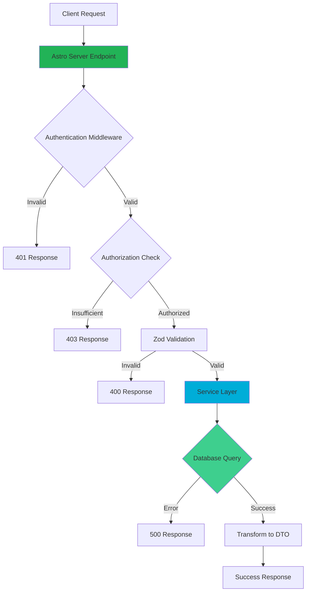

# API Endpoint Implementation Plan: Equipment Management

## Analysis Summary

The Equipment API provides comprehensive CRUD operations and advanced querying capabilities for managing rental equipment. The implementation follows a hybrid architecture with Go backend services and Astro frontend API endpoints, both connecting to Supabase PostgreSQL.

### Key Requirements
- **Authentication**: All endpoints require authentication (401 for unauthenticated)
- **Authorization**: POST, PATCH, DELETE operations require Admin/SuperAdmin roles (403 for insufficient permissions)
- **Soft Deletes**: Equipment uses `is_archived` flag instead of hard deletion
- **Audit Trail**: Status changes automatically create maintenance log entries via database triggers
- **Special Ordering**: Favorites-first sorting based on user's rental history (top 3 per type)
- **Pagination**: Support for configurable page sizes (10/25/50/100)

## 1. Endpoint Overview

This implementation plan covers **six Equipment endpoints** that provide full lifecycle management:

| Endpoint | Method | Purpose | Auth | Role Required |
|----------|--------|---------|------|---------------|
| `/api/equipment` | GET | Search and list equipment with filtering | ✓ | Any |
| `/api/equipment/:id` | GET | Get equipment details with maintenance logs | ✓ | Any |
| `/api/equipment` | POST | Create new equipment | ✓ | Admin/SuperAdmin |
| `/api/equipment/:id` | PATCH | Update equipment | ✓ | Admin/SuperAdmin |
| `/api/equipment/:id` | DELETE | Archive equipment (soft delete) | ✓ | Admin/SuperAdmin |
| `/api/equipment/:id/availability` | GET | Check availability for date range | ✓ | Any |

> [!NOTE]
> These endpoints will be implemented as **Astro Server Endpoints** following the project's architecture. The Go backend services layer will handle business logic and database interactions.

## 2. Request Details

### GET /api/equipment

**Query Parameters:**
- `page` (integer, optional, default: 1): Page number
- `per_page` (integer, optional, default: 25, enum: 10|25|50|100): Items per page
- `type_id` (uuid, optional): Filter by equipment type
- `search` (string, optional): Search in name and description
- `status` (string, optional, enum: ok|broken): Filter by status
- `include_archived` (boolean, optional, default: false): Include archived items

**Validation Requirements:**
- `page`: Must be positive integer >= 1
- `per_page`: Must be one of: 10, 25, 50, 100
- `type_id`: Must be valid UUID format if provided
- `status`: Must be one of: "ok", "broken" if provided
- `include_archived`: Must be boolean value

---

### GET /api/equipment/:id

**URL Parameters:**
- `id` (uuid, required): Equipment identifier

**Validation Requirements:**
- `id`: Must be valid UUID format

---

### POST /api/equipment

**Request Body:**
```json
{
  "internal_id": "K-05",
  "type_id": "uuid",
  "name": "Blue Kayak",
  "description": "Two-person kayak",
  "status": "ok",
  "image_path": "equipment/kayak-blue.jpg"
}
```

**Validation Requirements:**
- `internal_id` (required): Non-empty string, must be unique within type
- `type_id` (required): Valid UUID, equipment type must exist
- `name` (optional): Maximum 200 characters
- `description` (optional): Any string
- `status` (optional, default: "ok"): Must be "ok" or "broken"
- `image_path` (optional): Valid path in Supabase storage

---

### PATCH /api/equipment/:id

**URL Parameters:**
- `id` (uuid, required): Equipment identifier

**Request Body (all fields optional):**
```json
{
  "name": "Updated Kayak",
  "description": "Updated description",
  "status": "broken",
  "image_path": "equipment/new-image.jpg"
}
```

**Validation Requirements:**
- `name` (optional): Maximum 200 characters
- `status` (optional): Must be "ok" or "broken"
- `image_path` (optional): Valid path or null to remove
- At least one field must be provided

---

### DELETE /api/equipment/:id

**URL Parameters:**
- `id` (uuid, required): Equipment identifier

**Business Logic:**
- Sets `is_archived = true`
- Fails if equipment has active reservations (409 Conflict)

---

### GET /api/equipment/:id/availability

**URL Parameters:**
- `id` (uuid, required): Equipment identifier

**Query Parameters:**
- `start_date` (date, required): Format YYYY-MM-DD
- `end_date` (date, required): Format YYYY-MM-DD

**Validation Requirements:**
- `start_date`: Valid date format
- `end_date`: Valid date format, must be >= start_date

## 3. Used Types

### DTOs (Data Transfer Objects)

Based on the API responses, the following DTOs need to be defined:

```go
// EquipmentDTO - Full equipment response with joined type information
type EquipmentDTO struct {
    ID               string  `json:"id"`
    InternalID       string  `json:"internal_id"`
    TypeID           string  `json:"type_id"`
    TypeName         string  `json:"type_name"`
    Name             *string `json:"name"`
    Description      *string `json:"description"`
    Status           string  `json:"status"`
    CreditCostPerDay int32   `json:"credit_cost_per_day"`
    ImageURL         *string `json:"image_url"`
    IsFavorite       *bool   `json:"is_favorite,omitempty"` // Only in list view
    IsArchived       bool    `json:"is_archived"`
    CreatedAt        string  `json:"created_at"`
    UpdatedAt        *string `json:"updated_at,omitempty"`
}

// EquipmentDetailDTO - Equipment with maintenance logs
type EquipmentDetailDTO struct {
    ID               string            `json:"id"`
    InternalID       string            `json:"internal_id"`
    TypeID           string            `json:"type_id"`
    TypeName         string            `json:"type_name"`
    Name             *string           `json:"name"`
    Description      *string           `json:"description"`
    Status           string            `json:"status"`
    CreditCostPerDay int32             `json:"credit_cost_per_day"`
    ImageURL         *string           `json:"image_url"`
    IsArchived       bool              `json:"is_archived"`
    CreatedAt        string            `json:"created_at"`
    UpdatedAt        *string           `json:"updated_at"`
    MaintenanceLogs  []MaintenanceLogDTO `json:"maintenance_logs"`
}

// MaintenanceLogDTO - Maintenance log entry
type MaintenanceLogDTO struct {
    ID             string  `json:"id"`
    PreviousStatus *string `json:"previous_status"`
    NewStatus      string  `json:"new_status"`
    Notes          *string `json:"notes"`
    AdminUsername  string  `json:"admin_username"`
    CreatedAt      string  `json:"created_at"`
}

// EquipmentListResponse - Paginated list response
type EquipmentListResponse struct {
    Equipment  []EquipmentDTO     `json:"equipment"`
    Pagination PaginationResponse `json:"pagination"`
}

// PaginationResponse - Generic pagination metadata
type PaginationResponse struct {
    Page       int `json:"page"`
    PerPage    int `json:"per_page"`
    TotalItems int `json:"total_items"`
    TotalPages int `json:"total_pages"`
}

// AvailabilityResponse - Equipment availability check result
type AvailabilityResponse struct {
    EquipmentID            string                  `json:"equipment_id"`
    IsAvailable            bool                    `json:"is_available"`
    ConflictingReservations []ConflictingReservation `json:"conflicting_reservations"`
}

// ConflictingReservation - Reservation that conflicts with requested dates
type ConflictingReservation struct {
    ID        string `json:"id"`
    StartDate string `json:"start_date"`
    EndDate   string `json:"end_date"`
    Status    string `json:"status"`
}

// MessageResponse - Generic success message response
type MessageResponse struct {
    Message string `json:"message"`
}
```

### Command Models (Request Validation)

```go
// CreateEquipmentCommand - Create equipment request
type CreateEquipmentCommand struct {
    InternalID  string  `json:"internal_id" validate:"required"`
    TypeID      string  `json:"type_id" validate:"required,uuid"`
    Name        *string `json:"name" validate:"omitempty,max=200"`
    Description *string `json:"description"`
    Status      *string `json:"status" validate:"omitempty,oneof=ok broken"`
    ImagePath   *string `json:"image_path"`
}

// UpdateEquipmentCommand - Update equipment request
type UpdateEquipmentCommand struct {
    Name        *string `json:"name" validate:"omitempty,max=200"`
    Description *string `json:"description"`
    Status      *string `json:"status" validate:"omitempty,oneof=ok broken"`
    ImagePath   *string `json:"image_path"`
}

// EquipmentListQuery - List equipment filters
type EquipmentListQuery struct {
    Page            int     `query:"page" validate:"omitempty,min=1"`
    PerPage         int     `query:"per_page" validate:"omitempty,oneof=10 25 50 100"`
    TypeID          *string `query:"type_id" validate:"omitempty,uuid"`
    Search          *string `query:"search"`
    Status          *string `query:"status" validate:"omitempty,oneof=ok broken"`
    IncludeArchived bool    `query:"include_archived"`
}

// AvailabilityQuery - Availability check parameters
type AvailabilityQuery struct {
    StartDate string `query:"start_date" validate:"required,datetime=2006-01-02"`
    EndDate   string `query:"end_date" validate:"required,datetime=2006-01-02"`
}
```

## 4. Response Details

### Success Responses

| Endpoint | Status | Response Type |
|----------|--------|---------------|
| GET /api/equipment | 200 OK | `EquipmentListResponse` |
| GET /api/equipment/:id | 200 OK | `EquipmentDetailDTO` |
| POST /api/equipment | 201 Created | `EquipmentDTO` |
| PATCH /api/equipment/:id | 200 OK | `EquipmentDTO` |
| DELETE /api/equipment/:id | 200 OK | `MessageResponse` |
| GET /api/equipment/:id/availability | 200 OK | `AvailabilityResponse` |

### Error Responses

All endpoints return standardized error responses:

```json
{
  "error": "Error message",
  "code": "ERROR_CODE",
  "details": {} // Optional additional context
}
```

**Common Error Codes:**
- `400 Bad Request`: Invalid input validation
- `401 Unauthorized`: Missing or invalid authentication token
- `403 Forbidden`: Insufficient permissions (not Admin/SuperAdmin)
- `404 Not Found`: Equipment or equipment type not found
- `409 Conflict`: Duplicate internal_id within type, or equipment has active reservations
- `500 Internal Server Error`: Unexpected server error

## 5. Data Flow

### Architecture Overview



### Detailed Flow: GET /api/equipment

1. **Astro Endpoint** receives request with query parameters
2. **Middleware** extracts and validates JWT token from Supabase
3. **Validation Layer** uses Zod to validate query parameters
4. **Service Layer** calls `EquipmentService.list(userId, filters)`
5. **Service Logic**:
   - Builds Supabase query with filters
   - Joins `equipment` with `equipment_types` for type name and cost
   - If not `include_archived`, filters `WHERE is_archived = false`
   - Calculates user's favorite equipment by querying reservation history
   - Orders by: favorites first (top 3 per type), then alphabetically by name
   - Applies pagination
   - Generates signed URLs for `image_path`
6. **Transform** database rows to `EquipmentDTO[]`
7. **Return** `EquipmentListResponse` with pagination metadata

### Detailed Flow: POST /api/equipment

1. **Astro Endpoint** receives request with JSON body
2. **Middleware** validates JWT and extracts user role
3. **Authorization** checks if user role is `admin` or `super_admin`
4. **Validation** uses Zod to validate `CreateEquipmentCommand`
5. **Service Layer** calls `EquipmentService.create(command, adminId)`
6. **Service Logic**:
   - Validates `type_id` exists in `equipment_types`
   - Checks uniqueness of `(type_id, internal_id)` pair
   - Inserts new row into `equipment` table
   - Retrieves inserted record with joined type information
   - Generates signed URL for `image_path` if provided
7. **Transform** to `EquipmentDTO`
8. **Return** 201 Created with DTO

### Detailed Flow: PATCH /api/equipment/:id

1. **Astro Endpoint** receives request with path param and JSON body
2. **Middleware** validates JWT and extracts user role
3. **Authorization** checks if user role is `admin` or `super_admin`
4. **Validation** uses Zod to validate `UpdateEquipmentCommand`
5. **Service Layer** calls `EquipmentService.update(id, command, adminId)`
6. **Service Logic**:
   - Checks equipment exists and retrieves current status
   - Updates equipment record with provided fields
   - If `status` changed: database trigger automatically creates `maintenance_logs` entry
   - Retrieves updated record with joined type information
   - Generates signed URL for `image_path` if present
7. **Transform** to `EquipmentDTO`
8. **Return** 200 OK with updated DTO

> [!IMPORTANT]
> The `maintenance_logs` entry is created automatically by the `log_maintenance_change` database trigger. The service layer should NOT manually insert into `maintenance_logs`.

### Detailed Flow: DELETE /api/equipment/:id

1. **Astro Endpoint** receives request with path param
2. **Middleware** validates JWT and extracts user role
3. **Authorization** checks if user role is `admin` or `super_admin`
4. **Service Layer** calls `EquipmentService.archive(id)`
5. **Service Logic**:
   - Checks equipment exists
   - Verifies no active reservations exist (`status IN ('PENDING', 'RENTED')`)
   - If active reservations found: returns 409 Conflict
   - Updates `is_archived = true`
6. **Return** 200 OK with success message

### Image URL Generation

All endpoints that return equipment data should convert `image_path` to `image_url`:

```typescript
// If image_path exists, generate signed URL from Supabase Storage
const imageUrl = imagePath 
  ? supabase.storage.from('equipment').getPublicUrl(imagePath).data.publicUrl
  : null;
```

### Favorites Calculation (GET /api/equipment)

The favorites logic requires:

1. Query user's reservation history grouped by equipment
2. Count rentals per equipment item
3. Partition by `type_id` and rank by rental count
4. Mark top 3 per type as favorites
5. Order results: favorites first, then alphabetically

**SQL Pattern:**
```sql
WITH user_favorites AS (
  SELECT 
    equipment_id,
    COUNT(*) as rental_count,
    ROW_NUMBER() OVER (PARTITION BY e.type_id ORDER BY COUNT(*) DESC) as rank
  FROM reservations r
  JOIN equipment e ON e.id = r.equipment_id
  WHERE r.user_id = $userId AND r.status IN ('RENTED', 'RETURNED')
  GROUP BY equipment_id, e.type_id
)
SELECT 
  e.*,
  et.name as type_name,
  et.credit_cost_per_day,
  CASE WHEN uf.rank <= 3 THEN true ELSE false END as is_favorite
FROM equipment e
JOIN equipment_types et ON et.id = e.type_id
LEFT JOIN user_favorites uf ON uf.equipment_id = e.id
WHERE ...filters...
ORDER BY COALESCE(is_favorite, false) DESC, e.name ASC
```

## 6. Security Considerations

### Authentication

**Middleware Pattern:**
```typescript
// src/middleware/index.ts
export const onRequest = async (context, next) => {
  const supabase = context.locals.supabase;
  const { data: { session } } = await supabase.auth.getSession();
  
  if (!session) {
    return new Response(JSON.stringify({ error: "Unauthorized" }), {
      status: 401,
      headers: { "Content-Type": "application/json" }
    });
  }
  
  context.locals.user = session.user;
  return next();
};
```

### Authorization

**Role-Based Access Control (RBAC):**

```typescript
// Helper function for role checking
function requireRole(user: User, allowedRoles: string[]): boolean {
  // Query profiles table to get user role
  const { data: profile } = await supabase
    .from('profiles')
    .select('role')
    .eq('id', user.id)
    .single();
    
  return allowedRoles.includes(profile.role);
}

// In POST/PATCH/DELETE endpoints:
if (!requireRole(context.locals.user, ['admin', 'super_admin'])) {
  return new Response(JSON.stringify({ error: "Forbidden" }), {
    status: 403
  });
}
```

### Row Level Security (RLS)

While endpoints enforce authorization, RLS policies provide defense-in-depth:

- **Select on `equipment`**: Public (all authenticated users)
- **Insert/Update/Delete on `equipment`**: Admin/SuperAdmin only
- **Insert on `maintenance_logs`**: System (trigger) or Admin

### Input Sanitization

- Use Zod schemas to validate all inputs
- Sanitize search strings to prevent SQL injection (use parameterized queries)
- Validate UUID format for all ID parameters
- Validate date formats strictly (YYYY-MM-DD)
- Limit string lengths (name: 200 chars)

### Sensitive Data

- **Storage Paths**: Validate `image_path` points to allowed bucket
- **Admin Information**: Only include admin usernames in maintenance logs, not full profiles
- **User Privacy**: Don't expose user IDs in public responses (except where necessary)

## 7. Error Handling

### Error Response Format

All errors should return consistent JSON structure:

```typescript
interface ErrorResponse {
  error: string;        // Human-readable message
  code?: string;        // Machine-readable code
  details?: any;        // Additional context (validation errors, etc.)
}
```

### Validation Errors (400)

**Zod Validation Failure:**
```json
{
  "error": "Validation failed",
  "code": "VALIDATION_ERROR",
  "details": {
    "per_page": "Must be one of: 10, 25, 50, 100",
    "type_id": "Invalid UUID format"
  }
}
```

### Authorization Errors (403)

**Insufficient Permissions:**
```json
{
  "error": "Insufficient permissions",
  "code": "FORBIDDEN"
}
```

### Not Found Errors (404)

**Equipment Not Found:**
```json
{
  "error": "Equipment not found",
  "code": "EQUIPMENT_NOT_FOUND"
}
```

**Equipment Type Not Found (during POST):**
```json
{
  "error": "Equipment type not found",
  "code": "EQUIPMENT_TYPE_NOT_FOUND"
}
```

### Conflict Errors (409)

**Duplicate Internal ID:**
```json
{
  "error": "Internal ID already exists for this equipment type",
  "code": "DUPLICATE_INTERNAL_ID",
  "details": {
    "internal_id": "K-05",
    "type_id": "uuid"
  }
}
```

**Active Reservations (DELETE):**
```json
{
  "error": "Cannot archive equipment with active reservations",
  "code": "ACTIVE_RESERVATIONS",
  "details": {
    "active_count": 2,
    "reservation_ids": ["uuid1", "uuid2"]
  }
}
```

### Server Errors (500)

**Database Errors:**
```json
{
  "error": "Internal server error",
  "code": "INTERNAL_ERROR"
}
```

> [!CAUTION]
> Never expose database error messages or stack traces to clients in production. Log detailed errors server-side for debugging.

### Error Handling Pattern

```typescript
try {
  // Validation
  const validated = schema.parse(input);
  
  // Service call
  const result = await equipmentService.create(validated);
  
  return new Response(JSON.stringify(result), { status: 201 });
  
} catch (error) {
  if (error instanceof z.ZodError) {
    return new Response(JSON.stringify({
      error: "Validation failed",
      code: "VALIDATION_ERROR",
      details: error.flatten().fieldErrors
    }), { status: 400 });
  }
  
  if (error.code === 'PGRST116') { // Supabase not found
    return new Response(JSON.stringify({
      error: "Equipment not found",
      code: "EQUIPMENT_NOT_FOUND"
    }), { status: 404 });
  }
  
  // Log error for debugging
  console.error('Equipment endpoint error:', error);
  
  // Return generic error to client
  return new Response(JSON.stringify({
    error: "Internal server error",
    code: "INTERNAL_ERROR"
  }), { status: 500 });
}
```

## 8. Performance Considerations

### Database Optimization

**Required Indexes** (from db-plan.md):
- `(type_id, internal_id)` - Unique constraint, used for lookup
- `(status)` - Filtering available items
- `(user_id, equipment_id)` on reservations - Favorites calculation

**Additional Recommended Indexes:**
```sql
CREATE INDEX idx_equipment_name ON equipment(name) 
  WHERE is_archived = false;  -- Text search optimization

CREATE INDEX idx_equipment_search ON equipment 
  USING gin(to_tsvector('english', COALESCE(name, '') || ' ' || COALESCE(description, '')))
  WHERE is_archived = false;  -- Full-text search
```

### Query Optimization

**Pagination:**
- Use `LIMIT` and `OFFSET` for pagination
- Calculate `total_pages` in a separate count query
- Consider cursor-based pagination for very large datasets

**Favorites Calculation:**
- Use CTE (Common Table Expression) to precompute favorites
- Cache user's favorite equipment IDs in memory/Redis for frequent requests
- Only compute favorites for current page, not entire dataset

**Joins:**
- Use `INNER JOIN` for required relationships (equipment_types)
- Use `LEFT JOIN` for optional relationships (favorites)
- Select only needed columns, avoid `SELECT *`

### Caching Strategy

**Response Caching:**
- Equipment list: Cache for 5 minutes (invalidate on equipment changes)
- Equipment details: Cache for 10 minutes
- Equipment types: Long-term cache (rarely change)

**Cache Invalidation:**
- Clear cache on POST, PATCH, DELETE operations
- Use equipment ID as cache key for detail endpoints
- Use query params hash as cache key for list endpoint

### File Storage

**Image URL Generation:**
- Generate signed URLs only when needed (not during database queries)
- Cache signed URLs with appropriate expiration (24 hours)
- Consider CDN for image delivery

### Rate Limiting

Implement rate limiting to prevent abuse:
- **Authenticated users**: 100 requests per minute
- **Admin operations**: 50 writes per minute

## 9. Implementation Steps

### Phase 1: Setup Types and Schemas (Backend)

1. **Create DTO types** in `backend/internal/types/types.go`
   - Add all equipment-related DTOs
   - Add command models
   - Add response wrapper types

2. **Create Zod validation schemas** in frontend (for Astro endpoints)
   - `src/lib/schemas/equipment.schema.ts`
   - Define schemas for all command models
   - Export reusable schemas

### Phase 2: Service Layer Implementation (Go Backend)

3. **Create Equipment Service** in `backend/internal/service/equipment.service.go`
   - `List(userId, filters)` - List equipment with favorites
   - `GetByID(id)` - Get equipment details with maintenance logs
   - `Create(command, adminId)` - Create new equipment
   - `Update(id, command, adminId)` - Update equipment
   - `Archive(id)` - Soft delete equipment
   - `CheckAvailability(id, startDate, endDate)` - Check availability

4. **Implement favorites logic** in service
   - Create helper function to calculate user favorites
   - Integrate with list query
   - Add unit tests for favorites calculation

5. **Implement image URL generation**
   - Create helper function to convert paths to signed URLs
   - Handle null image paths
   - Set appropriate expiration times

### Phase 3: Astro API Endpoints

6. **Create `src/pages/api/equipment/index.ts`**
   - GET handler for listing equipment
   - POST handler for creating equipment
   - Export `prerender = false`
   - Use Zod validation
   - Call service layer
   - Handle errors

7. **Create `src/pages/api/equipment/[id].ts`**
   - GET handler for equipment details
   - PATCH handler for updates
   - DELETE handler for archiving
   - Parameter validation
   - Error handling

8. **Create `src/pages/api/equipment/[id]/availability.ts`**
   - GET handler for availability check
   - Date validation
   - Query reservations table

### Phase 4: Middleware and Authorization

9. **Enhance authentication middleware** in `src/middleware/index.ts`
   - Validate JWT tokens
   - Extract user session
   - Attach user to context
   - Return 401 for missing/invalid tokens

10. **Create authorization helper** in `src/lib/auth/roles.ts`
    - `getUserRole(userId)` - Fetch user role from profiles
    - `requireRole(user, roles)` - Check if user has required role
    - Export role constants

### Phase 5: Error Handling

11. **Create error handler utility** in `src/lib/errors/api-error.ts`
    - `ApiError` class with status code and error code
    - `handleApiError(error)` - Convert errors to responses
    - Export error factory functions

12. **Add error logging**
    - Log all 500 errors with full stack traces
    - Log validation errors with request context
    - Consider integration with error tracking service

### Phase 6: Testing

13. **Unit tests for service layer** (Go)
    - Test favorites calculation logic
    - Test filters and search functionality
    - Test pagination calculations
    - Test authorization checks
    - Test conflict detection (duplicate IDs, active reservations)

14. **Integration tests for API endpoints**
    - Test authentication flow
    - Test authorization (admin vs user)
    - Test CRUD operations
    - Test error responses
    - Test pagination
    - Test availability check

### Phase 7: Documentation and Optimization

15. **Add JSDoc comments** to all service functions
    - Document parameters
    - Document return types
    - Document error cases

16. **Performance profiling**
    - Measure query execution times
    - Identify slow queries
    - Add appropriate indexes
    - Implement caching layer

17. **API documentation**
    - Document all endpoints with examples
    - Add Postman/Thunder Client collection
    - Document error codes

## Verification Plan

### Automated Tests

1. **Backend Unit Tests** (Go):
   ```bash
   cd backend
   go test ./internal/service/... -v
   ```

2. **Integration Tests** (if applicable):
   ```bash
   cd backend
   go test ./internal/handler/... -v -tags=integration
   ```

### Manual Testing

1. **Authentication Test**:
   - Attempt to access `/api/equipment` without token → Expect 401
   - Login via Supabase Auth and obtain JWT
   - Access `/api/equipment` with token → Expect 200

2. **Authorization Test**:
   - As regular user, attempt `POST /api/equipment` → Expect 403
   - As admin user, attempt `POST /api/equipment` → Expect 201

3. **List Equipment Test**:
   - `GET /api/equipment?per_page=10&page=1`
   - Verify pagination metadata
   - Verify favorites are shown
   - Verify archived items excluded by default
   - `GET /api/equipment?include_archived=true` → Verify archived shown

4. **Create Equipment Test**:
   - `POST /api/equipment` with valid data → Expect 201
   - Verify equipment appears in list
   - Attempt duplicate `internal_id` for same type → Expect 409

5. **Update Equipment Test**:
   - `PATCH /api/equipment/:id` with status change → Expect 200
   - `GET /api/equipment/:id` → Verify maintenance log created

6. **Archive Equipment Test**:
   - Create reservation for equipment
   - Attempt `DELETE /api/equipment/:id` → Expect 409
   - Cancel reservation
   - Attempt `DELETE /api/equipment/:id` → Expect 200
   - Verify equipment no longer in default list

7. **Availability Test**:
   - Create equipment and reservation
   - `GET /api/equipment/:id/availability?start_date=...&end_date=...`
   - Verify conflicting reservations returned
   - Test with non-conflicting dates → Verify `is_available: true`

### Database Verification

1. **Verify Triggers**:
   - Update equipment status
   - Check `maintenance_logs` table for automatic entry
   - Verify `admin_id` is populated correctly

2. **Verify Constraints**:
   - Attempt to insert duplicate `(type_id, internal_id)` → Should fail
   - Verify uniqueness constraint works

## User Review Required

> [!WARNING]
> **Breaking Changes**: None. This is new functionality.

> [!IMPORTANT]
> **Design Decisions Requiring Approval**:
> 
> 1. **Image URL Generation Strategy**: Using Supabase's `getPublicUrl()` for image paths. This assumes all images are publicly accessible. Should we use signed URLs with expiration instead for additional security?
> 
> 2. **Favorites Calculation Performance**: The favorites logic requires joining reservations and counting. For large datasets, this might be slow. Should we pre-compute favorites and cache them, or is real-time calculation acceptable?
> 
> 3. **Pagination Strategy**: Currently using offset-based pagination (`LIMIT`/`OFFSET`). For very large datasets, cursor-based pagination is more efficient. Is cursor-based worth the added complexity?
> 
> 4. **Error Logging**: Where should errors be logged? Console only, or should we integrate with a service like Sentry?
> 
> 5. **Rate Limiting**: Should we implement rate limiting from the start, or add it later if needed?

---

**Implementation Priority**: HIGH  
**Estimated Effort**: 3-4 days  
**Dependencies**: Database schema must be deployed, Supabase authentication configured
