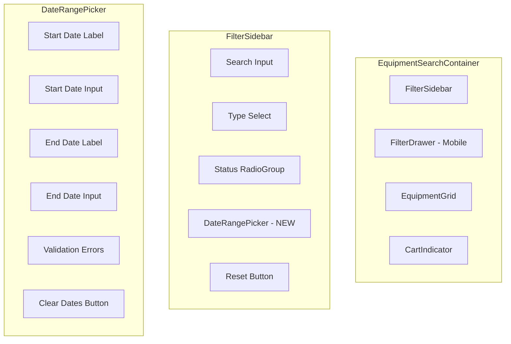

# Feature Implementation Plan: Filter Equipment by Availability Date Range

## 1. Overview

This feature enhances the existing **Equipment Search View** (`/equipment`) by adding a date range filter for availability. Users can specify a start and end date, and the system will show only equipment items that are available for the **entire specified period**. This helps users quickly find equipment they can actually reserve.

**Key Changes:**
- Extend `EquipmentSearchParams` with `availableFrom` and `availableTo` fields
- Add `DateRangePicker` component to `FilterSidebar` / mobile `FilterDrawer`
- Update `useEquipmentSearch` hook for date filter state + URL sync
- Extend `equipment-api.ts` to send `available_from`/`available_to` query params

> [!IMPORTANT]
> **Backend Prerequisite**: The API handler (`equipment_handler.go`) and `EquipmentListQuery` type must be updated to accept `available_from` and `available_to` query parameters. These changes are out of scope for this frontend plan but must be completed first.

---

## 2. View Routing

| Path | Description |
|------|-------------|
| `/equipment` | No route change - this enhances the existing Equipment Search View |

---

## 3. Component Structure



**Component Hierarchy:**
1. `EquipmentSearchContainer` (existing)
   - `FilterSidebar` (existing - **TO MODIFY**)
     - `DateRangePicker` (**NEW**)
   - `Sheet` with `FilterSidebar` for mobile (existing)
   - `EquipmentGrid` (existing)
   - `CartIndicator` (existing)

---

## 4. Component Details

### 4.1 DateRangePicker (**REUSE EXISTING**)

> [!TIP]
> **Existing component found!** Reuse `@/components/reservations/DateRangePicker.tsx` instead of creating new.

**Existing File:** [DateRangePicker.tsx](file:///e:/bystrze/Magazyn/frontend/src/components/reservations/DateRangePicker.tsx)

**Current Location:** `src/components/reservations/DateRangePicker.tsx`

**Recommendation:** Either:
1. **Option A (Preferred):** Move to `src/components/shared/DateRangePicker.tsx` for reuse across features
2. **Option B:** Import directly from `reservations/` folder (less ideal - couples unrelated features)

**Existing Features (already implemented):**
- ✅ Start/End date inputs with `<Input type="date">`
- ✅ Validation error display (`DateRangeValidationErrors` type)
- ✅ `min` attribute for date constraints
- ✅ Uses existing `getTodayAsString()` from `date-utils.ts`
- ✅ Uses existing error constants from `error-messages.ts`
- ✅ Responsive grid layout
- ✅ Duration calculation display

**Minor Modifications Needed:**
1. **Add optional title prop** - Allow customizing "Reservation Dates" header or hiding it for filter context
2. **Add optional clear button** - For filter use case (not needed in reservation creation)
3. **Add accessibility attributes:**
   - `aria-invalid` on invalid inputs
   - `aria-describedby` linking errors to inputs
   - Use `useId()` for unique element IDs

**Existing Props:**
```typescript
interface DateRangePickerProps {
  startDate: string | null;
  endDate: string | null;
  onStartDateChange: (date: string) => void;
  onEndDateChange: (date: string) => void;
  validationErrors: DateRangeValidationErrors;
}
```

**Proposed Extended Props:**
```typescript
interface DateRangePickerProps {
  startDate: string | null;
  endDate: string | null;
  onStartDateChange: (date: string) => void;
  onEndDateChange: (date: string) => void;
  validationErrors: DateRangeValidationErrors;
  /** Optional: Custom title, defaults to "Reservation Dates", set null to hide */
  title?: string | null;
  /** Optional: Show clear button for filter use cases */
  showClearButton?: boolean;
  /** Optional: Callback when clear button clicked */
  onClear?: () => void;
  /** Optional: Compact mode for sidebar filters */
  compact?: boolean;
}
```

**Existing Utilities to Reuse:**
- `date-utils.ts`: `getTodayAsString()`, `calculateDays()`, `formatDate()`
- `DateRangeValidationErrors` type from `reservation-cart.types.ts`
- `ERROR_START_DATE_PAST`, `ERROR_END_DATE_BEFORE_START` from `error-messages.ts`

---

### 4.2 FilterSidebar (**MODIFY**)

**Description:** Existing filter sidebar component that will be extended with the new `DateRangePicker` section.

**Main Elements (updated):**
- Search Input (existing)
- Type Select (existing)
- Status RadioGroup (existing)
- **DateRangePicker (NEW)** - placed between Status and Reset button
- Reset Filters Button (existing - will also clear dates)

**Handled Interactions (additions):**
- Pass `availableFrom` and `availableTo` to parent via `onFilterChange`
- Include date clearing in `onReset`

**Types (updated props):**
```typescript
interface FilterSidebarProps {
  filters: EquipmentSearchParams; // Now includes availableFrom, availableTo
  types: EquipmentType[];
  onFilterChange: (key: keyof EquipmentSearchParams, value: string | undefined) => void;
  onReset: () => void;
}
```

---

### 4.3 EquipmentSearchContainer (**MODIFY**)

**Description:** Container component - minimal changes needed as filter state is handled by `useEquipmentSearch` hook.

**Changes:**
- `handleReset` must also clear `availableFrom` and `availableTo`

---

## 5. Types

### 5.1 Extended EquipmentSearchParams (**MODIFY**)

**File:** `@/types/equipment/equipment.types.ts`

```typescript
export interface EquipmentSearchParams {
  search?: string;
  type_id?: string;
  status?: EquipmentStatus;
  page: number;
  perPage: number;
  // NEW FIELDS
  availableFrom?: string;  // ISO date string YYYY-MM-DD
  availableTo?: string;    // ISO date string YYYY-MM-DD
}
```

### 5.2 Existing Types to REUSE (No Changes Needed)

> [!TIP]
> The following types and constants already exist and should be reused:

| Type/Constant | Location | Purpose |
|---------------|----------|--------|
| `DateRangeValidationErrors` | `@/types/reservation-cart.types.ts` | Validation error state |
| `ERROR_START_DATE_PAST` | `@/lib/config/error-messages.ts` | Error message constant |
| `ERROR_END_DATE_BEFORE_START` | `@/lib/config/error-messages.ts` | Error message constant |
| `getTodayAsString()` | `@/lib/utils/date-utils.ts` | Get today in YYYY-MM-DD |
| `calculateDays()` | `@/lib/utils/date-utils.ts` | Calculate date range duration |

### 5.3 No New Constants Needed

**Existing** `error-messages.ts` already has:
```typescript
export const ERROR_START_DATE_PAST = "Start date must be in the future";
export const ERROR_END_DATE_BEFORE_START = "End date must be after start date";
```

---

## 6. State Management

### 6.1 useEquipmentSearch Hook (**MODIFY**)

**File:** `@/hooks/use-equipment-search.ts`

**Changes:**
1. Add `availableFrom` and `availableTo` to initial state parsing from URL
2. Add these params to URL sync in `updateUrl`
3. Include in debounced filters

**Updated State Shape:**
```typescript
{
  search?: string;
  type_id?: string;
  status?: EquipmentStatus;
  page: number;
  perPage: number;
  availableFrom?: string;  // NEW
  availableTo?: string;    // NEW
}
```

**URL Parameters:**
- `available_from` → `availableFrom` in state
- `available_to` → `availableTo` in state

### 6.2 Date Validation Helper

**File:** `@/lib/utils/date-validation.ts` (**NEW**)

```typescript
export function validateDateRange(
  startDate: string | undefined,
  endDate: string | undefined
): DateRangeValidation {
  // Returns { isValid, startDateError?, endDateError? }
}

export function isDateInFuture(dateString: string): boolean {
  // Checks if date is today or in the future
}
```

---

## 7. API Integration

### 7.1 Equipment API (**MODIFY**)

**File:** `@/lib/api/equipment-api.ts`

**Changes to `list()` method:**

```typescript
async list(params?: Partial<EquipmentSearchParams>): Promise<{
  equipment: EquipmentSearchItem[];
  pagination: PaginationMeta;
}> {
  const queryParams = params
    ? {
        search: params.search,
        type_id: params.type_id,
        status: params.status,
        page: params.page,
        per_page: params.perPage,
        // NEW
        available_from: params.availableFrom,
        available_to: params.availableTo,
      }
    : undefined;

  const response = await api.get('/api/equipment', queryParams);
  return transformEquipmentListResponse(response.data);
}
```

### 7.2 Backend API Contract

**Request:** `GET /api/equipment`

| Query Parameter | Type | Description |
|-----------------|------|-------------|
| `available_from` | string (ISO date) | Start date for availability check |
| `available_to` | string (ISO date) | End date for availability check |

**Response:** Unchanged - equipment list filtered by availability

---

## 8. User Interactions

| Interaction | Component | Expected Outcome |
|-------------|-----------|------------------|
| Select start date | `DateRangePicker` | Updates `availableFrom` in state, validates against today |
| Select end date | `DateRangePicker` | Updates `availableTo` in state, validates against start date |
| Clear dates | `DateRangePicker` | Clears both dates, shows all equipment |
| Reset all filters | `FilterSidebar` | Clears all filters including dates |
| Page load with URL params | `useEquipmentSearch` | Restores date filters from `?available_from=...&available_to=...` |

**Debounced Behavior:** Date changes use the same `SEARCH_DEBOUNCE_MS` (300ms) as other filters before triggering API call.

---

## 9. Conditions and Validation

### Frontend Validation

| Condition | Validated By | UI Effect |
|-----------|--------------|-----------|
| Start date ≥ today | `DateRangePicker` | Inline error, API not called |
| End date > start date | `DateRangePicker` | Inline error, API not called |
| End date requires start date | `DateRangePicker` | Inline error, clears end date |
| Both dates valid | `DateRangePicker` | Filter applied, API called |

### HTML5 Date Input Constraints

Use `min` attribute on date inputs:
- Start date: `min={today}`
- End date: `min={startDate || today}`

---

## 10. Error Handling

| Scenario | Handling |
|----------|----------|
| Invalid date format from URL | Default to `undefined`, log warning |
| API error with date filter | Show generic error in `EquipmentGrid` (existing behavior) |
| Start date in past (URL manipulation) | Validate and clear, show error message |
| End date before start (URL manipulation) | Validate and clear end date |

---

## 11. Implementation Steps

> [!TIP]
> **Reuse-First Approach**: This plan leverages existing code to minimize new development.

### Phase 1: Refactor for Reuse

- [ ] **Step 1.1:** Move `DateRangePicker` to shared location
  - From: `src/components/reservations/DateRangePicker.tsx`
  - To: `src/components/shared/DateRangePicker.tsx`
  - Update import in `ReservationCartView.tsx`

- [ ] **Step 1.2:** Extend `DateRangePicker` props (minor changes)
  - Add `title?: string | null` prop (default: "Reservation Dates")
  - Add `showClearButton?: boolean` prop
  - Add `onClear?: () => void` callback
  - Add `compact?: boolean` for sidebar layout
  - Add accessibility: `useId()`, `aria-invalid`, `aria-describedby`

### Phase 2: Types & State

- [ ] **Step 2.1:** Extend `EquipmentSearchParams`
  - File: `@/types/equipment/equipment.types.ts`
  - Add `availableFrom?: string` and `availableTo?: string`

- [ ] **Step 2.2:** Update `useEquipmentSearch` hook
  - Parse `available_from`/`available_to` from URL
  - Add to URL sync in `updateUrl()`
  - Include in debounced filters

### Phase 3: API Integration

- [ ] **Step 3.1:** Update `equipment-api.ts`
  - Add `available_from` and `available_to` to query params

### Phase 4: UI Integration

- [ ] **Step 4.1:** Update `FilterSidebar`
  - Import `DateRangePicker` from `@/components/shared/`
  - Add section between Status RadioGroup and Reset button
  - Pass `compact={true}`, `title="Filter by Availability"`, `showClearButton={true}`

- [ ] **Step 4.2:** Update `EquipmentSearchContainer`
  - Add `availableFrom`/`availableTo` to `handleReset`

### Phase 5: Verification

- [ ] **Step 5.1:** Manual testing
  - Date selection and validation
  - URL state persistence
  - Reset functionality
  - Mobile drawer behavior

- [ ] **Step 5.2:** Lint check
  - `npm run lint` in frontend directory

---

## 12. Dependencies

### Required UI Components

**No new Shadcn components needed!** The existing `DateRangePicker` uses native HTML `<input type="date">` elements.

> [!NOTE]
> **Future Enhancement (Optional):** If richer calendar UX is desired later, install:
> ```bash
> npx shadcn@latest add calendar popover
> ```

### Backend Prerequisite

The following backend changes must be made:

1. **`EquipmentListQuery`** (`equipment_types.go`):
   ```go
   type EquipmentListQuery struct {
     // ... existing fields
     AvailableFrom *string `json:"available_from"`
     AvailableTo   *string `json:"available_to"`
   }
   ```

2. **Handler** (`equipment_handler.go`):
   ```go
   if availFrom := r.URL.Query().Get("available_from"); availFrom != "" {
     query.AvailableFrom = &availFrom
   }
   if availTo := r.URL.Query().Get("available_to"); availTo != "" {
     query.AvailableTo = &availTo
   }
   ```

3. **Service/Repository**: Filter equipment by checking against `reservations` table for conflicts.
