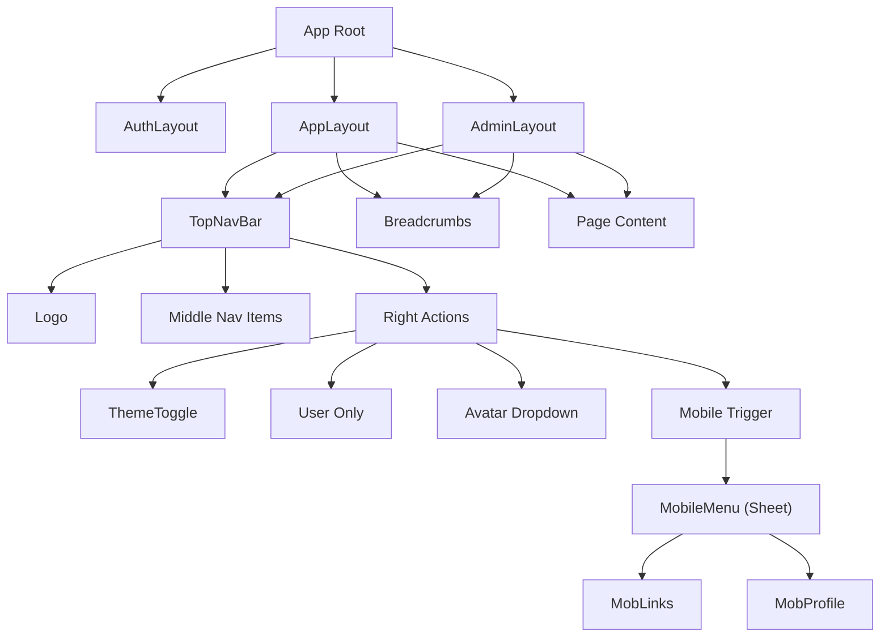

# View Implementation Plan: Global Navigation Shell & Router

## 1. Overview
Implementation of the core application shell, global navigation, and routing infrastructure. This includes setting up the main layouts for different user roles (Guest, User, Admin), implementing the responsive Top Navigation Bar with role-based links, and establishing the routing structure with mock pages for unimplemented features.

**Key Objectives:**
-   Create a responsive, accessible Navigation Shell.
-   Implement role-based link visibility (Guest vs User vs Admin).
-   Integrate Dark/Light mode toggle.
-   Establish a "Skeleton" routing structure for the entire application map.
-   Ensure "Active Link" states and Breadcrumbs are functional.

## 2. View Routing

**Global Routing Table:**

| Path | Component | Access | Layout |
| :--- | :--- | :--- | :--- |
| `/login` | `LoginView` | Guest | `AuthLayout` |
| `/dashboard` | `DashboardView` | User | `AppLayout` |
| `/equipment` | `EquipmentSearchView` | User | `AppLayout` |
| `/equipment/[id]` | `EquipmentDetailsView` | User | `AppLayout` |
| `/reservations` | `MyReservationsView` | User | `AppLayout` |
| `/reservations/[id]` | `ReservationDetailsView` | User | `AppLayout` |
| `/reservations/create` | `ReservationCartView` | User | `AppLayout` |
| `/credits/history` | `CreditHistoryView` (Mock) | User | `AppLayout` |
| `/credits/request` | `CreditRequestView` (Mock) | User | `AppLayout` |
| `/admin` | `AdminDashboardView` | Admin | `AdminLayout` |
| `/admin/reservations` | `AdminReservationsView` | Admin | `AdminLayout` |
| `/admin/equipment` | `AdminEquipmentView` | Admin | `AdminLayout` |
| `/admin/users` | `UserMgrView` (Mock) | Admin | `AdminLayout` |
| `/admin/analytics` | `AnalyticsView` (Mock) | Admin | `AdminLayout` |

## 3. Component Structure



## 4. Component Details

### `TopNavBar`
-   **Description**: The main persistent header. Responsive design that adapts content based on `user.role`.
-   **Main Elements**:
    -   `Logo`: SVG brand icon, links home.
    -   `NavigationMenu`: Semantic `<nav>` list for desktop.
    -   `ThemeToggle`: Button to switch light/dark mode.
    -   `UserMenu`: Dropdown for profile/logout.
    -   `MobileTrigger`: Hamburger icon for small screens.
-   **Props**: `user: SessionUser | null`, `currentPath: string`.

### `DesktopLinks`
-   **Description**: List of links rendered conditionally.
-   **Validation**:
    -   If `!user` → Show nothing (handled by `AuthLayout` mostly, or Login link).
    -   If `user.role === 'user'` → Show Dashboard, Equipment, Reservations, Credits.
    -   If `user.role === 'admin'` → Show Overview, Reservations, Inventory, Users, Stats.
-   **Visuals**:
    -   Active State: `underline` decoration + `bg-accent/10` background highlight.

### `MobileMenu` (Sheet)
-   **Description**: Slide-out drawer for mobile navigation.
-   **Content**:
    -   Replicates all `DesktopLinks` stacked vertically.
    -   Includes `UserProfile` summary (Avatar + Name + Email) at the top.
    -   Includes `CreditDisplay` (User only) prominently.
    -   Includes `ThemeToggle` if not in header.

### `Breadcrumbs`
-   **Description**: Auto-generated path trail.
-   **Logic**: Split URL path, map segments to readable names (e.g., `reservations` -> "My Reservations").
-   **Exclusions**: Hidden on Dashboard/Home.

### `UserMenu` (Dropdown)
-   **Description**: Avatar trigger opening a menu.
-   **Items**: "Profile", "Settings", "Log Out".

## 5. Types

```typescript
// Navigation Types
export interface NavItem {
    label: string;
    href: string;
    icon?: React.ComponentType;
    activePattern: RegExp; // Regex to match child routes
}

// Layout Props
export interface LayoutProps {
    title: string;
    description?: string;
    showBreadcrumbs?: boolean;
}

// Theme Context
export type Theme = 'light' | 'dark' | 'system';
```

## 6. State Management
-   **Theme State**: Managed via `localStorage` and `document.documentElement` class list (Tailwind dark mode). A client-side script in `head` prevents FOUC.
-   **Details**:
    -   `theme` atom (Nano Stores) or React Context to sync toggle state.
-   **Mobile Menu**: Local `isOpen` state in `TopNavBar` (controlled component pattern for the Sheet).

## 7. API Integration
-   **Auth Check**:
    -   Layouts read `Astro.locals.user` to pass initial user state to React components.
    -   `UserMenu` handles "Logout" via `POST /api/auth/logout`.

## 8. User Interactions
1.  **Navigation**: Clicking a link performs a client-side transition (View Transitions API recommended if using Astro 5) or standard navigation.
2.  **Theme Toggle**: Clicking the Moon/Sun icon toggles the class on `<html>` and saves preference.
3.  **Logout**: Clicking "Log Out" calls API, clears cookies, redirects to `/login`.

## 9. Conditions and Validation
-   **Role-Based Rendering**:
    -   **Condition**: `user.role` determines which `NavItems` array is rendered.
    -   **Validation**: Ensure Admin links are NEVER rendered for standard users in the HTML (security by obscurity + solid middleware protection).

## 10. Error Handling
-   **404 Not Found**: Create a generic `404.astro` page in `src/pages`.
-   **403 Forbidden**: If a user tries to access a restricted layout, Middleware handles it, but the UI should also visually indicate restrictions if they somehow get there (e.g., via direct link).

## 11. Implementation Steps

### Phase 1: Infrastructure
1.  **Install Components**: Run `npx shadcn@latest add sheet dropdown-menu avatar breadcrumb`.
2.  **Theme Setup**: Implement standard Tailwind dark mode script in `BaseHead.astro` or main Layout.
3.  **Layout Refactor**: Split `src/layouts/Layout.astro` into:
    -   `BaseLayout.astro` (HTML shell, Meta tags, Theme script).
    -   `AppLayout.astro` (Includes Navbar, Sidebar for User).
    -   `AdminLayout.astro` (Includes Navbar, Sidebar for Admin).
    -   `AuthLayout.astro` (Clean slate for Login).

### Phase 2: Navigation Components
4.  **TopNavBar**: Build `TopNavBar.tsx` with responsive logical rendering.
5.  **UserMenu**: Implement the Avatar dropdown with Logout logic.
6.  **Breadcrumbs**: Create smart `Breadcrumbs.tsx`.

### Phase 3: Routing & Mocks
7.  **Create Pages**: Generate `.astro` files for all Missing Views identified in section 2.
8.  **Mock Content**: Add simple `<div class="p-10 text-center"><h1>Coming Soon</h1></div>` to these new pages.
9.  **Link Wiring**: Ensure `routes.ts` or a new `nav-config.ts` acts as the source of truth for links.

### Phase 4: Verification
10. **Test Flows**:
    -   Login as User -> Verify User Links -> Check Mobile Menu -> Check Dark Mode.
    -   Login as Admin -> Verify Admin Links.
    -   Logout -> Verify Redirect.
