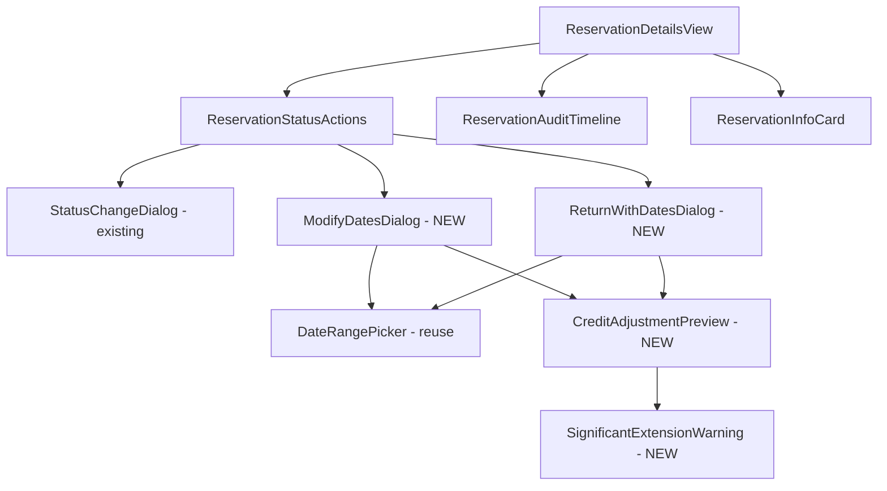

# View Implementation Plan: Reservation Management

## 1. Overview

This implementation plan covers the **Reservation Management** functionality within the existing reservation details view. The goal is to enable users and admins to:

1. **Modify reservation dates** (PENDING status only, without status change)
2. **Cancel reservations** (PENDING → DENIED, triggers credit refund)
3. **Mark reservations as returned** (PENDING → RETURNED, with optional date modification)
4. **View credit adjustments** when dates change (comparison of old vs new)

The implementation follows the existing architecture patterns and maximizes reuse of existing components (`ReservationStatusActions`, `StatusChangeDialog`, `useReservationDetail`).

### Status Transition Rules

| Current Status | Available Actions |
|----------------|-------------------|
| PENDING | Cancel, Modify Dates, Mark Returned (with optional date change) |
| RETURNED | No actions (final state) |
| DENIED | No actions (final state) |

---

## 2. View Routing

The existing route will be extended:

- **Route**: `/reservations/[id]`
- **Page**: `src/pages/reservations/[id].astro`
- **Access**: Authenticated users (own reservations) and admins (all reservations)

No new routes are required.

---

## 3. Component Structure



### Component Hierarchy

```
ReservationDetailsView (existing, extend)
├── Header (existing)
├── ReservationInfoCard (existing)
├── ReservationStatusActions (existing, extend)
│   ├── Cancel Button (existing) → StatusChangeDialog
│   ├── Modify Dates Button (NEW) → ModifyDatesDialog
│   └── Mark Returned Button (existing, extend) → ReturnWithDatesDialog
├── ReservationAuditTimeline (existing)
└── Dialogs:
    ├── StatusChangeDialog (existing - for cancel)
    ├── ModifyDatesDialog (NEW - date-only changes)
    └── ReturnWithDatesDialog (NEW - return with optional dates)
```

---

## 4. Component Details

### 4.1 ReservationStatusActions (MODIFY)

**File**: `src/components/reservations/ReservationStatusActions.tsx`

- **Component description**: Extended to include "Modify Dates" button alongside existing Cancel and Mark Returned buttons.
- **Main elements**:
  - `Button` (Cancel) - existing
  - `Button` (Modify Dates) - **NEW**
  - `Button` (Mark Returned) - existing, modified to open new dialog
  - `StatusChangeDialog` - for cancel confirmation
  - `ModifyDatesDialog` - **NEW**
  - `ReturnWithDatesDialog` - **NEW**
- **Handled interactions**:
  - `onModifyDatesClick` → Opens `ModifyDatesDialog`
  - `onMarkReturnedClick` → Opens `ReturnWithDatesDialog` instead of `StatusChangeDialog`
  - `onCancelClick` → Opens `StatusChangeDialog` (unchanged)
- **Handled validation**:
  - Modify Dates button visible only for PENDING status and (isOwner OR isAdmin)
  - All buttons disabled when `isUpdating`
- **Types**: `ReservationDetail`, `Enums<"reservation_status">`
- **Props**: Same as current (no interface change)

---

### 4.2 ModifyDatesDialog (NEW)

**File**: `src/components/reservations/ModifyDatesDialog.tsx`

- **Component description**: Dialog for modifying reservation dates without changing status. Shows date picker, credit adjustment preview, and significant extension warning if applicable.
- **Main elements**:
  - `Dialog` (Shadcn)
  - `DialogHeader` with title
  - `DateRangePicker` (reuse from existing components)
  - `CreditAdjustmentPreview` (NEW child component)
  - `SignificantExtensionWarning` (conditional, NEW)
  - `DialogFooter` with Cancel/Confirm buttons
- **Handled interactions**:
  - `onStartDateChange(date: string)` → Updates local state, recalculates credit
  - `onEndDateChange(date: string)` → Updates local state, recalculates credit
  - `onConfirm()` → Calls API, closes dialog on success
  - `onCancel()` → Closes dialog without changes
- **Handled validation**:
  - Start date must be in the future (for PENDING reservations)
  - End date must be >= start date
  - New dates must not conflict with other reservations
  - Significant extension warning if: duration increase > 50% OR extension > 3 days
- **Types**:
  - `ModifyDatesDialogProps` (NEW)
  - `DateRange` (existing)
  - `CreditAdjustmentInfo` (NEW)
- **Props**:
  ```typescript
  interface ModifyDatesDialogProps {
    open: boolean;
    onOpenChange: (open: boolean) => void;
    reservation: ReservationDetail;
    onConfirm: (newDates: { startDate: string; endDate: string }) => Promise<void>;
    isSubmitting: boolean;
  }
  ```

---

### 4.3 ReturnWithDatesDialog (NEW)

**File**: `src/components/reservations/ReturnWithDatesDialog.tsx`

- **Component description**: Dialog for marking a reservation as RETURNED with optional date modification. Combines status change confirmation with optional date picker.
- **Main elements**:
  - `Dialog` (Shadcn)
  - `DialogHeader` with title
  - `Checkbox` ("Modify dates before returning")
  - `DateRangePicker` (conditional, when checkbox checked)
  - `CreditAdjustmentPreview` (conditional, when dates differ)
  - `SignificantExtensionWarning` (conditional)
  - Info text about RETURNED being final
  - `DialogFooter` with Cancel/Confirm buttons
- **Handled interactions**:
  - `onModifyDatesToggle(checked: boolean)` → Shows/hides date picker
  - `onStartDateChange(date: string)` → Updates local state
  - `onEndDateChange(date: string)` → Updates local state
  - `onConfirm()` → Calls API with status + optional dates
  - `onCancel()` → Closes dialog
- **Handled validation**:
  - All date validations from `ModifyDatesDialog`
  - Warning that RETURNED status is final
- **Types**:
  - `ReturnWithDatesDialogProps` (NEW)
- **Props**:
  ```typescript
  interface ReturnWithDatesDialogProps {
    open: boolean;
    onOpenChange: (open: boolean) => void;
    reservation: ReservationDetail;
    onConfirm: (command: UpdateReservationCommand) => Promise<void>;
    isSubmitting: boolean;
  }
  ```

---

### 4.4 CreditAdjustmentPreview (NEW)

**File**: `src/components/reservations/CreditAdjustmentPreview.tsx`

- **Component description**: Displays a comparison of old vs new dates and the resulting credit adjustment. Shows both the adjustment amount and new total balance.
- **Main elements**:
  - Comparison section (old dates → new dates)
  - Days difference display
  - Credit adjustment amount (positive = refund, negative = charge)
  - New total balance after adjustment
- **Handled interactions**: None (read-only display)
- **Handled validation**: None
- **Types**:
  - `CreditAdjustmentPreviewProps` (NEW)
  - `CreditAdjustmentInfo` (NEW)
- **Props**:
  ```typescript
  interface CreditAdjustmentPreviewProps {
    originalDates: { startDate: string; endDate: string };
    newDates: { startDate: string; endDate: string };
    originalCreditCost: number;
    newCreditCost: number;
    creditPerDay: number;
    currentBalance: number;
  }
  ```

---

### 4.5 SignificantExtensionWarning (NEW)

**File**: `src/components/reservations/SignificantExtensionWarning.tsx`

- **Component description**: Warning alert displayed when date extension is significant (>50% duration increase OR >3 days extension).
- **Main elements**:
  - `Alert` with warning styling (amber)
  - `AlertTriangle` icon
  - Warning message with specifics (old duration → new duration, additional credits)
- **Handled interactions**: None (read-only display)
- **Handled validation**: None (parent component determines whether to show)
- **Types**: `SignificantExtensionWarningProps` (NEW)
- **Props**:
  ```typescript
  interface SignificantExtensionWarningProps {
    originalDays: number;
    newDays: number;
    additionalCredits: number;
  }
  ```

---

## 5. Types

### 5.1 New Types (add to `src/types/reservations/reservation.types.ts`)

```typescript
/**
 * Credit adjustment calculation result
 * Used for previewing changes before confirmation
 */
export type CreditAdjustmentInfo = {
  originalDays: number;
  newDays: number;
  originalCost: number;
  newCost: number;
  adjustment: number;           // positive = refund, negative = charge
  newBalance: number;           // user's balance after adjustment
  isSignificantExtension: boolean;
};

/**
 * Date modification command for API
 * Subset of UpdateReservationCommand focused on dates
 */
export type ModifyDatesCommand = {
  startDate: string;  // YYYY-MM-DD
  endDate: string;    // YYYY-MM-DD
};
```

### 5.2 Existing Types (unchanged, for reference)

```typescript
// Already exists in reservation.types.ts
export type UpdateReservationCommand = {
  startDate?: string;
  endDate?: string;
  status?: Enums<"reservation_status">;
};

// Already exists in reservation.types.ts  
export type UpdateReservationResponse = {
  id: string;
  equipmentId: string;
  startDate: string;
  endDate: string;
  status: Enums<"reservation_status">;
  creditCost: number;
  creditAdjustment: number;
  remainingBalance: number;
  updatedAt: string;
};
```

---

## 6. State Management

### 6.1 Existing Hook Extension

**File**: `src/hooks/useReservationDetail.ts`

The existing hook already handles:
- Fetching reservation details
- Status update mutations
- Query invalidation on success

**No major changes needed** - the `updateStatus` function accepts `UpdateReservationCommand` which already supports date modifications.

### 6.2 New Utility Hook (optional, for dialog state)

**File**: `src/hooks/useDateModification.ts` (NEW)

```typescript
interface UseDateModificationReturn {
  /** Current date values in dialog */
  dates: { startDate: string; endDate: string };
  /** Update dates */
  setDates: (dates: { startDate: string; endDate: string }) => void;
  /** Calculated credit adjustment info */
  adjustment: CreditAdjustmentInfo;
  /** Validation errors */
  errors: { startDate?: string; endDate?: string };
  /** Whether dates have been modified from original */
  hasChanges: boolean;
  /** Whether current dates are valid */
  isValid: boolean;
}
```

**Purpose**: Encapsulates date modification state, validation, and credit calculation logic. Can be used by both `ModifyDatesDialog` and `ReturnWithDatesDialog`.

### 6.3 Local Component State

Each dialog manages its own local state:

```typescript
// ModifyDatesDialog
const [startDate, setStartDate] = useState(reservation.startDate);
const [endDate, setEndDate] = useState(reservation.endDate);
const [isValidating, setIsValidating] = useState(false);

// ReturnWithDatesDialog  
const [modifyDates, setModifyDates] = useState(false);
const [startDate, setStartDate] = useState(reservation.startDate);
const [endDate, setEndDate] = useState(reservation.endDate);
```

---

## 7. API Integration

### 7.1 Endpoints Used

| Action | Endpoint | Method | Request Type | Response Type |
|--------|----------|--------|--------------|---------------|
| Modify dates | `/api/reservations/:id` | PATCH | `UpdateReservationCommand` | `UpdateReservationResponse` |
| Mark returned | `/api/reservations/:id` | PATCH | `UpdateReservationCommand` | `UpdateReservationResponse` |
| Cancel | `/api/reservations/:id` | PATCH | `UpdateReservationCommand` | `UpdateReservationResponse` |

### 7.2 Request/Response Examples

**Modify Dates Only:**
```typescript
// Request
const command: UpdateReservationCommand = {
  startDate: "2025-12-05",
  endDate: "2025-12-10"
};

// Response
{
  id: "uuid",
  equipmentId: "uuid",
  startDate: "2025-12-05",
  endDate: "2025-12-10",
  status: "PENDING",
  creditCost: 25,
  creditAdjustment: -5,  // 5 credits charged due to extension
  remainingBalance: 145,
  updatedAt: "2025-12-14T18:00:00Z"
}
```

**Mark Returned with Date Change:**
```typescript
// Request
const command: UpdateReservationCommand = {
  startDate: "2025-12-01",
  endDate: "2025-12-03",  // shortened from 2025-12-05
  status: "RETURNED"
};

// Response
{
  id: "uuid",
  ...
  status: "RETURNED",
  creditCost: 12,
  creditAdjustment: 8,  // 8 credits refunded
  remainingBalance: 158,
  ...
}
```

### 7.3 API Client (existing, no changes needed)

```typescript
// src/lib/api/reservations-api.ts
reservationsApi.update(id: string, command: UpdateReservationCommand)
```

---

## 8. User Interactions

### 8.1 Modify Dates Flow

1. User views reservation details (PENDING status)
2. User clicks "Modify Dates" button
3. `ModifyDatesDialog` opens with current dates pre-filled
4. User selects new date range
5. System displays:
   - Date comparison (old → new)
   - Credit adjustment preview (+X refund or -X charge)
   - New balance after adjustment
   - Warning if significant extension (>50% or >3 days)
6. User clicks "Confirm Changes"
7. API call updates reservation
8. Dialog closes, view refreshes with new data
9. Audit trail shows new entry

### 8.2 Mark Returned Flow (without date modification)

1. User clicks "Mark Returned" button
2. `ReturnWithDatesDialog` opens
3. "Modify dates before returning" checkbox is unchecked
4. User sees info that RETURNED is a final state
5. User clicks "Confirm Return"
6. Status changes to RETURNED, no credit change
7. Dialog closes, view refreshes

### 8.3 Mark Returned Flow (with date modification)

1. User clicks "Mark Returned" button
2. `ReturnWithDatesDialog` opens
3. User checks "Modify dates before returning"
4. Date picker appears with current dates
5. User modifies dates (e.g., shortens end date)
6. System shows credit adjustment preview (refund)
7. User clicks "Confirm Return"
8. API updates both dates and status
9. Credits adjusted, dialog closes, view refreshes

### 8.4 Cancel Reservation Flow (existing, unchanged)

1. User clicks "Cancel" button
2. `StatusChangeDialog` opens (mode: "cancel")
3. User confirms
4. Status changes to DENIED, credits refunded
5. Dialog closes

---

## 9. Conditions and Validation

### 9.1 Button Visibility Conditions

| Button | Condition |
|--------|-----------|
| Cancel | `status === 'PENDING' && (isOwner \|\| isAdmin)` |
| Modify Dates | `status === 'PENDING' && (isOwner \|\| isAdmin)` |
| Mark Returned | `status === 'PENDING' && (isOwner \|\| isAdmin)` |

### 9.2 Date Validation Rules

| Rule | Condition | Error Message |
|------|-----------|---------------|
| Start date required | `!!startDate` | "Start date is required" |
| End date required | `!!endDate` | "End date is required" |
| Valid range | `endDate >= startDate` | "End date must be on or after start date" |
| Future start (for PENDING) | `startDate > today` | "Start date must be in the future" |
| Availability | No conflicting reservations | "Equipment not available for selected dates" |

### 9.3 Significant Extension Detection

```typescript
function isSignificantExtension(
  originalDays: number,
  newDays: number
): boolean {
  const dayIncrease = newDays - originalDays;
  const percentIncrease = (dayIncrease / originalDays) * 100;
  
  return dayIncrease > 3 || percentIncrease > 50;
}
```

### 9.4 Credit Calculation

```typescript
function calculateCreditAdjustment(
  originalDays: number,
  newDays: number,
  creditPerDay: number,
  currentBalance: number
): CreditAdjustmentInfo {
  const originalCost = originalDays * creditPerDay;
  const newCost = newDays * creditPerDay;
  const adjustment = originalCost - newCost; // positive = refund
  
  return {
    originalDays,
    newDays,
    originalCost,
    newCost,
    adjustment,
    newBalance: currentBalance + adjustment,
    isSignificantExtension: isSignificantExtension(originalDays, newDays),
  };
}
```

---

## 10. Error Handling

### 10.1 API Errors

| Error Code | Scenario | User Message |
|------------|----------|--------------|
| 400 | Invalid date range | "Invalid date range. End date must be on or after start date." |
| 400 | Invalid status transition | "This status change is not allowed." |
| 403 | Not owner (for users) | "You can only modify your own reservations." |
| 403 | Final status | "This reservation cannot be modified." |
| 404 | Reservation not found | "Reservation not found." |
| 409 | Date conflict | "Equipment is not available for the selected dates." |
| 409 | Insufficient credits | "Insufficient credits for this date extension." |

### 10.2 Error Display

- Display errors in `Alert` component within the dialog
- Keep dialog open on error so user can correct
- Clear error when user modifies input

### 10.3 Loading States

- Disable all inputs and buttons when `isSubmitting`
- Show `Loader2` spinner on confirm button
- Prevent dialog close during submission

---

## 11. Implementation Steps

### Phase 1: Utility Functions (1-2 hours)

1. [ ] Create `src/lib/utils/credit-utils.ts`:
   - `calculateCreditAdjustment()`
   - `isSignificantExtension()`
   - `formatCreditAdjustment()` (for display)

2. [ ] Add new types to `src/types/reservations/reservation.types.ts`:
   - `CreditAdjustmentInfo`
   - `ModifyDatesCommand`

---

### Phase 2: Preview Components (2-3 hours)

3. [ ] Create `src/components/reservations/CreditAdjustmentPreview.tsx`:
   - Date comparison display
   - Credit adjustment with color coding (green refund, red charge)
   - New balance display

4. [ ] Create `src/components/reservations/SignificantExtensionWarning.tsx`:
   - Warning alert with amber styling
   - Shows duration increase and additional cost

---

### Phase 3: Dialog Components (4-5 hours)

5. [ ] Create `src/components/reservations/ModifyDatesDialog.tsx`:
   - Integrate `DateRangePicker`
   - Add date validation
   - Include `CreditAdjustmentPreview`
   - Include `SignificantExtensionWarning` (conditional)
   - Handle confirm/cancel

6. [ ] Create `src/components/reservations/ReturnWithDatesDialog.tsx`:
   - Checkbox to toggle date modification
   - Conditional date picker
   - Conditional credit preview
   - Handle status + optional dates

---

### Phase 4: Integration (2-3 hours)

7. [ ] Update `src/components/reservations/ReservationStatusActions.tsx`:
   - Add "Modify Dates" button
   - Add state for new dialogs
   - Wire up click handlers
   - Update `handleMarkReturned` to use new dialog

8. [ ] Add UI strings to `src/lib/config/constants.ts`:
   - Dialog titles and messages
   - Button labels
   - Warning messages

---

### Phase 5: Testing & Polish (2-3 hours)

9. [ ] Manual testing:
   - Test all 3 flows (modify dates, return, return+dates)
   - Test validation errors
   - Test significant extension warning
   - Test as both user and admin

10. [ ] Code cleanup:
    - Run linters (`npx astro check`, `npx prettier --check`)
    - Remove any unused code
    - Verify no TypeScript errors

---

## 12. Files to Create/Modify

### New Files

| File | Purpose |
|------|---------|
| `src/lib/utils/credit-utils.ts` | Credit calculation and extension detection |
| `src/components/reservations/CreditAdjustmentPreview.tsx` | Preview UI component |
| `src/components/reservations/SignificantExtensionWarning.tsx` | Warning alert component |
| `src/components/reservations/ModifyDatesDialog.tsx` | Date modification dialog |
| `src/components/reservations/ReturnWithDatesDialog.tsx` | Return with dates dialog |
| `src/hooks/useDateModification.ts` (optional) | Shared state management hook |

### Modified Files

| File | Changes |
|------|---------|
| `src/types/reservations/reservation.types.ts` | Add `CreditAdjustmentInfo` type |
| `src/components/reservations/ReservationStatusActions.tsx` | Add Modify Dates button, new dialogs |
| `src/lib/config/constants.ts` | Add UI strings |

---

## 13. Reused Components

| Existing Component | Usage |
|--------------------|-------|
| `DateRangePicker` | Date selection in dialogs |
| `Dialog`, `DialogContent`, etc. | Dialog structure |
| `Button` | All buttons |
| `Alert`, `AlertDescription` | Warnings and errors |
| `Checkbox` | Toggle date modification |
| `StatusBadge` | Status display |
| `useReservationDetail` | Data fetching and mutations |
| `reservationsApi.update()` | API calls |
