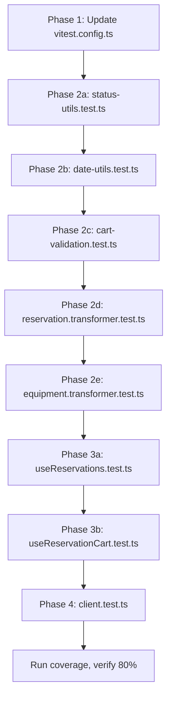

# Frontend Test Coverage Report & Improvement Plan

> **Purpose**: Analysis of current test coverage and a prioritized plan to achieve 80% test coverage for frontend code, focusing on functionality and integration tests to support the upcoming refactoring.

---

## Current State Analysis

### Test Summary

| Metric | Value |
|--------|-------|
| **Total Tests** | 184 |
| **Test Files** | 9 |
| **All Pass** | ✅ Yes |

### Existing Test Files

```
src/
├── components/auth/__tests__/
│   └── AuthListener.test.tsx (14 tests)
│
├── hooks/__tests__/
│   └── use-equipment-search.test.ts (6 tests)
│
├── lib/auth/__tests__/
│   ├── auth-integration.test.ts (4 tests)
│   ├── cookie-utils.test.ts (39 tests)
│   ├── redirect-manager.test.ts (32 tests)
│   ├── role-utils.test.ts (23 tests)
│   ├── session-utils.test.ts (12 tests)
│   └── url-utils.test.ts (37 tests)
│
└── lib/transformers/__tests__/
    └── user.transformer.test.ts (17 tests)
```

### Current Coverage Configuration

```typescript
// vitest.config.ts
coverage: {
  provider: 'v8',
  reporter: ['text', 'html'],
  include: [
    'src/lib/auth/**',        // ✅ Well tested
    'src/components/auth/**', // ✅ Well tested
  ],
}
```

> [!IMPORTANT]
> Current coverage config only targets auth module. Must expand to include all critical modules.

---

## Coverage Gap Analysis

### Priority 1: Critical Business Logic (Untested)

| Module | Files | Priority | Impact |
|--------|-------|----------|--------|
| `src/lib/utils/` | 9 files | 🔴 High | Reservation status, cart validation, date utils |
| `src/lib/transformers/` | 5 files (1 tested) | 🔴 High | Data transformation for all domain types |
| `src/lib/validators/` | 4 files | 🔴 High | Zod schema validation |

### Priority 2: Hooks (Business Logic)

| Hook | Lines | Priority | Reason |
|------|-------|----------|--------|
| `useReservations.ts` | 5736 | 🔴 High | Core reservation logic |
| `useEquipmentManager.ts` | 7102 | 🔴 High | Equipment CRUD operations |
| `useReservationCart.ts` | 3035 | 🔴 High | Cart state management |
| `useUsers.ts` | 5838 | 🟡 Medium | User management |
| `useEquipmentDetails.ts` | 3907 | 🟡 Medium | Equipment detail fetching |
| `useReservationDetail.ts` | 2659 | 🟡 Medium | Reservation detail fetching |
| `useCreditHistory.ts` | 1696 | 🟢 Low | Credit history display |
| `useAvailabilityCheck.ts` | 3213 | 🟢 Low | Availability checking |
| `useDarkMode.ts` | 2712 | 🟢 Low | UI preference |
| `use-equipment-api.ts` | 1153 | 🟢 Low | API wrapper |

### Priority 3: API Client & Domain APIs

| File | Lines | Priority |
|------|-------|----------|
| `src/lib/api/client.ts` | 141 | 🔴 High |
| `src/lib/api/reservations-api.ts` | 3242 | 🟡 Medium |
| `src/lib/api/equipment-api.ts` | 8521 | 🟡 Medium |
| `src/lib/api/users-api.ts` | 3313 | 🟢 Low |
| `src/lib/api/credits-api.ts` | 775 | 🟢 Low |

---

## Test Improvement Plan

### Phase 1: Update Configuration (Immediate)

#### Expand Coverage Targets

```typescript
// vitest.config.ts - updated
coverage: {
  provider: 'v8',
  reporter: ['text', 'html', 'json'],
  include: [
    'src/lib/**/*.ts',
    'src/hooks/**/*.ts',
    'src/components/**/*.tsx',
  ],
  exclude: [
    'src/**/*.d.ts',
    'src/**/index.ts',
    'src/db/**',
    'src/types/**',
    'src/env.d.ts',
    'src/middleware/**', // SSR, hard to test client-side
    'src/pages/**', // Astro pages
  ],
  thresholds: {
    lines: 80,
    functions: 80,
    branches: 70,
  },
}
```

---

### Phase 2: Unit Tests for Pure Functions (High Priority)

#### 2.1 Utility Functions Tests

| File | Functions to Test | Estimated Tests |
|------|-------------------|-----------------|
| `status-utils.ts` | `canChangeStatus`, `getAvailableTransitions`, `isStatusFinal` | 15-20 |
| `date-utils.ts` | Date formatting, range validation | 10-15 |
| `credit-utils.ts` | Credit calculations | 8-12 |
| `cart-validation.ts` | Cart validation rules | 10-15 |
| `cart-storage.ts` | localStorage operations | 8-10 |
| `text-utils.ts` | Text formatting | 5-8 |
| `group-reservations.ts` | Grouping logic | 5-8 |
| `user-utils.ts` | User helpers | 3-5 |

**Example Test Structure**:

```typescript
// src/lib/utils/__tests__/status-utils.test.ts
describe('status-utils', () => {
  describe('canChangeStatus', () => {
    it('returns no actions for final states (RETURNED)', () => { ... })
    it('returns no actions for final states (DENIED)', () => { ... })
    it('allows owner to cancel PENDING reservation', () => { ... })
    it('allows admin to change status for non-final states', () => { ... })
    it('returns no actions for non-owner non-admin', () => { ... })
  })
  
  describe('getAvailableTransitions', () => {
    it('returns transitions for PENDING status', () => { ... })
    it('returns only RETURNED for RENTED status', () => { ... })
    it('returns empty for final statuses', () => { ... })
    it('returns empty for non-admin users', () => { ... })
  })
})
```

#### 2.2 Transformer Tests

| File | Functions to Test | Estimated Tests |
|------|-------------------|-----------------|
| `reservation.transformer.ts` | Request & response transforms | 12-15 |
| `equipment.transformer.ts` | Equipment data transforms | 10-12 |
| `credit.transformer.ts` | Credit data transforms | 6-8 |
| `availability.transformer.ts` | Availability data transforms | 4-6 |

**Example Test Pattern** (following existing `user.transformer.test.ts`):

```typescript
// src/lib/transformers/__tests__/reservation.transformer.test.ts
describe('transformCreateReservationsCommand', () => {
  it('transforms camelCase to snake_case for single item', () => { ... })
  it('includes user_id when provided', () => { ... })
  it('handles multiple reservation items', () => { ... })
})

describe('transformReservationItem', () => {
  it('transforms snake_case DTO to camelCase frontend type', () => { ... })
  it('handles null updatedAt', () => { ... })
  it('correctly maps status enum', () => { ... })
})
```

#### 2.3 Validator Tests

| File | Schemas to Test | Estimated Tests |
|------|-----------------|-----------------|
| `equipment.validator.ts` | Equipment schemas | 8-10 |
| `user.validator.ts` | User schemas | 10-12 |
| `cart.validator.ts` | Cart item schema | 6-8 |
| `availability.validator.ts` | Availability schemas | 4-6 |

---

### Phase 3: Integration Tests for Hooks

#### 3.1 Core Business Hooks

Focus on testing the hook logic with mocked API responses.

**Test Setup Pattern**:

```typescript
// src/hooks/__tests__/useReservations.test.ts
import { renderHook, waitFor } from '@testing-library/react'
import { QueryClient, QueryClientProvider } from '@tanstack/react-query'
import { vi } from 'vitest'

// Mock API module
vi.mock('@/lib/api/reservations-api', () => ({
  reservationsApi: {
    getMyReservations: vi.fn(),
    getAllReservations: vi.fn(),
    updateReservation: vi.fn(),
  }
}))

const wrapper = ({ children }) => (
  <QueryClientProvider client={new QueryClient({
    defaultOptions: { queries: { retry: false } }
  })}>
    {children}
  </QueryClientProvider>
)

describe('useReservations', () => {
  it('fetches user reservations successfully', async () => { ... })
  it('handles pagination correctly', async () => { ... })
  it('applies status filter', async () => { ... })
  it('transforms response data correctly', async () => { ... })
})
```

#### Hooks to Test

| Hook | Test Focus | Estimated Tests |
|------|------------|-----------------|
| `useReservations` | Filtering, pagination, mutations | 15-20 |
| `useReservationCart` | Cart CRUD, validation, persistence | 12-15 |
| `useEquipmentManager` | CRUD operations, status updates | 12-15 |
| `useUsers` | User list, search, CRUD | 10-12 |

---

### Phase 4: API Client Tests

#### 4.1 Core Client Tests

```typescript
// src/lib/api/__tests__/client.test.ts
describe('api client', () => {
  describe('get', () => {
    it('builds correct URL with query params', () => { ... })
    it('includes auth header when session exists', () => { ... })
    it('throws on non-ok response', () => { ... })
    it('parses JSON response correctly', () => { ... })
  })
  
  describe('post', () => {
    it('sends JSON body correctly', () => { ... })
    it('handles error responses', () => { ... })
  })
  
  // Similar for patch, delete
})
```

---

## Estimated Effort

| Phase | Tests | Effort |
|-------|-------|--------|
| Phase 1: Config | 0 | 1 hour |
| Phase 2: Utils & Transformers | ~100 | 8-12 hours |
| Phase 3: Hook Integration | ~60 | 10-15 hours |
| Phase 4: API Client | ~20 | 3-4 hours |
| **Total** | **~180 new tests** | **~25-35 hours** |

---

## Implementation Order



---

## Verification Strategy

### Continuous Verification

```bash
# Run all tests with coverage
npm run test:coverage

# Watch mode during development
npm run test -- --watch

# UI mode for debugging
npm run test:ui
```

### Target Metrics

| Metric | Current | Target |
|--------|---------|--------|
| Line Coverage | ~20% (auth only) | 80% |
| Function Coverage | ~20% (auth only) | 80% |
| Branch Coverage | Unknown | 70% |
| Total Tests | 184 | ~360+ |

---

## Notes for Refactoring Preparation

> [!TIP]
> **Before any refactoring**, ensure tests capture current behavior:
> 
> 1. **Status transitions** - Critical for reservation flow correctness
> 2. **Data transformations** - Verify snake_case ↔ camelCase consistency
> 3. **Cart validation** - Business rules for reservation creation
> 4. **Hook data flow** - React Query caching and mutation behavior

### Test-First Refactoring Approach

1. Write tests for existing behavior first
2. Ensure all tests pass
3. Refactor code
4. Verify tests still pass
5. Add new tests for new/changed behavior

---

## Files to Create

```
src/lib/utils/__tests__/
├── status-utils.test.ts
├── date-utils.test.ts
├── credit-utils.test.ts
├── cart-validation.test.ts
├── cart-storage.test.ts
├── text-utils.test.ts
└── group-reservations.test.ts

src/lib/transformers/__tests__/
├── reservation.transformer.test.ts
├── equipment.transformer.test.ts
├── credit.transformer.test.ts
└── availability.transformer.test.ts

src/lib/validators/__tests__/
├── equipment.validator.test.ts
├── user.validator.test.ts
├── cart.validator.test.ts
└── availability.validator.test.ts

src/lib/api/__tests__/
└── client.test.ts

src/hooks/__tests__/
├── useReservations.test.ts
├── useReservationCart.test.ts
├── useEquipmentManager.test.ts
└── useUsers.test.ts
```

---

## Summary

This plan prioritizes testing **pure functions and business logic** first, as they are:
- Easier to test (no mocking complexity)
- Most critical for refactoring safety
- High value-to-effort ratio

Hook integration tests come second, requiring React Query wrapper setup but providing confidence in data flow during refactoring.
