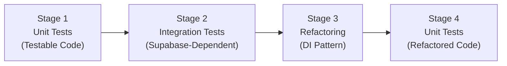

# Backend Authentication Testing Plan

> [!NOTE]
> **Based on**: [.agent/rules/go.md](file:///e:/bystrze/Magazyn/.agent/rules/go.md), [.agent/rules/backend.md](file:///e:/bystrze/Magazyn/.agent/rules/backend.md)  
> **Documentation**: [auth-description.md](file:///e:/bystrze/Magazyn/.ai/loop/auth-description.md), [report.md](file:///e:/bystrze/Magazyn/.ai/loop/report.md)

This plan uses a **4-stage approach** to systematically test the Go backend authentication:



---

## Table of Contents

1. [Overview & Strategy](#overview--strategy)
2. [Code Analysis - Testability Matrix](#code-analysis---testability-matrix)
3. [Stage 1: Unit Tests (No Refactoring Required)](#stage-1-unit-tests-no-refactoring-required)
4. [Stage 2: Integration Tests (Supabase-Dependent)](#stage-2-integration-tests-supabase-dependent)
5. [Stage 3: Refactoring Plan](#stage-3-refactoring-plan)
6. [Stage 4: Unit Tests (Post-Refactoring)](#stage-4-unit-tests-post-refactoring)
7. [Setup Requirements](#setup-requirements)
8. [Test File Structure](#test-file-structure)
9. [Implementation Checklist](#implementation-checklist)
10. [Coverage Goals](#coverage-goals)

---

## Overview & Strategy

### Why 4 Stages?

The current codebase has **tight coupling** with `config.SupabaseClient`. This makes some code directly unit-testable, while other code requires integration tests first. The staged approach:

1. **Validates existing behavior** before refactoring (safety net)
2. **Protects against regressions** during refactoring
3. **Enables pure unit tests** after dependency injection is applied

### Files Under Test

| File | Package | Main Functions |
|------|---------|----------------|
| [roles.go](file:///e:/bystrze/Magazyn/backend/internal/auth/roles.go) | `auth` | `HasRole` |
| [auth.service.go](file:///e:/bystrze/Magazyn/backend/internal/service/auth.service.go) | `service` | `Login`, `Logout`, `GetSession` |
| [auth.handler.go](file:///e:/bystrze/Magazyn/backend/internal/handler/auth.handler.go) | `handler` | `HandleLogin`, `HandleLogout`, `HandleGetSession` |
| [auth.middleware.go](file:///e:/bystrze/Magazyn/backend/internal/middleware/auth.middleware.go) | `middleware` | `AuthMiddleware` |
| [rbac.middleware.go](file:///e:/bystrze/Magazyn/backend/internal/middleware/rbac.middleware.go) | `middleware` | `RequireRoles` |

---

## Code Analysis - Testability Matrix

### Classification of Code by Testability

| File | Function | Testable Now? | Reason | Stage |
|------|----------|---------------|--------|-------|
| `auth/roles.go` | `HasRole` | ✅ **YES** | Pure function, no external deps | **Stage 1** |
| `auth/roles.go` | Role constants | ✅ **YES** | Constants verification | **Stage 1** |
| `middleware/rbac.middleware.go` | `RequireRoles` | ✅ **YES** | Uses context, easy to mock | **Stage 1** |
| `middleware/auth.middleware.go` | `min` helper | ✅ **YES** | Pure function | **Stage 1** |
| `middleware/auth.middleware.go` | Header validation | ✅ **YES** | Can test without Supabase | **Stage 1** |
| `middleware/auth.middleware.go` | Token verification | ❌ **NO** | Direct `config.SupabaseClient` call | **Stage 2** |
| `handler/auth.handler.go` | `HandleLogin` | ⚠️ **PARTIAL** | Service injection possible | **Stage 1/2** |
| `handler/auth.handler.go` | `HandleLogout` | ⚠️ **PARTIAL** | Service injection possible | **Stage 1/2** |
| `handler/auth.handler.go` | `HandleGetSession` | ⚠️ **PARTIAL** | Context user + service call | **Stage 1/2** |
| `service/auth.service.go` | `Login` | ❌ **NO** | `config.SupabaseClient.Auth.OTP()` | **Stage 2→4** |
| `service/auth.service.go` | `Logout` | ❌ **NO** | `config.SupabaseClient.Auth.WithToken()` | **Stage 2→4** |
| `service/auth.service.go` | `GetSession` | ❌ **NO** | `config.SupabaseClient.From()` | **Stage 2→4** |

### Summary

- **Stage 1 (Unit Tests Now)**: 6 testable items
- **Stage 2 (Integration Tests)**: 4 items requiring Supabase
- **Stage 3 (Refactoring)**: 3 files need DI pattern
- **Stage 4 (Unit Tests Post-Refactor)**: 4 items after refactoring

---

## Stage 1: Unit Tests (No Refactoring Required)

> [!TIP]
> These tests can be written **immediately** without any code changes.

### 1.1 Unit Tests: `auth/roles.go`

**Test File**: `backend/internal/auth/roles_test.go`

| Test Case | Description | Priority |
|-----------|-------------|----------|
| `TestHasRole_NilProfile` | Returns false for nil profile | HIGH |
| `TestHasRole_MatchingRole` | Returns true for matching role | HIGH |
| `TestHasRole_NonMatchingRole` | Returns false for non-matching role | HIGH |
| `TestHasRole_MultipleAllowedRoles` | Returns true when profile has one of allowed roles | HIGH |
| `TestHasRole_CaseInsensitive` | Handles case insensitive comparison | MEDIUM |
| `TestHasRole_EmptyAllowedRoles` | Returns false when no roles allowed | MEDIUM |
| `TestRoleConstants` | Role constants match expected values | LOW |

**Test Code Outline**:

```go
package auth

import (
    "testing"
    "magazyn/backend/internal/types"
    "github.com/stretchr/testify/assert"
)

func TestHasRole(t *testing.T) {
    t.Run("returns false for nil profile", func(t *testing.T) {
        assert.False(t, HasRole(nil, RoleUser))
    })

    t.Run("returns true for matching role", func(t *testing.T) {
        profile := &types.PublicProfilesSelect{Role: "admin"}
        assert.True(t, HasRole(profile, RoleAdmin))
    })

    t.Run("returns false for non-matching role", func(t *testing.T) {
        profile := &types.PublicProfilesSelect{Role: "user"}
        assert.False(t, HasRole(profile, RoleAdmin))
    })

    t.Run("returns true for one of multiple allowed roles", func(t *testing.T) {
        profile := &types.PublicProfilesSelect{Role: "admin"}
        assert.True(t, HasRole(profile, RoleUser, RoleAdmin, RoleSuperAdmin))
    })

    t.Run("case insensitive comparison", func(t *testing.T) {
        profile := &types.PublicProfilesSelect{Role: "ADMIN"}
        assert.True(t, HasRole(profile, "admin"))
    })

    t.Run("returns false for empty allowed roles", func(t *testing.T) {
        profile := &types.PublicProfilesSelect{Role: "admin"}
        assert.False(t, HasRole(profile))
    })
}

func TestRoleConstants(t *testing.T) {
    assert.Equal(t, "user", RoleUser)
    assert.Equal(t, "admin", RoleAdmin)
    assert.Equal(t, "super_admin", RoleSuperAdmin)
}
```

---

### 1.2 Unit Tests: `middleware/rbac.middleware.go`

**Test File**: `backend/internal/middleware/rbac_middleware_test.go`

| Test Case | Description | Priority |
|-----------|-------------|----------|
| `TestRequireRoles_NoProfileInContext` | Returns 401 when profile not in context | HIGH |
| `TestRequireRoles_WrongTypeInContext` | Returns 500 when context value is wrong type | HIGH |
| `TestRequireRoles_InsufficientPermissions` | Returns 403 when user lacks required role | HIGH |
| `TestRequireRoles_AdminHasAccess` | Allows admin through | HIGH |
| `TestRequireRoles_SuperAdminHasAccess` | Allows super_admin through | HIGH |
| `TestRequireRoles_UserRoleOnlyEndpoint` | Allows user role for user-only endpoint | MEDIUM |
| `TestRequireRoles_MultipleAllowedRoles` | Works with multiple allowed roles | MEDIUM |

**Test Code Outline**:

```go
package middleware

import (
    "context"
    "net/http"
    "net/http/httptest"
    "testing"
    "magazyn/backend/internal/appcontext"
    "magazyn/backend/internal/types"
    "github.com/stretchr/testify/assert"
)

func TestRequireRoles(t *testing.T) {
    t.Run("returns 401 when profile not in context", func(t *testing.T) {
        nextCalled := false
        next := http.HandlerFunc(func(w http.ResponseWriter, r *http.Request) {
            nextCalled = true
        })

        middleware := RequireRoles("admin")(next)
        req := httptest.NewRequest(http.MethodGet, "/admin", nil)
        w := httptest.NewRecorder()

        middleware.ServeHTTP(w, req)

        assert.Equal(t, http.StatusUnauthorized, w.Code)
        assert.False(t, nextCalled)
    })

    t.Run("returns 403 when user has insufficient permissions", func(t *testing.T) {
        next := http.HandlerFunc(func(w http.ResponseWriter, r *http.Request) {})
        middleware := RequireRoles("admin", "super_admin")(next)

        profile := &types.PublicProfilesSelect{Role: "user", IsEnabled: true}
        req := httptest.NewRequest(http.MethodGet, "/admin", nil)
        ctx := context.WithValue(req.Context(), appcontext.UserProfileContextKey, profile)
        req = req.WithContext(ctx)
        w := httptest.NewRecorder()

        middleware.ServeHTTP(w, req)

        assert.Equal(t, http.StatusForbidden, w.Code)
    })

    t.Run("allows admin through", func(t *testing.T) {
        nextCalled := false
        next := http.HandlerFunc(func(w http.ResponseWriter, r *http.Request) {
            nextCalled = true
            w.WriteHeader(http.StatusOK)
        })
        middleware := RequireRoles("admin", "super_admin")(next)

        profile := &types.PublicProfilesSelect{Role: "admin", IsEnabled: true}
        req := httptest.NewRequest(http.MethodGet, "/admin", nil)
        ctx := context.WithValue(req.Context(), appcontext.UserProfileContextKey, profile)
        req = req.WithContext(ctx)
        w := httptest.NewRecorder()

        middleware.ServeHTTP(w, req)

        assert.Equal(t, http.StatusOK, w.Code)
        assert.True(t, nextCalled)
    })
}
```

---

### 1.3 Unit Tests: `middleware/auth.middleware.go` (Partial)

**Test File**: `backend/internal/middleware/auth_middleware_test.go`

Only test the parts that don't require Supabase:

| Test Case | Description | Priority | Testable Now? |
|-----------|-------------|----------|---------------|
| `TestAuthMiddleware_MissingHeader` | Returns 401 when Authorization header missing | HIGH | ✅ YES |
| `TestAuthMiddleware_InvalidFormat` | Returns 401 when header format is invalid | HIGH | ✅ YES |
| `TestAuthMiddleware_BearerWithoutToken` | Returns 401 for "Bearer" without token | HIGH | ✅ YES |
| `TestAuthMiddleware_TokenVerification` | Token verified with Supabase | HIGH | ❌ Stage 2 |
| `TestMin_Helper` | `min()` helper function | LOW | ✅ YES |

**Test Code Outline**:

```go
package middleware

import (
    "net/http"
    "net/http/httptest"
    "testing"
    "github.com/stretchr/testify/assert"
)

func TestAuthMiddleware_HeaderValidation(t *testing.T) {
    t.Run("returns 401 when Authorization header missing", func(t *testing.T) {
        next := http.HandlerFunc(func(w http.ResponseWriter, r *http.Request) {
            t.Error("Next handler should not be called")
        })

        middleware := AuthMiddleware(next)
        req := httptest.NewRequest(http.MethodGet, "/protected", nil)
        w := httptest.NewRecorder()

        middleware.ServeHTTP(w, req)

        assert.Equal(t, http.StatusUnauthorized, w.Code)
        assert.Contains(t, w.Body.String(), "Authorization header required")
    })

    t.Run("returns 401 when header format is invalid", func(t *testing.T) {
        next := http.HandlerFunc(func(w http.ResponseWriter, r *http.Request) {
            t.Error("Next handler should not be called")
        })

        middleware := AuthMiddleware(next)
        req := httptest.NewRequest(http.MethodGet, "/protected", nil)
        req.Header.Set("Authorization", "InvalidFormat token")
        w := httptest.NewRecorder()

        middleware.ServeHTTP(w, req)

        assert.Equal(t, http.StatusUnauthorized, w.Code)
    })

    t.Run("returns 401 for Bearer without token", func(t *testing.T) {
        next := http.HandlerFunc(func(w http.ResponseWriter, r *http.Request) {
            t.Error("Next handler should not be called")
        })

        middleware := AuthMiddleware(next)
        req := httptest.NewRequest(http.MethodGet, "/protected", nil)
        req.Header.Set("Authorization", "Bearer")
        w := httptest.NewRecorder()

        middleware.ServeHTTP(w, req)

        assert.Equal(t, http.StatusUnauthorized, w.Code)
    })
}

func TestMin(t *testing.T) {
    assert.Equal(t, 5, min(5, 10))
    assert.Equal(t, 3, min(10, 3))
    assert.Equal(t, 7, min(7, 7))
    assert.Equal(t, -5, min(-5, 10))
    assert.Equal(t, 0, min(0, 5))
}
```

---

### 1.4 Unit Tests: `handler/auth.handler.go` (Partial - No Service Calls)

**Test File**: `backend/internal/handler/auth_handler_test.go`

Test input validation and HTTP method checks (don't invoke service):

| Test Case | Description | Priority | Testable Now? |
|-----------|-------------|----------|---------------|
| `TestHandleLogin_MethodNotAllowed` | Returns 405 for non-POST | HIGH | ✅ YES |
| `TestHandleLogin_InvalidJSON` | Returns 400 for invalid JSON | HIGH | ✅ YES |
| `TestHandleLogin_EmptyEmail` | Returns 400 for empty email | HIGH | ✅ YES |
| `TestHandleLogout_MethodNotAllowed` | Returns 405 for non-POST | HIGH | ✅ YES |
| `TestHandleGetSession_MethodNotAllowed` | Returns 405 for non-GET | HIGH | ✅ YES |
| `TestHandleGetSession_NoUserInContext` | Returns 401 when no user | HIGH | ✅ YES |
| `TestHandleGetSession_NilUserInContext` | Returns 401 when user is nil | HIGH | ✅ YES |
| `TestHandleGetSession_WrongTypeInContext` | Returns 401 when wrong type | HIGH | ✅ YES |

**Test Code Outline**:

```go
package handler

import (
    "bytes"
    "context"
    "net/http"
    "net/http/httptest"
    "testing"
    "magazyn/backend/internal/appcontext"
    "magazyn/backend/internal/service"
    "github.com/stretchr/testify/assert"
    gotrueTypes "github.com/supabase-community/gotrue-go/types"
)

func TestHandleLogin_Validation(t *testing.T) {
    // Create handler with real service (won't be called for validation tests)
    handler := NewAuthHandler(service.NewAuthService())

    t.Run("returns 405 for non-POST", func(t *testing.T) {
        req := httptest.NewRequest(http.MethodGet, "/auth/login", nil)
        w := httptest.NewRecorder()
        handler.HandleLogin(w, req)
        assert.Equal(t, http.StatusMethodNotAllowed, w.Code)
    })

    t.Run("returns 400 for invalid JSON", func(t *testing.T) {
        req := httptest.NewRequest(http.MethodPost, "/auth/login", 
            bytes.NewBufferString("invalid json"))
        w := httptest.NewRecorder()
        handler.HandleLogin(w, req)
        assert.Equal(t, http.StatusBadRequest, w.Code)
    })

    t.Run("returns 400 for empty email", func(t *testing.T) {
        req := httptest.NewRequest(http.MethodPost, "/auth/login", 
            bytes.NewBufferString(`{"email": ""}`))
        w := httptest.NewRecorder()
        handler.HandleLogin(w, req)
        assert.Equal(t, http.StatusBadRequest, w.Code)
        assert.Contains(t, w.Body.String(), "Email is required")
    })
}

func TestHandleLogout_Validation(t *testing.T) {
    handler := NewAuthHandler(service.NewAuthService())

    t.Run("returns 405 for non-POST", func(t *testing.T) {
        req := httptest.NewRequest(http.MethodGet, "/auth/logout", nil)
        w := httptest.NewRecorder()
        handler.HandleLogout(w, req)
        assert.Equal(t, http.StatusMethodNotAllowed, w.Code)
    })
}

func TestHandleGetSession_Validation(t *testing.T) {
    handler := NewAuthHandler(service.NewAuthService())

    t.Run("returns 405 for non-GET", func(t *testing.T) {
        req := httptest.NewRequest(http.MethodPost, "/auth/session", nil)
        w := httptest.NewRecorder()
        handler.HandleGetSession(w, req)
        assert.Equal(t, http.StatusMethodNotAllowed, w.Code)
    })

    t.Run("returns 401 when user not in context", func(t *testing.T) {
        req := httptest.NewRequest(http.MethodGet, "/auth/session", nil)
        w := httptest.NewRecorder()
        handler.HandleGetSession(w, req)
        assert.Equal(t, http.StatusUnauthorized, w.Code)
    })

    t.Run("returns 401 when user in context is nil", func(t *testing.T) {
        req := httptest.NewRequest(http.MethodGet, "/auth/session", nil)
        ctx := context.WithValue(req.Context(), appcontext.UserContextKey, 
            (*gotrueTypes.User)(nil))
        req = req.WithContext(ctx)
        w := httptest.NewRecorder()
        handler.HandleGetSession(w, req)
        assert.Equal(t, http.StatusUnauthorized, w.Code)
    })

    t.Run("returns 401 when context value is wrong type", func(t *testing.T) {
        req := httptest.NewRequest(http.MethodGet, "/auth/session", nil)
        ctx := context.WithValue(req.Context(), appcontext.UserContextKey, "wrong-type")
        req = req.WithContext(ctx)
        w := httptest.NewRecorder()
        handler.HandleGetSession(w, req)
        assert.Equal(t, http.StatusUnauthorized, w.Code)
    })
}
```

---

## Stage 2: Integration Tests (Supabase-Dependent)

> [!IMPORTANT]
> These tests require a **test Supabase instance** or local Supabase setup.
> Run with: `go test ./... -tags=integration`

### 2.1 Integration Test Setup

**Prerequisites**:
- Local Supabase instance OR test project
- Test environment variables:
  ```bash
  TEST_SUPABASE_URL=http://localhost:54321
  TEST_SUPABASE_KEY=your-test-anon-key
  TEST_SUPABASE_SERVICE_KEY=your-test-service-key
  ```

**Test Database Fixtures**:
- Test user with `is_enabled = true`
- Test user with `is_enabled = false`
- Test users for each role: `user`, `admin`, `super_admin`

---

### 2.2 Integration Tests: `service/auth.service.go`

**Test File**: `backend/internal/service/auth_service_integration_test.go`

| Test Case | Description | Priority |
|-----------|-------------|----------|
| `TestLogin_Integration_SendsMagicLink` | Sends magic link email | HIGH |
| `TestLogin_Integration_CreatesNewUser` | Creates user if not exists | HIGH |
| `TestLogout_Integration_InvalidatesSession` | Session is invalidated | HIGH |
| `TestGetSession_Integration_ReturnsProfile` | Returns correct profile data | HIGH |
| `TestGetSession_Integration_ProfileNotFound` | Returns error for missing profile | HIGH |
| `TestGetSession_Integration_IsEnabledFlag` | Returns correct isEnabled value | HIGH |

**Test Code Outline**:

```go
//go:build integration

package service

import (
    "context"
    "os"
    "testing"
    "magazyn/backend/internal/config"
    "github.com/stretchr/testify/assert"
    "github.com/stretchr/testify/require"
)

func setupTestConfig(t *testing.T) {
    // Load test environment
    os.Setenv("SUPABASE_URL", os.Getenv("TEST_SUPABASE_URL"))
    os.Setenv("SUPABASE_KEY", os.Getenv("TEST_SUPABASE_KEY"))
    config.LoadConfig()
}

func TestLogin_Integration(t *testing.T) {
    setupTestConfig(t)
    service := NewAuthService()

    t.Run("sends magic link to valid email", func(t *testing.T) {
        err := service.Login("test@example.com")
        // Note: Can't verify email was sent without email infrastructure
        // This test verifies no error is returned
        assert.NoError(t, err)
    })
}

func TestGetSession_Integration(t *testing.T) {
    setupTestConfig(t)
    service := NewAuthService()

    t.Run("returns session for existing user", func(t *testing.T) {
        // Requires pre-seeded test user
        testUserId := "test-user-uuid-from-fixtures"
        
        session, err := service.GetSession(context.Background(), testUserId)
        
        require.NoError(t, err)
        assert.NotNil(t, session)
        assert.Equal(t, testUserId, session.UserId)
        assert.NotEmpty(t, session.Email)
        assert.NotEmpty(t, session.Username)
    })

    t.Run("returns error for non-existent user", func(t *testing.T) {
        session, err := service.GetSession(context.Background(), 
            "00000000-0000-0000-0000-000000000000")
        
        assert.Error(t, err)
        assert.Nil(t, session)
        assert.Equal(t, "profile not found", err.Error())
    })

    t.Run("returns correct isEnabled value", func(t *testing.T) {
        // Test with disabled user fixture
        disabledUserId := "disabled-test-user-uuid"
        
        session, err := service.GetSession(context.Background(), disabledUserId)
        
        require.NoError(t, err)
        assert.False(t, session.IsEnabled)
    })
}
```

---

### 2.3 Integration Tests: `middleware/auth.middleware.go`

**Test File**: `backend/internal/middleware/auth_middleware_integration_test.go`

| Test Case | Description | Priority |
|-----------|-------------|----------|
| `TestAuthMiddleware_ValidToken` | Valid token passes through | HIGH |
| `TestAuthMiddleware_InvalidToken` | Invalid token returns 401 | HIGH |
| `TestAuthMiddleware_ExpiredToken` | Expired token returns 401 | HIGH |
| `TestAuthMiddleware_DisabledUserBlocked` | Disabled user blocked on non-session routes | HIGH |
| `TestAuthMiddleware_DisabledUserAllowedSession` | Disabled user allowed on /auth/session | HIGH |
| `TestAuthMiddleware_PopulatesContext` | User and profile in context | HIGH |

**Test Code Outline**:

```go
//go:build integration

package middleware

import (
    "net/http"
    "net/http/httptest"
    "testing"
    "magazyn/backend/internal/appcontext"
    "magazyn/backend/internal/config"
    "magazyn/backend/internal/types"
    gotrueTypes "github.com/supabase-community/gotrue-go/types"
    "github.com/stretchr/testify/assert"
    "github.com/stretchr/testify/require"
)

func TestAuthMiddleware_Integration(t *testing.T) {
    config.LoadConfig() // Load test config

    t.Run("valid token passes through with user in context", func(t *testing.T) {
        validToken := getValidTestToken(t) // Helper to get test token
        
        var capturedUser *gotrueTypes.User
        var capturedProfile *types.PublicProfilesSelect
        
        next := http.HandlerFunc(func(w http.ResponseWriter, r *http.Request) {
            capturedUser, _ = r.Context().Value(appcontext.UserContextKey).(*gotrueTypes.User)
            capturedProfile, _ = r.Context().Value(appcontext.UserProfileContextKey).(*types.PublicProfilesSelect)
            w.WriteHeader(http.StatusOK)
        })

        middleware := AuthMiddleware(next)
        req := httptest.NewRequest(http.MethodGet, "/protected", nil)
        req.Header.Set("Authorization", "Bearer "+validToken)
        w := httptest.NewRecorder()

        middleware.ServeHTTP(w, req)

        assert.Equal(t, http.StatusOK, w.Code)
        require.NotNil(t, capturedUser)
        require.NotNil(t, capturedProfile)
    })

    t.Run("disabled user blocked on non-session route", func(t *testing.T) {
        disabledUserToken := getDisabledUserToken(t)
        
        next := http.HandlerFunc(func(w http.ResponseWriter, r *http.Request) {
            t.Error("Next handler should not be called")
        })

        middleware := AuthMiddleware(next)
        req := httptest.NewRequest(http.MethodGet, "/protected", nil)
        req.Header.Set("Authorization", "Bearer "+disabledUserToken)
        w := httptest.NewRecorder()

        middleware.ServeHTTP(w, req)

        assert.Equal(t, http.StatusForbidden, w.Code)
    })

    t.Run("disabled user allowed on /auth/session", func(t *testing.T) {
        disabledUserToken := getDisabledUserToken(t)
        
        nextCalled := false
        next := http.HandlerFunc(func(w http.ResponseWriter, r *http.Request) {
            nextCalled = true
            w.WriteHeader(http.StatusOK)
        })

        middleware := AuthMiddleware(next)
        req := httptest.NewRequest(http.MethodGet, "/auth/session", nil)
        req.Header.Set("Authorization", "Bearer "+disabledUserToken)
        w := httptest.NewRecorder()

        middleware.ServeHTTP(w, req)

        assert.Equal(t, http.StatusOK, w.Code)
        assert.True(t, nextCalled)
    })
}

// Helper functions (implementation depends on test infrastructure)
func getValidTestToken(t *testing.T) string {
    // Use Supabase admin API to generate test token
    // Or use pre-generated long-lived test token
    return "test-valid-token"
}

func getDisabledUserToken(t *testing.T) string {
    return "test-disabled-user-token"
}
```

---

## Stage 3: Refactoring Plan

> [!WARNING]
> Only proceed after Stage 1 and Stage 2 tests are passing.
> These tests serve as a **safety net** during refactoring.

### 3.1 Goal

Introduce **Dependency Injection** to make Supabase-dependent code unit testable.

### 3.2 Files to Refactor

| File | Change Type | Description |
|------|-------------|-------------|
| `service/auth.service.go` | Interface extraction | Accept auth & db interfaces |
| `middleware/auth.middleware.go` | Interface extraction | Accept auth verifier interface |
| `handler/auth.handler.go` | Interface extraction | Accept service interface |

---

### 3.3 Refactoring: `service/auth.service.go`

**Current State**:
```go
type AuthService struct{}

func (s *AuthService) Login(email string) error {
    err := config.SupabaseClient.Auth.OTP(...)  // ❌ Hard-coded dependency
}
```

**Proposed State**:
```go
// Define interfaces for dependencies
type AuthClient interface {
    OTP(req types.OTPRequest) error
    WithToken(token string) AuthClientWithToken
}

type AuthClientWithToken interface {
    Logout() error
    GetUser() (*types.User, error)
}

type DBClient interface {
    From(table string) DBQuery
}

type DBQuery interface {
    Select(columns string, count string, head bool) DBQuery
    Eq(column string, value string) DBQuery
    ExecuteTo(dest interface{}) (string, error)
}

// Refactored service
type AuthService struct {
    auth AuthClient
    db   DBClient
}

func NewAuthService(auth AuthClient, db DBClient) *AuthService {
    return &AuthService{auth: auth, db: db}
}

func (s *AuthService) Login(email string) error {
    err := s.auth.OTP(...)  // ✅ Injected dependency
}
```

---

### 3.4 Refactoring: `middleware/auth.middleware.go`

**Current State**:
```go
func AuthMiddleware(next http.Handler) http.Handler {
    user, err := config.SupabaseClient.Auth.WithToken(token).GetUser()  // ❌
}
```

**Proposed State**:
```go
type TokenVerifier interface {
    VerifyToken(token string) (*types.User, error)
}

type ProfileFetcher interface {
    GetProfile(userId string) (*types.PublicProfilesSelect, error)
}

func NewAuthMiddleware(verifier TokenVerifier, profiler ProfileFetcher) func(http.Handler) http.Handler {
    return func(next http.Handler) http.Handler {
        return http.HandlerFunc(func(w http.ResponseWriter, r *http.Request) {
            user, err := verifier.VerifyToken(token)  // ✅ Injected
        })
    }
}
```

---

### 3.5 Refactoring: `handler/auth.handler.go`

**Current State**:
```go
type AuthHandler struct {
    service *service.AuthService  // Concrete type
}
```

**Proposed State**:
```go
type AuthServiceInterface interface {
    Login(email string) error
    Logout(ctx context.Context, token string) error
    GetSession(ctx context.Context, userId string) (*SessionResponse, error)
}

type AuthHandler struct {
    service AuthServiceInterface  // ✅ Interface
}
```

---

## Stage 4: Unit Tests (Post-Refactoring)

> [!TIP]
> After refactoring, mock all dependencies for pure unit tests.

### 4.1 Unit Tests: `service/auth.service.go` (with mocks)

**Test File**: `backend/internal/service/auth_service_test.go`

| Test Case | Description |
|-----------|-------------|
| `TestLogin_Success` | Mock auth client OTP returns nil |
| `TestLogin_OTPFails` | Mock auth client OTP returns error |
| `TestLogout_Success` | Mock logout succeeds |
| `TestLogout_Fails` | Mock logout returns error |
| `TestGetSession_Success` | Mock db returns profile |
| `TestGetSession_ProfileNotFound` | Mock db returns empty |
| `TestGetSession_DBError` | Mock db returns error |
| `TestGetSession_IsEnabledTrue` | Verify isEnabled mapping |
| `TestGetSession_IsEnabledFalse` | Verify isEnabled mapping |

---

### 4.2 Unit Tests: `middleware/auth.middleware.go` (with mocks)

| Test Case | Description |
|-----------|-------------|
| `TestAuthMiddleware_ValidToken` | Mock verifier returns user |
| `TestAuthMiddleware_InvalidToken` | Mock verifier returns error |
| `TestAuthMiddleware_DisabledUserBlocked` | Mock profile with isEnabled=false |
| `TestAuthMiddleware_DisabledUserAllowedSession` | Path is /auth/session |
| `TestAuthMiddleware_PopulatesContext` | User and profile in context |

---

### 4.3 Unit Tests: `handler/auth.handler.go` (with mocks)

| Test Case | Description |
|-----------|-------------|
| `TestHandleLogin_Success` | Mock service login succeeds |
| `TestHandleLogin_ServiceFails` | Mock service returns error |
| `TestHandleLogout_Success` | Mock service logout succeeds |
| `TestHandleLogout_ServiceFails` | Mock service returns error |
| `TestHandleGetSession_Success` | Mock service returns session |
| `TestHandleGetSession_ProfileNotFound` | Mock service returns "profile not found" |
| `TestHandleGetSession_InternalError` | Mock service returns other error |
| `TestHandleGetSession_IsEnabledMapping` | Verify isEnabled in response |

---

## Setup Requirements

### Install Testing Dependencies

```bash
cd backend
go get github.com/stretchr/testify
go get github.com/golang/mock/gomock
go install github.com/golang/mock/mockgen@latest
```

### Makefile Commands

```makefile
# Run Stage 1 unit tests only
test-unit:
	go test ./internal/... -v -short

# Run Stage 2 integration tests
test-integration:
	go test ./internal/... -v -tags=integration

# Run all tests with coverage
test-coverage:
	go test ./... -coverprofile=coverage.out
	go tool cover -html=coverage.out -o coverage.html

# Generate mocks (after Stage 3 refactoring)
generate-mocks:
	mockgen -source=internal/service/interfaces.go -destination=internal/mocks/mock_auth.go -package=mocks
```

---

## Test File Structure

```
backend/
├── internal/
│   ├── auth/
│   │   ├── roles.go
│   │   └── roles_test.go                    ← Stage 1
│   ├── handler/
│   │   ├── auth.handler.go
│   │   └── auth_handler_test.go             ← Stage 1 (partial) + Stage 4
│   ├── middleware/
│   │   ├── auth.middleware.go
│   │   ├── auth_middleware_test.go          ← Stage 1 (partial)
│   │   ├── auth_middleware_integration_test.go  ← Stage 2
│   │   ├── rbac.middleware.go
│   │   └── rbac_middleware_test.go          ← Stage 1
│   ├── service/
│   │   ├── auth.service.go
│   │   ├── auth_service_test.go             ← Stage 4 (after refactor)
│   │   ├── auth_service_integration_test.go ← Stage 2
│   │   └── interfaces.go                    ← Stage 3 (new)
│   └── mocks/                               ← Stage 3/4 (new)
│       ├── mock_auth_client.go
│       └── mock_db_client.go
└── Makefile
```

---

## Implementation Checklist

### Stage 1: Unit Tests (Testable Now)
- [ ] Install `testify` dependency
- [ ] Create `auth/roles_test.go`
- [ ] Create `middleware/rbac_middleware_test.go`
- [ ] Create `middleware/auth_middleware_test.go` (header validation + min helper)
- [ ] Create `handler/auth_handler_test.go` (validation only)
- [ ] Run tests: `go test ./internal/... -v -short`

### Stage 2: Integration Tests (Supabase-Dependent)
- [ ] Set up test Supabase instance or configure test project
- [ ] Create test database fixtures (enabled/disabled users)
- [ ] Create `service/auth_service_integration_test.go`
- [ ] Create `middleware/auth_middleware_integration_test.go`
- [ ] Run tests: `go test ./internal/... -v -tags=integration`

### Stage 3: Refactoring
- [ ] Create `service/interfaces.go` with interface definitions
- [ ] Refactor `service/auth.service.go` to accept interfaces
- [ ] Refactor `middleware/auth.middleware.go` to accept interfaces
- [ ] Refactor `handler/auth.handler.go` to use interface for service
- [ ] Update `main.go` to wire dependencies
- [ ] Verify integration tests still pass

### Stage 4: Unit Tests (Post-Refactoring)
- [ ] Generate mocks using `mockgen`
- [ ] Complete `service/auth_service_test.go` with all mock tests
- [ ] Complete `middleware/auth_middleware_test.go` with mock tests
- [ ] Complete `handler/auth_handler_test.go` with mock tests
- [ ] Run full test suite: `go test ./... -v -coverprofile=coverage.out`

---

## Coverage Goals

| Stage | Package | Target Coverage | Type |
|-------|---------|-----------------|------|
| 1 | `auth/` | 100% | Unit |
| 1 | `middleware/rbac` | 90%+ | Unit |
| 1 | `middleware/auth` (partial) | 30% | Unit |
| 1 | `handler/` (partial) | 40% | Unit |
| 2 | `service/` | 80%+ | Integration |
| 2 | `middleware/auth` (full) | 90%+ | Integration |
| 4 | `service/` | 90%+ | Unit |
| 4 | `middleware/auth` | 90%+ | Unit |
| 4 | `handler/` | 90%+ | Unit |

**Final Target**: 85%+ overall coverage after Stage 4 completion.
