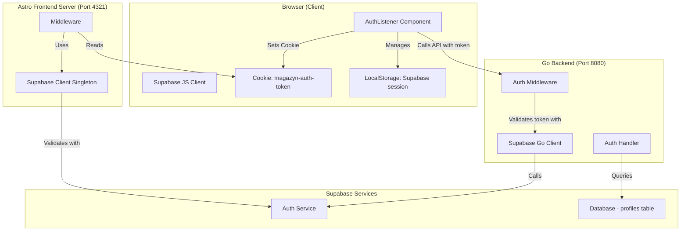

# Cookie and Session Handling Documentation

> [!NOTE]
> **STATUS: ✅ Issues Documented Here Have Been RESOLVED** - See [report.md](file:///e:/bystrze/Magazyn/.ai/loop/report.md)  
> Key fixes: SSR mode enabled in Astro, cookie timing + redirect flag in AuthListener, `detectSessionInUrl: false` in Supabase config.

This document provides a detailed analysis of how cookies and sessions are managed between the frontend, backend, and Supabase in the Magazyn equipment rental application.

## Table of Contents

1. [Architecture Overview](#architecture-overview)
2. [Supabase Session Management](#supabase-session-management)
3. [Cookie Implementation](#cookie-implementation)
4. [Frontend Session Flow](#frontend-session-flow)
5. [Backend Session Flow](#backend-session-flow)
6. [Session Synchronization](#session-synchronization)
7. [Potential Issues and Edge Cases](#potential-issues-and-edge-cases)

## Architecture Overview

The application uses a **three-tier session management** approach:



### Key Components

1. **Supabase Auth**: Central authentication authority
2. **Browser Cookie (`magazyn-auth-token`)**: Custom cookie for SSR
3. **Supabase LocalStorage**: Managed by Supabase JS client (disabled in our config)
4. **Backend Token Validation**: Validates every API request
5. **Frontend Middleware**: Protects routes server-side

## Supabase Session Management

### Supabase Client Configuration

#### Frontend Browser Client

**File**: `frontend/src/lib/supabase.ts` (inferred from imports)

The browser-side Supabase client is configured to handle auth state.

#### Frontend Server Client

**File**: `frontend/src/db/supabase.client.ts`

```typescript
export const supabaseClient = createClient(supabaseUrl, supabaseAnonKey, {
  auth: {
    flowType: 'pkce',                  // PKCE flow for security
    autoRefreshToken: false,           // ⚠️ No automatic refresh
    detectSessionInUrl: false,         // ⚠️ Don't auto-detect from URL
    persistSession: false,             // ⚠️ Don't persist in storage
  }
});
```

**Critical Configuration**:
- `persistSession: false` → Session NOT stored in localStorage server-side
- `detectSessionInUrl: false` → URL hash tokens must be manually processed
- `autoRefreshToken: false` → Manual token refresh required

**Why**: Server-side Supabase client is stateless and doesn't maintain session between requests.

#### Backend Go Client

**File**: `backend/internal/config/config.go`

```go
SupabaseClient, err = supabase.NewClient(AppConfig.SupabaseURL, AppConfig.SupabaseKey, nil)
```

**Key**: Uses **Service Role Key** (if available) or Anon Key
- Service Role Key bypasses Row Level Security (RLS)
- Used for privileged operations (querying profiles)

### Supabase Session Structure

A Supabase session contains:
- `access_token`: JWT token for authentication
- `refresh_token`: Token to get new access token
- `expires_at`: Unix timestamp when access token expires
- `user`: User object with metadata

**Token Lifespan**: 
- Access tokens typically expire after 1 hour
- Refresh tokens are long-lived

## Cookie Implementation

### Custom Cookie: `magazyn-auth-token`

**Purpose**: Store Supabase access token for server-side middleware access

#### Cookie Creation

**File**: `frontend/src/components/auth/AuthListener.tsx`

**When Set** (lines 122-127):
```typescript
supabase.auth.onAuthStateChange(async (event, session) => {
    if (session?.access_token) {
        const maxAge = 60 * 60 * 24 * 365;  // 1 year
        document.cookie = `magazyn-auth-token=${session.access_token}; path=/; max-age=${maxAge}; SameSite=Lax`;
    }
});
```

**Triggers**:
- `SIGNED_IN` event from Supabase
- Magic link processing (after successful `setSession()`)

#### Cookie Attributes

| Attribute | Value | Purpose |
|-----------|-------|---------|
| Name | `magazyn-auth-token` | Custom identifier |
| Value | `<access_token>` | Supabase JWT access token |
| Path | `/` | Available on all routes |
| Max-Age | `31536000` (1 year) | Long-lived cookie |
| SameSite | `Lax` | CSRF protection, allows top-level navigation |
| Secure | ❌ **Not set** | Works on HTTP (localhost) |
| HttpOnly | ❌ **Not set** | Accessible to JavaScript |

**⚠️ Security Note**: 
- Cookie is **NOT HttpOnly** → Can be read/modified by JavaScript
- Cookie is **NOT Secure** → Transmitted over HTTP (localhost only)
- For production, should add `Secure` flag and use HTTPS

#### Cookie Reading

**Frontend Middleware** (`frontend/src/middleware/index.ts`, lines 29-53):
```typescript
const authCookie = context.cookies.get("magazyn-auth-token");

if (authCookie?.value) {
    const { data: { user }, error } = await supabaseClient.auth.getUser(authCookie.value);
    if (user && !error) {
        context.locals.user = user;
        token = authCookie.value;
    }
}
```

**Backend**: Does NOT read cookies directly, expects `Authorization` header

#### Cookie Deletion

**When Cleared**:

1. **SIGNED_OUT event** (`AuthListener.tsx`, line 129):
   ```typescript
   document.cookie = 'magazyn-auth-token=; path=/; max-age=0; SameSite=Lax';
   ```

2. **Manual logout** (`account-disabled.astro`, line 174):
   ```javascript
   document.cookie = 'magazyn-auth-token=; Path=/; Expires=Thu, 01 Jan 1970 00:00:01 GMT;';
   ```

## Frontend Session Flow

### 1. Magic Link Click (Initial Authentication)

**File**: `frontend/src/components/auth/AuthListener.tsx` → `checkHashForToken()`

**Flow**:

1. **User clicks magic link** → Browser opens URL with hash:
   ```
   http://localhost:4321/#access_token=...&refresh_token=...&expires_in=3600&...
   ```

2. **AuthListener detects hash** (line 28-29):
   ```typescript
   const hash = window.location.hash;
   if (hash && hash.includes('access_token')) { ... }
   ```

3. **Parse tokens** (lines 34-36):
   ```typescript
   const hashParams = new URLSearchParams(hash.substring(1));
   const access_token = hashParams.get('access_token');
   const refresh_token = hashParams.get('refresh_token');
   ```

4. **Set Supabase session** (lines 41-44):
   ```typescript
   const { data, error } = await supabase.auth.setSession({
       access_token,
       refresh_token,
   });
   ```
   
   **What happens**:
   - Supabase client validates tokens
   - Stores session in memory (browser-side client)
   - Triggers `SIGNED_IN` event
   - **Does NOT set cookie yet** (happens in event handler)

5. **Fetch session info from backend** (line 59):
   ```typescript
   const sessionInfo = await getUserSession(data.session.access_token);
   ```
   
   **Backend call**: `GET /auth/session` with `Authorization: Bearer <token>`

6. **Determine redirect** based on `isEnabled` and role

7. **Clean URL hash** (line 91):
   ```typescript
   window.history.replaceState(null, '', window.location.pathname);
   ```

8. **Redirect user** (line 101):
   ```typescript
   window.location.href = redirectTo;
   ```

### 2. Auth State Change Event Handler

**Trigger**: `supabase.auth.onAuthStateChange()` fires `SIGNED_IN` event

**Flow**:

1. **Event fires** (line 118):
   ```typescript
   const { data: { subscription } } = supabase.auth.onAuthStateChange(async (event, session) => {
   ```

2. **Set cookie** (lines 122-127):
   ```typescript
   if (session?.access_token) {
       document.cookie = `magazyn-auth-token=${session.access_token}; path=/; max-age=${maxAge}; SameSite=Lax`;
   }
   ```
   
   **⚠️ CRITICAL TIMING**: Cookie is set **AFTER** session is established

3. **Fetch session info** (line 138):
   ```typescript
   const sessionInfo = await getUserSession(session.access_token);
   ```

4. **Determine redirect** and redirect if needed

### 3. Middleware Session Validation (Server-Side)

**File**: `frontend/src/middleware/index.ts`

**Execution**: Every page request (SSR)

**Flow**:

1. **Try standard Supabase session** (lines 19-21):
   ```typescript
   const { data: { session } } = await supabaseClient.auth.getSession();
   context.locals.user = session?.user || null;
   ```
   
   **Problem**: `persistSession: false` → Always returns `null` on server

2. **Fallback to cookie** (lines 29-53):
   ```typescript
   const authCookie = context.cookies.get("magazyn-auth-token");
   if (authCookie?.value) {
       const { data: { user }, error } = await supabaseClient.auth.getUser(authCookie.value);
       if (user && !error) {
           context.locals.user = user;
           token = authCookie.value;
       }
   }
   ```
   
   **Validation**: Calls Supabase Auth API to validate token

3. **Fetch complete session info** (lines 68-72):
   ```typescript
   if (context.locals.user && token) {
       sessionInfo = await getUserSession(token);
   }
   ```
   
   **Backend call**: `GET http://localhost:8080/auth/session`
   
   **Headers**: `Authorization: Bearer <token>`

4. **Make routing decisions** based on `sessionInfo.isEnabled` and role

### 4. getUserSession() Helper

**File**: `frontend/src/lib/auth/session-utils.ts`

**Purpose**: Fetch complete session info from backend

```typescript
export async function getUserSession(accessToken: string): Promise<SessionInfo | null> {
    const response = await fetch(`${BACKEND_URL}/auth/session`, {
        method: "GET",
        headers: {
            "Authorization": `Bearer ${accessToken}`,
            "Content-Type": "application/json",
        },
        cache: 'no-store'  // ⚠️ Don't cache
    });
    
    if (!response.ok) {
        return null;
    }
    
    const data = await response.json();
    return data as SessionInfo;
}
```

**Returns**: `SessionInfo` object with `isEnabled`, `role`, `creditBalance`, etc.

**⚠️ Critical**: If this fails or returns `null`, `sessionInfo` is `null` in middleware

## Backend Session Flow

### 1. Auth Middleware

**File**: `backend/internal/middleware/auth.middleware.go`

**Applied to**: All protected routes (except public `/auth/login`)

**Flow**:

1. **Extract Authorization header** (lines 19-24):
   ```go
   authHeader := r.Header.Get("Authorization")
   if authHeader == "" {
       http.Error(w, "Authorization header required", http.StatusUnauthorized)
       return
   }
   ```

2. **Parse Bearer token** (lines 28-36):
   ```go
   parts := strings.Split(authHeader, " ")
   if len(parts) != 2 || parts[0] != "Bearer" {
       http.Error(w, "Invalid authorization header format", http.StatusUnauthorized)
       return
   }
   token := parts[1]
   ```

3. **Validate with Supabase** (lines 41-47):
   ```go
   user, err := config.SupabaseClient.Auth.WithToken(token).GetUser()
   if err != nil {
       http.Error(w, "Invalid or expired token", http.StatusUnauthorized)
       return
   }
   ```
   
   **What happens**:
   - Go Supabase client calls Supabase Auth API
   - Verifies JWT signature and expiration
   - Returns user object if valid

4. **Fetch profile from database** (lines 53-60):
   ```go
   var profiles []model.PublicProfilesSelect
   _, err = config.SupabaseClient.From("profiles").Select("*", "exact", false)
           .Eq("id", user.ID.String()).ExecuteTo(&profiles)
   ```
   
   **Uses**: Service Role Key (bypasses RLS)

5. **Check isEnabled** (lines 87-91):
   ```go
   if !profile.IsEnabled && r.URL.Path != "/auth/session" {
       http.Error(w, "Account is disabled. Please contact an administrator.", http.StatusForbidden)
       return
   }
   ```
   
   **Exception**: `/auth/session` endpoint allowed for disabled users

6. **Add to context** (lines 77, 97):
   ```go
   ctx := context.WithValue(r.Context(), appcontext.UserContextKey, userCtx)
   ctx = context.WithValue(ctx, appcontext.UserProfileContextKey, profile)
   ```

7. **Call next handler** with enriched context

### 2. Session Endpoint Handler

**File**: `backend/internal/handler/auth.handler.go` → `HandleGetSession()`

**Flow**:

1. **Extract user from context** (lines 80-86):
   ```go
   val := r.Context().Value(appcontext.UserContextKey)
   user, ok := val.(*types.User)
   if !ok {
       http.Error(w, "Unauthorized", http.StatusUnauthorized)
       return
   }
   ```

2. **Call service** (line 96):
   ```go
   session, err := h.service.GetSession(r.Context(), user.ID.String())
   ```

3. **Service queries profile** (`auth.service.go`, lines 65-71):
   ```go
   var profiles []model.PublicProfilesSelect
   _, err := config.SupabaseClient.From("profiles").Select("*", "exact", false)
           .Eq("id", userId).ExecuteTo(&profiles)
   ```

4. **Construct response** (lines 90-98):
   ```go
   response := &SessionResponse{
       UserId:        profile.Id,
       Email:         profile.Email,
       Username:      profile.Username,
       Role:          profile.Role,
       CreditBalance: profile.CreditBalance,
       IsEnabled:     profile.IsEnabled,
   }
   ```

5. **Return JSON** (line 110):
   ```go
   json.NewEncoder(w).Encode(session)
   ```

## Session Synchronization

### Data Sources and Their Roles

| Data Source | Contains | Used By | Authoritative For |
|-------------|----------|---------|-------------------|
| **Supabase Auth** | `user` object (id, email, metadata) | Frontend & Backend | Authentication |
| **Database `profiles` table** | `is_enabled`, `role`, `username`, `credit_balance` | Backend only | User state |
| **Cookie `magazyn-auth-token`** | `access_token` | Frontend middleware | SSR auth |
| **Browser Supabase session** | Full session object | Client-side JS | Client state |

### Synchronization Points

#### 1. Login → Session Creation

```
User enters email
    ↓
Backend sends magic link (Supabase OTP)
    ↓
User clicks link
    ↓
Browser: URL contains #access_token=...&refresh_token=...
    ↓
AuthListener.checkHashForToken() processes hash
    ↓
Calls supabase.auth.setSession({access_token, refresh_token})
    ↓
Supabase client validates and stores session
    ↓
Fires SIGNED_IN event
    ↓
Event handler sets cookie: magazyn-auth-token
    ↓
Fetches session info from backend: GET /auth/session
    ↓
Backend validates token, queries profile, returns SessionInfo
    ↓
Frontend redirects based on isEnabled and role
```

**⚠️ Timing Issue**: Cookie is set **AFTER** session establishment, creating race condition window.

#### 2. Page Load → Middleware Session Check

```
Browser requests page
    ↓
Astro middleware runs (SSR)
    ↓
Tries supabaseClient.auth.getSession() → Returns null (persistSession: false)
    ↓
Reads magazyn-auth-token cookie
    ↓
Validates token with Supabase: supabaseClient.auth.getUser(token)
    ↓
If valid, sets context.locals.user
    ↓
Fetches session info from backend: GET /auth/session
    ↓
Backend validates token (redundant) and queries profile
    ↓
Middleware makes routing decision
```

**⚠️ Redundancy**: Token validated twice (frontend middleware + backend middleware)

#### 3. API Call → Backend Validation

```
Client makes API call with Authorization header
    ↓
Backend auth middleware runs
    ↓
Extracts Bearer token from header
    ↓
Validates with Supabase: client.Auth.WithToken(token).GetUser()
    ↓
Queries profiles table for is_enabled and role
    ↓
Blocks if disabled (except /auth/session)
    ↓
Adds user and profile to request context
    ↓
Handler accesses user from context
```

### Session State Consistency

**Potential Inconsistencies**:

1. **Token expired but cookie still exists**:
   - Cookie has 1-year lifespan
   - Token expires in 1 hour
   - Middleware validation will fail → User redirected to login

2. **Profile updated but session not refreshed**:
   - Admin enables user in database
   - User's cached `sessionInfo` still shows disabled
   - User must refresh page or call "Check Account Status"

3. **Cookie set but not yet sent to server**:
   - AuthListener sets cookie async
   - User immediately redirects to new page
   - Middleware runs before cookie is sent → No auth

## Potential Issues and Edge Cases

### 1. Race Condition: Cookie Set After Redirect

**Scenario**:
1. User logs in via magic link
2. `checkHashForToken()` calls `setSession()`
3. Function redirects immediately (line 101): `window.location.href = redirectTo`
4. `onAuthStateChange` event fires **AFTER** redirect initiated
5. Cookie set **AFTER** new page request sent
6. Middleware on new page doesn't see cookie
7. Redirects back to login

**Evidence from logs**:
```
✅ Session info received: { isEnabled: true, role: "super_admin" }
[repeated many times]
```

Multiple session fetches suggest repeated redirects.

**Fix**: Ensure cookie is set **BEFORE** redirect

### 2. Multiple Session Info Fetches

**Observation**: Backend logs show many `/auth/session` calls

**Causes**:
- Every page load fetches session info (middleware)
- Every client-side auth event fetches session info (AuthListener)
- Potential redirect loops multiplying requests

**Impact**: Performance and load on backend

**Fix**: Implement session info caching with short TTL

### 3. Token Validation Redundancy

**Current Flow**:
1. Frontend middleware validates token with Supabase
2. Frontend fetches session from backend
3. Backend middleware validates same token with Supabase again
4. Backend queries profile

**Redundancy**: Token validated twice for same request

**Fix**: Trust frontend validation OR skip frontend Supabase call

### 4. No Token Refresh Mechanism

**Config**: `autoRefreshToken: false`

**Problem**: 
- Access tokens expire after ~1 hour
- No automatic refresh
- User must log in again after token expiry

**Fix**: Implement manual refresh using `refresh_token` before expiry

### 5. Cookie Not HttpOnly

**Security Risk**:
- Cookie accessible to JavaScript
- Vulnerable to XSS attacks
- Malicious script can steal token

**Fix**: 
- Set `HttpOnly` flag
- Handle auth differently for client-side vs. SSR

### 6. sessionInfo Null Handling

**Problem**: If `getUserSession()` fails, `sessionInfo = null`

**Impact**:
- Middleware checks `sessionInfo?.isEnabled` → `undefined` (falsy)
- Enabled user might not be redirected away from `/account-disabled`
- Redirect logic breaks

**Fix**: Handle `null` sessionInfo explicitly, possibly retry or fail safely

### 7. Logout Incomplete

**Current logout** (`account-disabled.astro`):
- Clears cookie
- Clears localStorage
- Redirects to login

**Missing**:
- No backend logout call
- Supabase session not invalidated server-side
- Token still valid until expiry

**Fix**: Call backend `POST /auth/logout` to invalidate token

## Summary

### Session Flow Layers

1. **Supabase Auth**: Ultimate authority for authentication
2. **Database `profiles`**: Authority for user state (`isEnabled`, `role`)
3. **Cookie `magazyn-auth-token`**: Bridge for SSR authentication
4. **Backend validation**: Enforces access control
5. **Frontend middleware**: Route protection based on auth and `isEnabled`
6. **Frontend client**: Manages session UI state and redirects

### Critical Dependencies

- **Frontend middleware** depends on cookie being set
- **Cookie** depends on `onAuthStateChange` event firing
- **Redirect logic** depends on `sessionInfo` from backend
- **Backend auth** depends on token in `Authorization` header
- **Everything** depends on Supabase Auth for token validation

### Main Issues Identified

1. **Race condition**: Cookie set after redirect initiated
2. **No caching**: Excessive session info fetches
3. **Token duplication**: Token validated multiple times
4. **No refresh**: Tokens expire without renewal
5. **Security**: Cookie not HttpOnly
6. **Null handling**: `sessionInfo` failures not handled gracefully
7. **Incomplete logout**: Token not invalidated server-side

### Recommendations

1. **Set cookie BEFORE redirect** or use `await` properly
2. **Cache sessionInfo** with short TTL (e.g., 5 minutes)
3. **Eliminate redundant validation** or trust middleware
4. **Implement token refresh** before expiry
5. **Make cookie HttpOnly** and adjust architecture
6. **Add retry logic** for sessionInfo fetches
7. **Call backend logout** to invalidate tokens properly
