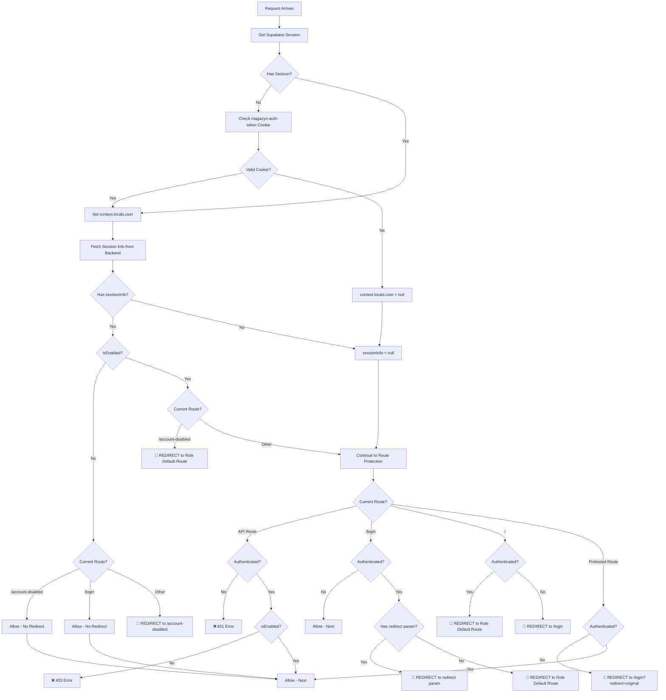

# Redirect Logic and Triggers Documentation

> [!NOTE]
> **STATUS: ✅ Issues Documented Here Have Been RESOLVED** - See [report.md](file:///e:/bystrze/Magazyn/.ai/loop/report.md)  
> Key fixes: SSR mode enabled, sessionInfo passed to pages, cookie timing fixed, duplicate redirects prevented.

This document provides a detailed analysis of all redirect logic and triggers in the Magazyn equipment rental application.

## Table of Contents

1. [Overview](#overview)
2. [Backend Redirects](#backend-redirects)
3. [Frontend Server-Side Redirects (Middleware)](#frontend-server-side-redirects-middleware)
4. [Frontend Client-Side Redirects (AuthListener)](#frontend-client-side-redirects-authlistener)
5. [Account Disabled Page Redirects](#account-disabled-page-redirects)
6. [Redirect Triggers Summary](#redirect-triggers-summary)
7. [Potential Loop Scenarios](#potential-loop-scenarios)

## Overview

The application has **three layers** of redirect logic:

1. **Backend**: No redirects (returns HTTP status codes)
2. **Frontend Middleware** (Server-Side): Astro middleware on every request
3. **Frontend Client-Side**: React AuthListener component

Redirects can be triggered by:
- Authentication status (logged in vs. not logged in)
- User enablement status (`isEnabled` true/false)
- User role (`user`, `admin`, `super_admin`)
- Current route vs. expected route

## Backend Redirects

**File**: `backend/internal/middleware/auth.middleware.go`, `backend/internal/handler/auth.handler.go`

### ❌ No Redirects in Backend

The backend **does not perform HTTP redirects**. It returns:
- `200 OK` for successful requests
- `401 Unauthorized` for missing/invalid tokens
- `403 Forbidden` for disabled users (except `/auth/session`)
- `404 Not Found` for missing profiles
- `500 Internal Server Error` for server errors

The frontend is responsible for handling these status codes and redirecting users accordingly.

## Frontend Server-Side Redirects (Middleware)

**File**: `frontend/src/middleware/index.ts`

**Execution**: Runs on **EVERY request** to Astro pages (SSR)

### Redirect Logic Flow



### Redirect Triggers

#### 1. Disabled User Redirect to `/account-disabled`

**Location**: Lines 76-85

**Condition**:
```typescript
if (
    context.locals.user &&           // User is authenticated
    sessionInfo &&                   // Session info was fetched
    !sessionInfo.isEnabled &&        // User is DISABLED
    !isAccountDisabledRoute &&       // Not already on /account-disabled
    !isPublicRoute                   // Not on a public route (/login)
) {
    return Response.redirect(new URL("/account-disabled", url.origin).toString(), 302);
}
```

**Trigger**: Authenticated disabled user accessing any route except `/account-disabled` or `/login`

**Redirect**: → `/account-disabled` (302 temporary redirect)

#### 2. Enabled User Redirect Away from `/account-disabled`

**Location**: Lines 87-92

**Condition**:
```typescript
if (isAccountDisabledRoute && sessionInfo?.isEnabled) {
    const defaultRoute = getDefaultRouteForUser(context.locals.user, sessionInfo);
    return Response.redirect(new URL(defaultRoute, url.origin).toString(), 302);
}
```

**Trigger**: Enabled user accessing `/account-disabled`

**Redirect**: → Role-based default route (302 temporary redirect)
- `super_admin` or `admin` → `/admin`
- `user` → `/dashboard`
- Default (no role) → `/dashboard`

**⚠️ CRITICAL**: If `sessionInfo` is `null` or `isEnabled` check fails, this redirect does NOT occur, creating potential for enabled users to see the disabled page.

#### 3. API Route Protection

**Location**: Lines 98-110

**Conditions**:
```typescript
if (url.pathname.startsWith("/api/") && !isAuthApiRoute && !isLoggerRoute) {
    if (!context.locals.user) {
        throw ApiErrors.unauthorized("Authentication required");  // ❌ 401
    }
    if (sessionInfo && !sessionInfo.isEnabled) {
        throw ApiErrors.forbidden("Account is disabled...");      // ❌ 403
    }
}
```

**Trigger**: Unauthenticated OR disabled user accessing protected API routes

**Response**: HTTP error, not redirect (handled by `handleApiError()`)

**Exceptions**:
- `/api/auth/*` (public)
- `/api/logger` (public for logging)

#### 4. Unauthenticated User Redirect to Login

**Location**: Lines 114-122

**Condition**:
```typescript
if (!isPublicRoute && !isAccountDisabledRoute && !url.pathname.startsWith("/api/")) {
    if (!context.locals.user) {
        const redirectUrl = new URL("/login", url.origin);
        redirectUrl.searchParams.set("redirect", url.pathname);
        return Response.redirect(redirectUrl.toString(), 302);
    }
}
```

**Trigger**: Unauthenticated user accessing protected page route

**Redirect**: → `/login?redirect=<original-path>` (302 temporary redirect)

#### 5. Root Path Role-Based Redirect

**Location**: Lines 126-131

**Condition**:
```typescript
if (url.pathname === "/" && context.locals.user) {
    const defaultRoute = getDefaultRouteForUser(context.locals.user, sessionInfo);
    return Response.redirect(new URL(defaultRoute, url.origin).toString(), 302);
}
```

**Trigger**: Authenticated user accessing root path `/`

**Redirect**: → Role-based default route (302 temporary redirect)

**⚠️ IMPORTANT**: This uses `getDefaultRouteForUser()` which checks `isEnabled` FIRST:
- If `sessionInfo.isEnabled === false` → `/account-disabled`
- Otherwise → role-based route (`/admin` or `/dashboard`)

#### 6. Authenticated User Redirect from Login

**Location**: Lines 134-149

**Condition**:
```typescript
if (url.pathname === "/login" && context.locals.user) {
    const redirect = url.searchParams.get("redirect");
    
    if (redirect && redirect !== "/login" && redirect !== "/") {
        return Response.redirect(new URL(redirect, url.origin).toString(), 302);
    } else {
        const defaultRoute = getDefaultRouteForUser(context.locals.user, sessionInfo);
        return Response.redirect(new URL(defaultRoute, url.origin).toString(), 302);
    }
}
```

**Trigger**: Authenticated user accessing `/login`

**Redirect**:
- If `redirect` param exists and is valid → redirect to that path
- Otherwise → Role-based default route

**⚠️ CRITICAL**: This redirect uses `getDefaultRouteForUser()` which checks `isEnabled`. If enabled → role route, if disabled → `/account-disabled`

## Frontend Client-Side Redirects (AuthListener)

**File**: `frontend/src/components/auth/AuthListener.tsx`

**Execution**: Runs in browser on component mount and auth state changes

### Redirect Triggers

#### 1. Magic Link Hash Processing

**Location**: Lines 27-112 (`checkHashForToken()`)

**Trigger**: URL contains `#access_token=...` (user clicked magic link)

**Flow**:
1. Extract tokens from URL hash
2. Call `supabase.auth.setSession({ access_token, refresh_token })`
3. **Fetch session info** from backend:
   ```typescript
   const sessionInfo = await getUserSession(data.session.access_token);
   ```
4. **Determine redirect based on `isEnabled`** (lines 75-88):
   ```typescript
   const urlParams = new URLSearchParams(window.location.search);
   const redirectParam = urlParams.get('redirect');
   
   let redirectTo: string;
   
   if (redirectParam && redirectParam !== '/login' && redirectParam !== '/') {
       if (!sessionInfo.isEnabled) {
           redirectTo = '/account-disabled';
       } else {
           redirectTo = redirectParam;
       }
   } else {
       redirectTo = getDefaultRouteForUser(data.session.user, sessionInfo);
   }
   ```

5. **Clean URL and redirect** (lines 91-102):
   ```typescript
   window.history.replaceState(null, '', window.location.pathname);
   
   const currentPath = window.location.pathname.replace(/\/$/, '') || '/';
   const targetPath = redirectTo.replace(/\/$/, '') || '/';
   
   if (currentPath !== targetPath) {
       window.location.href = redirectTo;  // 🔄 CLIENT-SIDE REDIRECT
   }
   ```

**Redirect**: 
- Disabled user → `/account-disabled`
- Enabled user with redirect param → redirect param
- Enabled user without redirect param → Role-based default route

#### 2. SIGNED_IN Event Handler

**Location**: Lines 133-177

**Trigger**: Supabase auth fires `SIGNED_IN` event

**Flow**:
1. **Set auth cookie** (lines 122-127):
   ```typescript
   document.cookie = `magazyn-auth-token=${session.access_token}; path=/; max-age=${maxAge}; SameSite=Lax`;
   ```

2. **Fetch session info** (lines 136-139):
   ```typescript
   const sessionInfo = await getUserSession(session.access_token);
   ```

3. **Determine redirect** (lines 145-159):
   ```typescript
   let redirectTo: string;
   
   if (redirectParam && redirectParam !== '/login' && redirectParam !== '/') {
       if (sessionInfo && !sessionInfo.isEnabled) {
           redirectTo = '/account-disabled';
       } else {
           redirectTo = redirectParam;
       }
   } else {
       redirectTo = getDefaultRouteForUser(session.user, sessionInfo);
   }
   ```

4. **Redirect if needed** (lines 167-177):
   ```typescript
   const currentPath = window.location.pathname.replace(/\/$/, '') || '/';
   const targetPath = redirectTo.replace(/\/$/, '') || '/';
   
   if (currentPath !== targetPath) {
       window.location.href = redirectTo;  // 🔄 CLIENT-SIDE REDIRECT
   } else {
       // Already on target page, no redirect
   }
   ```

**Redirect**:
- Disabled user → `/account-disabled`
- Enabled user → Redirect param or role-based default route
- **Only if not already on target page**

#### 3. URL Hash Cleanup

**Location**: Lines 162-164, 180-183

**Trigger**: Session exists and URL contains `#access_token`

**Action**:
```typescript
if (window.location.hash && window.location.hash.includes('access_token')) {
    window.history.replaceState(null, '', window.location.pathname);
}
```

**Purpose**: Clean up URL after processing magic link (not a redirect, just history manipulation)

## Account Disabled Page Redirects

**File**: `frontend/src/pages/account-disabled.astro`

### 1. Check Account Status Button

**Location**: Lines 109-162 (client-side script)

**Trigger**: User clicks "Check Account Status" button

**Flow**:
1. Fetch session info from backend:
   ```javascript
   const response = await fetch(`${BACKEND_URL}/auth/session`, {
       headers: { 'Authorization': `Bearer ${accessToken}` }
   });
   const data = await response.json();
   ```

2. **Check `isEnabled`** (lines 132-149):
   ```javascript
   if (data.isEnabled) {
       // Account is now enabled! Redirect to appropriate page
       setTimeout(() => {
           window.location.href = '/';  // 🔄 CLIENT-SIDE REDIRECT
       }, 1500);
   } else {
       // Still disabled - show message
   }
   ```

**Redirect**: If enabled → `/` (which triggers middleware role-based redirect)

**Delay**: 1.5 seconds after showing "Account enabled!" message

### 2. Logout Button

**Location**: Lines 165-191

**Trigger**: User clicks "Logout" button

**Flow**:
1. Clear auth cookie:
   ```javascript
   document.cookie = 'magazyn-auth-token=; Path=/; Expires=Thu, 01 Jan 1970 00:00:01 GMT;';
   ```

2. Clear localStorage:
   ```javascript
   localStorage.removeItem('magazyn-auth-token');
   localStorage.removeItem('sb-gwamxxqarkcpvgzvpanc-auth-token');
   ```

3. **Redirect**:
   ```javascript
   window.location.href = '/login';  // 🔄 CLIENT-SIDE REDIRECT
   ```

**Redirect**: → `/login`

## Redirect Triggers Summary

### Server-Side Middleware Redirects (SSR - Every Request)

| Condition | From | To | Line |
|-----------|------|----|----|
| Authenticated + Disabled + Not on `/account-disabled` or `/login` | Any route | `/account-disabled` | 76-85 |
| Authenticated + Enabled + On `/account-disabled` | `/account-disabled` | Role default route | 87-92 |
| Not Authenticated + Protected route | Protected route | `/login?redirect=<path>` | 114-122 |
| Authenticated + On root `/` | `/` | Role default route | 126-131 |
| Authenticated + On `/login` | `/login` | Redirect param OR Role default route | 134-149 |

### Client-Side AuthListener Redirects (Browser - Auth Events)

| Trigger | Condition | To | Line |
|---------|-----------|----|----|
| Magic link hash in URL | Disabled user | `/account-disabled` | 80-84 |
| Magic link hash in URL | Enabled user + redirect param | Redirect param | 82-84 |
| Magic link hash in URL | Enabled user + no redirect param | Role default route | 86-88 |
| SIGNED_IN event | Disabled user | `/account-disabled` | 151-155 |
| SIGNED_IN event | Enabled user + redirect param | Redirect param | 153-155 |
| SIGNED_IN event | Enabled user + no redirect param | Role default route | 157-159 |

### Client-Side Account Disabled Page Redirects

| Trigger | Condition | To | Line |
|---------|-----------|----|----|
| Check Status button | `isEnabled === true` | `/` (then middleware → role route) | 138-140 |
| Logout button | Always | `/login` | 185 |

## Potential Loop Scenarios

### ⚠️ Scenario 1: Enabled User Stuck on `/account-disabled`

**Conditions**:
1. User is enabled (`isEnabled === true`)
2. User navigates to `/account-disabled`
3. Middleware check at line 88 should redirect away

**Possible Causes**:
- `sessionInfo` is `null` (backend call failed)
- `sessionInfo.isEnabled` is `undefined` or falsy (unexpected value)
- Race condition: `isEnabled` value not synced between backend and frontend

**Expected Behavior**:
```typescript
if (isAccountDisabledRoute && sessionInfo?.isEnabled) {
    const defaultRoute = getDefaultRouteForUser(context.locals.user, sessionInfo);
    return Response.redirect(new URL(defaultRoute, url.origin).toString(), 302);
}
```

**Fix**: This redirect should occur, but requires `sessionInfo?.isEnabled === true`

### ⚠️ Scenario 2: Disabled User Redirect Loop

**Not Possible** based on current code:
- Disabled users are redirected to `/account-disabled` (line 84)
- `/account-disabled` is in the exception list (line 80): `!isAccountDisabledRoute`
- So disabled users on `/account-disabled` are NOT redirected

### ⚠️ Scenario 3: Enabled User Infinite Redirect Loop

**Possible Conditions**:
1. User is enabled (`isEnabled === true`)
2. User is on `/login` or `/`
3. Middleware redirects to role default route
4. Role default route redirects back to `/login` or `/`

**Analysis**:

**From `/login` (lines 134-149)**:
```typescript
if (url.pathname === "/login" && context.locals.user) {
    const defaultRoute = getDefaultRouteForUser(context.locals.user, sessionInfo);
    return Response.redirect(new URL(defaultRoute, url.origin).toString(), 302);
}
```

**`getDefaultRouteForUser()` logic**:
```typescript
if (sessionInfo && !sessionInfo.isEnabled) {
    return "/account-disabled";
}
const role = sessionInfo?.role || user.user_metadata?.role;
switch (role) {
    case "super_admin":
    case "admin":
        return "/admin";
    case "user":
        return "/dashboard";
    default:
        return "/dashboard";
}
```

**Causes for Loop**:
1. **If `sessionInfo` is `null` or `undefined`**:
   - `getDefaultRouteForUser()` falls through to role from `user.user_metadata?.role`
   - If role is also missing → returns `/dashboard`
   - If `/dashboard` doesn't exist or redirects back → loop

2. **If `sessionInfo.isEnabled` is incorrectly `false` for an enabled user**:
   - Returns `/account-disabled`
   - Middleware redirects enabled user away from `/account-disabled` (line 88)
   - Creates a loop if the away-redirect goes back to a route that redirects to `/account-disabled`

3. **If backend returns wrong `isEnabled` value**:
   - Database has `is_enabled = true` but backend returns `isEnabled: false` in DTO
   - Creates conflicting state

### 🔴 Scenario 4: OBSERVED ISSUE - Enabled User Redirect/Refresh Loop

**User Report**: "I am having issue with redirection/refresh loop on login view for user that IsEnabled == true"

**Hypothesis Based on Code**:

1. **User logs in via magic link**
2. **AuthListener processes hash** (lines 27-112):
   - Sets session
   - Fetches `sessionInfo` from backend
   - `sessionInfo.isEnabled === true`
   - Redirects to role default route (e.g., `/dashboard` or `/admin`)

3. **Middleware intercepts request** to `/dashboard` or `/admin`:
   - Fetches `sessionInfo` again from backend
   - **Potential Issue**: If this fetch fails or returns different data
   - Or if `context.locals.user` is not set properly

4. **Possible causes**:
   
   **A. Cookie not set before middleware runs**:
   - AuthListener sets cookie (line 126) AFTER `SIGNED_IN` event
   - But middleware runs BEFORE client-side JavaScript executes
   - If cookie is not present during middleware execution → `context.locals.user = null` → redirect to `/login`

   **B. Race condition between AuthListener and middleware**:
   - AuthListener redirects to `/dashboard`
   - Browser makes new request to `/dashboard`
   - Middleware runs but cookie not yet set → redirects to `/login?redirect=/dashboard`
   - AuthListener sees authenticated user on `/login` → redirects to `/dashboard`
   - **LOOP**

   **C. `getUserSession()` fails on middleware side**:
   - Middleware calls `getUserSession(token)` (line 70)
   - Backend returns error or `null`
   - `sessionInfo` is `null`
   - Redirect logic doesn't have proper `isEnabled` check
   - Falls back to problematic default

   **D. `isEnabled` value discrepancy**:
   - Client-side sees `isEnabled: true`
   - Server-side sees `isEnabled: false` (cached, stale, or query issue)
   - Creates conflicting redirects

**Evidence from Code**:

**Middleware line 69-72**:
```typescript
if (context.locals.user && token) {
    console.log('🔍 Middleware: Fetching session info for user:', context.locals.user.email);
    sessionInfo = await getUserSession(token);
    console.log('📋 Middleware: Session info received:', sessionInfo ? `Enabled=${sessionInfo.isEnabled}, Role=${sessionInfo.role}` : 'NULL');
}
```

**If `getUserSession()` returns `null`**:
- `sessionInfo` is `null`
- **Line 88 check** `sessionInfo?.isEnabled` evaluates to `undefined` (falsy)
- Enabled user is NOT redirected away from `/account-disabled`
- But middleware still allows access to protected routes IF authenticated

**Root Cause for Loop (Hypothesis)**:
1. User logs in → AuthListener redirects to role route (e.g., `/dashboard`)
2. Middleware runs → Fetches `sessionInfo` → Returns `null` or `isEnabled: false`
3. Middleware redirects disabled user to `/account-disabled`
4. AuthListener detects being on wrong page → Redirects to role route
5. **INFINITE LOOP**

Alternatively:
1. User logs in → AuthListener sets cookie and redirects
2. Browser loads new page BEFORE cookie is set
3. Middleware sees no authenticated user → Redirects to `/login`
4. Client-side JS executes → Sees authenticated session → Redirects away from `/login`
5. **LOOP**

## Recommendations for Investigation

To identify the exact cause of the enabled user redirect loop, check:

1. **Server logs** for middleware execution:
   - Is `sessionInfo` null?
   - Is `sessionInfo.isEnabled` true or false?
   - Is `context.locals.user` set?

2. **Browser console logs**:
   - What does AuthListener log for `sessionInfo`?
   - What redirects are triggered?

3. **Network tab**:
   - Is the cookie `magazyn-auth-token` present in requests?
   - What does `/auth/session` return?
   - Timing of cookie being set vs. requests being made

4. **Database**:
   - Verify `profiles.is_enabled` is actually `true` for the user

5. **Backend logs**:
   - Check `auth.middleware.go` for `isEnabled` value
   - Check if profile query returns results

6. **Sequence of events**:
   - Magic link click → hash processing → cookie set → redirect → middleware → backend call → response → redirect decision
