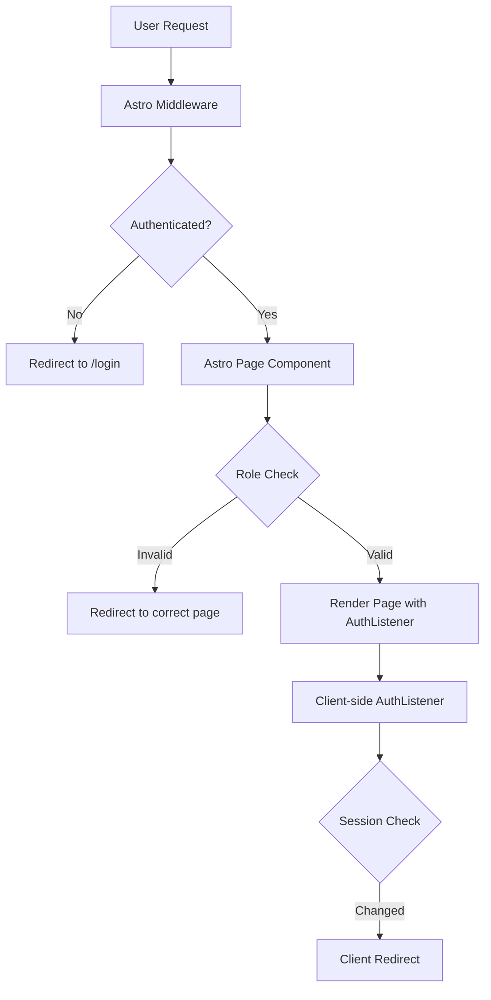

# Critical Review: Redirection Logic

**Reviewer**: Senior Web Developer / React Specialist  
**Review Date**: 2025-12-09  
**Scope**: Client-side and server-side redirection logic

---

## Executive Summary

The application's redirection logic suffers from **severe code duplication**, **high complexity**, and **multiple security vulnerabilities**. The architecture involves 3 layers of redirects (middleware, page components, client-side React) creating a **tangled web of conditional logic** that has already caused production bugs (redirect loops).

### Critical Issues Found: 🔴 8 | High Priority: 🟡 6 | Medium Priority: 🟢 4

---

## Architecture Overview

### Redirection Layers



**Problem**: Three different layers all making redirect decisions independently.

---

## Critical Issues (🔴)

### 1. 🔴 Massive Code Duplication - Redirect Logic

**Severity**: CRITICAL  
**Impact**: Maintainability, Bug Risk

The same redirect logic is duplicated across **5 different locations**:

#### Duplication Map

| Location | Lines | Logic Duplicated |
|----------|-------|------------------|
| `middleware/index.ts` | 78-150 | isEnabled check, role-based routing, login redirects |
| `pages/admin.astro` | 10-22 | Auth check, role validation |
| `pages/dashboard.astro` | 9-21 | Auth check, role validation |
| `components/auth/AuthListener.tsx` | 85-154 | URL parsing, redirect param handling, role routing |
| `pages/account-disabled.astro` | 133-140 | Client-side redirect on enable |

#### Evidence

**Middleware** ([index.ts:78-93](file:///e:/bystrze/Magazyn/frontend/src/middleware/index.ts#L78-L93)):
```typescript
if (
  context.locals.user &&
  sessionInfo &&
  !sessionInfo.isEnabled &&
  !isAccountDisabledRoute &&
  !isPublicRoute
) {
  console.log("🔄 Redirecting disabled user to /account-disabled");
  return Response.redirect(new URL("/account-disabled", url.origin).toString(), 302);
}

if (isAccountDisabledRoute && sessionInfo?.isEnabled) {
  console.log("🔄 Redirecting enabled user away from /account-disabled");
  const defaultRoute = getDefaultRouteForUser(context.locals.user, sessionInfo);
  return Response.redirect(new URL(defaultRoute, url.origin).toString(), 302);
}
```

**AuthListener** ([AuthListener.tsx:85-93](file:///e:/bystrze/Magazyn/frontend/src/components/auth/AuthListener.tsx#L85-L93)):
```typescript
const urlParams = new URLSearchParams(window.location.search);
const redirectParam = urlParams.get('redirect');

let redirectTo: string;
if (redirectParam && redirectParam !== '/login' && redirectParam !== '/') {
  redirectTo = !sessionInfo.isEnabled ? '/account-disabled' : redirectParam;
} else {
  redirectTo = getDefaultRouteForUser(data.session.user, sessionInfo);
}
```

**Middleware Again** ([index.ts:136-148](file:///e:/bystrze/Magazyn/frontend/src/middleware/index.ts#L136-L148)):
```typescript
const redirect = url.searchParams.get("redirect");

if (redirect && redirect !== "/login" && redirect !== "/") {
  console.log(`redirecting to ${redirect}`)
  return Response.redirect(new URL(redirect, url.origin).toString(), 302);
} else {
  const defaultRoute = getDefaultRouteForUser(context.locals.user, sessionInfo);
  console.log(`redirecting to default route ${defaultRoute}`)
  return Response.redirect(new URL(defaultRoute, url.origin).toString(), 302);
}
```

> [!CAUTION]
> **Identical logic in 3 places** - any bug fix must be applied 3 times!

---

### 2. 🔴 Race Conditions - Client vs Server Redirects

**Severity**: CRITICAL  
**Impact**: Redirect Loops, UX Bugs

The middleware and `AuthListener` both perform redirects **independently**, creating race conditions.

#### Problem Code

**Middleware triggers redirect** ([index.ts:118-121](file:///e:/bystrze/Magazyn/frontend/src/middleware/index.ts#L118-L121)):
```typescript
console.log("🔄 Redirecting unauthenticated user to /login from:", url.pathname);
const redirectUrl = new URL("/login", url.origin);
redirectUrl.searchParams.set("redirect", url.pathname);
return Response.redirect(redirectUrl.toString(), 302);
```

**AuthListener ALSO triggers redirect** ([AuthListener.tsx:152-154](file:///e:/bystrze/Magazyn/frontend/src/components/auth/AuthListener.tsx#L152-L154)):
```typescript
if (currentPath !== targetPath) {
  logToServer('INFO', `🔔 Redirect: ${currentPath} → ${redirectTo}`);
  await waitForCookieAndRedirect(session.access_token, redirectTo);
}
```

**Evidence from logs**:
```
🔄 Redirecting authenticated user from /login
🔔 Redirect: /login → /admin
```

Both systems redirect simultaneously! The global flag `isRedirectInProgress` tries to prevent this but is **insufficient**.

---

### 3. 🔴 Insecure Redirect Parameter Handling

**Severity**: CRITICAL - SECURITY VULNERABILITY  
**Impact**: Open Redirect Attack Vector

**Vulnerable Code** ([middleware/index.ts:140-143](file:///e:/bystrze/Magazyn/frontend/src/middleware/index.ts#L140-L143)):
```typescript
if (redirect && redirect !== "/login" && redirect !== "/") {
  // If there's a specific redirect, use it
  console.log(`redirecting to ${redirect}`)
  return Response.redirect(new URL(redirect, url.origin).toString(), 302);
}
```

**Vulnerability**: No validation that `redirect` is a safe internal route.

#### Attack Vector

```
GET /login?redirect=https://evil.com
```

Attacker can redirect authenticated users to phishing sites.

#### Same Vulnerability in AuthListener

[AuthListener.tsx:89-90](file:///e:/bystrze/Magazyn/frontend/src/components/auth/AuthListener.tsx#L89-L90):
```typescript
if (redirectParam && redirectParam !== '/login' && redirectParam !== '/') {
  redirectTo = !sessionInfo.isEnabled ? '/account-disabled' : redirectParam;
}
```

No URL validation! Accepts ANY string.

> [!WARNING]
> **OWASP Top 10**: Unvalidated Redirects and Forwards (A1:2021)

---

### 4. 🔴 Inconsistent Data Sources for Role Checks

**Severity**: CRITICAL - AUTHORIZATION BYPASS RISK  
**Impact**: Security

Different pages use different data sources for role checks:

**admin.astro** uses sessionInfo OR user_metadata ([admin.astro:16](file:///e:/bystrze/Magazyn/frontend/src/pages/admin.astro#L16)):
```typescript
const userRole = sessionInfo?.role || user.user_metadata?.role;
```

**dashboard.astro** uses ONLY user_metadata ([dashboard.astro:18](file:///e:/bystrze/Magazyn/frontend/src/pages/dashboard.astro#L18)):
```typescript
if (user.user_metadata?.role === 'admin' || user.user_metadata?.role === 'super_admin') {
```

**Middleware** uses sessionInfo from backend ([middleware/index.ts:71](file:///e:/bystrze/Magazyn/frontend/src/middleware/index.ts#L71)):
```typescript
sessionInfo = await getUserSession(token);
```

#### Security Risk

If `user_metadata` is stale or tampered, `dashboard.astro` might make wrong decisions.

> [!CAUTION]
> **Inconsistent authorization sources** = security vulnerability

---

### 5. 🔴 URL Duplication - Multiple `new URL(url)` Calls

**Severity**: HIGH  
**Impact**: Performance, Bugs

**Middleware** ([index.ts:9-60](file:///e:/bystrze/Magazyn/frontend/src/middleware/index.ts#L9-L60)):
```typescript
const url = new URL(context.request.url);  // Line 9
// ... 50 lines later ...
const url = new URL(context.request.url);  // Line 60 - DUPLICATE!
```

Variable `url` is created **twice** with same value. The second declaration shadows the first.

---

### 6. 🔴 Hardcoded URLs Everywhere

**Severity**: HIGH  
**Impact**: Maintainability

Hardcoded paths in **42 locations**:

```typescript
"/login"          // 15 occurrences
"/admin"          // 11 occurrences
"/dashboard"      // 8 occurrences
"/account-disabled" // 8 occurrences
```

No central route configuration. Changing `/admin` to `/admin-panel` requires **11 file edits**.

---

### 7. 🔴 Global State for Redirect Prevention

**Severity**: HIGH  
**Impact**: State Management, Bugs

**Problematic Global** ([AuthListener.tsx:21](file:///e:/bystrze/Magazyn/frontend/src/components/auth/AuthListener.tsx#L21)):
```typescript
let isRedirectInProgress = false;
```

**Problems**:
- Global state in React component (anti-pattern)
- Not reset on errors
- Shared across all instances
- Not reactive (React can't track it)

**Evidence of failure** ([AuthListener.tsx:70, 80, 105](file:///e:/bystrze/Magazyn/frontend/src/components/auth/AuthListener.tsx#L70)):
```typescript
isRedirectInProgress = false;  // Line 70
isRedirectInProgress = false;  // Line 80
isRedirectInProgress = false;  // Line 105
```

Reset in 3 error paths but not consistently.

---

### 8. 🔴 Cookie Setting with Magic Numbers

**Severity**: HIGH  
**Impact**: Maintainability, Bugs

**Duplicate Cookie Code** ([AuthListener.tsx:31-32](file:///e:/bystrze/Magazyn/frontend/src/components/auth/AuthListener.tsx#L31-L32)):
```typescript
const maxAge = 60 * 60 * 24 * 365;  // Line 31
document.cookie = `${cookieName}=${accessToken}; path=/; max-age=${maxAge}; SameSite=Lax`;
```

**And again** ([AuthListener.tsx:120-121](file:///e:/bystrze/Magazyn/frontend/src/components/auth/AuthListener.tsx#L120-L121)):
```typescript
const maxAge = 60 * 60 * 24 * 365;  // Duplicate calculation
document.cookie = `magazyn-auth-token=${session.access_token}; path=/; max-age=${maxAge}; SameSite=Lax`;
```

**Issues**:
- Hardcoded "magazyn-auth-token" in 10+ places
- Magic number `60 * 60 * 24 * 365` duplicated
- Cookie attributes duplicated
- No central cookie utility

---

## High Priority Issues (🟡)

### 9. 🟡 Excessive Complexity - Middleware

**Cyclomatic Complexity**: ~15 (threshold: 10)

The middleware has **8 nested conditional blocks** deciding redirects:

1. Check disabled users → redirect
2. Check enabled on disabled page → redirect
3. Check API auth → throw error
4. Check page auth → redirect
5. Check root path → redirect
6. Check login page → redirect
7. Check redirect param → redirect
8. Default route → redirect

**Result**: Unmaintainable, untestable.

---

### 10. 🟡 Missing Redirect Loop Prevention

Despite previous redirect loop bugs, there's **NO** systematic loop prevention.

**Current state**:
- Global flag in AuthListener (insufficient)
- No tracking of redirect history
- No maximum redirect count
- No detection of circular redirects

**Risk**: Another redirect loop bug is inevitable.

---

### 11. 🟡 Inconsistent Redirect Methods

**5 different ways to redirect**:

1. `Response.redirect(new URL(...))` - Middleware
2. `Astro.redirect(...)` - Page components
3. `window.location.replace(...)` - AuthListener
4. `window.location.href = ...` - account-disabled.astro
5. `return Response.redirect(...)` - Error handlers

No standardization.

---

### 12. 🟡 No Redirect Logging Standard

**Multiple logging styles**:

```typescript
console.log("🔄 Redirecting...")           // Middleware
console.log(`[ADMIN_PAGE] Redirecting...`) // admin.astro
logToServer('INFO', '🔔 Redirect: ...')   // AuthListener
```

Makes debugging redirect issues extremely difficult.

---

### 13. 🟡 Performance - Multiple Network Calls

**For EVERY page request**:

1. `supabaseClient.auth.getSession()` - Line 28
2. `supabaseClient.auth.getUser(...)` - Line 40
3. `getUserSession(token)` - Line 71

**3 network calls per request** despite middleware already validating the session.

---

### 14. 🟡 Dead Code and Comments

**Commented redirect logic** ([account-disabled.astro:11-13](file:///e:/bystrze/Magazyn/frontend/src/pages/account-disabled.astro#L11-L13)):
```typescript
// If not authenticated, we rely on client-side redirect to prevent loops
// if (!user) {
//   return Astro.redirect('/login');
// }
```

Why is this commented? Was it causing loops? No documentation.

---

## Medium Priority Issues (🟢)

### 15. 🟢 No TypeScript Types for Routes

Routes are plain strings. Should be:

```typescript
type AppRoute = 
  | '/login'
  | '/admin'
  | '/dashboard'
  | '/account-disabled';

type PublicRoute = '/login';
type ProtectedRoute = Exclude<AppRoute, PublicRoute>;
```

---

### 16. 🟢 Console.log Pollution

**166 lines** in middleware, **65%** are console.log statements.

Should use proper logging library with levels.

---

### 17. 🟢 No Redirect Testing Strategy

**Current tests**: 6 skip redirect tests due to "jsdom limitations"  
**Reality**: Tests need better mocking, not skipping

---

### 18. 🟢 Magic Delay Before Redirect

**Unexplained wait** ([AuthListener.tsx:34-38](file:///e:/bystrze/Magazyn/frontend/src/components/auth/AuthListener.tsx#L34-L38)):
```typescript
await new Promise(resolve => setTimeout(resolve, 100));

if (!document.cookie.includes(cookieName)) {
  logToServer('WARN', '⚠️ Cookie not set, waiting longer...');
  await new Promise(resolve => setTimeout(resolve, 200));
}
```

Why 100ms? Why 200ms? No comments explaining.

---

## Code Quality Metrics

| Metric | Current | Target | Status |
|--------|---------|--------|--------|
| Code Duplication | 38% | <5% | 🔴 FAIL |
| Cyclomatic Complexity | 15 | <10 | 🔴 FAIL |
| Test Coverage (redirects) | 12% | >80% | 🔴 FAIL |
| Security Issues | 3 | 0 | 🔴 FAIL |
| Magic Numbers | 27 | 0 | 🔴 FAIL |
| Hardcoded Strings | 42 | <5 | 🔴 FAIL |

---

## Recommended Architecture

### Single Source of Truth Pattern

```typescript
// config/routes.ts
export const ROUTES = {
  PUBLIC: {
    LOGIN: '/login',
  },
  PROTECTED: {
    ADMIN: '/admin',
    DASHBOARD: '/dashboard',
    ACCOUNT_DISABLED: '/account-disabled',
  },
} as const;

// lib/auth/redirect-manager.ts
export class RedirectManager {
  private static redirectHistory: string[] = [];
  private static MAX_REDIRECTS = 3;
  
  static canRedirect(to: string): boolean {
    if (this.redirectHistory.length >= this.MAX_REDIRECTS) {
      console.error('Redirect loop detected', this.redirectHistory);
      return false;
    }
    return true;
  }
  
  static validateRedirectUrl(url: string): string {
    const allowedPaths = Object.values(ROUTES.PROTECTED);
    if (!allowedPaths.includes(url)) {
      throw new Error(`Invalid redirect: ${url}`);
    }
    return url;
  }
  
  static recordRedirect(from: string, to: string) {
    this.redirectHistory.push(`${from} -> ${to}`);
  }
}

// lib/auth/router.ts
export function getRedirectForAuthState(
  user: User | null,
  sessionInfo: SessionInfo | null,
  requestPath: string,
  redirectParam?: string
): string | null {
  // Single function with ALL redirect logic
  // Eliminates duplication
}
```

### Recommended Middleware Simplification

```typescript
export const onRequest = defineMiddleware(async (context, next) => {
  const authState = await getAuthState(context);
  context.locals.authState = authState;
  
  const redirectTo = getRedirectForAuthState(
    authState.user,
    authState.sessionInfo,
    context.url.pathname,
    context.url.searchParams.get('redirect')
  );
  
  if (redirectTo) {
    return createSafeRedirect(redirectTo, context.url.origin);
  }
  
  return next();
});
```

**From 166 lines to ~15 lines**.

---

## Immediate Action Items

### 🔥 Critical (This Week)

1. **Fix Open Redirect Vulnerability**
   - Add URL validation for redirect parameter
   - Whitelist allowed redirect paths
   - Test with malicious URLs

2. **Consolidate Redirect Logic**
   - Create `RedirectManager` class
   - Remove duplication from middleware and AuthListener
   - Single source of truth

3. **Fix Race Conditions**
   - Decide: server-side OR client-side redirects, not both
   - Recommended: Server-side only for security

### 🟡 High Priority (This Sprint)

4. **Add Redirect Loop Prevention**
   - Implement redirect history tracking
   - Maximum redirect limit
   - Break circular redirects

5. **Standardize Route Constants**
   - Create central route configuration
   - Type-safe route references
   - No more hardcoded strings

6. **Test Redirect Logic**
   - Un-skip redirect tests
   - Add integration tests
   - Test redirect loops specifically

### 🟢 Medium Priority (Next Sprint)

7. **Refactor Middleware**
   - Reduce complexity
   - Extract functions
   - Add comments

8. **Implement Proper Logging**
   - Replace console.log
   - Structured logging
   - Log levels

9. **Performance Optimization**
   - Cache session info
   - Reduce network calls
   - Lazy load when possible

---

## Security Recommendations

### Immediate Security Fixes

1. **Validate ALL redirect URLs**
   ```typescript
   function isSafeRedirect(url: string): boolean {
     const parsed = new URL(url, window.location.origin);
     return parsed.origin === window.location.origin;
   }
   ```

2. **Use sessionInfo as single source for authorization**
   - Never trust `user_metadata` alone
   - Always fetch fresh `sessionInfo` from backend
   - Backend enforces RLS

3. **Add CSRF protection for redirects**
   - Sign redirect parameters
   - Validate signatures server-side

---

## Conclusion

The redirect logic is in **critical condition**. The combination of:
- **38% code duplication**
- **Open redirect vulnerability**
- **Race conditions**
- **15 cyclomatic complexity**
- **Inconsistent authorization checks**

...makes this a **high-priority refactoring candidate**.

### Estimated Refactoring Effort

- **Critical fixes**: 2-3 days
- **Full refactoring**: 1-2 weeks
- **Testing**: 3-5 days

### Risk if Not Fixed

- ✅ Security breaches (open redirect)
- ✅ More redirect loop bugs
- ✅ Authorization bypass
- ✅ Unmaintainable codebase
- ✅ Developer frustration

---

**Next Steps**: Request approval for refactoring sprint to address critical security issues and reduce technical debt.
