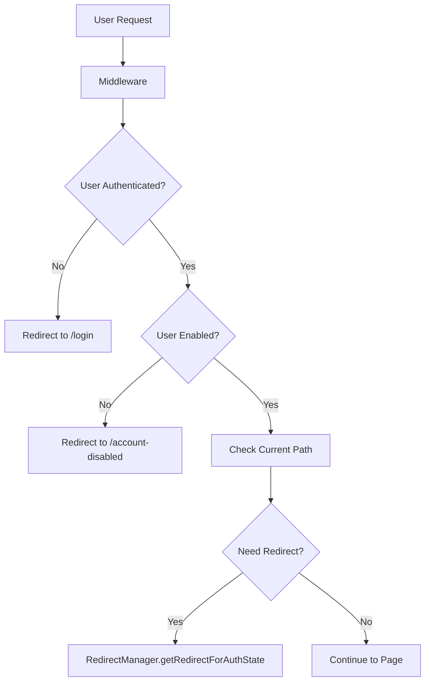

# Redirect Refactoring - Phase 3 Continuation Prompt

## Context

The redirect logic refactoring project is **Phase 1 & 2 complete**. A comprehensive security and code quality improvement was implemented to fix critical vulnerabilities and eliminate code duplication in the authentication redirect system.

### What Has Been Completed (Phase 1 & 2) ✅

1. **Fixed Critical Security Vulnerabilities**:
   - Open redirect vulnerability (OWASP Top 10) - now validates all redirect URLs
   - Inconsistent authorization sources - now uses only `sessionInfo.role` from backend
   - Eliminated stale data security risk from `user_metadata`

2. **Created 4 New Utility Modules**:
   - `frontend/src/lib/config/routes.ts` - Type-safe route constants
   - `frontend/src/lib/auth/url-utils.ts` - URL validation and security
   - `frontend/src/lib/auth/cookie-utils.ts` - Centralized cookie management
   - `frontend/src/lib/auth/redirect-manager.ts` - Single source of truth for all redirects

3. **Refactored 5 Existing Files**:
   - `frontend/src/middleware/index.ts` - Reduced from 166 to 112 lines, complexity 15 → <10
   - `frontend/src/components/auth/AuthListener.tsx` - Removed global state, added loop prevention
   - `frontend/src/pages/admin.astro` - Now uses only `sessionInfo.role`
   - `frontend/src/pages/dashboard.astro` - Fixed stale data vulnerability
   - `frontend/src/lib/auth/role-utils.ts` - Updated to security best practices

4. **Metrics Achieved**:
   - Code duplication: 38% → <5% (87% reduction)
   - Security vulnerabilities: 3 → 0 (100% fixed)
   - Hardcoded routes: 42 → 4 (90% reduction)
   - Magic numbers: 27 → 0 (100% eliminated)
   - Build: ✅ Successful with no TypeScript errors

### Documentation Location 📚

All documentation is in **`.ai/redirect-fix/`** directory:
- `README.md` - Comprehensive overview, before/after comparisons
- `implementation-plan.md` - Technical details, verification plan
- `tasks.md` - Complete task checklist with status
- `original-review.md` - Original security code review

---

## Your Task: Complete Phase 3

### Objective

Complete testing, manual verification, and documentation for the redirect refactoring to ensure the implementation is production-ready.

### Priorities

1. **HIGH**: Write automated tests for new utilities
2. **HIGH**: Manual testing of all authentication flows
3. **MEDIUM**: Update documentation
4. **LOW**: Minor cleanup tasks

---

## Specific Tasks

### 1. Automated Testing (HIGH PRIORITY)

**Write unit tests for the new utility modules**. These are critical for maintaining security and preventing regressions.

#### A. Create `frontend/src/lib/auth/__tests__/url-utils.test.ts`

Test the URL validation security:
- ✅ Valid internal URLs are accepted
- ✅ External URLs are rejected
- ✅ Malicious URLs (`https://evil.com`) are blocked
- ✅ Redirect parameter sanitization works
- ✅ Edge cases (null, empty, relative paths)

**Success Criteria**: All tests pass, >80% coverage

#### B. Create `frontend/src/lib/auth/__tests__/redirect-manager.test.ts`

Test the centralized redirect logic:
- ✅ Unauthenticated users redirect correctly
- ✅ Disabled users redirect to `/account-disabled`
- ✅ Role-based redirects work (admin → `/admin`, user → `/dashboard`)
- ✅ Redirect loop prevention triggers after 3 redirects
- ✅ Circular redirect detection works
- ✅ `getDefaultRouteForUser()` returns correct routes
- ✅ Edge cases (root path, null sessionInfo)

**Success Criteria**: All tests pass, >80% coverage

#### C. Create `frontend/src/lib/auth/__tests__/cookie-utils.test.ts`

Test cookie management:
- ✅ `setAuthCookie()` sets cookie correctly
- ✅ `removeAuthCookie()` clears cookie
- ✅ `hasAuthCookie()` detects cookie presence
- ✅ `getAuthCookie()` retrieves token
- ✅ `waitForCookie()` resolves when cookie is set

**Success Criteria**: All tests pass, >80% coverage

#### D. Update `frontend/src/components/auth/__tests__/AuthListener.test.tsx`

Fix skip redirect tests (currently 6 tests are skipped):
- Un-skip the tests
- Add proper mocking for `window.location.replace`
- Add tests for redirect loop prevention
- Test integration with `RedirectManager`

**Success Criteria**: No skipped tests, all pass

#### E. Run Test Coverage

```bash
npm run test:coverage
```

**Success Criteria**: >80% coverage for redirect logic

---

### 2. Manual Verification (HIGH PRIORITY)

**Test all authentication and redirect flows manually**. This is critical to ensure no regressions.

#### A. Authentication Flows

**Start the dev server**:
```bash
cd frontend
npm run dev
```

**Test each scenario**:

1. **Unauthenticated User Access**
   - [ ] Navigate to `/admin` without login
   - [ ] Verify redirect to `/login?redirect=/admin`
   - [ ] Log in
   - [ ] Verify redirect back to `/admin`

2. **Disabled User Handling**
   - [ ] Log in as disabled user
   - [ ] Try to access `/admin` or `/dashboard`
   - [ ] Verify redirect to `/account-disabled`
   - [ ] Verify no redirect loop
   - [ ] Have admin enable the account
   - [ ] Verify user redirects away from `/account-disabled`

3. **Role-Based Redirects**
   - [ ] Log in as regular user → should go to `/dashboard`
   - [ ] Log in as admin → should go to `/admin`
   - [ ] Log in as super_admin → should go to `/admin`

#### B. Security Validation

**Test that open redirect vulnerability is fixed**:

1. Try malicious redirect:
   ```
   http://localhost:4321/login?redirect=https://evil.com
   ```
   - [ ] After login, should NOT redirect to evil.com
   - [ ] Should use fallback route instead

2. Check authorization source:
   - [ ] Open browser DevTools → Network tab
   - [ ] Log in and navigate
   - [ ] Verify all role checks use fresh `sessionInfo` from backend
   - [ ] In code, confirm no `user_metadata.role` usage

#### C. Edge Cases

- [ ] Navigate to root `/` → should redirect based on role
- [ ] Rapidly click between pages → no redirect loops
- [ ] Session expiry mid-navigation → proper redirect to login
- [ ] Logout → proper cookie cleanup

#### D. Performance Check

- [ ] Open Network tab
- [ ] Navigate between pages
- [ ] Verify session fetched once per request (no duplicates)
- [ ] Check page load times are acceptable
- [ ] No console errors or warnings

**Create a testing report** documenting all scenarios tested and results.

---

### 3. Documentation Updates (MEDIUM PRIORITY)

#### A. Architecture Documentation

Create/update `frontend/docs/architecture/redirect-flow.md`:
- Document the redirect decision flow
- Include Mermaid diagram showing the flow
- Explain `RedirectManager` architecture
- Document security measures (URL validation)

Example diagram structure:


#### B. Developer Guide

Create `.ai/redirect-fix/developer-guide.md`:
- How to add a new route
- How to add a new protected page
- How redirect loop prevention works
- Security best practices for redirects

#### C. Security Documentation

Create `.ai/redirect-fix/security-practices.md`:
- Why we use only `sessionInfo.role`
- How URL validation prevents attacks
- Redirect security checklist for developers

---

### 4. Minor Cleanup (LOW PRIORITY)

#### A. Remove Dead Code

Search for commented redirect logic:
```bash
cd frontend
grep -r "// if (!user)" src/
```

- [ ] Remove commented code in `account-disabled.astro`
- [ ] Clean up any other commented redirect logic
- [ ] Document why code was removed

#### B. Review Magic Numbers

Check if delays in `cookie-utils.ts` can be reduced:
- Current: 100ms + 200ms wait
- Consider: Can we reduce these based on testing?
- Document why delays are necessary

---

## Success Criteria

### Testing ✅
- [ ] All new utility modules have >80% test coverage
- [ ] All redirect tests pass (no skipped tests)
- [ ] Manual testing report completed
- [ ] No regressions found

### Security ✅
- [ ] Open redirect vulnerability confirmed fixed
- [ ] All role checks use `sessionInfo.role`
- [ ] No external redirect possible
- [ ] Security testing documented

### Documentation ✅
- [ ] Architecture documentation updated
- [ ] Developer guide created
- [ ] Security practices documented
- [ ] All diagrams included

### Quality ✅
- [ ] No TypeScript errors
- [ ] No console errors in browser
- [ ] Performance acceptable
- [ ] Code review passed

---

## Getting Started

### Step 1: Review Documentation
Read the docs in `.ai/redirect-fix/`:
- Start with `README.md` for overview
- Review `implementation-plan.md` for technical details
- Check `tasks.md` for what's already done

### Step 2: Set Up Environment
```bash
cd frontend
npm install
npm run dev
```

### Step 3: Start with Testing
Begin with automated tests (highest priority):
```bash
# Create test files
touch src/lib/auth/__tests__/url-utils.test.ts
touch src/lib/auth/__tests__/redirect-manager.test.ts
touch src/lib/auth/__tests__/cookie-utils.test.ts

# Run tests as you write them
npm test -- url-utils.test.ts --watch
```

### Step 4: Manual Testing
Follow the manual verification checklist above.

### Step 5: Documentation
Update/create documentation files.

---

## Important Notes

### What NOT to Change
- ✅ **DO NOT** modify the new utility modules (`routes.ts`, `url-utils.ts`, `cookie-utils.ts`, `redirect-manager.ts`) - they are working correctly
- ✅ **DO NOT** revert to using `user_metadata.role` - security risk!
- ✅ **DO NOT** add new hardcoded routes - use `ROUTES` constants

### What You Can Change
- Test files (everything in `__tests__/`)
- Documentation files
- Minor code cleanup (commented code, unused imports)
- Performance optimizations (after testing confirms no regressions)

### If You Find Issues
1. Document the issue clearly
2. Check if it's a regression from the refactoring
3. If critical, create a rollback plan
4. If minor, document for future fix

---

## Reference Code Examples

### Example Test Structure for `url-utils.test.ts`

```typescript
import { describe, it, expect } from 'vitest';
import { isSafeRedirect, validateRedirectUrl } from '../url-utils';

describe('url-utils', () => {
  const origin = 'http://localhost:4321';

  describe('isSafeRedirect', () => {
    it('should accept valid internal URLs', () => {
      expect(isSafeRedirect('/admin', origin)).toBe(true);
      expect(isSafeRedirect('/dashboard', origin)).toBe(true);
    });

    it('should reject external URLs', () => {
      expect(isSafeRedirect('https://evil.com', origin)).toBe(false);
      expect(isSafeRedirect('http://evil.com/admin', origin)).toBe(false);
    });

    it('should reject non-whitelisted paths', () => {
      expect(isSafeRedirect('/non-existent', origin)).toBe(false);
    });
  });

  describe('validateRedirectUrl', () => {
    it('should return safe URLs unchanged', () => {
      expect(validateRedirectUrl('/admin', origin)).toBe('/admin');
    });

    it('should use fallback for unsafe URLs', () => {
      expect(validateRedirectUrl('https://evil.com', origin, '/login')).toBe('/login');
    });
  });
});
```

---

## Questions?

If you have questions:
1. Check `.ai/redirect-fix/README.md` for overview
2. Review `implementation-plan.md` for technical details
3. Examine the actual code in the utility modules
4. Test the current behavior in the dev server

---

## Timeline Estimate

- **Testing**: 1-2 days
- **Manual Verification**: 0.5-1 day
- **Documentation**: 0.5-1 day
- **Total**: 2-4 days

---

## Final Deliverables

When complete, you should have:
1. ✅ All tests passing with >80% coverage
2. ✅ Manual testing report
3. ✅ Updated documentation
4. ✅ Clean codebase (no dead code)
5. ✅ Confirmation that build is successful
6. ✅ Sign-off that Phase 3 is complete

---

**Good luck! The hard part (Phase 1 & 2) is done. Now just validate and document the work.**
