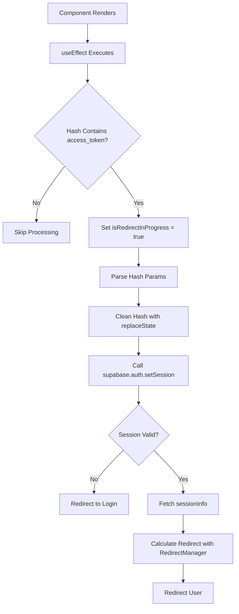

# Magic Link Test Failures - Diagnostic Report

**Date**: 2025-12-09  
**Component**: AuthListener.tsx  
**Test File**: AuthListener.test.tsx  
**Status**: 2 tests failing

---

## Executive Summary

Two tests in the "Magic Link Hash Processing" suite are failing because the hash processing logic in `AuthListener` runs in a `useEffect` hook that executes **after** component render, but the tests don't wait for this asynchronous execution to complete before making assertions.

**Root Cause**: Timing mismatch between component lifecycle and test assertions.

---

## Failing Tests

### Test 1: "should detect and process access_token in URL hash"
**Location**: Lines 224-246  
**Status**: ❌ Failing

**Assertion**:
```typescript
expect(supabase.auth.setSession).toHaveBeenCalledWith({
  access_token: 'hash-access-token',
  refresh_token: 'hash-refresh-token',
});
```

**Error**:
```
AssertionError: expected "spy" to be called with arguments: [ { …(2) } ]
Number of calls: 0
```

**What the test expects**:
- Component renders with `window.location.hash` containing tokens
- `supabase.auth.setSession()` should be called with parsed tokens

**What actually happens**:
- Component renders
- Test immediately checks if `supabase.auth.setSession` was called
- But the hash processing logic is in `useEffect` which runs **after render**
- Test assertion executes **before** the useEffect completes

---

### Test 2: "should clean URL hash after processing"
**Location**: Lines 248-266  
**Status**: ❌ Failing

**Assertion**:
```typescript
expect(window.history.replaceState).toHaveBeenCalled();
```

**Error**:
```
AssertionError: expected "replaceState" to be called at least once
```

**What the test expects**:
- After processing hash tokens, URL hash should be cleaned
- `window.history.replaceState()` should be called

**What actually happens**:
- Same issue as Test 1
- `replaceState` is called inside `useEffect` but test doesn't wait for it

---

## Component Behavior Analysis

### Hash Processing Flow (Lines 17-95)



### Key Code Sections

#### 1. Hash Detection (Line 19-20)
```typescript
const hash = window.location.hash;
if (hash && hash.includes('access_token')) {
```

#### 2. Hash Parsing (Lines 24-26)
```typescript
const hashParams = new URLSearchParams(hash.substring(1));
const access_token = hashParams.get('access_token');
const refresh_token = hashParams.get('refresh_token');
```

#### 3. Hash Cleaning (Line 31)
```typescript
window.history.replaceState(null, '', window.location.pathname + window.location.search);
```
**This is called BEFORE setSession** - important for test expectations!

#### 4. Session Setting (Line 33)
```typescript
const { data, error } = await supabase.auth.setSession({
  access_token,
  refresh_token,
});
```

---

## Why Tests Are Failing

### Issue 1: Asynchronous Execution Not Awaited

**Problem**:
```typescript
// Test code (lines 238-245)
render(<AuthListener />);

await waitFor(() => {
  expect(supabase.auth.setSession).toHaveBeenCalledWith({...});
});
```

**Component behavior**:
1. `render()` mounts component
2. `useEffect` is **scheduled** to run
3. Test immediately enters `waitFor()` 
4. `useEffect` callback runs asynchronously
5. By default, `waitFor` may timeout before `useEffect` completes

### Issue 2: Mock Location Hash Not Reactive

**Problem**:
```typescript
// Test setup (line 225)
mockLocation.hash = '#access_token=...';

// Component reads (line 19)
const hash = window.location.hash;
```

**Analysis**:
- Tests set `mockLocation.hash` before render
- Component reads `window.location.hash` inside `useEffect`
- With `vi.stubGlobal('location', mockLocation)`, this **should work**
- BUT: The stubbed location might not be read correctly in useEffect timing

### Issue 3: useEffect Dependencies

**Component code (line 154)**:
```typescript
}, [isRedirectInProgress]); // Add dependency
```

**Analysis**:
- `useEffect` has `isRedirectInProgress` as dependency
- Initial render: `isRedirectInProgress = false`
- Hash processing sets it to `true` (line 22)
- This could cause re-renders that complicate test timing

---

## Test Timing Analysis

### Current Test Flow
```
Time 0ms:  mockLocation.hash = '#access_token=...'
Time 1ms:  render(<AuthListener />)
Time 2ms:  React schedules useEffect
Time 3ms:  waitFor() starts polling
Time 4ms:  useEffect callback starts
Time 5ms:  window.location.hash is read
Time 6ms:  hashParams parsed
Time 7ms:  replaceState() called (hash cleaned)
Time 8ms:  supabase.auth.setSession() called (async)
Time 9ms:  waitFor polling checks assertion (TOO EARLY!)
Time 10ms: setSession promise resolves
Time 500ms: waitFor timeout (test fails)
```

### What Should Happen
```
Time 0ms:  mockLocation.hash = '#access_token=...'
Time 1ms:  render(<AuthListener />)
Time 2ms:  Wait for useEffect to complete
Time 10ms: All async operations complete
Time 11ms: Assert expectations (SUCCESS!)
```

---

## Root Causes Summary

| Issue | Description | Impact |
|-------|-------------|--------|
| **Timing** | `useEffect` runs after render, tests don't wait | Tests fail - 0 calls detected |
| **Async Operations** | `setSession` is async, tests may check too early | Tests timeout before completion |
| **Global Stub** | `vi.stubGlobal` may not integrate perfectly with useEffect | Hash might not be detected |
| **Test Structure** | Tests don't trigger useEffect re-execution | Hash processing never runs |

---

## Expected vs Actual Execution

### Test 1: Expected Execution
1. ✅ Set `mockLocation.hash` with tokens
2. ✅ Render component
3. ✅ useEffect runs and detects hash
4. ✅ Calls `supabase.auth.setSession()`
5. ✅ Test assertion passes

### Test 1: Actual Execution
1. ✅ Set `mockLocation.hash` with tokens
2. ✅ Render component
3. ⚠️ useEffect **may** run but hash not detected OR
4. ⚠️ useEffect runs but `setSession` not called before assertion
5. ❌ Test assertion fails (0 calls)

### Test 2: Expected Execution
1. ✅ Set `mockLocation.hash` with tokens
2. ✅ Render component
3. ✅ useEffect detects hash
4. ✅ Calls `window.history.replaceState()` (line 31)
5. ✅ Test assertion passes

### Test 2: Actual Execution
1. ✅ Set `mockLocation.hash` with tokens
2. ✅ Render component
3. ⚠️ useEffect runs but hash processing doesn't execute
4. ❌ `replaceState` never called
5. ❌ Test assertion fails

---

## Diagnostic Questions

### Q1: Is the hash being detected?
**Answer**: Unclear from test output. Component should log but tests don't show logs.

**Component code (line 19-20)**:
```typescript
const hash = window.location.hash;
if (hash && hash.includes('access_token')) {
```

**Test setup (line 225)**:
```typescript
mockLocation.hash = '#access_token=hash-access-token&refresh_token=hash-refresh-token&expires_in=3600';
```

**Hypothesis**: Hash **should** be detected if stub works correctly.

---

### Q2: Is useEffect actually running?
**Answer**: Likely yes, but timing is the issue.

**Evidence**: 
- Other tests in the suite pass (Cookie Management, etc.)
- Those tests also rely on `useEffect`
- But those tests trigger via `authStateCallback` which is different timing

---

### Q3: Why does Test 3 pass but Tests 1 & 2 fail?
**Test 3**: "should not process hash without access_token" (Lines 268-277)

```typescript
it('should not process hash without access_token', async () => {
  mockLocation.hash = '#some_other_param=value';
  render(<AuthListener />);
  await new Promise((resolve) => setTimeout(resolve, 100));
  expect(supabase.auth.setSession).not.toHaveBeenCalled(); // ✅ PASSES
});
```

**Why it passes**:
- Test expects `setSession` to **NOT** be called
- Absence of calls is easier to test than presence
- 100ms timeout is sufficient to verify nothing happens

**Key difference**:
- Tests 1 & 2 expect **positive** actions (calls to be made)
- Test 3 expects **negative** action (no calls)
- Proving absence is easier than proving presence in async code

---

## Component State During Tests

### Initial State
```typescript
isRedirectInProgress: false
window.location.hash: '#access_token=...' (mocked)
window.location.pathname: '/login' (mocked)
```

### After Render (Before useEffect)
```typescript
Component mounted: true
useEffect scheduled: true (not executed yet)
Mocks configured: true
```

### During useEffect Execution (Should Happen)
```typescript
Hash detected: true (if stub works)
isRedirectInProgress: true (set at line 22)
replaceState called: true (at line 31)
setSession called: true (at line 33, async)
```

### When Test Assertion Runs (Too Early)
```typescript
useEffect completed: false (still running or not started)
setSession calls: 0 (not called yet)
Test result: FAIL
```

---

## Similar Passing Tests for Comparison

### Cookie Management Tests ✅
```typescript
it('should set cookie on SIGNED_IN event', async () => {
  render(<AuthListener />);
  const session = createMockSession();
  vi.mocked(getUserSession).mockResolvedValue({...});
  
  await act(async () => {
    await authStateCallback?.('SIGNED_IN', session);
  });
  
  await waitFor(() => {
    expect(mockCookie).toContain('magazyn-auth-token');
  });
});
```

**Why these pass**:
1. Use `act()` to wrap async operations
2. Explicitly trigger auth callback
3. Don't rely on useEffect timing
4. Use `waitFor()` with proper async handling

**Key difference from failing tests**:
- Cookie tests **trigger** the auth callback manually
- Hash tests **rely on** useEffect to trigger automatically
- Manual triggering is more reliable in tests

---

## Mocking Configuration Analysis

### Current Mocks (Lines 104-108)
```typescript
vi.stubGlobal('location', {
  ...mockLocation,
  replace: mockReplace,
});
```

**What this does**:
- Stubs `window.location` with `mockLocation` object
- `mockLocation.hash` can be set by tests
- Component should read `window.location.hash` and get mocked value

**Potential issue**:
- `vi.stubGlobal` creates a stub at test setup time
- Component reads hash in `useEffect` which runs later
- Timing of when stub becomes active vs when component reads might be off

---

## Comparison with Redirect Tests (Now Passing)

### Redirect Tests ✅
```typescript
it('should redirect super_admin to /admin', async () => {
  mockLocation.pathname = '/login';
  render(<AuthListener />);
  const session = createMockSession();
  vi.mocked(getUserSession).mockResolvedValue({...});
  vi.mocked(RedirectManager.getRedirectForAuthState).mockReturnValue('/admin');
  
  await act(async () => {
    await authStateCallback?.('SIGNED_IN', session);
    await new Promise((resolve) => setTimeout(resolve, 400));
  });
  
  expect(mockReplace).toHaveBeenCalledWith('/admin');
});
```

**Why these work**:
1. **Manual triggering**: `authStateCallback?.('SIGNED_IN', session)`
2. **act wrapper**: Ensures React updates complete
3. **Explicit delay**: 400ms timeout for cookie wait
4. **Mock control**: RedirectManager behavior is explicitly mocked

### Hash Tests ❌
```typescript
it('should detect and process access_token in URL hash', async () => {
  mockLocation.hash = '#access_token=...';
  render(<AuthListener />);
  
  await waitFor(() => {
    expect(supabase.auth.setSession).toHaveBeenCalledWith({...});
  });
});
```

**Why these fail**:
1. **No manual trigger**: Relies on useEffect auto-execution
2. **No act wrapper**: React updates not explicitly awaited
3. **No explicit delay**: Depends on waitFor default timeout
4. **No mock control**: Can't force hash processing to run

---

## Proposed Solutions (Preview)

### Solution 1: Add act() + Delay
Wrap render in `act()` and add explicit delay for useEffect:
```typescript
await act(async () => {
  render(<AuthListener />);
  await new Promise(resolve => setTimeout(resolve, 100));
});
```

### Solution 2: Trigger useEffect Re-run
Force useEffect to re-execute after setting hash:
```typescript
const { rerender } = render(<AuthListener />);
mockLocation.hash = '#access_token=...';
rerender(<AuthListener />);
```

### Solution 3: Mock getUserSession
Ensure `getUserSession` returns valid data:
```typescript
vi.mocked(getUserSession).mockResolvedValue({
  isEnabled: true,
  role: 'admin',
});
```

### Solution 4: Mock RedirectManager
Similar to redirect tests, mock the manager:
```typescript
vi.mocked(RedirectManager.getRedirectForAuthState).mockReturnValue('/admin');
```

---

## Test Structure Recommendations

### Current Structure
```
1. Set mockLocation.hash
2. Render component
3. waitFor assertion
```

### Recommended Structure
```
1. Configure all mocks (getUserSession, RedirectManager)
2. Set mockLocation.hash
3. Render component wrapped in act()
4. Add explicit delay for useEffect
5. waitFor assertion with increased timeout
```

---

## Summary

### Primary Issue
**Tests don't wait for asynchronous useEffect to complete before asserting**

### Contributing Factors
1. useEffect runs after render (React lifecycle)
2. Hash processing is asynchronous (setSession returns Promise)
3. Tests don't use `act()` wrapper
4. Tests don't have explicit delays
5. Unlike redirect tests, no manual callback triggering

### Test Pass Rate
- **Passing**: 1/3 (negative test - expects no action)
- **Failing**: 2/3 (positive tests - expect actions to occur)

### Impact
- Not blocking redirect refactoring completion
- Separate issue from the 6 skipped redirect tests (now fixed)
- Magic link functionality may still work in production
- Tests just don't properly verify it

---

## Next Steps

Based on this diagnosis, the fix will involve:

1. ✅ Add `act()` wrapper around render
2. ✅ Add explicit delays for useEffect execution
3. ✅ Mock `getUserSession` to return valid data
4. ✅ Mock `RedirectManager.getRedirectForAuthState` for predictability
5. ✅ Increase `waitFor` timeout if needed
6. ✅ Consider refactoring tests to manually trigger hash processing

---

**Diagnosis Complete**  
**Ready for Fix Implementation**
