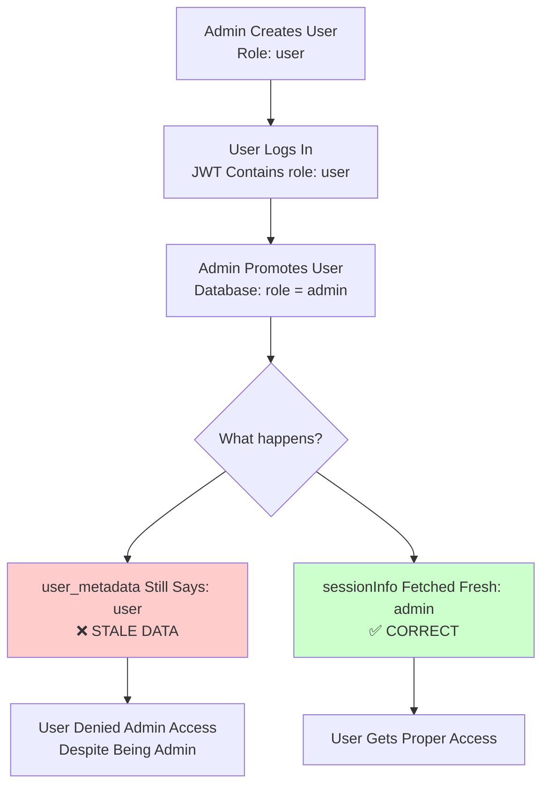
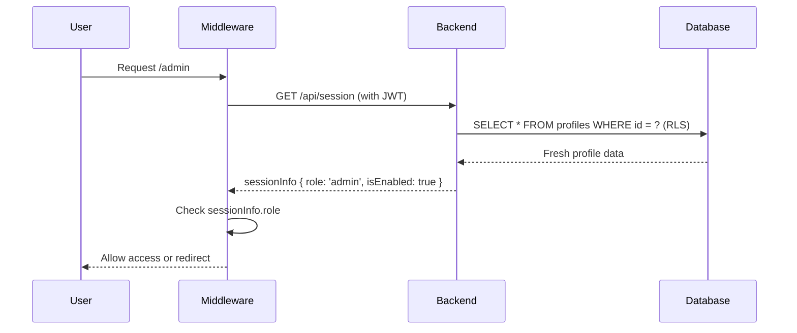
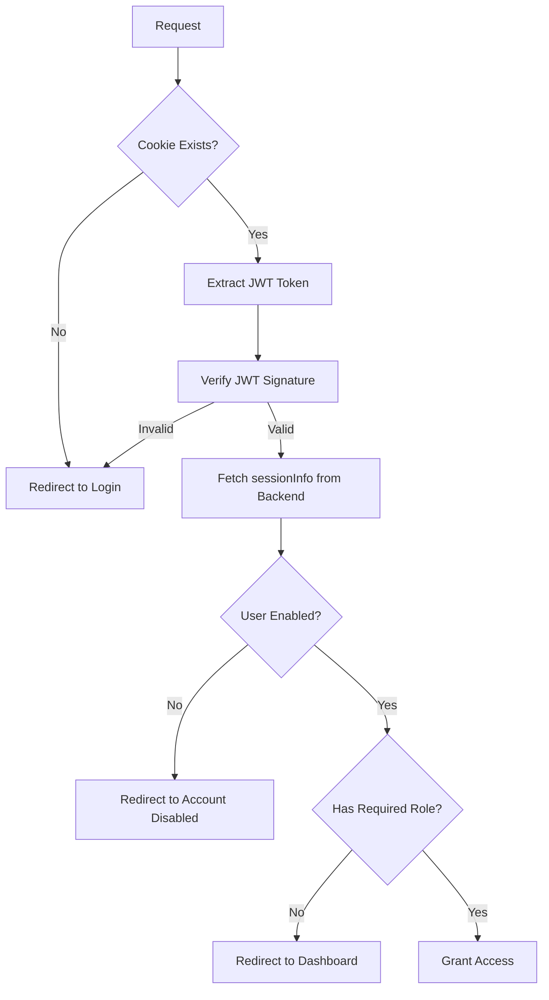

# Security Practices: Redirect System

**Last Updated**: 2025-12-09  
**Version**: 1.0  
**Classification**: Security Best Practices

---

## Overview

This document outlines security best practices for the redirect system in the Magazyn application. Following these practices prevents common vulnerabilities like open redirects, authorization bypass, and session hijacking.

---

## Table of Contents

1. [Open Redirect Prevention](#open-redirect-prevention)
2. [Authorization Security](#authorization-security)
3. [Cookie Security](#cookie-security)
4. [Session Management](#session-management)
5. [Redirect Loop Prevention](#redirect-loop-prevention)
6. [Attack Scenarios & Mitigations](#attack-scenarios--mitigations)
7. [Security Checklist](#security-checklist)

---

## Open Redirect Prevention

### What is an Open Redirect?

An **open redirect** vulnerability occurs when an application accepts user-controlled input (like a URL parameter) and redirects users to that location without proper validation. Attackers can exploit this to redirect users to malicious sites.

### Attack Example

```
Vulnerable URL:
https://magazyn.com/login?redirect=https://evil-phishing-site.com

After login, user is redirected to evil site that looks like magazyn.com
User enters credentials → attacker steals them
```

### How We Prevent This

#### 1. Whitelist-Based Validation

We only allow redirects to known, safe routes:

```typescript
// url-utils.ts
export function isAllowedPath(pathname: string): boolean {
  const allowedPaths = [
    ROUTES.PUBLIC.LOGIN,
    ROUTES.PROTECTED.ADMIN,
    ROUTES.PROTECTED.DASHBOARD,
    ROUTES.PROTECTED.ACCOUNT_DISABLED,
  ];
  
  // Exact match required
  return allowedPaths.includes(pathname);
}
```

> [!IMPORTANT]
> **Whitelist, Don't Blacklist**: Only allow known-good URLs. Never try to block bad URLs (impossible to be comprehensive).

#### 2. Origin Validation

We verify all redirects are to the same origin:

```typescript
export function isSafeRedirect(redirectUrl: string, currentOrigin: string): boolean {
  try {
    const url = new URL(redirectUrl, currentOrigin);
    
    // 1. Must be same origin
    if (url.origin !== currentOrigin) {
      console.warn('❌ Redirect blocked: Different origin', {
        attempted: url.origin,
        expected: currentOrigin,
      });
      return false;
    }
    
    // 2. Must be whitelisted path
    if (!isAllowedPath(url.pathname)) {
      console.warn('❌ Redirect blocked: Non-whitelisted path', {
        attempted: url.pathname,
      });
      return false;
    }
    
    return true;
  } catch (error) {
    return false; // Invalid URL format
  }
}
```

#### 3. Automatic Fallback

If validation fails, we use a safe fallback instead of the user-provided URL:

```typescript
export function validateRedirectUrl(
  redirectUrl: string | null,
  currentOrigin: string,
  fallback: string = ROUTES.PROTECTED.DASHBOARD
): string {
  if (!redirectUrl) {
    return fallback;
  }
  
  // Validate the URL
  if (!isSafeRedirect(redirectUrl, currentOrigin)) {
    console.warn('🛡️ Using fallback route instead of unsafe redirect');
    return fallback; // Safe default
  }
  
  return redirectUrl;
}
```

### Attack Vectors We Block

| Attack Vector | Example | Blocked By |
|---------------|---------|------------|
| External HTTP | `http://evil.com` | Origin check |
| External HTTPS | `https://evil.com` | Origin check |
| Protocol-relative | `//evil.com/admin` | Origin check |
| JavaScript | `javascript:alert(1)` | URL parsing fails |
| Data URLs | `data:text/html,<script>` | URL parsing fails |
| Non-whitelisted path | `/secret-backdoor` | Whitelist check |
| Subdomain | `https://evil.magazyn.com` | Origin check |

### Best Practices

✅ **DO**:
```typescript
// Always validate before redirect
const safe = validateRedirectUrl(userInput, origin, fallback);
window.location.replace(safe);
```

❌ **DON'T**:
```typescript
// Never trust user input directly
window.location.replace(params.get('redirect')); // VULNERABLE!
```

---

## Authorization Security

### The Stale Data Problem

**Critical Security Issue**: Using `user.user_metadata` for authorization checks

#### Why `user_metadata` is Dangerous



#### Exploitation Scenario

```typescript
// VULNERABLE CODE - DO NOT USE
const role = user.user_metadata?.role || 'user';

// Scenario:
// 1. Attacker has account with role: 'admin' in JWT
// 2. Admin demotes attacker to 'user' in database
// 3. Attacker's JWT still contains role: 'admin'
// 4. Attacker retains admin access until JWT expires!
// 5. This could be hours of unauthorized admin access
```

#### Timeline of Exploitation

| Time | Database | JWT (`user_metadata`) | Access Granted |
|------|----------|----------------------|----------------|
| T+0 | admin | admin | ✅ Admin |
| T+1 | **user** (demoted) | admin (stale) | ✅ Admin (WRONG!) |
| T+2 | user | admin (stale) | ✅ Admin (WRONG!) |
| ... | user | admin (stale) | ✅ Admin (WRONG!) |
| T+24h | user | **user** (JWT refreshed) | ✅ User (correct) |

**Impact**: Up to 24 hours of unauthorized access!

### Secure Authorization Pattern

#### Single Source of Truth: `sessionInfo.role`

```typescript
// ✅ SECURE - Always fresh from database
if (!sessionInfo || !sessionInfo.role) {
  return Astro.redirect(ROUTES.PUBLIC.LOGIN);
}

const role = sessionInfo.role; // Fresh from DB with RLS

// Authorization check
if (role !== 'admin' && role !== 'super_admin') {
  return Astro.redirect(ROUTES.PROTECTED.DASHBOARD);
}
```

#### Data Flow



**Benefits**:
- ✅ Always fresh from database
- ✅ Protected by Row Level Security (RLS)
- ✅ Reflects real-time permission changes
- ✅ Cannot be exploited with stale JWTs

### Security Comparison

| Approach | Freshness | Security | Use Case |
|----------|-----------|----------|----------|
| `user.user_metadata.role` | ❌ Stale (cached in JWT) | ❌ Vulnerable | Never use |
| `user_metadata || sessionInfo` | ⚠️ Sometimes stale | ❌ Vulnerable | Never use |
| `sessionInfo.role` only | ✅ Always fresh | ✅ Secure | Always use |

### Implementation Examples

#### ✅ Secure Page Protection

```astro
---
// admin.astro
import { ROUTES } from '@/lib/config/routes';
import { isAdmin } from '@/lib/auth/role-utils';

const { user, sessionInfo } = Astro.locals;

// 1. Check authentication
if (!user || !sessionInfo) {
  return Astro.redirect(ROUTES.PUBLIC.LOGIN);
}

// 2. Check account status
if (!sessionInfo.isEnabled) {
  return Astro.redirect(ROUTES.PROTECTED.ACCOUNT_DISABLED);
}

// 3. Check authorization - ONLY use sessionInfo.role
if (!isAdmin(sessionInfo)) {
  return Astro.redirect(ROUTES.PROTECTED.DASHBOARD);
}

// 4. User is authorized - allow access
---
```

#### ❌ Vulnerable Patterns (Never Do This)

```typescript
// PATTERN 1: Using user_metadata directly
const role = user.user_metadata?.role; // ❌ STALE DATA

// PATTERN 2: Fallback to user_metadata
const role = sessionInfo?.role || user.user_metadata?.role; // ❌ STILL VULNERABLE

// PATTERN 3: Not checking sessionInfo exists
const role = sessionInfo.role; // ❌ Can be undefined
if (role === 'admin') { /* ... */ }

// PATTERN 4: Mixing sources
if (user.user_metadata?.role === 'admin' || sessionInfo?.role === 'admin') // ❌ NO
```

---

## Cookie Security

### Cookie Attributes

We use secure cookie attributes to prevent attacks:

```typescript
// cookie-utils.ts
export function setAuthCookie(token: string): void {
  const maxAge = COOKIE_MAX_AGE; // 1 year
  
  document.cookie = 
    `${AUTH_COOKIE_NAME}=${token}; ` +
    `path=/; ` +                      // Available site-wide
    `max-age=${maxAge}; ` +           // Persistent session
    `SameSite=Lax`;                   // CSRF protection
}
```

### Cookie Attribute Security

| Attribute | Value | Security Benefit |
|-----------|-------|------------------|
| `SameSite=Lax` | Lax | Prevents CSRF while allowing normal navigation |
| `path=/` | Root | Cookie available to all routes |
| `max-age=31536000` | 1 year | Persistent sessions (user choice) |
| `Secure` (prod) | HTTPS only | Future: Prevents man-in-the-middle |
| `HttpOnly` | N/A | Cannot use (needs JS access for client auth) |

> [!NOTE]
> We cannot use `HttpOnly` because Supabase client needs JavaScript access to the token. This is a known tradeoff in client-side authentication architectures.

### Cookie Timing Attack Prevention

**Problem**: Race condition where cookie is read before it's set

```typescript
// ❌ VULNERABLE - Race condition
setAuthCookie(token);
window.location.replace('/dashboard'); // Cookie might not be set yet!
// Result: Infinite redirect loop
```

**Solution**: Wait for cookie confirmation

```typescript
// ✅ SECURE - Wait for cookie
setAuthCookie(token);
await waitForCookie(300); // Polls until cookie exists
window.location.replace('/dashboard'); // Now safe
```

### Cookie Implementation

```typescript
export async function waitForCookie(timeout: number = 300): Promise<void> {
  const startTime = Date.now();
  
  while (Date.now() - startTime < timeout) {
    if (hasAuthCookie()) {
      return; // Cookie is set
    }
    await new Promise(resolve => setTimeout(resolve, 50)); // Poll every 50ms
  }
  
  throw new Error('Cookie was not set within timeout');
}
```

---

## Session Management

### Session Validation Flow



### Defense in Depth

We implement multiple layers of security:

1. **Cookie Validation** - Cookie must exist and be valid
2. **JWT Verification** - Token signature must be valid
3. **Backend Session Check** - Profile must exist in database
4. **Account Status Check** - Account must be enabled
5. **Role Authorization** - User must have required role
6. **RLS Enforcement** - Database enforces permissions

### Session Expiry

```typescript
// Sessions expire after inactivity
// Supabase handles JWT expiry automatically

// On expiry:
// 1. JWT becomes invalid
// 2. Backend returns 401
// 3. Middleware redirects to login
// 4. Cookie is cleared
```

---

## Redirect Loop Prevention

### Loop Detection Algorithm

```typescript
class RedirectManager {
  private static redirectHistory: Array<{
    from: string;
    to: string;
    timestamp: number;
  }> = [];
  
  private static readonly MAX_REDIRECTS = 3;
  private static readonly HISTORY_TIMEOUT = 5000; // 5 seconds
  
  static canRedirect(from: string, to: string): boolean {
    // 1. Clean old history
    this.cleanupHistory();
    
    // 2. Check max redirects
    if (this.redirectHistory.length >= this.MAX_REDIRECTS) {
      console.error('🚨 Too many redirects:', this.redirectHistory);
      return false;
    }
    
    // 3. Check circular redirects
    const wouldCreateCircle = this.redirectHistory.some(
      entry => entry.from === to && entry.to === from
    );
    
    if (wouldCreateCircle) {
      console.error('🚨 Circular redirect detected:', { from, to });
      return false;
    }
    
    return true;
  }
}
```

### Common Loop Scenarios

#### Scenario 1: Cookie Not Set
```
Login → Dashboard (no cookie) → Login (not authenticated) → Dashboard → ...
```
**Fix**: Wait for cookie before redirecting

#### Scenario 2: Circular Logic
```
Disabled user on /admin → /dashboard → /admin → /dashboard → ...
```
**Fix**: Redirect disabled users to /account-disabled (non-circular)

#### Scenario 3: Role Confusion
```
User with no role → /admin → /dashboard → /admin → ...
```
**Fix**: Always validate sessionInfo exists and has role

---

## Attack Scenarios & Mitigations

### 1. Open Redirect Phishing

**Attack**:
```
1. Attacker sends: https://magazyn.com/login?redirect=https://evil.com
2. User logs in successfully
3. User redirected to evil.com (looks like magazyn.com)
4. User enters credentials again
5. Attacker captures credentials
```

**Mitigation**:
```typescript
// URL validation blocks external URLs
const safe = validateRedirectUrl(
  'https://evil.com',
  'https://magazyn.com',
  '/dashboard'
);
// Returns: '/dashboard' (fallback used)
```

### 2. Authorization Bypass via Stale JWT

**Attack**:
```
1. User has JWT with role: 'admin'
2. Admin demotes user to 'user' in database
3. Attacker continues using old JWT
4. If app checks user.user_metadata.role, attacker retains admin access
```

**Mitigation**:
```typescript
// Always check fresh sessionInfo
if (!sessionInfo?.role || sessionInfo.role !== 'admin') {
  return redirect(ROUTES.PROTECTED.DASHBOARD);
}
```

### 3. Session Hijacking

**Attack**:
```
1. Attacker steals victim's JWT token
2. Attacker sets cookie with stolen token
3. Attacker impersonates victim
```

**Mitigation**:
- RLS in database (attacker can only access their own data)
- Short JWT expiry (limits exposure window)
- SameSite=Lax (prevents CSRF token theft)
- HTTPS-only in production (prevents man-in-the-middle)

### 4. Privilege Escalation

**Attack**:
```
1. Regular user modifies client-side role check
2. User bypasses UI restriction
3. User attempts to access admin API
```

**Mitigation**:
- Server-side authorization on all API endpoints
- Backend validates role from database (not JWT)
- RLS enforces database-level permissions
- Never trust client-side validation alone

---

## Security Checklist

### Before Deploying Changes

- [ ] All redirects use `validateRedirectUrl()`
- [ ] No external URLs allowed in redirects
- [ ] All role checks use `sessionInfo.role` (not `user_metadata`)
- [ ] `sessionInfo` existence is validated before use
- [ ] Cookies are set before redirects
- [ ] All routes added to whitelist if needed
- [ ] No hardcoded routes (use `ROUTES` constants)
- [ ] Tests cover security scenarios
- [ ] No console.log with sensitive data

### Code Review Questions

1. **Redirect Security**
   - Is this redirect URL user-controlled?
   - If yes, is it validated with `validateRedirectUrl()`?
   - Is the redirect in the whitelist?

2. **Authorization**
   - Does this code check user roles?
   - If yes, does it use `sessionInfo.role`?
   - Is there a fallback to `user_metadata`? (remove it!)

3. **Cookie Handling**
   - Does this code redirect after setting a cookie?
   - If yes, does it wait for the cookie first?

4. **Session Validation**
   - Does this code assume `sessionInfo` exists?
   - If yes, is there a null check?

---

## Testing Security

### Unit Tests

```typescript
describe('Security tests', () => {
  it('should block external URLs', () => {
    expect(isSafeRedirect('https://evil.com', origin)).toBe(false);
  });
  
  it('should require sessionInfo for admin access', () => {
    const redirect = RedirectManager.getRedirectForAuthState(
      mockUser,
      null, // No sessionInfo
      '/admin',
      null,
      origin
    );
    expect(redirect).toBe(ROUTES.PUBLIC.LOGIN);
  });
});
```

### Manual Security Testing

1. **Open Redirect**:
   ```
   Try: /login?redirect=https://evil.com
   Expected: Redirect to /dashboard, not evil.com
   ```

2. **Stale Role**:
   ```
   1. Log in as admin
   2. Demote to user in database (keep same session)
   3. Try to access /admin
   Expected: Redirect to /dashboard
   ```

3. **Disabled Account**:
   ```
   1. Log in as enabled user
   2. Disable account in database
   3. Try to access /admin or /dashboard
   Expected: Redirect to /account-disabled
   ```

---

## References

### OWASP Resources

- [OWASP Top 10 - A01: Broken Access Control](https://owasp.org/Top10/A01_2021-Broken_Access_Control/)
- [OWASP Unvalidated Redirects](https://cheatsheetseries.owasp.org/cheatsheets/Unvalidated_Redirects_and_Forwards_Cheat_Sheet.html)
- [OWASP Session Management](https://cheatsheetseries.owasp.org/cheatsheets/Session_Management_Cheat_Sheet.html)

### Related Documentation

- [Developer Guide](./developer-guide.md)
- [Redirect Flow Architecture](file:///e:/bystrze/Magazyn/frontend/docs/architecture/redirect-flow.md)
- [Implementation Plan](./implementation-plan.md)

---

**Security is not optional. Every redirect, every authorization check, every cookie operation must follow these practices.**

**Questions?** Review this guide before implementing auth-related features.

**Last Updated**: 2025-12-09
