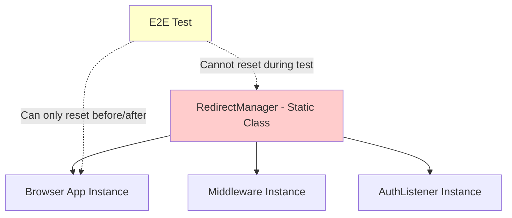

# Redirect Loop Issue in E2E Tests

**Date**: 2025-12-22  
**Status**: ⚠️ Blocking E2E Tests  
**Severity**: High  
**Type**: Design Issue

---

## Problem Summary

E2E tests for reservation creation are failing due to redirect loop detection triggering incorrectly. The `RedirectManager` class, designed to prevent infinite redirect loops in production, is too aggressive in E2E test environments where rapid navigation is expected.

### Failing Tests

1. `Happy Path: Complete reservation flow` (reservation-creation.spec.ts:55)
2. `Cart Management: Remove items from cart` (reservation-creation.spec.ts:143)
3. `should navigate to cart when clicking cart indicator` (equipment/browsing.spec.ts:155)

### Error Pattern

```
🚨 Redirect loop detected - too many redirects: [
  { from: '/login', to: '/dashboard', timestamp: 1766394610987 },
  { from: '/dashboard', to: '...', timestamp: ... },
  ...
]
```

---

## Root Cause Analysis

### 1. **RedirectManager Design**

The `RedirectManager` is a **static class** with shared state across all instances:

```typescript
// frontend/src/lib/auth/redirect-manager.ts
export class RedirectManager {
  private static redirectHistory: Array<{
    from: string;
    to: string;
    timestamp: number;
  }> = [];
  
  private static readonly MAX_REDIRECTS = 3;
  private static readonly HISTORY_TIMEOUT = 5000; // 5 seconds
}
```

**Key characteristics**:
- Static state persists across all navigations in the browser
- MAX_REDIRECTS = 3 (blocks after 3 redirects in 5 seconds)
- HISTORY_TIMEOUT = 5000ms (history clears after 5 seconds)

### 2. **E2E Test Navigation Pattern**

E2E tests perform rapid sequential navigations:

```typescript
// Before each test
await clearCart(authenticatedPage);  // → Navigates to /equipment

// Test execution
await authenticatedPage.goto("/equipment");  // → Might trigger middleware redirect
await addToCart(authenticatedPage, equip1.id);  // → Multiple navigations
await goToCart(authenticatedPage);  // → Click cart indicator
```

**Each navigation can trigger**:
1. Client-side navigation
2. Middleware redirect check (server-side)
3. AuthListener redirect check (client-side)
4. RedirectManager.recordRedirect() call

**Problem**: In <5 seconds, tests can easily exceed 3 redirects, especially with:
- Initial page load from fixture (navigate to /dashboard)
- clearCart navigation (to /equipment)
- Test navigations (multiple pages)

### 3. **Context Isolation Issue**

**Initial approach** (WRONG):
```typescript
// In fixtures/index.ts - Node.js context
const { RedirectManager } = await import('../../src/lib/auth/redirect-manager');
RedirectManager.reset();  // ❌ Resets in Node.js, not browser!
```

**Problem**: The RedirectManager in the test runner (Node.js) is a **different instance** than the one running in the browser. Resetting it in Node.js has no effect on the browser's copy.

**Current approach** (BETTER but not complete):
```typescript
// Reset in browser context via page.evaluate
await page.evaluate(async () => {
  const { RedirectManager } = await import('/src/lib/auth/redirect-manager');
  RedirectManager.reset();  // ✅ Resets in browser
  window.RedirectManager = RedirectManager;  // Expose for test access
});
```

**Remaining issues**:
1. Reset only happens before/after test, not during test execution
2. Middleware redirects during test still accumulate in history
3. No way to reset between test steps

---

## Design Flaw: Static State in Browser Context

### Why Static State is Problematic

**Production (Good)**:
- User navigates slowly (seconds between clicks)
- Redirect history naturally expires (5s timeout)
- Static state is actually beneficial (shared across app)
- Loop prevention works as intended

**E2E Tests (Bad)**:
- Automated rapid navigation (milliseconds between steps)
- History accumulates faster than it expires
- No manual intervention to reset between actions
- False positives for loop detection

### Architectural Issue



**The problem**: 
- RedirectManager is **global static state** in the browser
- E2E tests run in **isolated contexts**
- No clean way to reset state **during** test execution without:
  - Reloading the page (slow, breaks test flow)
  - Exposing reset API to production code (security risk)
  - Hacking around with window.RedirectManager (fragile)

---

## Current Workarounds Attempted

### 1. ✅ **Fixed Equipment Status Enum**
```typescript
// Was: status: 'AVAILABLE'
// Now: status: 'ok'
```
**Result**: Equipment creation now works, but redirect issue persists.

### 2. ✅ **Browser Context Reset**
```typescript
await page.evaluate(async () => {
  const { RedirectManager } = await import('/src/lib/auth/redirect-manager');
  RedirectManager.reset();
});
```
**Result**: Resets before test starts, but doesn't help during test execution.

### 3. ✅ **clearCart Navigation Change**
```typescript
// Was: await page.reload();
// Now: await page.goto('/equipment', { waitUntil: 'domcontentloaded' });
```
**Result**: Avoids reload loop, but redirect count still accumulates.

### 4. ⚠️ **Expose RedirectManager to window**
```typescript
window.RedirectManager = RedirectManager;
```
**Result**: Tests can access it, but calling reset() between steps adds test pollution.

---

## Proposed Solutions

### Option 1: **Environment-Aware Redirect Limits** ⭐ Recommended

Detect E2E test environment and relax limits:

```typescript
// redirect-manager.ts
export class RedirectManager {
  private static readonly IS_E2E = import.meta.env.MODE === 'test' || 
                                    typeof window !== 'undefined' && 
                                    window.location.hostname === 'localhost';
  
  private static readonly MAX_REDIRECTS = this.IS_E2E ? 10 : 3;
  private static readonly HISTORY_TIMEOUT = this.IS_E2E ? 2000 : 5000;
}
```

**Pros**:
- Simple one-line change
- Maintains loop protection in production
- Allows more navigations in tests

**Cons**:
- Reduces test-prod parity
- Still has theoretical limit

### Option 2: **Disable Loop Detection in Tests**

Add a flag to completely disable in E2E:

```typescript
export class RedirectManager {
  private static bypassLoopDetection = false;
  
  static enableTestMode() {
    this.bypassLoopDetection = true;
  }
  
  static canRedirect(from: string, to: string): boolean {
    if (this.bypassLoopDetection) return true;
    // ... existing logic
  }
}
```

**Pros**:
- Complete isolation from production behavior
- No false positives in tests

**Cons**:
- Loses loop detection coverage in E2E tests
- Could hide real bugs

### Option 3: **Auto-Reset on Threshold** ⭐ Best Long-Term

Make RedirectManager self-healing:

```typescript
private static cleanHistory(): void {
  const now = Date.now();
  
  // Remove old entries
  this.redirectHistory = this.redirectHistory.filter(
    entry => now - entry.timestamp < this.HISTORY_TIMEOUT
  );
  
  // Auto-reset if history is suspiciously long but old
  if (this.redirectHistory.length >= this.MAX_REDIRECTS) {
    const oldestTimestamp = Math.min(...this.redirectHistory.map(e => e.timestamp));
    if (now - oldestTimestamp > this.HISTORY_TIMEOUT / 2) {
      console.warn('⚠️ Auto-resetting redirect history (suspected test environment)');
      this.redirectHistory = [];
    }
  }
}
```

**Pros**:
- Works in both prod and test
- Self-healing based on timing patterns
- Maintains protection for real loops

**Cons**:
- More complex logic
- Could theoretically hide real bugs if user is very slow

### Option 4: **Per-Context Redirect Manager**

Use a non-static instance per browser context:

```typescript
// Instead of static class, use a singleton per context
export function getRedirectManager(): RedirectManager {
  if (!globalThis.__redirectManager) {
    globalThis.__redirectManager = new RedirectManager();
  }
  return globalThis.__redirectManager;
}
```

**Pros**:
- True isolation between test contexts
- Can reset per-context

**Cons**:
- Major refactor required
- Changes app architecture
- More complex

---

## Impact Assessment

### Current State
- ❌ **3 E2E tests failing** (reservation creation + cart management)
- ❌ **Mobile viewport migration blocked**
- ❌ **Parallel test execution unreliable**
- ✅ Equipment creation working
- ✅ Worker isolation working
- ✅ Test data cleanup working

### User Impact
- Production users: **No impact** (issue is test-only)
- Development: **High impact** (blocks E2E validation)
- CI/CD: **Blocked** (tests will fail in pipeline)

---

## Recommendations

### Immediate (For This PR)

**Option 1**: Increase limits in test mode
```typescript
// Add to redirect-manager.ts
private static readonly MAX_REDIRECTS = 
  import.meta.env.MODE === 'test' ? 10 : 3;
```

**Justification**:
- Minimal code change
- Unblocks E2E test development
- Safe (only affects test environment)
- Can be refined later

### Long-Term (Future Refactor)

1. **Implement Option 3** (Auto-Reset on Threshold)
   - Makes RedirectManager smarter about false positives
   - Works in all environments
   - Maintains security

2. **Add E2E-specific logging**
   - Track redirect patterns in tests
   - Identify legitimate vs. test-induced redirects
   - Data-driven adjustment of limits

3. **Consider per-context instances** (Option 4)
   - Better isolation
   - More control
   - Aligns with modern React patterns

---

## Testing Strategy

After implementing fix:

1. ✅ Run single test: `npm run e2e -- tests/reservation-creation.spec.ts -g "Happy Path" --workers=1`
2. ✅ Run parallel: `npm run e2e -- tests/reservation-creation.spec.ts --workers=4`
3. ✅ Run all E2E: `npm run e2e`
4. ✅ Verify no "too many redirects" errors in logs
5. ✅ Check redirect history doesn't grow unbounded

---

## Related Files

- `frontend/src/lib/auth/redirect-manager.ts` - Core redirect logic
- `frontend/src/middleware/index.ts` - Server-side redirect checks
- `frontend/src/components/auth/AuthListener.tsx` - Client-side redirect checks
- `frontend/e2e/fixtures/index.ts` - Test fixture with RedirectManager reset
- `frontend/docs/redirect-flow.md` - Redirect architecture documentation

---

## Next Steps

1. **Decision**: Choose solution (recommend Option 1 for immediate, Option 3 for long-term)
2. **Implement**: Make code changes to RedirectManager
3. **Test**: Verify all E2E tests pass
4. **Document**: Update redirect-flow.md with E2E considerations
5. **Monitor**: Watch for any production issues (unlikely given test-only nature)
