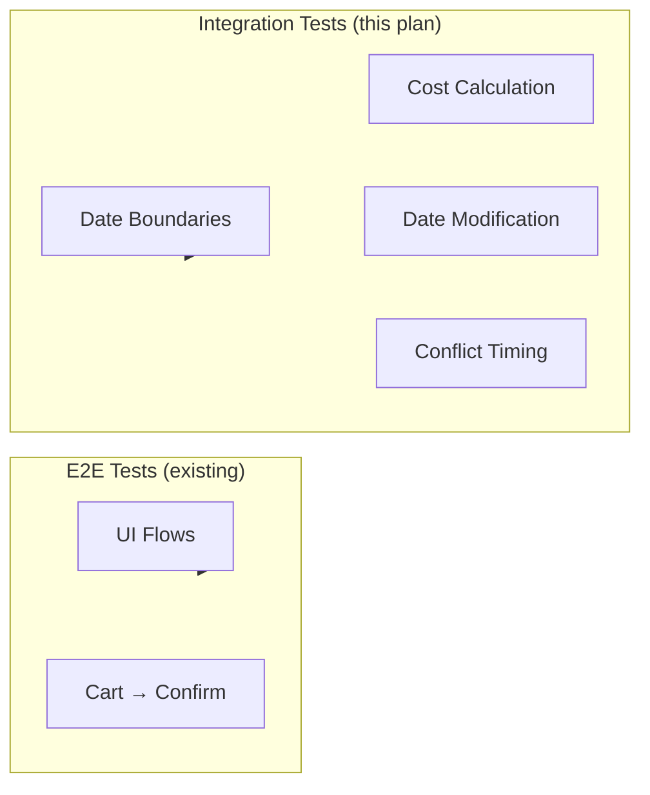

# Backend Integration Tests Plan: Reservation Date & Cost Calculations

> Fills the gap left by [reservation-e2e-plan.md](file:///e:/bystrze/Magazyn/.ai/reservation-e2e-plan.md) by testing **time-sensitive** scenarios at the backend level.

---

## Overview

The E2E plan tests UI flows at a single point in time. This plan covers **backend integration tests** for:
- Date boundary behavior (adjacent reservations)
- Cost calculation correctness across different date ranges
- Credit adjustments when modifying reservation dates
- Conflict detection timing edge cases



---

## Test File Structure

```
backend/internal/service/reservation/
├── reservation_service_test.go           # Existing unit tests (mocks)
├── reservation_integration_test.go       # Existing basic integration
└── reservation_date_integration_test.go  # [NEW] Date-focused integration tests
```

---

## Test Categories

### 1. Adjacent Date Reservations (Boundary Tests)

> **Rule**: If reservation A ends on day X, reservation B can start on day X (adjacent OK, overlapping NOT OK)

| Test | Setup | Action | Expected Result |
|------|-------|--------|-----------------|
| `TestAdjacentDates_SameUserCanReserveAfterReturn` | User reserves equipment for Jan 7-10 | Reserve same equipment for Jan 10-12 | ✅ Success (start = previous end) |
| `TestAdjacentDates_DifferentUserCanReserveAfterReturn` | User A reserves for Jan 7-10 | User B reserves for Jan 10-12 | ✅ Success |
| `TestOverlappingDates_SameUserConflict` | User reserves for Jan 7-10 | Reserve same equipment for Jan 9-12 | ❌ Conflict error |
| `TestOverlappingDates_DifferentUserConflict` | User A reserves for Jan 7-10 | User B reserves for Jan 8-11 | ❌ Conflict error |
| `TestExactSameDates_Conflict` | User reserves for Jan 7-10 | Reserve same equipment for Jan 7-10 | ❌ Conflict error |

#### Test Helper: Date Boundary Checker

```go
// Creates two reservations with configurable gap/overlap
func testDateBoundary(t *testing.T, svc ReservationService, 
    firstEnd, secondStart string, expectSuccess bool) {
    // ... implementation
}
```

---

### 2. Same-Day Reservation (Today Edge Cases)

> **Rule**: Reservations can start today, even single-day reservations

| Test | Setup | Action | Expected Result |
|------|-------|--------|-----------------|
| `TestTodayReservation_SingleDay` | Fresh equipment | Reserve for today only | ✅ Success, cost = 1 day |
| `TestTodayReservation_MultiDay` | Fresh equipment | Reserve today → today+3 | ✅ Success, cost = 4 days |
| `TestTodayReservation_AfterExistingEndsToday` | Reservation ending today | New reservation starting today | ✅ Success (adjacent) |
| `TestTodayReservation_ConflictWithOngoing` | Reservation from yesterday → tomorrow | Reserve for today | ❌ Conflict |

---

### 3. Cost Calculation Verification

> **Rule**: `Cost = Days × CreditCostPerDay` where `Days = (end - start) + 1`

| Test | Start | End | Expected Days | Expected Cost (10/day) |
|------|-------|-----|---------------|------------------------|
| `TestCost_SingleDay` | Jan 5 | Jan 5 | 1 | 10 |
| `TestCost_TwoDays` | Jan 5 | Jan 6 | 2 | 20 |
| `TestCost_WeekLong` | Jan 5 | Jan 11 | 7 | 70 |
| `TestCost_MonthLong` | Jan 1 | Jan 31 | 31 | 310 |

#### Cost Verification Helper

```go
type costTestCase struct {
    name          string
    startDate     string
    endDate       string
    costPerDay    int32
    expectedDays  int32
    expectedCost  int32
}

func TestCostCalculation_Matrix(t *testing.T) {
    cases := []costTestCase{
        {"single_day", "2025-01-05", "2025-01-05", 10, 1, 10},
        {"two_days", "2025-01-05", "2025-01-06", 10, 2, 20},
        // ...
    }
    for _, tc := range cases {
        t.Run(tc.name, func(t *testing.T) {
            // Create reservation and verify cost
        })
    }
}
```

---

### 4. Date Modification with Credit Adjustment

> **Assumption**: Full credit recalculation will be implemented. These tests serve as acceptance criteria.

#### 4.1 Extending Dates (Additional Charge)

| Test | Original | New Dates | Credit Change |
|------|----------|-----------|---------------|
| `TestModifyDates_ExtendEnd` | Jan 5-7 (3 days) | Jan 5-10 (6 days) | -30 credits (deduct) |
| `TestModifyDates_ExtendStart` | Jan 5-7 (3 days) | Jan 3-7 (5 days) | -20 credits (deduct) |
| `TestModifyDates_ExtendBoth` | Jan 5-7 (3 days) | Jan 3-10 (8 days) | -50 credits (deduct) |

#### 4.2 Shortening Dates (Refund)

| Test | Original | New Dates | Credit Change |
|------|----------|-----------|---------------|
| `TestModifyDates_ShortenEnd` | Jan 5-10 (6 days) | Jan 5-7 (3 days) | +30 credits (refund) |
| `TestModifyDates_ShortenStart` | Jan 3-10 (8 days) | Jan 5-10 (6 days) | +20 credits (refund) |
| `TestModifyDates_ShortenBoth` | Jan 3-10 (8 days) | Jan 5-7 (3 days) | +50 credits (refund) |

#### 4.3 Shifting Dates (No Cost Change)

| Test | Original | New Dates | Credit Change |
|------|----------|-----------|---------------|
| `TestModifyDates_ShiftLater` | Jan 5-7 (3 days) | Jan 10-12 (3 days) | 0 |
| `TestModifyDates_ShiftEarlier` | Jan 10-12 (3 days) | Jan 5-7 (3 days) | 0 |

#### 4.4 Modification Conflicts

| Test | Original | Other Reservation | Attempt | Expected |
|------|----------|-------------------|---------|----------|
| `TestModifyDates_ConflictWithOwn` | Jan 5-7 | Jan 10-12 (same user) | Modify to Jan 9-11 | ❌ Conflict |
| `TestModifyDates_ConflictWithOther` | Jan 5-7 | Jan 10-12 (other user) | Modify to Jan 9-11 | ❌ Conflict |
| `TestModifyDates_AdjacentToOther` | Jan 5-7 | Jan 10-12 (other user) | Modify to Jan 7-9 | ✅ Success |

---

### 5. Multi-Reservation Scenarios

| Test | Description | Expected |
|------|-------------|----------|
| `TestMultiReservation_SameEquipmentDifferentDates` | Create 3 reservations for same equipment on non-overlapping dates | ✅ All succeed |
| `TestMultiReservation_PartialConflict` | Create batch of 3, where 2nd conflicts | ❌ All fail (atomic) |
| `TestMultiReservation_TotalCostCalculation` | Create 3 items × 3 days each | Total = 90 credits |

---

## Test Infrastructure

### Test Isolation Pattern

```go
type dateTestFixture struct {
    t           *testing.T
    svc         reservation.ReservationService
    client      *supa.Client
    testUserID  string
    testUser2ID string
    equipmentID string
    typeID      string
    costPerDay  int32
    cleanup     []func()
}

func setupDateTestFixture(t *testing.T) *dateTestFixture {
    // 1. Connect to Supabase with service role
    // 2. Create unique equipment type with known cost_per_day
    // 3. Create unique equipment
    // 4. Create/find test users with sufficient credits
    // 5. Return fixture with cleanup functions
}

func (f *dateTestFixture) teardown() {
    // Execute cleanup in reverse order
    for i := len(f.cleanup) - 1; i >= 0; i-- {
        f.cleanup[i]()
    }
}
```

### Date Helper Functions

```go
// dateOffset returns a date string (YYYY-MM-DD) offset from today
func dateOffset(days int) string {
    return time.Now().AddDate(0, 0, days).Format("2006-01-02")
}

// todayStr returns today's date as YYYY-MM-DD
func todayStr() string {
    return time.Now().Format("2006-01-02")
}

// createTestReservation creates a reservation and registers cleanup
func (f *dateTestFixture) createTestReservation(
    userID, equipmentID string, 
    startDays, endDays int,
) (string, error) {
    // Create reservation
    // Register cleanup: cancel reservation and restore credits
    // Return reservation ID
}
```

---

## Cleanup Strategy

Each test follows this pattern:

```go
func TestExample(t *testing.T) {
    fixture := setupDateTestFixture(t)
    defer fixture.teardown() // Always runs, even on failure
    
    // Test logic here
    // All created reservations auto-cleanup via fixture
}
```

### Cleanup Actions (in order)

1. Cancel all test reservations (status → DENIED)
2. Delete test reservations from DB
3. Restore user credit balances
4. Delete test equipment
5. Delete test equipment type (if created)

---

## Verification Strategy

### Automated

```bash
# Run only date integration tests
go test -v -tags=integration ./internal/service/reservation/... -run "Date"

# Run all integration tests
go test -v -tags=integration ./internal/service/reservation/...
```

### Assertions Per Test

1. **Reservation created/rejected** as expected
2. **Credit balance** correct after operation
3. **Conflict error messages** contain relevant info (equipment ID, conflicting dates)
4. **Database state** matches expected (reservation exists/not exists)

---

## Implementation Order

1. **Create test fixture** (`setupDateTestFixture`)
2. **Implement date helpers** (`dateOffset`, `todayStr`)
3. **Adjacent date tests** (Section 1) – validates core conflict logic
4. **Today reservation tests** (Section 2) – validates edge cases
5. **Cost calculation matrix** (Section 3) – validates pricing
6. **Date modification tests** (Section 4) – validates credit adjustments
7. **Multi-reservation tests** (Section 5) – validates atomicity

---

## Dependencies on Future Work

The following tests assume features are implemented:

| Test Category | Required Feature | Current Status |
|---------------|------------------|----------------|
| Date Modification (4.1-4.3) | `ModifyReservationDatesWithCredits` RPC | ⚠️ Partial |
| Credit Adjustment Verification | Credit history logging | ✅ Implemented |

> [!NOTE]
> Tests for unimplemented features should be marked with `t.Skip("Pending implementation")` initially, then enabled as features are completed.

---

## Related Files

| File | Purpose |
|------|---------|
| [reservation_service.go](file:///e:/bystrze/Magazyn/backend/internal/service/reservation/reservation_service.go) | Service under test |
| [reservation_integration_test.go](file:///e:/bystrze/Magazyn/backend/internal/service/reservation/reservation_integration_test.go) | Existing integration test pattern |
| [add_reservation_rpc.sql](file:///e:/bystrze/Magazyn/supabase/migrations/20251210201500_add_reservation_rpc.sql) | Atomic creation RPC |
| [reservation-workflow.md](file:///e:/bystrze/Magazyn/documentation/workflows/reservation-workflow.md) | Business rules reference |
