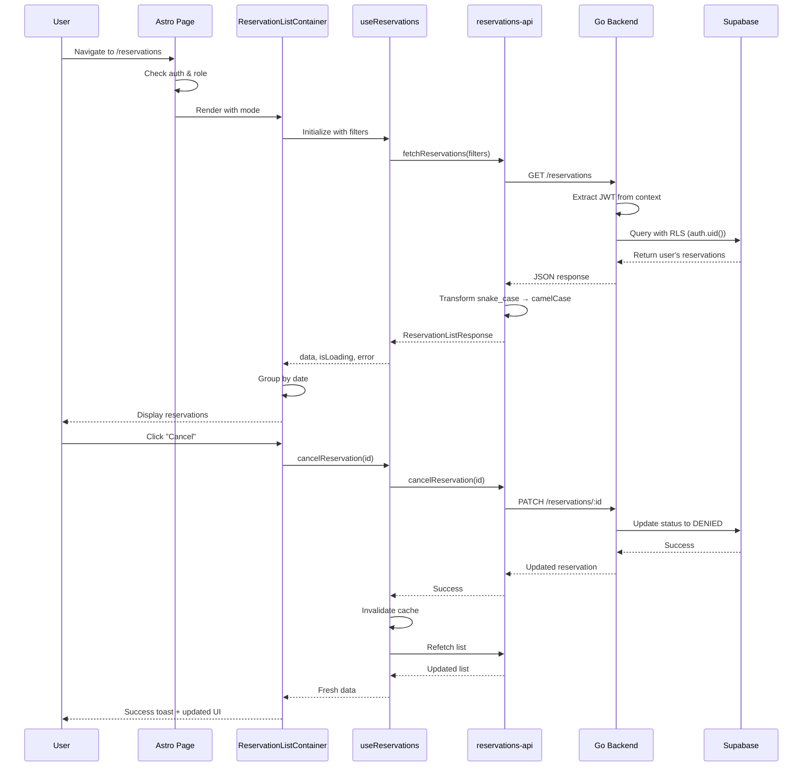
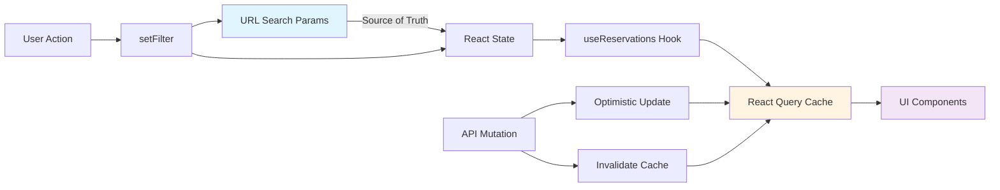
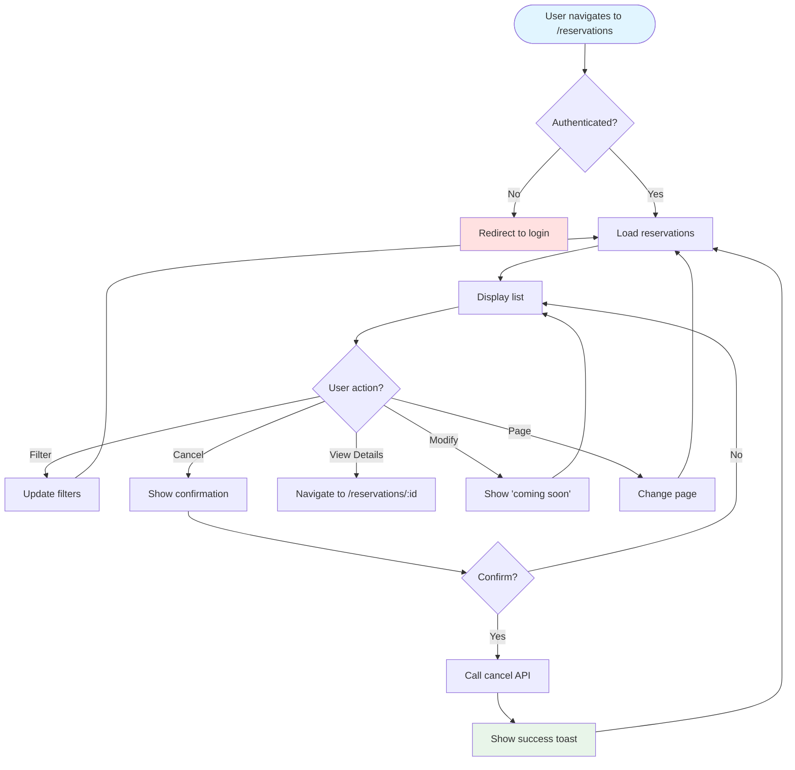
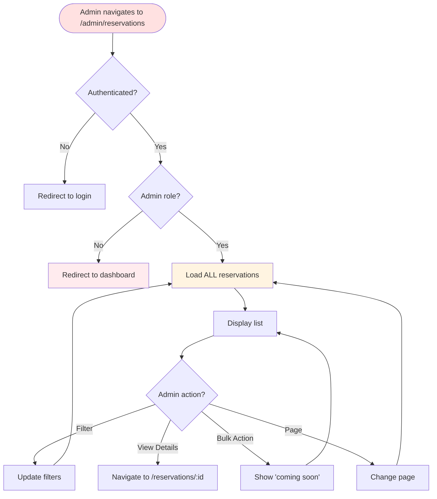
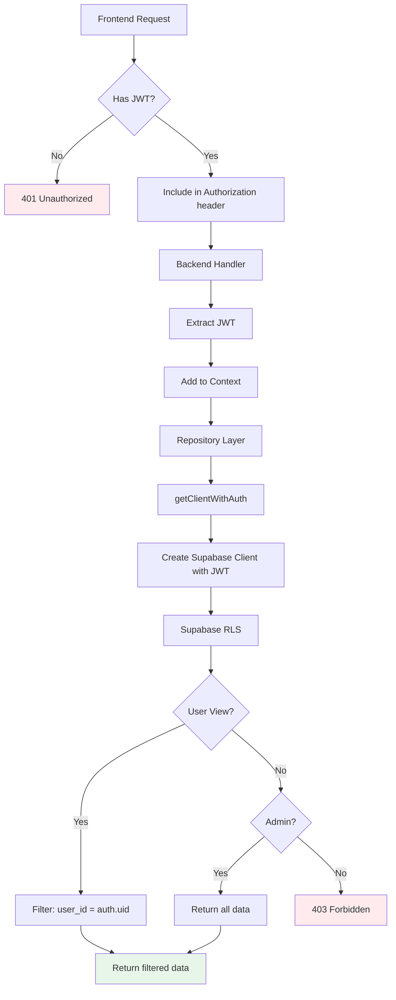
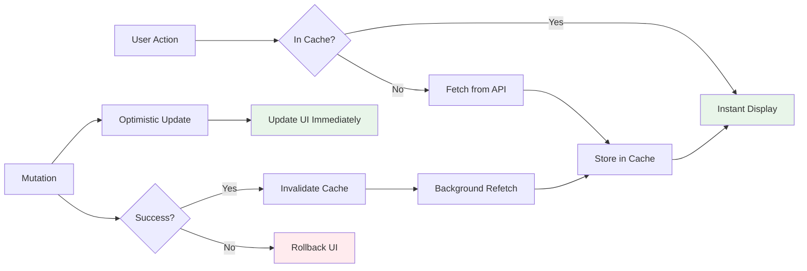
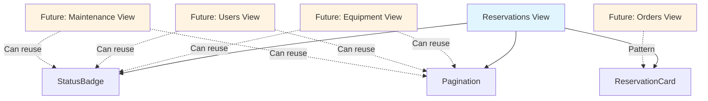

# Reservations View - Architecture Diagram

## Component Hierarchy

```mermaid
graph TD
    A[Astro Pages] --> B[/reservations/index.astro]
    A --> C[/admin/reservations/index.astro]
    
    B --> D[ReservationListContainer mode=user]
    C --> E[ReservationListContainer mode=admin]
    
    D --> F[QueryProvider]
    E --> F
    
    F --> G[ReservationListContainerInner]
    
    G --> H[Success/Error Alerts]
    G --> I[ReservationFilters]
    G --> J[ReservationCardList]
    G --> K[CancelReservationDialog]
    
    I --> L[Status Filter Select]
    I --> M[Sort Select]
    I --> N[Reset Button]
    
    J --> O{Has Groups?}
    O -->|Yes| P[GroupedReservationCard]
    O -->|No| Q[ReservationCard]
    
    P --> R[Group Header - Collapsed]
    P --> S[Group Content - Expanded]
    S --> Q
    
    Q --> T[Equipment Info]
    Q --> U[Date Range]
    Q --> V[Status Badge]
    Q --> W[Action Buttons]
    
    J --> X[Pagination]
    
    style B fill:#e1f5ff
    style C fill:#ffe1e1
    style D fill:#e1f5ff
    style E fill:#ffe1e1
    style G fill:#fff4e1
    style P fill:#e8f5e9
    style Q fill:#f3e5f5
```

## Data Flow



## State Management



## File Structure

```
frontend/src/
│
├── pages/
│   ├── reservations/
│   │   └── index.astro                 # User entry point
│   └── admin/
│       └── reservations/
│           └── index.astro             # Admin entry point
│
├── components/
│   ├── reservations/
│   │   ├── ReservationListContainer.tsx    # Smart container
│   │   ├── ReservationCardList.tsx         # Presentation layer
│   │   ├── ReservationCard.tsx             # Individual card
│   │   ├── GroupedReservationCard.tsx      # Grouped card
│   │   ├── ReservationFilters.tsx          # Filter controls
│   │   ├── CancelReservationDialog.tsx     # Cancel dialog
│   │   └── StatusBadge.tsx                 # Status indicator
│   │
│   └── ui/
│       └── pagination.tsx                   # Reusable pagination
│
├── hooks/
│   └── useReservations.ts                   # React Query hook
│
├── lib/
│   ├── api/
│   │   └── reservations-api.ts              # API client
│   │
│   ├── transformers/
│   │   └── reservation.transformer.ts       # Data transformers
│   │
│   ├── utils/
│   │   ├── group-reservations.ts            # Grouping logic
│   │   ├── date-utils.ts                    # Date formatting
│   │   └── text-utils.ts                    # Text helpers
│   │
│   └── config/
│       ├── constants.ts                     # All constants
│       └── routes.ts                        # Route definitions
│
└── types/
    └── reservations/
        └── reservation.types.ts             # Type definitions
```

## Backend Architecture

```
backend/
│
├── internal/
│   ├── repository/
│   │   └── supabase/
│   │       ├── auth_utils.go               # JWT forwarding utility
│   │       └── reservation_repository.go   # Data access with RLS
│   │
│   ├── service/
│   │   └── reservation_service.go          # Business logic
│   │
│   └── handler/
│       └── reservation_handler.go          # HTTP handlers
│
└── RLS Flow:
    1. HTTP Request → Handler
    2. Handler → Extract JWT from header
    3. Handler → Add JWT to context
    4. Service → Pass context to repository
    5. Repository → getClientWithAuth(ctx)
    6. Repository → Query Supabase with JWT
    7. Supabase → Apply RLS policies
    8. Supabase → Return filtered data
```

## User Workflows

### User View Workflow



### Admin View Workflow



## Security Model



## Performance Optimizations



## Component Reusability



## Legend

- **Blue** - User-facing components
- **Red** - Admin-facing components
- **Yellow** - Shared/Core components
- **Green** - Success states
- **Pink** - Error states
- **Purple** - Data components
- **Dashed lines** - Future/potential usage
