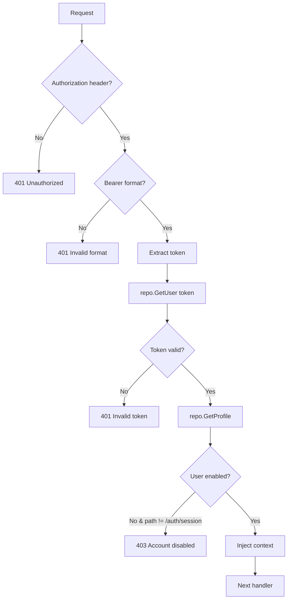

# Backend Authentication

> **Purpose**: Detailed documentation of backend authentication implementation, JWT validation, and authorization middleware.

---

## Architecture Overview

```
┌─────────────────────────────────────────────────────────────────┐
│ Incoming Request                                                 │
│   Authorization: Bearer <JWT>                                    │
├─────────────────────────────────────────────────────────────────┤
│ Middleware Chain                                                 │
│   1. CORS Middleware                                            │
│   2. Auth Middleware (JWT validation, user/profile injection)  │
│   3. RBAC Middleware (role-based access control)               │
├─────────────────────────────────────────────────────────────────┤
│ Handler                                                          │
│   Access: ctx.Value(UserContextKey), ctx.Value(ProfileContextKey)│
└─────────────────────────────────────────────────────────────────┘
```

---

## Key Files

| File | Purpose |
|------|---------|
| `internal/middleware/auth/auth_middleware.go` | JWT validation, user context injection |
| `internal/middleware/auth/rbac_middleware.go` | Role-based access control |
| `internal/repository/supabase/auth_repository.go` | Supabase auth operations |
| `internal/service/auth/auth_service.go` | Auth business logic |
| `internal/handler/auth/auth_handler.go` | Auth HTTP endpoints |
| `internal/appcontext/context_keys.go` | Context key definitions |

---

## Auth Middleware

### Purpose
Validates JWT tokens and populates request context with user/profile data.

### Flow



### Implementation

```go
// internal/middleware/auth/auth_middleware.go
func NewAuthMiddleware(repo repository.AuthRepository) func(http.Handler) http.Handler {
    return func(next http.Handler) http.Handler {
        return http.HandlerFunc(func(w http.ResponseWriter, r *http.Request) {
            // 1. Extract token
            authHeader := r.Header.Get("Authorization")
            parts := strings.Split(authHeader, " ")
            token := parts[1]  // Bearer <token>
            
            // 2. Validate with Supabase
            user, err := repo.GetUser(r.Context(), token)
            
            // 3. Fetch profile (RLS-enforced)
            profile, _ := repo.GetProfile(r.Context(), user.ID, token)
            
            // 4. Check disabled status
            if !profile.IsEnabled && r.URL.Path != "/auth/session" {
                http.Error(w, "Account is disabled", http.StatusForbidden)
                return
            }
            
            // 5. Inject into context
            ctx := context.WithValue(r.Context(), appcontext.UserContextKey, user)
            ctx = context.WithValue(ctx, appcontext.AccessTokenContextKey, token)
            ctx = context.WithValue(ctx, appcontext.UserProfileContextKey, profile)
            
            next.ServeHTTP(w, r.WithContext(ctx))
        })
    }
}
```

---

## RBAC Middleware

### Purpose
Enforces role-based access control on protected endpoints.

### Usage

```go
// main.go or router setup
adminRouter := router.PathPrefix("/admin").Subrouter()
adminRouter.Use(authMiddleware)
adminRouter.Use(RequireRoles("admin", "super_admin"))
```

### Implementation

```go
// internal/middleware/auth/rbac_middleware.go
func RequireRoles(allowedRoles ...string) func(http.Handler) http.Handler {
    return func(next http.Handler) http.Handler {
        return http.HandlerFunc(func(w http.ResponseWriter, r *http.Request) {
            // Extract profile from context
            profile := r.Context().Value(appcontext.UserProfileContextKey).(*types.PublicProfilesSelect)
            
            // Check role
            if !authutil.HasRole(profile, allowedRoles...) {
                http.Error(w, "Forbidden: Insufficient permissions", http.StatusForbidden)
                return
            }
            
            next.ServeHTTP(w, r)
        })
    }
}
```

---

## Context Keys

```go
// internal/appcontext/context_keys.go
type contextKey string

const (
    UserContextKey        contextKey = "user"
    UserProfileContextKey contextKey = "profile"
    AccessTokenContextKey contextKey = "accessToken"
)
```

### Accessing in Handlers

```go
func (h *Handler) GetData(w http.ResponseWriter, r *http.Request) {
    // Get user
    user := r.Context().Value(appcontext.UserContextKey).(*types.User)
    
    // Get profile
    profile := r.Context().Value(appcontext.UserProfileContextKey).(*types.PublicProfilesSelect)
    
    // Get token (for passing to other services)
    token := r.Context().Value(appcontext.AccessTokenContextKey).(string)
}
```

---

## Auth Repository

### Interface

```go
// internal/repository/auth.go
type AuthRepository interface {
    GetUser(ctx context.Context, token string) (*types.User, error)
    GetProfile(ctx context.Context, userID, token string) (*types.PublicProfilesSelect, error)
    CreateUser(ctx context.Context, email, password, role string) (*types.User, error)
    // ...
}
```

### Supabase Implementation

```go
// internal/repository/supabase/auth_repository.go
func (r *AuthRepository) GetUser(ctx context.Context, token string) (*types.User, error) {
    // Uses Supabase client with user token
    // JWT validation happens server-side at Supabase
    user, err := r.client.Auth.User(ctx, token)
    return &types.User{
        ID:    user.ID,
        Email: user.Email,
    }, err
}

func (r *AuthRepository) GetProfile(ctx context.Context, userID, token string) (*types.PublicProfilesSelect, error) {
    // Fetch with RLS enforcement
    // Token ensures user can only access their own profile
    return r.client.From("profiles").
        Select("*").
        Eq("id", userID).
        Single().
        ExecuteWithToken(ctx, token)
}
```

---

## Authentication Contexts

### User Token (RLS)
- Used for most operations
- Supabase RLS policies enforced
- User can only access their own data

```go
// Profile fetch with user token
profile, err := repo.GetProfile(ctx, userID, userToken)
```

### Service Role Key (Admin)
- Bypasses all RLS
- Used for admin operations
- **Never expose to client**

```go
// Admin user creation with service key
user, err := repo.CreateUser(ctx, email, password, role) // Uses service key internally
```

---

## Session Endpoint

Returns current user's session info (role, status, credits):

```go
// GET /auth/session
func (h *AuthHandler) GetSession(w http.ResponseWriter, r *http.Request) {
    profile := r.Context().Value(appcontext.UserProfileContextKey).(*types.PublicProfilesSelect)
    
    response := SessionResponse{
        UserID:        profile.ID,
        Role:          profile.Role,
        IsEnabled:     profile.IsEnabled,
        CreditBalance: profile.CreditBalance,
        Username:      profile.Username,
    }
    
    json.NewEncoder(w).Encode(response)
}
```

> **Note**: This is the only endpoint accessible by disabled users (for frontend to detect disabled state).

---

## Role Hierarchy

```go
// internal/auth/roles.go
const (
    RoleUser       = "user"
    RoleAdmin      = "admin"
    RoleSuperAdmin = "super_admin"
)

// HasRole checks if user has one of the allowed roles
func HasRole(profile *types.PublicProfilesSelect, allowedRoles ...string) bool {
    for _, role := range allowedRoles {
        if profile.Role == role {
            return true
        }
    }
    return false
}
```

### Typical Endpoint Protection

| Endpoint Pattern | Required Roles |
|-----------------|----------------|
| `/auth/*` | Any authenticated |
| `/equipment/*` | Any authenticated |
| `/admin/*` | `admin`, `super_admin` |
| `/admin/users/*` | `super_admin` |

---

## Error Handling

| Status | Condition |
|--------|-----------|
| 401 | Missing/invalid `Authorization` header |
| 401 | Invalid/expired JWT token |
| 403 | Account disabled (except `/auth/session`) |
| 403 | Insufficient role permissions |

```go
// Consistent error responses
http.Error(w, "Authorization header required", http.StatusUnauthorized)
http.Error(w, "Invalid or expired token", http.StatusUnauthorized)
http.Error(w, "Account is disabled", http.StatusForbidden)
http.Error(w, "Forbidden: Insufficient permissions", http.StatusForbidden)
```

---

## Testing Middleware

```go
// internal/middleware/auth/auth_middleware_test.go
func TestAuthMiddleware_ValidToken(t *testing.T) {
    mockRepo := &mocks.AuthRepository{}
    mockRepo.On("GetUser", mock.Anything, "valid-token").Return(&types.User{ID: "123"}, nil)
    mockRepo.On("GetProfile", mock.Anything, "123", "valid-token").Return(&types.PublicProfilesSelect{
        ID:        "123",
        Role:      "user",
        IsEnabled: true,
    }, nil)
    
    middleware := NewAuthMiddleware(mockRepo)
    // ... test assertions
}
```

---

## Security Considerations

1. **Service Key Protection**: Never log or expose `SUPABASE_SERVICE_ROLE_KEY`
2. **Token Validation**: All tokens validated with Supabase, not locally decoded
3. **RLS Enforcement**: Use user tokens for data access to enforce row-level security
4. **Disabled User Blocking**: Checked at middleware level before handler execution
5. **Role Source of Truth**: Database `profiles.role` column (not JWT claims)

---

## Related Docs

- [Architecture](./architecture.md) - Backend architecture patterns
- [Coding Standards](./coding_standards.md) - Code conventions
- [Frontend Auth](../../frontend/docs/auth.md) - Frontend auth implementation
- [Auth Workflow](../../documentation/workflows/auth-workflow.md) - End-to-end flow
