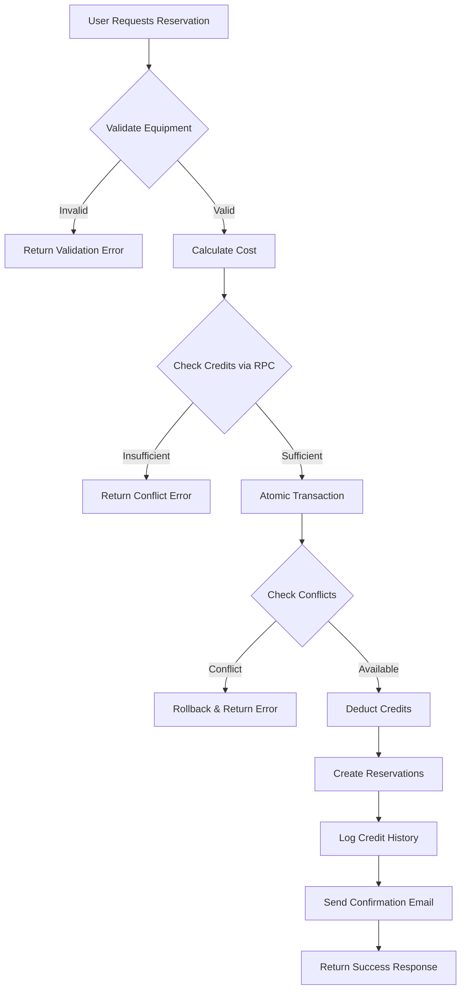
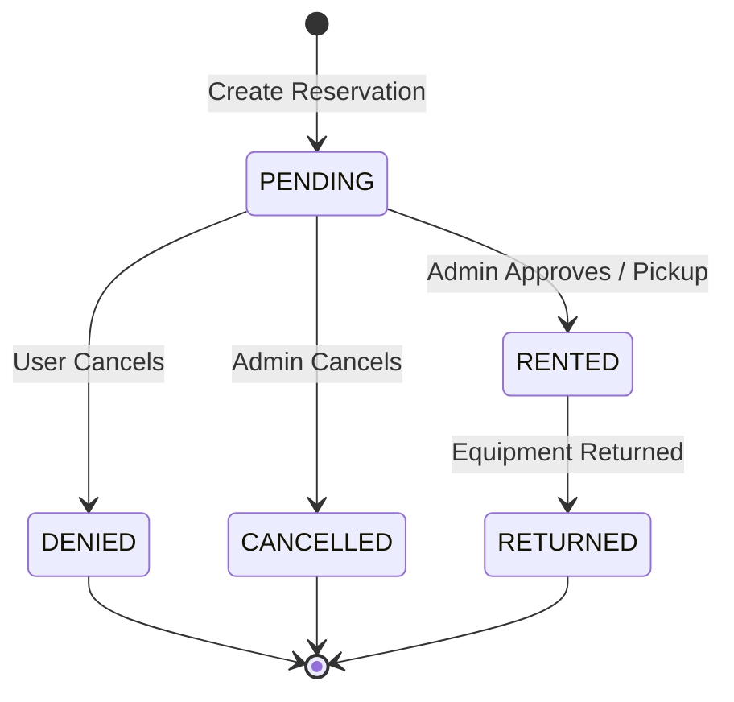
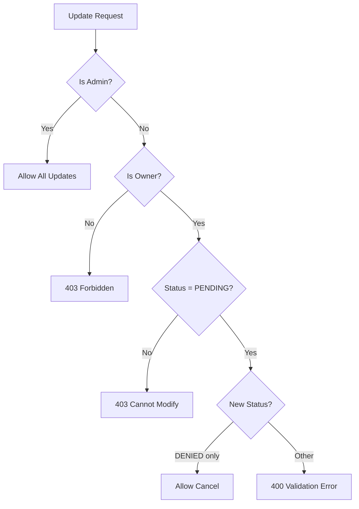

# Reservation Workflow

This document describes the complete reservation workflow, including logic flow, cost calculation, status transitions, and failure handling.

## Overview

The reservation system manages equipment rentals with credit-based billing. Users spend credits from their balance to reserve equipment, and credits are refunded on cancellation.



---

## Cost Calculation

### Formula
```
Cost = Days × CreditCostPerDay (from EquipmentType)
```

### Day Calculation Logic
Located in [reservation_service.go](file:///e:/bystrze/Magazyn/backend/internal/service/reservation/reservation_service.go#L334-L342):

```go
func (s *reservationService) calculateDays(start, end string) int32 {
    layout := "2006-01-02"
    t1, _ := time.Parse(layout, start)
    t2, _ := time.Parse(layout, end)
    
    days := int32(t2.Sub(t1).Hours() / 24)
    if days < 1 { days = 1 } // Minimum 1 day
    return days + 1
}
```

**Rules:**
- Dates are in `YYYY-MM-DD` format
- Minimum charge is **1 day**
- Total includes both start and end date (`days + 1`)
- Cost per day is defined per `EquipmentType`, not per individual equipment

### Example
| Start Date | End Date | Days | Cost/Day | Total Cost |
|------------|----------|------|----------|------------|
| 2025-01-01 | 2025-01-03 | 3 | 5 credits | 15 credits |
| 2025-01-05 | 2025-01-05 | 1 | 5 credits | 5 credits |

---

## Reservation Status Lifecycle

Statuses are defined in [constants.go](file:///e:/bystrze/Magazyn/backend/internal/constants/constants.go#L23-L32):

| Status | Description |
|--------|-------------|
| `PENDING` | Reservation created, awaiting equipment pickup |
| `RENTED` | Equipment currently with user |
| `RETURNED` | Equipment returned, reservation complete |
| `DENIED` | Reservation denied by admin or cancelled by user |
| `CANCELLED` | Reservation cancelled |

### Status Transition Diagram



### Permission-Based Transitions

| Actor | From Status | Allowed Transitions |
|-------|-------------|---------------------|
| User | `PENDING` | → `DENIED` (cancel own) |
| Admin | `PENDING` | → `RENTED`, `DENIED`, `CANCELLED` |
| Admin | `RENTED` | → `RETURNED` |

> [!IMPORTANT]
> Users can only modify their **own PENDING** reservations. Non-pending reservations are immutable for regular users.

---

## Create Reservation Flow

### Step-by-Step Process

1. **Target User Resolution**
   - Admin can create for any user (via `cmd.UserID`)
   - Regular users always create for themselves

2. **Validation Phase** (Read-Only)
   - For each reservation item:
     - Verify equipment exists
     - Check equipment is not archived (`is_archived = false`)
     - Check equipment status is not `BROKEN`
     - Fetch equipment type for cost calculation
     - Calculate item cost: `days × credit_cost_per_day`
   - Sum total cost

3. **Atomic Transaction** (via DB RPC)
   - Calls [create_reservation_atomic](file:///e:/bystrze/Magazyn/supabase/migrations/20251210201500_add_reservation_rpc.sql) PostgreSQL function
   - Steps within transaction:
     1. Lock user row (`FOR UPDATE`)
     2. Verify sufficient balance
     3. Deduct credits from profile
     4. Log deduction in `credit_history`
     5. For each reservation:
        - Check for overlapping reservations (`PENDING` or `RENTED`)
        - Insert reservation with status `PENDING`
     6. Return created IDs and new balance

4. **Email Notification** (Async)
   - Runs in background goroutine
   - Uses detached context to prevent request cancellation issues
   - Currently a no-op implementation logging to console

5. **Response**
   - Returns created reservation IDs
   - Total credit cost
   - Remaining balance

---

## Update Reservation Flow

### Authorization Checks



### Status Change to DENIED/CANCELLED (Cancellation)

When status changes to `DENIED` or `CANCELLED`:

1. Fetch equipment details
2. Fetch equipment type for cost calculation
3. Calculate refund: `days × credit_cost_per_day`
4. Call [refund_reservation_credits](file:///e:/bystrze/Magazyn/supabase/migrations/20251210204500_add_refund_rpc.sql) RPC
   - Updates user's `credit_balance`
   - Logs refund in `credit_history` with reason `reservation_refund`

### Date Change

When dates are modified:

1. Check for overlapping reservations (excluding current)
2. If conflicts exist, return `409 Conflict`
3. Update reservation dates
4. **Note:** Credit recalculation for date changes is not yet fully implemented

---

## Failure Handling

### Validation Errors (HTTP 400)

| Condition | Error Message |
|-----------|---------------|
| Equipment not found | `Equipment {id} not found` |
| Equipment archived/broken | `Equipment {name} is not available` |
| User tries non-DENIED status | `Users can only cancel pending reservations` |

### Authorization Errors (HTTP 403)

| Condition | Error Message |
|-----------|---------------|
| User views other's reservation | `You are not allowed to view this reservation` |
| User modifies non-own | `Not allowed` |
| User modifies non-pending | `Cannot modify non-pending reservation` |

### Conflict Errors (HTTP 409)

| Condition | Error Message |
|-----------|---------------|
| Insufficient credits | `Reservation failed: Insufficient credits` |
| Date overlap (creation) | `Reservation failed: Conflict detected for equipment {id}` |
| Date overlap (update) | `Dates not available` |

### Database-Level Failures

The RPC function uses `SECURITY DEFINER` and PostgreSQL transactions to ensure:

- **Atomicity:** All-or-nothing execution
- **Isolation:** Row-level locking prevents concurrent balance modifications
- **Consistency:** Rollback on any failure

| Exception | Behavior |
|-----------|----------|
| `User not found` | Transaction rolls back |
| `Insufficient credits` | Transaction rolls back |
| `Conflict detected` | Transaction rolls back |

### Refund Failure Handling

Refund failures are **logged but not blocking**:

```go
if err := s.repo.RefundCredits(ctx, id, refundAmount); err != nil {
    logger.Errorf(ctx, "Failed to refund %d credits for reservation %s: %v", refundAmount, id, err)
} else {
    logger.Infof(ctx, "Refunded %d credits for reservation %s", refundAmount, id)
}
```

> [!WARNING]
> If refund fails, the reservation status change **still proceeds**. Manual intervention may be required.

---

## Database Functions Reference

### `create_reservation_atomic`

| Parameter | Type | Description |
|-----------|------|-------------|
| `p_user_id` | UUID | User creating reservations |
| `p_total_cost` | INTEGER | Pre-calculated total credit cost |
| `p_reservations` | JSONB | Array of `{equipment_id, start_date, end_date}` |

**Returns:** `{reservation_ids: UUID[], new_balance: INTEGER}`

### `refund_reservation_credits`

| Parameter | Type | Description |
|-----------|------|-------------|
| `p_reservation_id` | UUID | Reservation to refund |
| `p_amount` | INTEGER | Credit amount to refund |

**Returns:** void

---

## Related Files

| File | Purpose |
|------|---------|
| [reservation_service.go](file:///e:/bystrze/Magazyn/backend/internal/service/reservation/reservation_service.go) | Business logic |
| [reservation.go](file:///e:/bystrze/Magazyn/backend/internal/repository/reservation.go) | Repository interface |
| [constants.go](file:///e:/bystrze/Magazyn/backend/internal/constants/constants.go) | Status constants |
| [add_reservation_rpc.sql](file:///e:/bystrze/Magazyn/supabase/migrations/20251210201500_add_reservation_rpc.sql) | Atomic creation RPC |
| [add_refund_rpc.sql](file:///e:/bystrze/Magazyn/supabase/migrations/20251210204500_add_refund_rpc.sql) | Credit refund RPC |
| [email_service.go](file:///e:/bystrze/Magazyn/backend/internal/service/email/email_service.go) | Email notifications |
