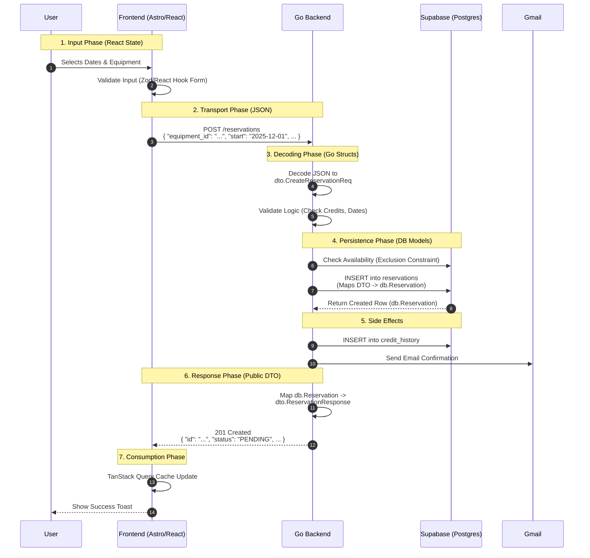

# API Request Flow - Complete Lifecycle

This diagram shows the complete lifecycle of a reservation request from user input to database persistence and response.

## Phase Breakdown

### 1. Input Phase (Frontend)

- User interacts with React form
- Client-side validation using Zod/React Hook Form
- Prevents invalid requests from reaching the backend

### 2. Transport Phase (HTTP)

- Frontend sends JSON request to Go backend
- Uses camelCase naming convention
- Includes JWT token for authentication

### 3. Decoding Phase (Backend)

- Go backend decodes JSON to DTO struct
- Validates business logic (credit balance, date conflicts)
- Maps DTO to database entities

### 4. Persistence Phase (Database)

- Checks equipment availability using exclusion constraints
- Inserts reservation record
- Returns created row with generated ID

### 5. Side Effects

- Records credit transaction in history
- Sends email confirmation via Gmail SMTP
- Maintains audit trail

### 6. Response Phase (Backend)

- Maps database entity to public DTO
- Formats dates and enriches data
- Returns JSON response to frontend

### 7. Consumption Phase (Frontend)

- TanStack Query updates cache
- React components re-render with new data
- User sees success feedback
