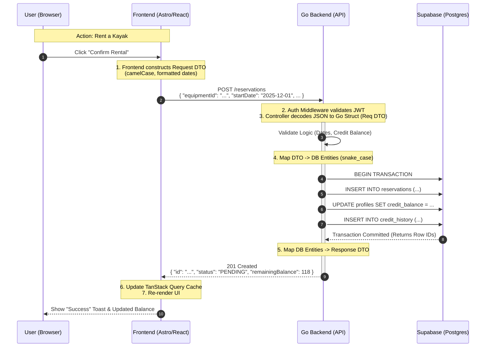

```mermaid
sequenceDiagram
    autonumber
    participant U as User (Browser)
    participant FE as Frontend (Astro/React)
    participant GO as Go Backend (API)
    participant DB as Supabase (Postgres)

    Note over U, FE: Action: Rent a Kayak

    U->>FE: Click "Confirm Rental"

    Note over FE: 1. Frontend constructs Request DTO<br/>(camelCase, formatted dates)

    FE->>GO: POST /reservations<br/>{ "equipmentId": "...", "startDate": "2025-12-01", ... }

    Note over GO: 2. Auth Middleware validates JWT<br/>3. Controller decodes JSON to Go Struct (Req DTO)

    activate GO
    GO->>GO: Validate Logic (Dates, Credit Balance)

    Note over GO: 4. Map DTO -> DB Entities (snake_case)

    GO->>DB: BEGIN TRANSACTION
    GO->>DB: INSERT INTO reservations (...)
    GO->>DB: UPDATE profiles SET credit_balance = ...
    GO->>DB: INSERT INTO credit_history (...)

    DB-->>GO: Transaction Committed (Returns Row IDs)

    Note over GO: 5. Map DB Entities -> Response DTO

    GO-->>FE: 201 Created<br/>{ "id": "...", "status": "PENDING", "remainingBalance": 118 }
    deactivate GO

    Note over FE: 6. Update TanStack Query Cache<br/>7. Re-render UI
    FE-->>U: Show "Success" Toast & Updated Balance
```

### 2. DTO Structure & Mapping (Mermaid Class Diagram)

This diagram illustrates the relationship between your generated Supabase types and the custom DTOs you need to create in Go and TypeScript.
