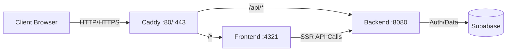

# Deployment Guide

This guide covers deploying the Magazyn application using Docker Compose with Caddy as a reverse proxy.

## Architecture Overview

The application consists of three main services:

- **Frontend** (Astro/Node.js) - Runs on port 4321 internally
- **Backend** (Go) - Runs on port 8080 internally  
- **Caddy** - Reverse proxy exposing port 80/443 externally



## Prerequisites

- Docker and Docker Compose installed
- `.env` file configured (see [Environment Variables](#environment-variables))
- Supabase project set up with:
  - Email templates configured
  - SMTP settings configured (for magic links)
  - Proper redirect URLs whitelisted

## Environment Variables

Create a `.env` file in the project root with the following variables:

```bash
# Supabase Configuration
PUBLIC_SUPABASE_URL=https://your-project.supabase.co
PUBLIC_SUPABASE_ANON_KEY=your-anon-key-here
SUPABASE_SERVICE_ROLE_KEY=your-service-role-key-here

# Backend API Configuration
PUBLIC_BACKEND_URL=http://localhost:8080
PORT=8080

# Application URL - CRITICAL for Magic Links
PUBLIC_APP_URL=http://localhost:3000

# Logging
LOG_LEVEL=INFO

# CORS Configuration
CORS_ALLOWED_ORIGINS=http://localhost:4321,http://localhost:3000,http://localhost
```

> [!IMPORTANT]
> **PUBLIC_APP_URL Configuration**
> 
> The `PUBLIC_APP_URL` variable is **critical** for magic link authentication to work correctly. This URL is used as the `redirect_to` parameter in Supabase OTP requests.
> 
> - **Development**: `http://localhost:3000` or `http://localhost:4321`
> - **Production**: `https://yourdomain.com` (your actual production domain)
> 
> This URL must be:
> 1. Added to Supabase Auth → URL Configuration → Redirect URLs
> 2. Configured without quotes in the `.env` file
> 3. Updated when deploying to different environments

## Building and Running

### Development/Local Deployment

1. **Build and start services:**
   ```bash
   docker compose -f infra/docker-compose.yml --env-file .env build
   docker compose -f infra/docker-compose.yml --env-file .env up -d
   ```

2. **View logs:**
   ```bash
   docker compose -f infra/docker-compose.yml logs -f
   ```

3. **Access the application:**
   - Application: http://localhost
   - Frontend (direct): http://localhost:4321
   - Backend (direct): http://localhost:8080

### Production Deployment

For production deployment, update the following:

1. **Update `.env` for production:**
   ```bash
   PUBLIC_APP_URL=https://yourdomain.com
   PUBLIC_BACKEND_URL=https://yourdomain.com/api
   CORS_ALLOWED_ORIGINS=https://yourdomain.com
   LOG_LEVEL=WARN
   ```

2. **Update Caddyfile for HTTPS:**
   Replace `http://localhost` in [infra/Caddyfile](file:///e:/bystrze/Magazyn/infra/Caddyfile) with your domain:
   ```caddyfile
   yourdomain.com {
       # Caddy will automatically obtain SSL certificates
       
       # Backend API routes
       handle /api/* {
           uri strip_prefix /api
           reverse_proxy backend:8080
       }
       
       # Frontend routes
       handle /* {
           reverse_proxy frontend:4321
       }
       
       log {
           output stdout
       }
   }
   ```

3. **Configure Supabase redirect URLs:**
   In your Supabase project settings (Authentication → URL Configuration):
   - Add `https://yourdomain.com` to Redirect URLs
   - Add `https://yourdomain.com/*` to Redirect URLs (wildcard)

4. **Rebuild and deploy:**
   ```bash
   docker compose -f infra/docker-compose.yml --env-file .env build --no-cache
   docker compose -f infra/docker-compose.yml --env-file .env up -d
   ```

## Monitoring

### Health Checks

Check service status:
```bash
docker compose -f infra/docker-compose.yml ps
```

### Logs

View all logs:
```bash
docker compose -f infra/docker-compose.yml logs -f
```

View specific service:
```bash
docker compose -f infra/docker-compose.yml logs -f backend
docker compose -f infra/docker-compose.yml logs -f frontend
docker compose -f infra/docker-compose.yml logs -f caddy
```

### Resource Usage

Monitor resource consumption:
```bash
docker stats
```

## Updating

To update the application:

1. **Pull latest changes:**
   ```bash
   git pull origin main
   ```

2. **Rebuild changed services:**
   ```bash
   # Rebuild only backend
   docker compose -f infra/docker-compose.yml build backend
   
   # Rebuild only frontend  
   docker compose -f infra/docker-compose.yml build frontend
   
   # Rebuild all
   docker compose -f infra/docker-compose.yml build
   ```

3. **Restart services:**
   ```bash
   docker compose -f infra/docker-compose.yml up -d
   ```

## Security Considerations

> [!CAUTION]
> **Production Security Checklist**
> - [ ] Set `LOG_LEVEL=WARN` or `LOG_LEVEL=ERROR` in production
> - [ ] Configure proper CORS origins (remove localhost)
> - [ ] Enable rate limiting on authentication endpoints
> - [ ] Review Supabase RLS policies

## Backup and Recovery

### Database Backups

Supabase handles database backups automatically. Configure backup retention in Supabase dashboard under Settings → Database → Backup.

### Application State

The application is stateless. All data is stored in Supabase. To restore:

1. Ensure Supabase database is accessible
2. Rebuild and restart containers with correct environment variables

## Related Documentation

- [Tech Stack](file:///e:/bystrze/Magazyn/documentation/techstack.md)
- [Project Structure](file:///e:/bystrze/Magazyn/documentation/project_structure.md)
- [Frontend Architecture](file:///e:/bystrze/Magazyn/frontend/docs/architecture.md)
- [Backend Architecture](file:///e:/bystrze/Magazyn/backend/docs/architecture.md)
