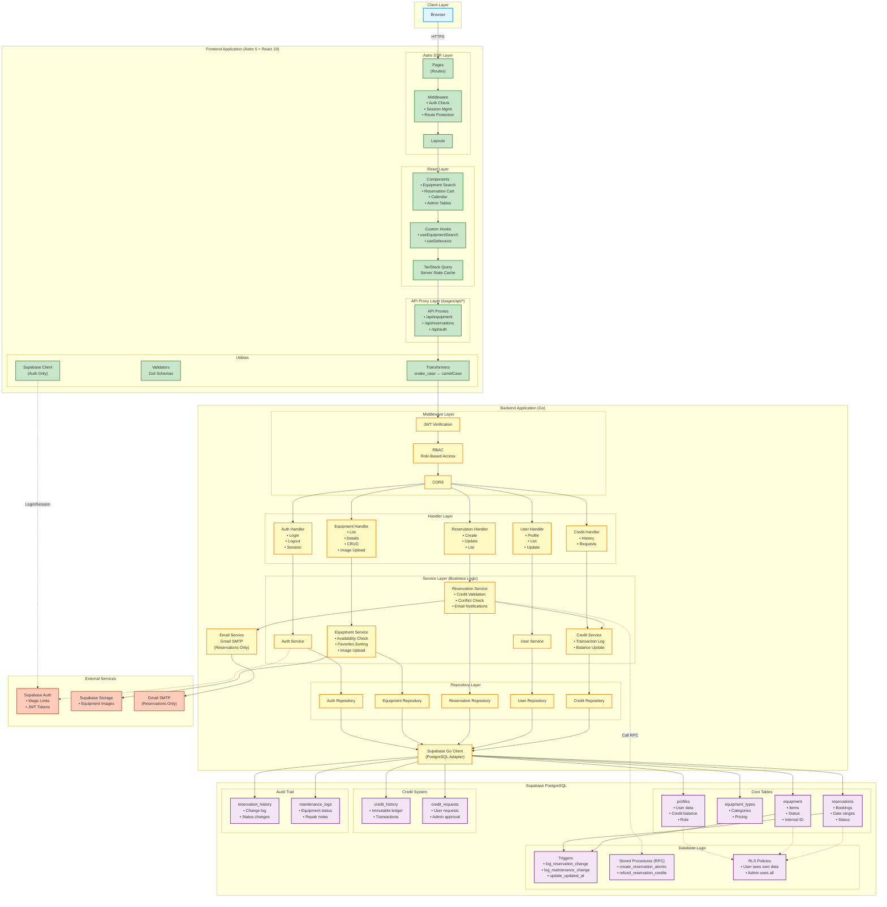

# Detailed Architecture

This diagram shows the complete technical architecture including all layers, patterns, and data flows.

## Architecture Layers

### Frontend Layer

#### Astro SSR Layer
- **Pages**: File-based routing (`/equipment`, `/reservations`, etc.)
- **Layouts**: Reusable page templates
- **Middleware**: Pre-request processing
  - Validates Supabase session
  - Protects routes based on authentication
  - Injects user data into `Astro.locals`

#### React Layer
- **Components**: Interactive UI elements (client:load, client:visible)
- **Custom Hooks**: Reusable stateful logic
- **TanStack Query**: 
  - Caches API responses
  - Handles loading/error states
  - Automatic background refetching

#### API Proxy Layer
- **Purpose**: Never call backend directly from React components
- **Benefits**:
  - Injects auth headers from server-side context
  - Abstracts backend URL
  - Handles CORS properly

#### Utilities
- **Transformers**: Convert between backend snake_case and frontend camelCase
- **Validators**: Zod schemas for runtime type safety
- **Supabase Client**: Direct calls for authentication only (login, session management)

---

### Backend Layer

#### Middleware
- **JWT Verification**: Validates Supabase JWT tokens
- **RBAC**: Enforces role-based permissions (user/admin/super_admin)
- **CORS**: Manages cross-origin requests

#### Handler Layer (HTTP)
- Parses requests
- Validates input
- Calls service layer
- Returns HTTP responses with proper status codes

#### Service Layer (Business Logic)
- **Equipment Service**:
  - Availability checking
  - Favorites sorting (top 3 per type per user)
  - Image uploads to Supabase Storage (admin only)
- **Reservation Service**:
  - Multi-item reservation creation
  - Credit validation
  - Conflict detection
  - Calls stored procedures for atomic operations
  - Sends email notifications via Gmail SMTP
- **Credit Service**:
  - Transaction logging
  - Balance updates with audit trail

#### Repository Layer (Data Access)
- Abstracts database operations
- Returns domain models (not raw SQL results)
- Implements interfaces for testability

---

### Database Layer

#### Core Tables
- **profiles**: User accounts linked to `auth.users`
- **equipment_types**: Categories with standard pricing
- **equipment**: Physical inventory items
- **reservations**: Date-based bookings with exclusion constraints

#### Credit System
- **credit_history**: Immutable transaction log
- **credit_requests**: User-submitted work credit requests

#### Audit Trail
- **reservation_history**: Tracks all reservation changes
- **maintenance_logs**: Tracks equipment status changes

#### Database Logic
- **Triggers**:
  - Auto-log reservation changes
  - Auto-log equipment status changes
  - Auto-update `updated_at` timestamps
- **Stored Procedures (RPC)**:
  - `create_reservation_atomic`: Multi-step transaction (check availability, deduct credits, create reservation)
  - `refund_reservation_credits`: Atomic refund on cancellation
- **RLS Policies**: Row-level security ensures users only see their data

---

## Design Patterns

### 1. Repository Pattern
**Problem**: Coupling business logic to database implementation  
**Solution**: Repository interfaces abstract data access

### 2. Proxy Pattern
**Problem**: Frontend needs to call backend with authentication  
**Solution**: API proxy endpoints inject server-side auth tokens

### 3. Transformer Pattern
**Problem**: Backend sends snake_case, frontend needs camelCase  
**Solution**: Bidirectional transformers with Zod validation

### 4. Dependency Injection
**Problem**: Hard to test tightly coupled code  
**Solution**: Constructor injection of dependencies

### 5. Middleware Pattern
**Problem**: Cross-cutting concerns (auth, logging) duplicated  
**Solution**: Middleware pipeline for request processing

---

## Request Flow Example: Create Reservation

1. **User Action**: User clicks "Confirm Reservation" in React component
2. **TanStack Query**: Triggers mutation to API proxy
3. **API Proxy** (`/api/reservations`): 
   - Injects `Authorization: Bearer <token>` from session
   - Forwards to backend
4. **Backend Middleware**: Validates JWT, extracts user ID
5. **Handler**: Parses request body, validates input
6. **Service**: 
   - Checks user credit balance
   - Validates equipment availability
   - Calls `create_reservation_atomic` stored procedure
7. **Stored Procedure**: 
   - Checks for conflicts (exclusion constraint)
   - Deducts credits
   - Creates reservation
   - Logs to `credit_history`
   - Returns transaction result
8. **Service**: Sends reservation confirmation email via Gmail SMTP
9. **Response**: Flows back through layers
10. **Frontend**: TanStack Query invalidates cache, updates UI

---

## Authentication Flow

**Note**: All authentication is handled by Supabase. Gmail SMTP is NOT used for authentication emails.

1. **Login Request**: User enters email → Frontend calls `/api/auth/login`
2. **Magic Link**: Supabase Auth sends magic link email (NOT Gmail SMTP)
3. **Click Link**: User clicks link → Supabase validates → creates session
4. **Set Cookie**: Supabase sets session cookie (httpOnly)
5. **Middleware**: On each request, middleware validates session
6. **API Calls**: Frontend proxies include `Authorization: Bearer <token>` from session
7. **Backend**: Verifies JWT signature against Supabase public key

---

## Image Upload Flow (Admin Only)

1. **User Action**: Admin uploads image in equipment form
2. **Frontend**: Sends image file to `/api/equipment/:id/image` API proxy
3. **Backend Handler**: Validates admin role via RBAC middleware
4. **Equipment Service**: 
   - Validates image format and size
   - Uploads to Supabase Storage bucket
   - Updates equipment record with image path
5. **Response**: Returns public URL for the uploaded image

---

## Key Features

### Atomic Transactions
PostgreSQL stored procedures ensure ACID guarantees for critical operations:
- Reservation creation with credit deduction
- Credit refunds on cancellation

### Favorites System
Equipment Service calculates user's top 3 most-rented items per type and sorts them first in search results.

### Audit Trail
All changes to reservations and equipment are logged automatically via database triggers.

### Type Safety
- Backend: Go's type system
- Frontend: TypeScript strict mode
- API boundary: Zod schemas validate and transform data
