# DTO Hierarchy and Data Flow

This diagram illustrates the relationship between your generated Supabase types and the custom DTOs you need to create in Go and TypeScript.

```mermaid
classDiagram
    note for DB_Reservation "BACKEND (Go) - Database Layer"

    class DB_Reservation {
        <<Generated from SQL>>
        +UUID ID
        +UUID UserID
        +UUID EquipmentID
        +Time StartDate
        +Time EndDate
        +String Status
        +Time CreatedAt
    }

    class CreateReservationReq {
        <<Input DTO>>
        +UUID EquipmentID
        +String StartDate
        +String EndDate
    }

    class ReservationResponse {
        <<Output DTO>>
        +UUID ID
        +String EquipmentName
        +String Status
        +Int CreditCost
        +String Period
    }

    CreateReservationReq ..> DB_Reservation : Maps To (Controller)
    DB_Reservation ..> ReservationResponse : Maps To (Controller)

    note for JSON_Request "JSON WIRE PROTOCOL - Request"
    note for JSON_Response "JSON WIRE PROTOCOL - Response"

    class JSON_Request {
        <<Request Body>>
        +equipment_id
        +start_date
        +end_date
    }

    class JSON_Response {
        <<Response Body>>
        +id
        +equipment_name
        +status
        +credit_cost
        +period
    }

    CreateReservationReq -- JSON_Request : Decodes
    ReservationResponse -- JSON_Response : Encodes

    note for TS_Reservation "FRONTEND (TypeScript)"

    class TS_Reservation {
        <<Inferred from API>>
        +id string
        +equipment_name string
        +status ReservationStatus
        +credit_cost number
        +period string
    }

    class ReactComponent {
        <<UI Component>>
        +props TS_Reservation
        +render()
    }

    JSON_Response -- TS_Reservation : TanStack Query Fetches
    TS_Reservation -- ReactComponent : Props
```

## Data Flow Summary

### Backend (Go)

1. **CreateReservationReq** - Input DTO that receives JSON from frontend
2. **DB_Reservation** - Database entity (generated from SQL schema)
3. **ReservationResponse** - Output DTO that sends JSON to frontend

### Wire Protocol (JSON)

- **Request**: `{ "equipment_id": "...", "start_date": "2025-12-01", "end_date": "2025-12-05" }`
- **Response**: `{ "id": "...", "equipment_name": "Kayak #1", "status": "PENDING", "credit_cost": 10, "period": "Dec 1-5" }`

### Frontend (TypeScript)

1. **TS_Reservation** - TypeScript interface inferred from API response
2. **ReactComponent** - React component that renders the reservation data

## Mapping Rules

- **snake_case** → Database entities (PostgreSQL convention)
- **camelCase** → JSON wire protocol (JavaScript convention)
- **PascalCase** → Go structs and TypeScript interfaces
