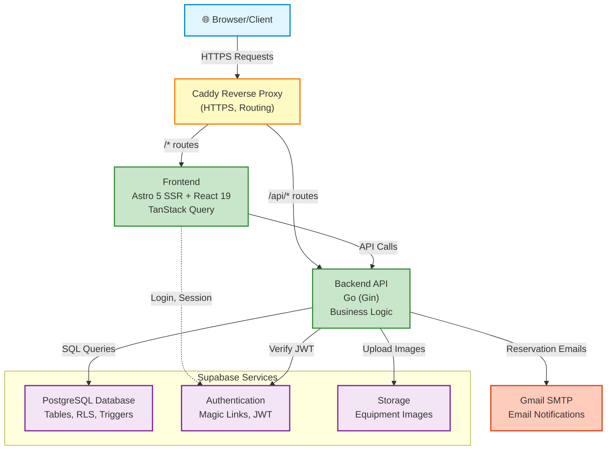

# High-Level Architecture

This diagram shows the main components of the Magazyn application and their interactions.

## Key Components

### Browser/Client
- User interface
- Interacts with frontend via HTTPS
- Receives server-rendered pages and React components

### Caddy Reverse Proxy
- Automatic HTTPS (Let's Encrypt)
- Routes traffic:
  - `/*` → Frontend (Astro)
  - `/api/*` → Backend (Go)

### Frontend (Astro + React)
- **Astro 5**: SSR pages, layouts, middleware
- **React 19**: Interactive components (cart, calendar, forms)
- **TanStack Query**: Server state management and caching
- **API Proxies**: Forward requests to backend with auth headers

### Backend (Go)
- RESTful API
- Layered architecture (Handler → Service → Repository)
- JWT verification via Supabase
- Business logic (reservations, credits, equipment)
- Image upload handling (admin only)
- Reservation email notifications via Gmail SMTP

### Supabase Services

#### PostgreSQL Database
- User profiles, equipment, reservations
- Credit system (history, requests)
- Row Level Security (RLS) policies
- Triggers and stored procedures

#### Authentication
- Magic link (passwordless) authentication
- JWT token generation and validation
- Session management

#### Storage
- Equipment images
- Admin uploads via backend API (not direct)
- RLS policies for secure access

### Gmail SMTP
- Reservation confirmation emails
- Credit request notifications
- NOT used for authentication (Supabase handles all auth)

## Data Flow

1. **User Request** → Browser sends HTTPS request
2. **Routing** → Caddy routes to Frontend or Backend
3. **Frontend Processing** → Astro renders pages, React handles interactivity
4. **API Calls** → Frontend proxies call Backend with auth tokens
5. **Business Logic** → Backend processes requests, validates, applies logic
6. **Database Operations** → Backend queries PostgreSQL via Supabase
7. **Response** → Data flows back through layers to browser
