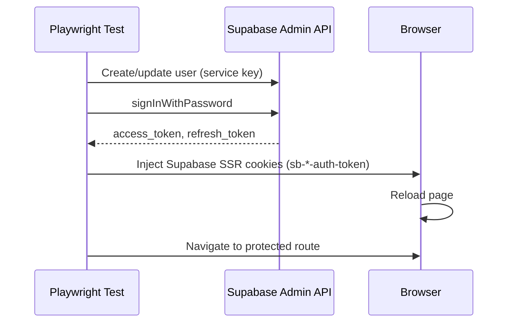

# E2E Testing

> **Purpose**: Configure and run end-to-end tests for the Magazyn application.

---

## Overview

Magazyn uses **Playwright** for e2e testing with **Supabase password-based authentication**. Tests authenticate by injecting Supabase SSR cookies (`sb-*-auth-token`) obtained via `signInWithPassword`.

**Testing Approaches**:
- **Docker Compose** (Recommended): Full stack testing closest to production
- **Dev Server**: Faster iteration during development

**Database Options**:
- **Local Supabase** (`http://127.0.0.1:54321`): Development, CI pull requests
- **Remote Supabase**: CI releases, staging validation
- **Switch**: Change environment variables in `.env`

> [!IMPORTANT]
> Tests run on mobile viewport (Pixel 5: 393x851).

---

## Quick Start

### 1. Environment Setup

Create `.env` in root:

```bash
# Supabase
PUBLIC_SUPABASE_URL=<your-supabase-url>
PUBLIC_SUPABASE_ANON_KEY=<your-anon-key>
SUPABASE_SERVICE_ROLE_KEY=<your-service-role-key>

# Test Users (auto-created by fixtures)
E2E_TEST_EMAIL=test.dev.g6@gmail.com  # Optional, default: test.dev.g6@gmail.com
E2E_TEST_PASSWORD=TestSecurePassword123!  # Optional, default: TestSecurePassword123!
E2E_BASE_URL=http://localhost:80

# Caddy Configuration
CADDY_FILE=Caddyfile.test

# Backend
PORT=8080
CORS_ALLOWED_ORIGINS=http://localhost:80
```

> [!NOTE]
> **Test users are auto-created** on each test run via Playwright fixtures. If users already exist, their passwords are updated. Users include:
> - `test.dev.g6@gmail.com` (regular user)
> - `test.admin.g6@gmail.com` (admin)  
> - `test.superadmin.g6@gmail.com` (super admin)

**For local Supabase**: 
- Dev Server: `PUBLIC_SUPABASE_URL=http://127.0.0.1:54321`
- Docker Compose: `PUBLIC_SUPABASE_URL=http://host.docker.internal:54321` (Required for backend container to reach host)
    - *Note*: Ensure `host.docker.internal` resolves in your browser/hosts file.
**For remote Supabase**: Use your project URL and keys from Supabase dashboard.

### 2. Setup Test Users (Optional)

Test users are **auto-created** by Playwright fixtures. For manual setup or verification, run [`e2e/setup/test-users.sql`](../e2e/setup/test-users.sql) in Supabase SQL Editor.

### 3. Run Tests

**Option A: Docker Compose (Recommended)**
```bash
supabase start  # If using local DB
cd infra && docker compose --env-file ../.env up -d --build
cd ../frontend && npm run e2e
cd ../infra && docker compose --env-file ../.env down -v
```

**Option B: Dev Server (Faster iteration)**
```bash
supabase start  # If using local DB
cd backend && go run cmd/api/main.go  # Terminal 1
cd frontend && npm run e2e  # Terminal 2
```

---

## Authentication Flow



> [!NOTE]
> Password auth works at the API level even though the app UI only shows magic links.

---

## Test Data Strategy

We use a **Hybrid Strategy** to balance performance and reliability:

### 1. Shared User (Performance)
*   **Strategy**: Reuse a single test user (`test.dev.g6@gmail.com`) across all tests.
*   **Why**: Creating a new user for every test is too slow (Auth API rate limits + latency).
*   **Management**: The generic `testUser` fixture ensures this user exists.
*   **Risk**: Potential for shared state (e.g., credit balance changes).
*   **Mitigation**: Tests must explicitly **reset relevant user state** (like credits) in `beforeEach` or `afterEach` if they modify it.

### 2. Isolated Resources (Reliability)
*   **Strategy**: Create fresh, unique resources (Equipment, Reservations) for *every* test that needs them.
*   **Why**: Prevents race conditions in parallel execution.
*   **Implementation**: Use the `testEquipment` fixture. It creates 2 unique items for the worker and deletes them afterwards.
*   **Guidance**: **Never** hardcode equipment IDs in tests. Always use the IDs provided by the `testEquipment` fixture.
*   **Auto-Seeding**: The `testEquipment` fixture automatically creates default equipment types (`kayak`, `paddle`) if they don't exist, making tests fully self-contained.

### 3. Database State
*   **Strategy**: Use `supabaseAdmin` (Admin API) for setup/teardown, NOT the UI.
*   **Why**: API is faster and less flaky than UI interactions for prerequisite data.

---

## Test Structure

```
frontend/e2e/
├── tests/                   # Test files organized by feature
│   ├── auth/                # Authentication tests
│   ├── equipment/           # Equipment feature tests
│   └── reservation-creation.spec.ts
├── fixtures/                # Test fixtures (authenticatedPage, testEquipment)
├── page-objects/            # Page Object Models
├── helpers/                 # Helper functions
│   ├── data-setup.helper.ts # Equipment creation/cleanup
│   └── reservation.helper.ts
└── constants/               # Shared constants
    ├── test-ids.ts          # Centralized data-testid values
    └── config.ts            # Single source of truth for timeouts, user creds, and global defaults
```

---

### Test Commands

| Command | Description |
|---------|-------------|
| `npm run e2e` | Run all tests |
| `npm run e2e:ui` | Playwright UI |
| `npm run e2e:debug` | Debug mode |
| `npm run e2e -- <file>` | Specific test |
| `npm run e2e -- --workers=4` | Parallel workers |

---

## CI/CD Integration

### Pull Request Workflow

Uses **local Supabase** (`http://127.0.0.1:54321`) with Docker Compose.

See [`.github/workflows/pull-request.yml`](../../.github/workflows/pull-request.yml)

### Release Workflow

Uses **remote Supabase** (from secrets) with Docker Compose. Pushes migrations before testing.

See [`.github/workflows/release.yml`](../../.github/workflows/release.yml)

---