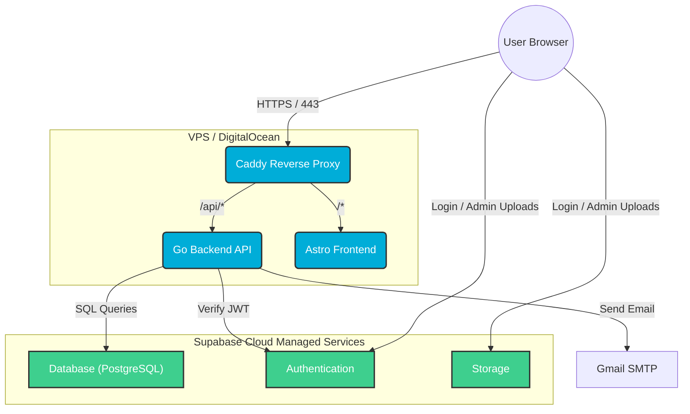

# Project B: Technology Stack & Architecture

## Overview

This document outlines the architecture for a public-facing Rental Application. It follows a Hybrid "Light" Architecture: maximizing performance by hosting the application logic (Go/Astro) on your existing VPS (DigitalOcean), while offloading state management (DB, Auth, Storage) to Supabase Cloud (Free Tier).

**Key Decisions:**

- **Traffic:** Low volume; the 1-week Supabase "pause" on free tier is an acceptable risk.
- **Proxy:** Caddy will be used as a lightweight alternative to Nginx for automatic HTTPS.
- **Uploads:** Restricted to Admin users only.

### 1. Frontend (Astro + React)

**Core Framework:**

- **Astro 5:** Configured for SSR (output: 'server') to handle SEO and dynamic content.
- **React 19:** Interactive components (Cart, Calendar, Checkout).
- **TypeScript 5:** Shared types between Frontend and Backend.

**State & API:**

- **TanStack Query:** Caches API responses from the Go Backend.
- **Supabase Client (JS):** Used only for Authentication and Admin File Uploads (Storage).

### 2. Backend Layer (Go)

- **Language:** Go (Golang).
- **Role:** Stateless Business Logic.
- **API:** Exposes REST endpoints (e.g., `POST /rent`, `GET /availability`).
- **Email:** Uses Gmail SMTP (with App Password) to send transactional emails (Rental Confirmations).
- **Auth Middleware:** Verifies Supabase JWTs. The Go backend trusts the token issued by Supabase Cloud to identify the user.

### 3. Infrastructure & Data (Supabase Cloud)

Instead of self-hosting complex services, we connect to the managed Supabase Cloud.

**Database (PostgreSQL):**

- **Host:** Supabase Cloud.
- **Limits (Free Tier):** 500MB Database size.
- **Security:** Protected by Row Level Security (RLS) policies.

**Authentication (Supabase Auth):**

- **Method:** Magic Links / Passwordless (Replaces local Go passwordless package).
- **Integration:** Frontend handles login; Backend verifies the session token.
- **Limits:** 50,000 MAU.

**Storage (Supabase Storage):**

- **Usage:** Storing Rental Item images.
- **Policies:**
  - **Read:** Publicly accessible.
  - **Write:** Restricted to Admin users only via RLS.
- **Limits:** 1GB Storage.

### 4. Deployment (VPS / DigitalOcean)

**Container Strategy (Docker Compose):**

- **Container 1 (Go API):** Runs the compiled Go Binary.
- **Container 2 (Astro):** Runs the Node.js adapter for Astro.
- **Container 3 (Caddy):**
  - Acts as the entry point (Reverse Proxy).
  - Handles Automatic HTTPS (Let's Encrypt).
  - Routes `/api/*` → Go Container.
  - Routes `/*` → Astro Container.

### 5. External Services

- **Email:** Gmail SMTP (Credentials injected via ENV variables in Go container).

## Architecture Diagram

The following diagram illustrates the "Hybrid Light" approach. The heavy stateful services live in the cloud, while your VPS runs the lightweight compute containers.

## Implementation Roadmap

- **Auth Migration:** Remove passwordless package from Go. Implement Supabase Auth UI in React.
- **Caddyfile Setup:** Configure Caddy to proxy `localhost:3000` (Astro) and `localhost:8080` (Go).
- **Database Connection:** Update Go ENV variables to point to the remote Supabase Postgres connection string.
- **RLS Policies:** Set up Supabase Storage policies:
  - `bucket_id = 'rentals'`, `operation = SELECT`, `auth.role() = 'anon'` (Public Read).
  - `bucket_id = 'rentals'`, `operation = INSERT/UPDATE/DELETE`, `auth.jwt().role = 'service_role'` OR custom admin flag (Admin Write).
