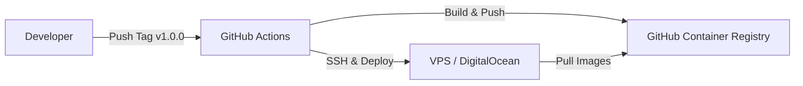

# Release Strategy & VPS Deployment Guide

This document outlines the standard release process for the Magazyn application, optimized for a single VPS deployment using Docker Compose and GitHub Actions.

## 1. Release Architecture

We will use a **Container-based Deployment** strategy.
- **Build Artifacts:** Docker Images (ghcr.io/username/repo/backend, ghcr.io/username/repo/frontend).
- **Runtime:** Docker Compose on VPS.
- **Routing:** Caddy as the ingress/reverse-proxy (handling SSL).



## 2. Preparation Checklist

### A. VPS Setup (One-time)
1. **Provision Server:** Ubuntu 22.04 LTS recommended.
2. **Install Docker Engine & Compose:**
   ```bash
   # Add Docker's official GPG key and repository
   # Install:
   sudo apt-get update
   sudo apt-get install docker-ce docker-ce-cli containerd.io docker-buildx-plugin docker-compose-plugin
   ```
3. **Security:**
   - Configure UFW (Firewall): Allow 22 (SSH), 80 (HTTP), 443 (HTTPS).
   - Setup non-root user with docker group access.

### B. Secrets Management
Create a `.env` file on the VPS at `/opt/magazyn/.env`. **DO NOT commit this to Git.**
Use the existing `infra/.env.example` as a template.

```ini
# Production Secrets
PUBLIC_SUPABASE_URL=https://your-project.supabase.co
PUBLIC_SUPABASE_ANON_KEY=ey...
SUPABASE_SERVICE_ROLE_KEY=ey... # Only if needed by backend (try to avoid)
PUBLIC_BACKEND_URL=https://yourdomain.com/api
PUBLIC_APP_URL=https://yourdomain.com
PORT=8080
LOG_LEVEL=INFO
CORS_ALLOWED_ORIGINS=https://yourdomain.com
```

### C. Caddy Configuration
Ensure `infra/Caddyfile` is ready for production. 
**Action Required:** Modify `infra/Caddyfile` to use your real domain and remove `auto_https off`.

```caddy
yourdomain.com {
    handle /api/* { ... }
    handle /* { ... }
}
```

## 3. CI/CD Pipeline Design

Create a new GitHub Action workflow: `.github/workflows/deploy.yml`.

### Triggers
- **Main Branch:** Run tests (Continuous Integration).
- **Tags (v*):** Build images and Deployment (Continuous Deployment).

### Workflow Steps (Draft)
1. **Checkout Code**
2. **Run Tests:** `go test ./...` and `npm run test`
3. **Login to GHCR:** Use `${{ secrets.GITHUB_TOKEN }}`
4. **Build & Push Docker Images:**
   - Backend: `ghcr.io/owner/magazyn-backend:v1.0.0`
   - Frontend: `ghcr.io/owner/magazyn-frontend:v1.0.0`
5. **Deploy via SSH:**
   - Connect to VPS using SSH Key stored in GitHub Secrets.
   - Run deployment script.

## 4. Release Procedure

When you are ready to release the code on `main`:

1.  **Version Bump:** Determine the new version (e.g., `v1.0.0`).
2.  **Tag & Push:**
    ```bash
    git tag v1.0.0
    git push origin v1.0.0
    ```
3.  **Monitor:** Watch the GitHub Action. It will build images and update the VPS.
4.  **Verify:** Check `https://yourdomain.com` and `docker ps` on the VPS.

## 5. Rollback Strategy

We have two methods for reverting: **Standard (Git-based)** and **Emergency (VPS-based)**.

### Method A: Standard Rollback (Recommended)
Use this when the issue is not critical or when you want to keep the git history clean.

1.  **Revert the Commit:**
    ```bash
    git revert HEAD
    git push origin main
    ```
2.  **Tag & Release:**
    Tag this new state as a new version.
    ```bash
    git tag v1.0.1
    git push origin v1.0.1
    ```
3.  **Wait:** GitHub Actions will build and deploy v1.0.1 (which effectively contains v0.9.9 code).

### Method B: Emergency Rollback (Fastest)
Use this when production is down and you need an immediate fix (< 30 seconds).

1.  **SSH into VPS:**
    ```bash
    ssh user@your-vps-ip
    ```
2.  **Switch Version:**
    Manually export the previous working tag (e.g., `v1.0.0`) and redeploy.
    ```bash
    cd /opt/magazyn
    export TAG=v1.0.0
    
    # Force Caddy & containers to recreate with the old image
    docker compose -f infra/docker-compose.prod.yml up -d
    ```
3.  **Verify:**
    Check `docker ps` to see that containers were recreated ~seconds ago.


---

## Recommended Next Steps

1.  **Finalize `infra/docker-compose.yml`** to use image names from GHCR.
2.  **Create `.github/workflows/deploy.yml`**.
3.  **Provision VPS** and copy the `infra` folder there.
4.  **Set up DNS** records.
