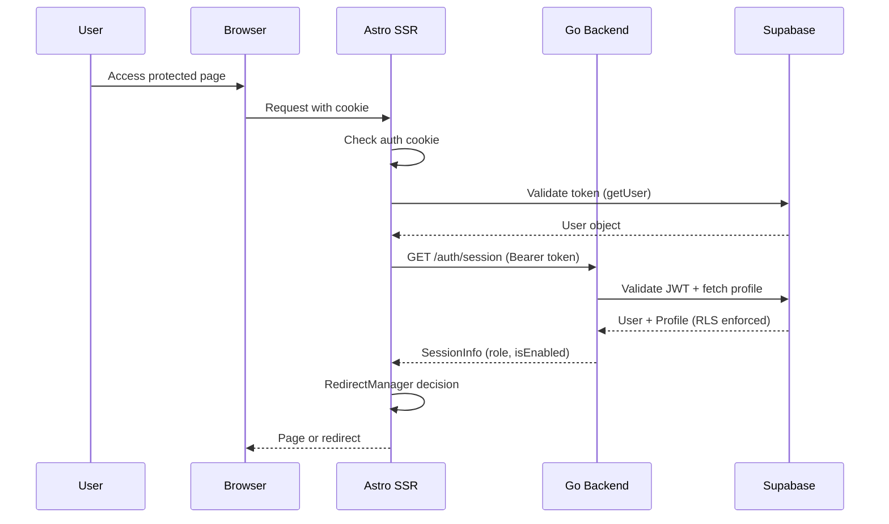
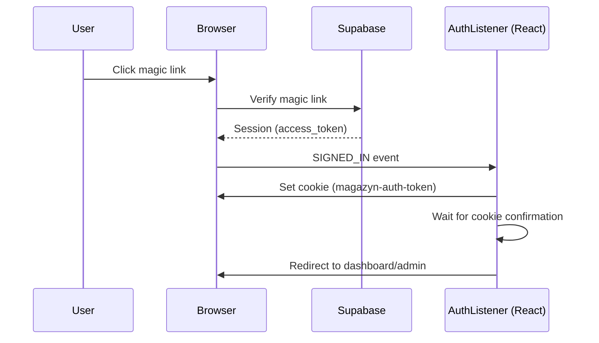

# Authentication & Token Workflow

> **Purpose**: High-level overview of authentication and token handling across the Magazyn application.

---

## Overview

Magazyn uses **Supabase Auth** for identity management with **JWT tokens** for API authentication. The architecture implements a hybrid SSR/CSR model with centralized redirect logic and role-based access control (RBAC).

### Key Components

| Layer | Component | Responsibility |
|-------|-----------|----------------|
| **Frontend (SSR)** | Astro Middleware | Session validation, token forwarding, route protection |
| **Frontend (Client)** | AuthListener | Auth state changes, cookie management, client redirects |
| **Backend** | Auth Middleware | JWT validation, user context injection |
| **Backend** | RBAC Middleware | Role-based endpoint protection |
| **Supabase** | Auth Service | User identity, JWT issuance, magic links |

---

## Authentication Flow



---

## Token Lifecycle

### 1. Token Acquisition (Login)



### 2. Token Propagation (API Calls)

```
┌─────────────────────────────────────────────────────────────────┐
│ React Component → API Client → Frontend API Proxy → Go Backend │
└─────────────────────────────────────────────────────────────────┘
                         ↓
    1. Cookie sent automatically with request
    2. Astro middleware extracts token from cookie
    3. Token stored in context.locals.accessToken
    4. API proxy adds Authorization: Bearer <token>
    5. Backend middleware validates token
    6. User/Profile injected into request context
```

### 3. Token Validation (Backend)

```go
// Authorization header → Extract Bearer token → Verify with Supabase
token := strings.Split(authHeader, " ")[1]
user, err := repo.GetUser(ctx, token)    // Supabase validates JWT
profile, err := repo.GetProfile(ctx, user.ID, token)  // RLS-enforced fetch
```

---

## Session Management

### Frontend Session Info

Fetched from Go backend at `/auth/session`:

```typescript
interface SessionInfo {
  userId: string;
  role: 'user' | 'admin' | 'super_admin';
  isEnabled: boolean;
  creditBalance: number;
  username: string;
}
```

> **Security**: Always use `sessionInfo.role` from backend (fresh from DB with RLS), never `user_metadata.role` (can be stale).

### Cookie Configuration

| Attribute | Value | Purpose |
|-----------|-------|---------|
| Name | `magazyn-auth-token` | Auth token storage |
| Path | `/` | Site-wide availability |
| Max-Age | 1 year | Persistent sessions |
| SameSite | Lax | CSRF protection |

---

## Authorization Layers

### 1. Route Protection (Frontend)

**Astro Middleware** (`src/middleware/index.ts`):
- Validates auth cookie/session
- Fetches `sessionInfo` from backend
- Delegates to `RedirectManager` for routing decisions
- Blocks disabled users from API routes

### 2. API Protection (Frontend)

All `/api/*` routes (except `/api/auth/*`) require authentication:
```typescript
if (!context.locals.user) {
  throw ApiErrors.unauthorized("Authentication required");
}
if (sessionInfo && !sessionInfo.isEnabled) {
  throw ApiErrors.forbidden("Account is disabled");
}
```

### 3. JWT Validation (Backend)

**Auth Middleware** (`internal/middleware/auth/`):
- Extracts Bearer token from `Authorization` header
- Validates token with Supabase
- Fetches user profile with RLS
- Blocks disabled users (except `/auth/session`)

### 4. Role-Based Access (Backend)

**RBAC Middleware**:
```go
// Protect admin endpoints
router.Use(authMiddleware, RequireRoles("admin", "super_admin"))
```

---

## Redirect Architecture

Centralized in `RedirectManager` class with loop prevention:

| User State | Current Path | Action |
|------------|--------------|--------|
| Unauthenticated | Any | → `/login?redirect=<path>` |
| Disabled | Any | → `/account-disabled` |
| Enabled | `/login` | → Default route (role-based) |
| Enabled | `/` | → `/admin` or `/dashboard` |
| Enabled | Valid page | Continue |

**Default Routes by Role**:
- `admin` / `super_admin` → `/admin`
- `user` → `/dashboard`

---

## Security Measures

1. **Token Security**
   - JWT validated server-side on every request
   - Tokens never exposed to client JavaScript (except via Supabase SDK)

2. **Authorization Single Source of Truth**
   - Role/status from `sessionInfo` (backend DB with RLS)
   - Never trust `user_metadata` for authorization

3. **Redirect Validation**
   - Same-origin only
   - Whitelist-based path validation
   - Loop detection (max 3 redirects in 5s)

4. **Disabled User Handling**
   - Blocked at both frontend and backend layers
   - Only `/auth/session` endpoint accessible

---

## Related Documentation

- **Frontend**: [auth.md](../../frontend/docs/auth.md)
- **Backend**: [auth.md](../../backend/docs/auth.md)
- **Redirect Flow**: [redirect-flow.md](../../frontend/docs/redirect-flow.md)
