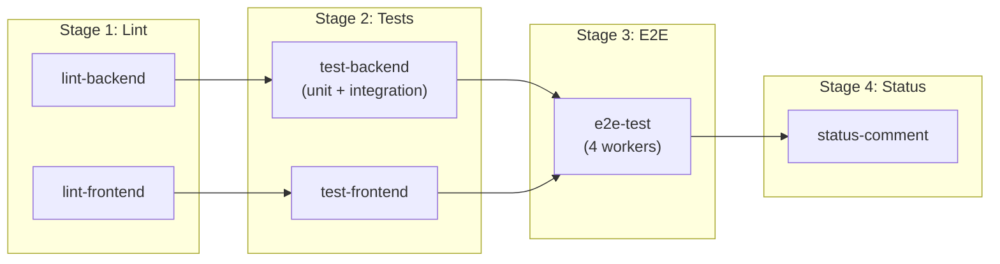
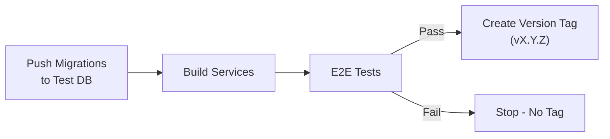

# GitHub Actions Workflows

> **Purpose**: CI/CD pipelines for testing, building, and deploying the Magazyn application.

---

## Overview

| Workflow | Trigger | Purpose |
|----------|---------|---------|
| [pull-request.yml](#pull-request) | PR to main | Full test suite (lint, unit, integration, E2E) |
| [release.yml](#release) | Push to main | Build, E2E on test DB, create version tag |

---

## Pull Request

**File**: [pull-request.yml](file:///e:/bystrze/Magazyn/.github/workflows/pull-request.yml)

**Trigger**: Pull requests to `main` branch

### Pipeline Stages



Uses **local Supabase** (`supabase start`) - no secrets required.

---

## Release

**File**: [release.yml](file:///e:/bystrze/Magazyn/.github/workflows/release.yml)

**Trigger**: Push to `main` branch (after PR merge)

### Pipeline Stages



### Required Secrets

| Secret | Description |
|--------|-------------|
| `TEST_SUPABASE_URL` | Remote test Supabase project URL |
| `TEST_SUPABASE_ANON_KEY` | Test project anon key |
| `TEST_SUPABASE_SERVICE_ROLE_KEY` | Test project service role key |
| `TEST_SUPABASE_DB_PASSWORD` | Test project DB password |
| `SUPABASE_ACCESS_TOKEN` | Supabase CLI access token |
| `E2E_TEST_EMAIL` | Test user email |
| `E2E_TEST_PASSWORD` | Test user password |

---

## Manual VPS Deployment

Scripts for production deployment on VPS.

### Deploy

**File**: [deploy.sh](file:///e:/bystrze/Magazyn/infra/scripts/deploy.sh)

```bash
# Deploy latest main
./infra/scripts/deploy.sh

# Deploy specific version
./infra/scripts/deploy.sh v1.2.3
```

**What it does**:
1. Backs up current containers (`docker commit`)
2. Pulls code from git
3. Builds new Docker images
4. Stops old → Starts new containers
5. Health checks
6. Auto-rollback on failure

### Rollback

**File**: [rollback.sh](file:///e:/bystrze/Magazyn/infra/scripts/rollback.sh)

```bash
# Rollback to last backup
./infra/scripts/rollback.sh

# Rollback to specific backup
./infra/scripts/rollback.sh backup-20251226-143000
```

> [!WARNING]
> Rollback does NOT revert database migrations. Manual DB restore required if needed.

---

## Local Testing

```bash
# Backend
cd backend && make lint && make test-unit && make test-integration

# Frontend
cd frontend && npm run lint && npm run test && npm run e2e
```

