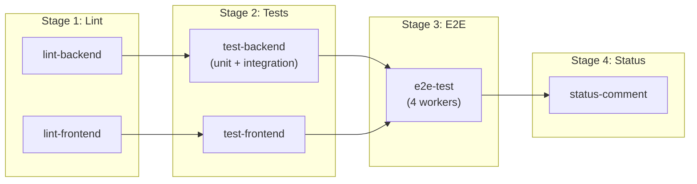
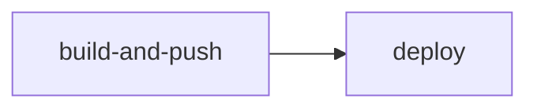

# GitHub Actions Workflows

> **Purpose**: CI/CD pipelines for testing, building, and deploying the Magazyn application.

---

## Overview

| Workflow | Trigger | Purpose |
|----------|---------|---------|
| [pull-request.yml](#pull-request) | PR to main | Full test suite (lint, unit, integration, E2E) |
| [deploy.yml](#deploy) | Version tags (`v*`) | Build Docker images and deploy to VPS |
| [build.yaml](#build) | Push/PR to main | Go backend build verification |
| [lint.yaml](#lint) | Push/PR to main | Go backend linting |
| [test.yaml](#test) | Push/PR to main | Go backend unit tests |

---

## Pull Request

**File**: [pull-request.yml](file:///e:/bystrze/Magazyn/.github/workflows/pull-request.yml)

**Trigger**: Pull requests to `main` branch

### Pipeline Stages



### Jobs

| Job | Description | Dependencies |
|-----|-------------|--------------|
| `lint-backend` | golangci-lint on `./backend` | None |
| `lint-frontend` | ESLint on `./frontend` | None |
| `test-backend` | Unit + Integration tests with local Supabase | `lint-backend` |
| `test-frontend` | Vitest unit tests | `lint-frontend` |
| `e2e-test` | Playwright E2E (4 parallel workers) | `test-backend`, `test-frontend` |
| `status-comment` | PR success comment | All tests |

### Environment

Uses **local Supabase** (`supabase start`) with standard demo credentials - no GitHub secrets required.

---

## Deploy

**File**: [deploy.yml](file:///e:/bystrze/Magazyn/.github/workflows/deploy.yml)

**Trigger**: Version tags (e.g., `v1.0.0`)

### Pipeline Stages



### Jobs

| Job | Description |
|-----|-------------|
| `build-and-push` | Build backend/frontend Docker images, push to GHCR |
| `deploy` | SSH to VPS, pull images, restart containers |

### Required Secrets

| Secret | Description |
|--------|-------------|
| `PUBLIC_SUPABASE_URL` | Supabase project URL |
| `PUBLIC_SUPABASE_ANON_KEY` | Supabase anon key |
| `VPS_HOST` | VPS hostname/IP |
| `VPS_USER` | SSH username |
| `VPS_SSH_KEY` | SSH private key |

---

## Additional Workflows

These workflows run on push/PR to main alongside the main pull-request workflow:

### Build

**File**: [build.yaml](file:///e:/bystrze/Magazyn/.github/workflows/build.yaml)

Builds Go backend from `./backend/cmd/api`.

### Lint

**File**: [lint.yaml](file:///e:/bystrze/Magazyn/.github/workflows/lint.yaml)

Runs golangci-lint on `./backend`.

### Test

**File**: [test.yaml](file:///e:/bystrze/Magazyn/.github/workflows/test.yaml)

Runs unit tests on `./backend` (short mode, no integration tests).

---

## Local Testing

Before pushing, run tests locally:

```bash
# Backend
cd backend && make lint && make test-unit && make test-integration

# Frontend
cd frontend && npm run lint && npm run test && npm run e2e
```
