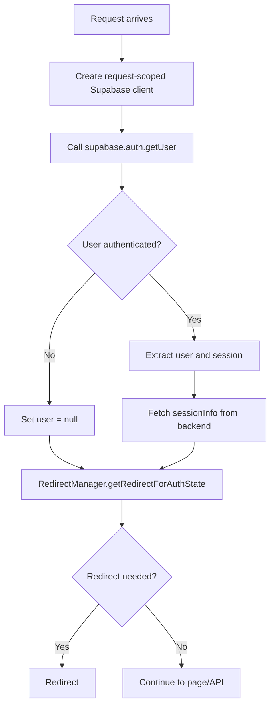
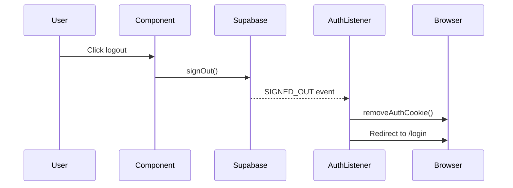
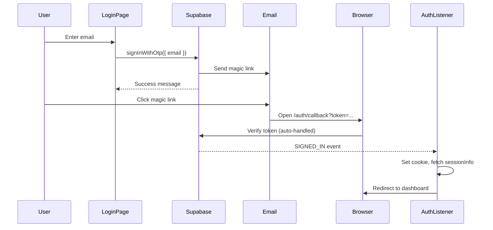

# Frontend Authentication

> **Purpose**: Detailed documentation of frontend authentication implementation, token handling, and session management.

---

## Architecture Overview

```
┌─────────────────────────────────────────────────────────────────┐
│ Browser                                                          │
├──────────────────────────┬──────────────────────────────────────┤
│ Client-Side              │ Server-Side (SSR)                    │
│ ├─ AuthListener.tsx      │ ├─ middleware/index.ts (Astro)       │
│ ├─ Supabase Client       │ ├─ pages/api/* (API Proxies)         │
│ └─ Cookie Utils          │ └─ lib/auth/* (Utilities)            │
├──────────────────────────┴──────────────────────────────────────┤
│ Token Storage: Cookie (magazyn-auth-token)                       │
└─────────────────────────────────────────────────────────────────┘
```

---

## Key Files

| File | Purpose |
|------|---------|
| `src/middleware/index.ts` | SSR auth validation, route protection |
| `src/components/auth/AuthListener.tsx` | Client-side auth state handling |
| `src/lib/auth/supabase-ssr.ts` | 🆕 Request-scoped Supabase client factory |
| `src/lib/auth/cookie-utils.ts` | Cookie management utilities |
| `src/lib/auth/session-utils.ts` | Backend session fetching |
| `src/lib/auth/redirect-manager.ts` | Centralized redirect logic |
| `src/lib/auth/url-utils.ts` | URL validation for redirects |
| `src/lib/auth/role-utils.ts` | Role checking helpers |

---

## Token Management

### Cookie Operations

```typescript
import {
  setAuthCookie,
  removeAuthCookie,
  getAuthCookie,
  hasAuthCookie,
  waitForCookieAndRedirect
} from '@/lib/auth/cookie-utils';

// Set cookie after login
setAuthCookie(accessToken);

// Clear on logout
removeAuthCookie();

// Check existence
if (hasAuthCookie()) { ... }

// Set and redirect (handles async cookie propagation)
await waitForCookieAndRedirect(token, '/dashboard');
```

### Cookie Configuration

```typescript
export const AUTH_COOKIE_NAME = 'magazyn-auth-token';
export const COOKIE_MAX_AGE = 60 * 60 * 24 * 365; // 1 year

// Set with security attributes
document.cookie = `${AUTH_COOKIE_NAME}=${token}; path=/; max-age=${COOKIE_MAX_AGE}; SameSite=Lax`;
```

---

## Middleware Authentication

### Flow



### Supabase SSR Client 🆕

**New in v2.0**: Using `@supabase/ssr` for proper session isolation.

```typescript
// src/lib/auth/supabase-ssr.ts
import { createServerClient } from '@supabase/ssr';
import type { AstroCookies } from 'astro';

export function createSupabaseServerClient(
  request: Request,
  cookies: AstroCookies
) {
  return createServerClient(
    import.meta.env.PUBLIC_SUPABASE_URL,
    import.meta.env.PUBLIC_SUPABASE_ANON_KEY,
    {
      cookies: {
        get(key: string) {
          return cookies.get(key)?.value;
        },
        set(key: string, value: string, options: CookieOptions) {
          cookies.set(key, value, options);
        },
        remove(key: string, options: CookieOptions) {
          cookies.delete(key, options);
        },
      },
    }
  );
}
```

**Why @supabase/ssr?**
- ✅ Automatic cookie handling (no manual fallback needed)
- ✅ Request-scoped clients prevent state leakage
- ✅ Proper SSR session validation with `getUser()`
- ✅ Recommended by Supabase for server-side rendering

### Key Code (`src/middleware/index.ts`)

```typescript
// 1. Create request-scoped client
const supabase = createSupabaseServerClient(context.request, context.cookies);
context.locals.supabase = supabase;

// 2. Get user (server-side validation)
const { data: { user }, error } = await supabase.auth.getUser();
context.locals.user = user || null;

// 3. Fetch session info from backend
let token: string | null = null;
if (user) {
  const { data: { session } } = await supabase.auth.getSession();
  token = session?.access_token || null;
  
  if (token) {
    sessionInfo = await getUserSession(token);
    context.locals.sessionInfo = sessionInfo;
    context.locals.accessToken = token;  // For API proxies
  }
}

// 4. Redirect logic with request-scoped context
const redirectContext: RedirectContext = { history: [] };
const redirectTo = RedirectManager.getRedirectForAuthState(
  user, sessionInfo, url.pathname, redirectParam, url.origin, redirectContext
);
```

---

## API Proxy Authentication

API proxies forward tokens to the backend:

```typescript
// src/pages/api/equipment/index.ts
export const GET: APIRoute = async ({ locals, request }) => {
  // Token from middleware
  const token = locals.accessToken;

  const headers = new Headers({ 'Content-Type': 'application/json' });
  if (token) {
    headers.set('Authorization', `Bearer ${token}`);
  }

  const response = await fetch(`${BACKEND_URL}/equipment`, {
    method: 'GET',
    headers,
  });

  return new Response(response.body, { status: response.status });
};
```

---

## Client-Side Auth (AuthListener)

Handles Supabase auth events on client:

```typescript
// On SIGNED_IN
onAuthStateChange(async (event, session) => {
  if (event === 'SIGNED_IN' && session) {
    // 1. Set cookie
    setAuthCookie(session.access_token);
    
    // 2. Fetch fresh session info
    const sessionInfo = await getUserSession(session.access_token);
    
    // 3. Get redirect target
    const redirectTo = RedirectManager.getRedirectForAuthState(...);
    
    // 4. Wait for cookie and redirect
    await waitForCookieAndRedirect(session.access_token, redirectTo);
  }
  
  if (event === 'SIGNED_OUT') {
    removeAuthCookie();
    window.location.href = ROUTES.PUBLIC.LOGIN;
  }
});
```

---

## Session Info

### Type Definition

```typescript
export interface SessionInfo {
  userId: string;
  role: 'user' | 'admin' | 'super_admin';
  isEnabled: boolean;
  creditBalance: number;
  username: string;
}
```

### Fetching

```typescript
// src/lib/auth/session-utils.ts
export async function getUserSession(accessToken: string): Promise<SessionInfo | null> {
  const response = await fetch(`${BACKEND_URL}/auth/session`, {
    method: 'GET',
    headers: {
      'Authorization': `Bearer ${accessToken}`,
      'Content-Type': 'application/json',
    },
    cache: 'no-store',  // Always fresh
  });
  
  if (!response.ok) return null;
  return response.json();
}
```

---

## RedirectManager

Single source of truth for all redirect decisions:

```typescript
import { RedirectManager } from '@/lib/auth/redirect-manager';

// Get redirect (or null if no redirect needed)
const redirectTo = RedirectManager.getRedirectForAuthState(
  user,          // Supabase User | null
  sessionInfo,   // SessionInfo | null
  currentPath,   // string
  redirectParam, // string | null
  origin         // string
);

// Loop prevention
if (RedirectManager.canRedirect(from, to)) {
  RedirectManager.recordRedirect(from, to);
  // Perform redirect
}
```

### Decision Matrix

| Condition | Result |
|-----------|--------|
| `!user` | → `/login?redirect=<path>` |
| `!sessionInfo.isEnabled` | → `/account-disabled` |
| On `/login` as authenticated user | → Default route or redirect param |
| On `/` | → Role-based default route |
| Other valid page | `null` (no redirect) |

---

## Context Locals (TypeScript)

```typescript
// src/env.d.ts
declare global {
  namespace App {
    interface Locals {
      supabase: SupabaseClient<Database>;
      user: User | null;
      sessionInfo: SessionInfo | null;
      accessToken?: string;
    }
  }
}
```

---

## Token Refresh & Expiration

### Supabase Auto-Refresh

Supabase SDK automatically handles token refresh:

```typescript
// Supabase client automatically refreshes tokens when:
// 1. Token is about to expire (within 60 seconds)
// 2. API call returns 401 Unauthorized
// 3. onAuthStateChange fires TOKEN_REFRESHED event

onAuthStateChange(async (event, session) => {
  if (event === 'TOKEN_REFRESHED' && session) {
    // Update cookie with new token
    setAuthCookie(session.access_token);
  }
});
```

### Expiration Handling

| Scenario | Behavior |
|----------|----------|
| Token expires during session | Supabase auto-refreshes silently |
| Refresh token expired | `SIGNED_OUT` event fires, redirect to login |
| Network error during refresh | Session remains valid until next API call |

> **Note**: JWT access tokens expire after 1 hour (Supabase default). Refresh tokens have longer lifetime configured in Supabase dashboard.

---

## Logout Flow

### Client-Side Logout

```typescript
// src/components/auth/LogoutButton.tsx
import { supabase } from '@/lib/supabase-client';
import { removeAuthCookie } from '@/lib/auth/cookie-utils';

async function handleLogout() {
  // 1. Sign out from Supabase (invalidates session)
  await supabase.auth.signOut();
  
  // 2. Cookie removal handled by AuthListener on SIGNED_OUT event
  // (see AuthListener section)
}
```

### Logout Sequence



### AuthListener Logout Handling

```typescript
// Already in AuthListener.tsx
if (event === 'SIGNED_OUT') {
  removeAuthCookie();
  window.location.href = ROUTES.PUBLIC.LOGIN;
}
```

---

## Disabled User Blocking

### API Route Protection

All `/api/*` routes (except `/api/auth/*`) block disabled users:

```typescript
// src/pages/api/[...route].ts or individual API routes
export const GET: APIRoute = async ({ locals }) => {
  // 1. Check authentication
  if (!locals.user) {
    throw ApiErrors.unauthorized("Authentication required");
  }
  
  // 2. Block disabled users
  if (locals.sessionInfo && !locals.sessionInfo.isEnabled) {
    throw ApiErrors.forbidden("Account is disabled");
  }
  
  // 3. Proceed with request...
};
```

### Middleware-Level Blocking

Disabled users are also caught at middleware level for page routes:

```typescript
// src/middleware/index.ts
if (sessionInfo && !sessionInfo.isEnabled) {
  // RedirectManager handles redirect to /account-disabled
  const redirectTo = RedirectManager.getRedirectForAuthState(...);
  if (redirectTo) {
    return Response.redirect(redirectTo);
  }
}
```

### Disabled User Access Matrix

| Resource | Disabled User Access |
|----------|---------------------|
| `/account-disabled` | ✅ Allowed |
| `/api/auth/session` | ✅ Allowed (to check status) |
| Other pages | ❌ Redirected to `/account-disabled` |
| Other API routes | ❌ 403 Forbidden |

---

## Magic Link Flow

### Email Authentication

Magazyn uses passwordless authentication via magic links:



### Login Page Implementation

```typescript
// src/components/auth/LoginForm.tsx
async function handleLogin(email: string) {
  const { error } = await supabase.auth.signInWithOtp({
    email,
    options: {
      emailRedirectTo: `${window.location.origin}/auth/callback`,
    },
  });
  
  if (error) {
    // Handle error (show message)
    return;
  }
  
  // Show "Check your email" message
}
```

### Callback Page

The `/auth/callback` page handles the magic link token:

```typescript
// src/pages/auth/callback.astro
// Supabase SDK auto-parses URL hash/params and establishes session
// AuthListener then handles cookie setting and redirect
```

> **Security**: Magic link tokens are single-use and expire after 1 hour (configurable in Supabase).

---

## Security Considerations

1. **Token Storage**: Cookies with `SameSite=Lax` prevent CSRF
2. **No localStorage**: Tokens never stored in localStorage (XSS vulnerable)
3. **Role Source**: Always use `sessionInfo.role` from backend (RLS-enforced)
4. **URL Validation**: Redirects validated for same-origin and whitelisted paths
5. **Loop Prevention**: Max 3 redirects in 5 seconds

---

## Related Docs

- [Redirect Flow](./redirect-flow.md) - Detailed redirect architecture
- [Architecture](./architecture.md) - Overall frontend architecture
- [Backend Auth](../../backend/docs/auth.md) - Backend auth implementation
