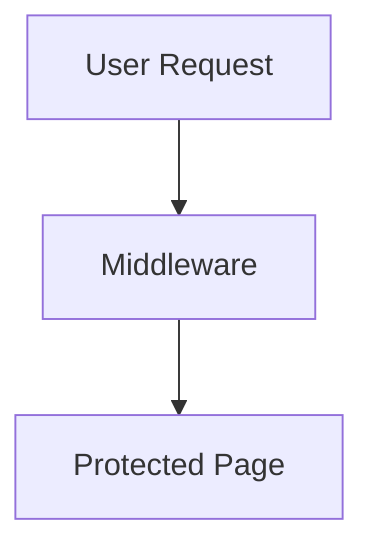

# Frontend Coding Standards

> **Purpose**: Comprehensive guidelines for contributing to the frontend codebase, incorporating best practices and lessons learned from production issues.

## Table of Contents

1. [Core Principles](#core-principles)
2. [Naming Conventions](#naming-conventions)
3. [Type Safety & Data Contracts](#type-safety--data-contracts)
4. [API Architecture](#api-architecture)
5. [React Query Setup](#react-query-setup)
6. [Authentication & Middleware](#authentication--middleware)
7. [Data Transformation](#data-transformation)
8. [Environment Configuration](#environment-configuration)
9. [Component Development](#component-development)
10. [Error Handling](#error-handling)
11. [Testing Requirements](#testing-requirements)

---

## Naming Conventions

Consistent naming makes code easier to read, navigate, and maintain. Follow these conventions across the codebase.

### File Naming

#### React Components (`.tsx`)
- **PascalCase** for component files
- Match the exported component name
- Use descriptive, specific names

```
✅ EquipmentCard.tsx
✅ FilterSidebar.tsx
✅ QueryProvider.tsx

❌ equipment.tsx
❌ Card.tsx (too generic)
❌ query_provider.tsx (snake_case)
```

#### Astro Pages (`.astro`)
- **kebab-case** for routing clarity
- Matches URL structure

```
✅ login.astro          → /login
✅ account-disabled.astro → /account-disabled
✅ dashboard.astro       → /dashboard

❌ Login.astro
❌ accountDisabled.astro
```

#### API Routes (`.ts` in `pages/api`)
- **kebab-case** for directories
- `index.ts` for the main endpoint handler

```
✅ pages/api/equipment/index.ts  → GET /api/equipment
✅ pages/api/equipment-types.ts  → GET /api/equipment-types
✅ pages/api/auth/login.ts       → POST /api/auth/login

❌ pages/api/Equipment.ts
❌ pages/api/equipmentTypes.ts
```

#### Utility Files (`.ts`)
- **kebab-case** for multi-word utilities
- **camelCase** for single-word utilities

```
✅ cookie-utils.ts
✅ redirect-manager.ts
✅ api.ts
✅ supabase.ts

❌ CookieUtils.ts
❌ cookie_utils.ts
```

#### Type Definition Files (`.ts`)
- **singular** for shared types: `types.ts`
- **PascalCase** for specific type modules: `DatabaseTypes.ts`

```
✅ types.ts              (shared application types)
✅ database.types.ts     (generated Supabase types)
✅ env.d.ts             (environment declarations)

❌ Types.ts
❌ types.d.ts (unless ambient declarations)
```

### Component Naming

#### React Components
- **PascalCase** for component names
- Use descriptive, domain-specific names

```tsx
// ✅ GOOD: Clear, specific names
export function EquipmentCard({ item }: Props) { }
export function FilterSidebar({ filters }: Props) { }
export function EquipmentSearchContainer() { }

// ❌ BAD: Generic or unclear names
export function Card() { }
export function Sidebar() { }
export function Container() { }
```

#### Component Props Interfaces
- Component name + `Props` suffix

```tsx
// ✅ GOOD
interface EquipmentCardProps {
  item: EquipmentSearchItem;
  onSelect: (id: string) => void;
}

export function EquipmentCard({ item, onSelect }: EquipmentCardProps) { }

// ❌ BAD
interface CardProps { }  // Too generic
interface IEquipmentCard { }  // Hungarian notation
interface Props { }  // Not specific
```

### Function Naming

#### Event Handlers
- Prefix with `handle` for clarity
- Use descriptive action verbs

```tsx
// ✅ GOOD
const handleSubmit = () => { };
const handleFilterChange = (key: string, value: any) => { };
const handleReset = () => { };

// ❌ BAD
const submit = () => { };  // Ambiguous
const onChange = () => { };  // Could be prop or handler
const onFilterChange = () => { };  // Use 'handle' for internal handlers
```

#### Callback Props
- Prefix with `on` for props passed to children

```tsx
// ✅ GOOD
interface Props {
  onSelect: (id: string) => void;
  onFilterChange: (key: string, value: any) => void;
  onReset: () => void;
}

// Component usage
<EquipmentCard onSelect={handleSelect} />
```

#### Utility Functions
- Use **camelCase**
- Start with a verb describing the action

```tsx
// ✅ GOOD
function buildHeaders(): Headers { }
function validateToken(token: string): boolean { }
function transformEquipment(data: BackendEquipment): Equipment { }

// ❌ BAD
function Headers() { }  // Looks like a component
function token_validator() { }  // snake_case
function equipment() { }  // Not descriptive
```

#### Boolean Functions
- Prefix with `is`, `has`, `can`, `should`

```tsx
// ✅ GOOD
function isAuthenticated(user: User | null): boolean { }
function hasPermission(role: string, resource: string): boolean { }
function canEditEquipment(user: User, item: Equipment): boolean { }

// ❌ BAD
function authenticated() { }
function permission() { }
function editEquipment() { }  // Sounds like an action
```

### Variable Naming

#### Constants
- **SCREAMING_SNAKE_CASE** for true constants
- **camelCase** for configuration values

```tsx
// ✅ GOOD: True constants
const MAX_RETRY_ATTEMPTS = 3;
const DEFAULT_PAGE_SIZE = 25;
const API_TIMEOUT_MS = 5000;

// ✅ GOOD: Configuration (could change based on env)
const backendUrl = import.meta.env.PUBLIC_BACKEND_URL;
const defaultHeaders = { 'Content-Type': 'application/json' };

// ❌ BAD
const max_retry_attempts = 3;  // snake_case
const BackendUrl = "...";  // PascalCase for non-components
```

#### Boolean Variables
- Prefix with `is`, `has`, `should`, `can`

```tsx
// ✅ GOOD
const isLoading = true;
const hasError = false;
const shouldShowModal = user?.role === 'admin';
const canDelete = permissions.includes('delete');

// ❌ BAD
const loading = true;  // Ambiguous type
const error = false;  // Could be error object or boolean
const showModal = true;  // Less clear
```

#### Arrays and Collections
- Use **plural nouns**

```tsx
// ✅ GOOD
const items = [...];
const equipmentTypes = [...];
const activeFilters = [...];

// ❌ BAD
const item = [...];  // Confusing
const equipmentTypeList = [...];  // Redundant suffix
```

### Type & Interface Naming

#### Interfaces
- **PascalCase**
- Use descriptive, domain-specific names
- NO `I` prefix (not Hungarian notation)

```tsx
// ✅ GOOD
interface EquipmentSearchItem { }
interface PaginationMeta { }
interface SessionInfo { }

// ❌ BAD
interface IEquipmentSearchItem { }  // No 'I' prefix
interface equipmentSearchItem { }  // Not PascalCase
interface Item { }  // Too generic
```

#### Type Aliases
- **PascalCase**
- Use `Type` suffix for generic wrappers only when needed

```tsx
// ✅ GOOD
type EquipmentStatus = 'ok' | 'broken' | 'blocked';
type UserId = string;
type PaginatedResponse<T> = {
  data: T[];
  pagination: PaginationMeta;
};

// ❌ BAD
type equipmentStatus = ...;  // Not PascalCase
type EquipmentStatusType = ...;  // Redundant suffix
```

#### Enums
- **PascalCase** for the enum name
- **SCREAMING_SNAKE_CASE** for enum values (when representing constants)
- **PascalCase** for enum values (when representing state/types)

```tsx
// ✅ GOOD: Constant-like values
enum HttpStatus {
  OK = 200,
  NOT_FOUND = 404,
  SERVER_ERROR = 500,
}

// ✅ GOOD: Type-like values
enum UserRole {
  Admin = 'admin',
  User = 'user',
  Guest = 'guest',
}

// ❌ BAD
enum httpStatus { }  // Not PascalCase
enum HTTP_STATUS { }  // All caps for enum name
```

### CSS Class Names

#### Tailwind Utility Classes
- Use Tailwind utilities directly in JSX
- Compose with `cn()` helper for conditional classes

```tsx
// ✅ GOOD
<div className="flex items-center gap-2">
<Button className={cn(
  "bg-primary text-white",
  isDisabled && "opacity-50 cursor-not-allowed"
)}>

// ❌ BAD: Custom CSS for spacing/layout (use Tailwind)
<div className="equipment-container">  // .equipment-container { display: flex; }
```

#### Custom CSS Classes (when needed)
- **kebab-case**
- Use BEM-like structure for complex components

```css
/* ✅ GOOD */
.equipment-card { }
.equipment-card__header { }
.equipment-card__title { }
.equipment-card--highlighted { }

/* ❌ BAD */
.equipmentCard { }  /* camelCase in CSS */
.equipment_card { }  /* snake_case */
.EquipmentCard { }  /* PascalCase */
```

### API Route Naming

#### Endpoint Paths
- **kebab-case** for multi-word resources
- Use **plural nouns** for collections
- Use **RESTful** structure

```
✅ GET  /api/equipment
✅ GET  /api/equipment/{id}
✅ GET  /api/equipment-types
✅ POST /api/auth/login

❌ GET  /api/equipments (no 's' for countable collections in our convention)
❌ GET  /api/EquipmentTypes (PascalCase)
❌ GET  /api/get-equipment (verb in path)
```

#### Query Parameters
- **snake_case** to match backend convention

```
✅ GET /api/equipment?type_id=123&status=ok&page=1
❌ GET /api/equipment?typeId=123 (camelCase)
```

### Hook Naming

#### Custom Hooks
- Always prefix with `use`
- Use descriptive names

```tsx
// ✅ GOOD
export function useEquipmentSearch() { }
export function useAuth() { }
export function useDebounce<T>(value: T, delay: number) { }

// ❌ BAD
export function equipmentSearch() { }  // Missing 'use' prefix
export function Use EquipmentSearch() { }  // Extra space
export function useHook() { }  // Not descriptive
```

### Directory Naming

- **kebab-case** for multi-word directories
- **singular** for utility directories
- **plural** for collection directories when it makes sense

```
✅ src/components/equipment/
✅ src/lib/auth/
✅ src/pages/api/
✅ src/hooks/

❌ src/Components/
❌ src/lib_services/
❌ src/pages_api/
```

### Quick Reference

| Item | Convention | Example |
|------|-----------|---------|
| React Component File | PascalCase | `EquipmentCard.tsx` |
| Astro Page File | kebab-case | `account-disabled.astro` |
| Utility File | kebab-case | `cookie-utils.ts` |
| Component Name | PascalCase | `function EquipmentCard()` |
| Props Interface | ComponentName + Props | `EquipmentCardProps` |
| Event Handler | handle + Action | `handleSubmit` |
| Callback Prop | on + Action | `onSelect` |
| Boolean Function | is/has/can/should | `isAuthenticated()` |
| Boolean Variable | is/has/can/should | `isLoading` |
| Constant | SCREAMING_SNAKE_CASE | `MAX_RETRY_ATTEMPTS` |
| Type/Interface | PascalCase | `EquipmentSearchItem` |
| CSS Class | kebab-case | `equipment-card` |
| API Endpoint | kebab-case | `/api/equipment-types` |
| Custom Hook | use + Name | `useEquipmentSearch` |
| Directory | kebab-case | `components/equipment/` |


## Core Principles

### 1. Type Safety First

**Always define types before writing implementation code.**

```tsx
// ❌ BAD: Using `any` or generic objects
const data = await api.get('/endpoint');
const items = data?.data || [];

// ✅ GOOD: Explicit type definitions
interface EquipmentResponse {
  equipment: EquipmentSearchItem[];
  pagination: PaginationMeta;
}

const { data } = await api.get<EquipmentResponse>('/endpoint');
const items = data?.equipment || [];
```

### 2. Fail Fast, Fail Clearly

Use early returns and guard clauses to handle edge cases immediately.

```tsx
// ❌ BAD: Nested conditions
function processData(data: unknown) {
  if (data) {
    if (Array.isArray(data)) {
      // ... lots of code
    }
  }
}

// ✅ GOOD: Guard clauses
function processData(data: unknown) {
  if (!data) return [];
  if (!Array.isArray(data)) {
    console.error('Expected array, got:', typeof data);
    return [];
  }
  
  // Happy path at the end
  return data.map(transform);
}
```

### 3. Documentation is Code

Treat documentation with the same care as code - it should be accurate, up-to-date, and reviewed.

---

## Documentation Workflow

### When to Update Documentation

Documentation should be updated whenever you make changes that affect:

**Architecture Changes**:
- New directories or file structure changes →Update [architecture.md](./architecture.md)
- New architectural patterns → Add to "Architectural Patterns" section
- Changes to data flow → Update flow diagrams

**Coding Standards**:
- New naming conventions → Update [coding_standards.md](./coding_standards.md)
- New patterns or anti-patterns discovered → Add examples
- Error resolution patterns → Document in relevant section

**Domain-Specific Documentation**:
- Changes to redirect logic → Update [redirect-flow.md](./redirect-flow.md)
- New auth flows → Document security implications
- API integration changes → Update API sections

**Rule Files** (`docs/rules/*.md`):
- Framework-specific best practices → Update relevant rule file
- New dependencies → Document usage patterns
- Testing strategies → Update vitest-unit-testing.md

### Approval Process

> [!IMPORTANT]
> All documentation changes require review and approval before merging.

**For Minor Updates** (typo fixes, clarifications):
1. Make the change
2. Note the update in your commit message
3. Submit for review

**For Major Updates** (new sections, restructuring):
1. **Create a plan** outlining the documentation changes
2. **Request approval** before making changes
3. **Update documentation** after approval
4. **Request review** of the final documentation
5. **Incorporate feedback** and finalize

**For Architecture/Design Documentation**:
1. **Draft the documentation** with diagrams and examples
2. **Request approval** from the team
3. **Validate** documentation against actual implementation
4. **Update** based on feedback
5. **Final review** before merging

### What Requires Documentation

#### Always Document

✅ **New Features**:
- Public API changes
- New components or utilities
- Authentication/authorization changes
- Data transformation logic

✅ **Architectural Decisions**:
- Why a pattern was chosen
- Trade-offs considered
- Alternatives evaluated

✅ **Breaking Changes**:
- What changed
- Migration guide
- Impact on existing code

✅ **Security Changes**:
- New validation rules
- Authentication flows
- Authorization patterns
- URL sanitization

#### Usually Document

🟡 **Bug Fixes that Reveal Patterns**:
- If the fix demonstrates a common mistake
- If it clarifies existing documentation
- If it adds a new best practice

🟡 **Refactoring**:
- If file locations change
- If import paths change
- If patterns evolve

#### Rarely Document

⚪ **Internal Refactoring**:
- Variable renaming (if follows conventions)
- Code formatting
- Minor optimizations

### Documentation Review Checklist

Before submitting documentation for review:

**Accuracy**:
- [ ] Code examples are tested and work
- [ ] File paths are correct and verified
- [ ] Links to other docs resolve correctly
- [ ] Diagrams match current implementation
- [ ] No references to removed/deprecated code

**Completeness**:
- [ ] All new concepts explained
- [ ] Examples provided for complex topics
- [ ] Edge cases documented
- [ ] Error handling covered

**Clarity**:
- [  ] Uses consistent terminology
- [ ] Follows existing documentation style
- [ ] Diagrams are clear and labeled
- [ ] Code blocks have language specified
- [ ] Use of emojis/alerts is appropriate

**Compliance**:
- [ ] Follows naming conventions
- [ ] References use relative paths (not absolute)
- [ ] No broken links to `.ai` or non-existent directories
- [ ] Language is English (except for UI strings)
- [ ] Markdown is properly formatted

**Integration**:
- [ ] Added to Table of Contents if new page
- [ ] Linked from related documentation
- [ ] Cross-references updated
- [ ] Rule files updated if applicable

### Documentation Standards

#### File Organization

```
docs/
├── architecture.md          # System architecture
├── coding_standards.md      # This file - coding guidelines
├── redirect-flow.md         # Domain-specific flows
└── rules/                   # Framework-specific rules
    ├── astro.md
    ├── react.md
    ├── shared.md
    └── ...
```

#### Markdown Formatting

**Headers**: Use `#` for document title, `##` for main sections, `###` for subsections

**Code Blocks**: Always specify language
```tsx
// ✅ GOOD
export function Component() { }
```

**Links**: Use relative paths from the current file
```markdown
✅ [Architecture](./architecture.md)
❌ [Architecture](/docs/architecture.md)
❌ [Architecture](file:///e:/path/architecture.md)
```

**Alerts**: Use for important information

> [!NOTE]
> Background information

> [!IMPORTANT]
> Critical requirements

> [!WARNING]
> Breaking changes or gotchas

#### Diagrams

Use **Mermaid** for:
- Flow diagrams (`graph TD`, `sequenceDiagram`)
- State diagrams (`stateDiagram-v2`)
- Architecture diagrams

**Example**:


### Keeping Documentation Current

**Regular Review**:
- Review documentation quarterly
- Update when refactoring
- Validate examples still work
- Remove outdated patterns

**When Implementation Changes**:
- Update docs in the same PR as code
- Mark outdated sections for update
- Verify all references still valid

**Red Flags** (Documentation Debt):
- Comments saying "see old docs"
- Multiple versions of truth
- Broken links or references
- Examples that don't work
- Undocumented features

---

## Type Safety & Data Contracts

### Define Response Interfaces

Always match backend response structures exactly in your types.

**Problem Encountered**: Backend returned `{ equipment: [], pagination: {} }` but code expected `{ data: [], pagination: {} }`.

**Solution**:

```tsx
// types.ts
export interface EquipmentListResponse {
  equipment: EquipmentSearchItem[];  // Match exact field name from backend
  pagination: PaginationMeta;
}

// Component
const { data } = useQuery({
  queryFn: () => api.get<EquipmentListResponse>('/api/equipment')
});

const items = data?.equipment || []; // Type-safe access
```

### Field Name Consistency

**Problem Encountered**: Component used `filters.q` but type defined `filters.search`.

**Rule**: Never access object properties without TypeScript validation.

```tsx
// ❌ BAD: No type checking
<Input value={filters.q || ""} />

// ✅ GOOD: TypeScript validates at compile time
interface SearchParams {
  search?: string;  // Clearly defined
  typeId?: string;
  status?: string;
}

<Input value={filters.search || ""} />  // Type error if using 'q'
```

### Import All Required Types

**Problem Encountered**: `PaginationMeta` was used but not imported, causing runtime errors.

```tsx
// ✅ Always import all types used in your file
import type {
  EquipmentSearchItem,
  EquipmentType,
  PaginationMeta,  // Don't forget utility types
} from "@/types";
```

---

## API Architecture

### Use API Proxies for Backend Calls

**Never call the backend directly from React components.**

**Problem Encountered**: Components were calling `http://localhost:8080/api/equipment` directly instead of using `/api/equipment` proxy.

```tsx
// ❌ BAD: Direct backend calls
const data = await fetch(`${BACKEND_URL}/equipment`);

// ✅ GOOD: Use frontend API proxies
const data = await api.get('/api/equipment');  // Proxied through Astro
```

### API Proxy Structure

All backend calls should go through Astro API routes in `src/pages/api/`.

**File**: `src/pages/api/equipment/index.ts`

```ts
import type { APIRoute } from 'astro';
import { BACKEND_URL } from '@/lib/config/api';

export const GET: APIRoute = async ({ locals, request }) => {
  // 1. Get auth token from middleware
  const token = locals.accessToken;
  
  // 2. Forward request to backend
  const url = new URL(request.url);
  const backendUrl = new URL(`${BACKEND_URL}/equipment`);
  backendUrl.search = url.search; // Forward query params
  
  const headers = new Headers({
    'Content-Type': 'application/json',
  });
  
  if (token) {
    headers.set('Authorization', `Bearer ${token}`);
  }
  
  // 3. Return response
  const response = await fetch(backendUrl.toString(), {
    method: 'GET',
    headers,
  });
  
  return new Response(response.body, {
    status: response.status,
    headers: {
      'Content-Type': 'application/json',
    },
  });
};
```

### API Client Pattern

**File**: `src/lib/api.ts`

```ts
// ✅ API client calls relative URLs (proxies)
export const api = {
  get: async <T>(url: string, params?: Record<string, any>): Promise<{ data: T }> => {
    const headers = await buildHeaders();
    
    const queryParams = new URLSearchParams();
    if (params) {
      Object.entries(params).forEach(([key, value]) => {
        if (value !== undefined && value !== null && value !== '') {
          queryParams.append(key, String(value));
        }
      });
    }
    
    const queryString = queryParams.toString();
    const fullUrl = queryString ? `${url}?${queryString}` : url;
    
    const response = await fetch(fullUrl, {
      method: 'GET',
      headers,
    });
    
    if (!response.ok) {
      const errorData = await response.json().catch(() => ({ error: 'Network error' }));
      throw errorData;
    }
    
    const resData = await response.json();
    return { data: resData };
  },
};
```

**Key Rules**:
1. ✅ Call relative URLs (`/api/equipment`) not absolute URLs
2. ✅ Let API proxies handle authentication headers
3. ✅ Let API proxies forward to backend
4. ✅ Return consistent `{ data: T }` structure

---

## React Query Setup

### Always Provide QueryClient

**Problem Encountered**: `useQuery` hooks failed with "No QueryClient set" error.

**Solution**: Wrap components using React Query with `QueryClientProvider`.

**File**: `src/components/providers/QueryProvider.tsx`

```tsx
import { QueryClient, QueryClientProvider } from '@tanstack/react-query';
import { useState } from 'react';

export function QueryProvider({ children }: { children: React.ReactNode }) {
  // Create client per component tree for SSR compatibility
  const [queryClient] = useState(
    () =>
      new QueryClient({
        defaultOptions: {
          queries: {
            staleTime: 1000 * 60, // 1 minute
            refetchOnWindowFocus: false,
            retry: 1,
          },
        },
      })
  );

  return (
    <QueryClientProvider client={queryClient}>
      {children}
    </QueryClientProvider>
  );
}
```

**Usage**:

```tsx
// ✅ Wrap any component tree using useQuery
export default function ComponentWithProvider() {
  return (
    <QueryProvider>
      <ComponentUsingQueries />
    </QueryProvider>
  );
}
```

---

## Authentication & Middleware

### Token Forwarding Pattern

**Problem Encountered**: API proxies couldn't access session token because middleware and proxies used different Supabase instances.

**Solution**: Store validated token in `context.locals`.

**File**: `src/middleware/index.ts`

```ts
export const onRequest = defineMiddleware(async (context, next) => {
  // ... get token from cookie or session
  
  if (context.locals.user && token) {
    const sessionInfo = await getUserSession(token);
    
    // ✅ Store both session info AND token
    context.locals.sessionInfo = sessionInfo;
    context.locals.accessToken = token;  // API proxies can access this
  }
  
  return next();
});
```

**File**: `src/env.d.ts`

```ts
declare global {
  namespace App {
    interface Locals {
      supabase: SupabaseClient<Database>;
      user: User | null;
      sessionInfo: SessionInfo | null;
      accessToken?: string;  // ✅ Add to type definition
    }
  }
}
```

**File**: `src/pages/api/equipment/index.ts`

```ts
export const GET: APIRoute = async ({ locals }) => {
  // ✅ Get token from locals (validated by middleware)
  const token = locals.accessToken;
  
  const headers = new Headers({
    'Content-Type': 'application/json',
  });
  
  if (token) {
    headers.set('Authorization', `Bearer ${token}`);
  }
  
  // ... forward to backend
};
```

---

## Data Transformation

### Transform Backend Data to Match Frontend Types

**Problem Encountered**: Backend returned snake_case flat structure, frontend expected camelCase nested structure.

**Backend Response**:
```json
{
  "equipment": [{
    "id": "123",
    "type_id": "456",
    "type_name": "kayak",
    "credit_cost_per_day": 4,
    "image_url": null
  }]
}
```

**Frontend Type**:
```tsx
interface EquipmentSearchItem {
  id: string;
  typeId: string;
  type: {
    id: string;
    name: string;
    creditCostPerDay: number;
  };
  imagePath: string | null;
}
```

**Solution**: Transform at the boundary (in the component using the data).

```tsx
const { data: equipmentData } = useQuery({
  queryKey: ["equipment", filters],
  queryFn: () => api.get<BackendEquipmentResponse>("/api/equipment", filters),
});

// ✅ Transform backend response to frontend types
const equipment: EquipmentSearchItem[] = (equipmentData?.data?.equipment || []).map((item) => ({
  id: item.id,
  name: item.name,
  description: item.description,
  typeId: item.type_id,
  type: {
    id: item.type_id,
    name: item.type_name,
    creditCostPerDay: item.credit_cost_per_day,
  },
  status: item.status,
  imagePath: item.image_url,
  internalId: item.internal_id,
  isFavorite: item.is_favorite,
}));
```

### Transformation Rules

1. ✅ **Transform at component level**, not in API client
2. ✅ **Document both backend and frontend structures** in comments
3. ✅ **Use explicit type annotations** for transformed data
4. ✅ **Handle missing fields** with defaults or null checks

---

## Environment Configuration

### Environment Variable Format

**Problem Encountered**: `PUBLIC_BACKEND_URL=localhost:8080` was missing protocol, breaking URL construction.

**Rules**:

```bash
# ❌ BAD: Missing protocol
PUBLIC_BACKEND_URL=localhost:8080

# ✅ GOOD: Complete URL with protocol
PUBLIC_BACKEND_URL=http://localhost:8080
```

### Environment Variable Usage

```ts
// src/lib/config/api.ts

// ✅ Provide sensible defaults
export const BACKEND_URL = import.meta.env.PUBLIC_BACKEND_URL || 'http://localhost:8080';

// ✅ Validate format in development
if (import.meta.env.DEV) {
  try {
    new URL(BACKEND_URL);  // Throws if invalid
  } catch (e) {
    console.error('❌ Invalid BACKEND_URL:', BACKEND_URL);
    console.error('   Must include protocol (http:// or https://)');
  }
}
```

### .env.example Documentation

Always document expected format:

```bash
# Backend API URL - MUST include protocol (http:// or https://)
PUBLIC_BACKEND_URL=http://localhost:8080

# Supabase Configuration
PUBLIC_SUPABASE_URL=https://your-project.supabase.co
PUBLIC_SUPABASE_ANON_KEY=your-anon-key
```

---

## Component Development

### React Component Best Practices

```tsx
// ✅ Use functional components with TypeScript
interface ComponentProps {
  items: EquipmentSearchItem[];
  onSelect: (id: string) => void;
}

export function EquipmentList({ items, onSelect }: ComponentProps) {
  // ✅ Early return for edge cases
  if (!items.length) {
    return <EmptyState message="No equipment found" />;
  }
  
  // ✅ Use semantic HTML
  return (
    <div role="list">
      {items.map((item) => (
        <EquipmentCard
          key={item.id}  // ✅ Always use unique keys
          item={item}
          onSelect={onSelect}
        />
      ))}
    </div>
  );
}
```

### Avoid React Warnings

**Problem Encountered**: `asChild` prop caused React warning.

```tsx
// ❌ BAD: Non-standard props on DOM elements
<Button asChild>
  <a href="/link">Link</a>
</Button>

// ✅ GOOD: Use standard props or style directly
<a 
  href="/link"
  className="btn-styles"  // Apply button styles to anchor
>
  Link
</a>
```

---

## Error Handling

### Graceful Degradation

```tsx
const { data, isLoading, error } = useQuery({
  queryKey: ['equipment'],
  queryFn: fetchEquipment,
});

// ✅ Handle all states
if (isLoading) return <LoadingSkeleton />;
if (error) return <ErrorMessage error={error} />;
if (!data?.equipment?.length) return <EmptyState />;

// Happy path
return <EquipmentGrid items={data.equipment} />;
```

### Error Boundaries

Wrap complex React trees with error boundaries:

```tsx
// src/components/ErrorBoundary.tsx
export class ErrorBoundary extends React.Component<Props, State> {
  // ... implement error boundary
  
  render() {
    if (this.state.hasError) {
      return <ErrorFallback error={this.state.error} />;
    }
    return this.props.children;
  }
}

// Usage
<ErrorBoundary>
  <EquipmentSearchContainer />
</ErrorBoundary>
```

---

## Testing Requirements

### Unit Tests

Test data transformations and business logic:

```tsx
// ✅ Test transformation logic
describe('Equipment data transformation', () => {
  it('transforms backend response to frontend format', () => {
    const backendData = {
      id: '123',
      type_name: 'kayak',
      credit_cost_per_day: 4,
    };
    
    const result = transformEquipment(backendData);
    
    expect(result.type.name).toBe('kayak');
    expect(result.type.creditCostPerDay).toBe(4);
  });
});
```

### Integration Tests

Test API integration and data flow:

```tsx
// ✅ Test API proxies
describe('/api/equipment endpoint', () => {
  it('forwards requests to backend with auth token', async () => {
    const response = await GET({
      locals: { accessToken: 'mock-token' },
      request: new Request('http://localhost/api/equipment?page=1'),
    });
    
    expect(response.status).toBe(200);
  });
});
```

### Manual Testing Checklist

Before deploying:

- [ ] Load page without authentication → redirects to login
- [ ] Load page with authentication → displays data
- [ ] Check browser console for errors
- [ ] Test filtering and pagination
- [ ] Verify network requests use correct endpoints
- [ ] Check authentication tokens are included in requests

---

## Common Pitfalls to Avoid

### ❌ Don't: Mix Backend and Frontend Concerns

```tsx
// ❌ BAD: Calling backend directly from component
const data = await fetch(`${BACKEND_URL}/equipment`);
```

### ❌ Don't: Use `any` Type

```tsx
// ❌ BAD: Any defeats TypeScript
const data: any = await fetchData();
```

### ❌ Don't: Ignore Type Mismatches

```tsx
// ❌ BAD: Accessing wrong property
const items = data?.data || [];  // Backend returns data.equipment
```

### ❌ Don't: Forget to Handle Loading States

```tsx
// ❌ BAD: No loading state
const { data } = useQuery(...);
return <div>{data.map(...)}</div>;  // Crashes if data is undefined
```

### ❌ Don't: Hard-code Configuration

```tsx
// ❌ BAD: Hard-coded URLs
const response = await fetch('http://localhost:8080/api');

// ✅ GOOD: Use environment variables
const response = await fetch(`${BACKEND_URL}/api`);
```

---

## Quick Reference Checklist

When adding a new feature:

- [ ] Define TypeScript interfaces for all data structures
- [ ] Create API proxy in `src/pages/api/` if calling backend
- [ ] Wrap React components using hooks with `QueryProvider`
- [ ] Transform backend data to match frontend types
- [ ] Handle loading, error, and empty states
- [ ] Add proper TypeScript types to `src/env.d.ts` if extending `Locals`
- [ ] Validate environment variables in development
- [ ] Test authentication token forwarding
- [ ] Write unit tests for transformations
- [ ] Check browser console for warnings/errors

---

## Linting Requirements

### Overview

The frontend uses automated code quality tools to maintain consistency and catch errors early:

- **Prettier**: Code formatting (enforced on commit)
- **TypeScript**: Type checking and compile-time validation
- **Vitest**: Test runner with coverage reporting
- **Husky + lint-staged**: Pre-commit hooks

### Running Linters

#### Format Check (Prettier)

```bash
# Check if files are formatted correctly
npx prettier --check "src/**/*.{ts,tsx,astro,json,md}"

# Auto-fix formatting issues
npx prettier --write "src/**/*.{ts,tsx,astro,json,md}"
```

#### Type Checking (TypeScript)

```bash
# Check for type errors
npx astro check

# Check TypeScript compilation
npx tsc --noEmit
```

#### Run Tests

```bash
# Run all tests
npm test

# Run tests with coverage
npm run test:coverage

# Run tests with UI
npm run test:ui
```

### Pre-Commit Hooks

**Automatically enforced via Husky:**

When you commit code, the following happens automatically:

1. **lint-staged** runs Prettier on staged files
2. Files are auto-formatted if needed
3. Commit proceeds only if formatting succeeds

**Configuration** (in `package.json`):
```json
{
  "lint-staged": {
    "*.{js,jsx,ts,tsx,json,md}": [
      "prettier --write"
    ]
  }
}
```

### When to Run Linters

#### During Development

- **TypeScript errors**: Show in your IDE in real-time
- **Save on format**: Configure your editor to run Prettier on save

#### Before Committing

- **Automatic**: Husky runs Prettier automatically
- **Manual check**: Run `npm test` to ensure tests pass

#### Before Pushing

- Run full type check: `npx astro check`
- Run full test suite: `npm run test:coverage`
- Verify no console errors in browser

### IDE Integration

#### VS Code (Recommended)

**Install extensions:**
- Prettier - Code formatter
- Astro
- TypeScript and JavaScript Language Features (built-in)

**Settings** (`.vscode/settings.json`):
```json
{
  "editor.formatOnSave": true,
  "editor.defaultFormatter": "esbenp.prettier-vscode",
  "[astro]": {
    "editor.defaultFormatter": "astro-build.astro-vscode"
  }
}
```

### TypeScript Strict Mode

**Configuration** (`tsconfig.json`):
```json
{
  "compilerOptions": {
    "strict": true,
    "noUnusedLocals": true,
    "noUnusedParameters": true,
    "noImplicitReturns": true
  }
}
```

**What this enforces:**
- No implicit `any` types
- Strict null checks
- No unused variables or parameters
- All code paths must return a value

### Common Lint Errors

#### Prettier Formatting

**Error**: `Delete ··⏎` (extra whitespace)
```tsx
// ❌ BAD
function example(  ) {
  return  "value"  ;
}

// ✅ GOOD
function example() {
  return "value";
}
```

**Fix**: Run `prettier --write` or save file in IDE

#### TypeScript Errors

**Error**: `Type 'null' is not assignable to type 'string'`
```tsx
// ❌ BAD
const name: string = user.name; // user.name could be null

// ✅ GOOD
const name: string = user.name ?? "Unknown";
```

**Error**: `Parameter 'item' implicitly has an 'any' type`
```tsx
// ❌ BAD
items.map(item => item.id)

// ✅ GOOD
items.map((item: Equipment) => item.id)
```

### Linting Checklist

Before committing:

- [ ] No TypeScript errors in IDE
- [ ] All tests passing (`npm test`)
- [ ] Code formatted by Prettier (automatic on commit)
- [ ] No `console.log` statements (unless intentional)
- [ ] No `@ts-ignore` or `any` types (without justification)

Before pushing:

- [ ] Run `npx astro check` - no type errors
- [ ] Run `npm run test:coverage` - tests pass, coverage acceptable
- [ ] Check browser console for warnings/errors

---

## Related Documentation

- [React Guidelines](./rules/react.md)
- [Astro Guidelines](./rules/astro.md)
- [Shared Coding Standards](./rules/shared.md)
- [Vitest Testing](./rules/vitest-unit-testing.md)
- [Shadcn/ui Components](./rules/ui-shadcn-helper.md)
