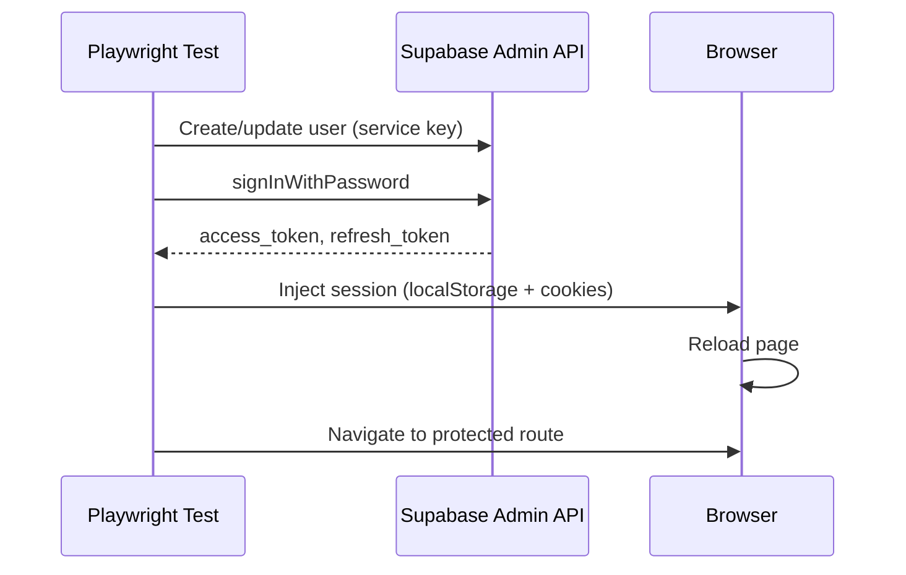

# E2E Testing

> **Purpose**: Configure and run end-to-end tests for the Magazyn application.

---

## Overview

Magazyn uses **Playwright** for e2e testing with **Supabase password-based authentication**. Tests authenticate using real JWT tokens obtained via `signInWithPassword` - this works even though the app UI uses magic links.

---

## Quick Start

### 1. Configure Environment

Add to **root `.env`**:

```bash
# Supabase (likely already set)
VITE_SUPABASE_URL=<your-supabase-url>
VITE_SUPABASE_ANON_KEY=<your-anon-key>

# E2E Testing (required)
SUPABASE_SERVICE_ROLE_KEY=<service-role-key>  # Supabase → Settings → API → Service Role
E2E_TEST_EMAIL=<test-user-email>
E2E_TEST_PASSWORD=<password>  # Optional, default: 'TestSecurePassword123!'
E2E_BASE_URL=http://localhost:4321  # Optional
```

> [!CAUTION]
> Keep `SUPABASE_SERVICE_ROLE_KEY` secret! Never commit to git.

### 2. Ensure Test User Profile

Run in Supabase SQL Editor:

```sql
INSERT INTO profiles (id, email, role, is_enabled, username, credit_balance)
SELECT id, email, 'user', true, 'e2e-tester', 100
FROM auth.users WHERE email = '<E2E_TEST_EMAIL>'
ON CONFLICT (id) DO UPDATE SET is_enabled = true;
```

### 3. Run Tests

```bash
# Terminal 1: Backend
cd backend && go run cmd/api/main.go

# Terminal 2: Run tests (starts frontend automatically)
cd frontend && npm run e2e
```

---

## Authentication Flow



> [!NOTE]
> Password auth works at the API level even though the app UI only shows magic links.

---

## Test Structure

```
frontend/e2e/
├── fixtures/index.ts        # Auth fixtures (authenticatedPage)
├── helpers/auth.helper.ts   # Auth helper functions
├── auth.spec.ts             # Login page + authenticated tests
├── auth-diagnostic.spec.ts  # Comprehensive auth diagnostics
└── equipment.spec.ts        # Equipment browsing tests
```

---

## Available Fixtures

| Fixture | Purpose |
|---------|---------|
| `page` | Standard Playwright page (no auth) |
| `authenticatedPage` | Pre-authenticated page with test user session |
| `supabaseAdmin` | Supabase admin client for setup/teardown |

### Usage

```typescript
import { test, expect } from './fixtures';

test('protected page access', async ({ authenticatedPage }) => {
  await authenticatedPage.goto('/equipment');
  await expect(authenticatedPage.getByTestId('equipment-grid')).toBeVisible();
});
```

---

## Writing New Tests

### Rules

#### 1. Use `data-testid` for Selectors

Always use `data-testid` attributes for element selection. Never rely on CSS classes or text content.

```typescript
// ✅ GOOD
await page.getByTestId('login-submit-button').click();
await expect(page.getByTestId('equipment-grid')).toBeVisible();

// ❌ BAD
await page.click('.btn-primary');
await page.getByText('Submit').click();
```

#### 2. Never Use Hardcoded Timeouts

Replace `waitForTimeout()` with explicit waits or assertions.

```typescript
// ❌ BAD - Arbitrary timeout
await page.waitForTimeout(1000);

// ✅ GOOD - Wait for specific element
await expect(page.getByTestId('modal')).toBeVisible();

// ✅ GOOD - Wait for URL change
await expect(page).toHaveURL(/\/dashboard/);

// ✅ GOOD - Wait for element state
await page.getByTestId('submit-button').waitFor({ state: 'visible' });
```

#### 3. Use Proper Assertions

Use Playwright's built-in `expect` assertions with auto-retry.

```typescript
// ✅ GOOD - Auto-retrying assertions
await expect(page.getByTestId('user-menu')).toBeVisible();
await expect(page).toHaveURL(/\/login/);
await expect(page.getByTestId('count')).toHaveText('5');

// ❌ BAD - Manual boolean checks
const isVisible = await page.getByTestId('menu').isVisible();
expect(isVisible).toBeTruthy();
```

#### 4. Import from Local Fixtures

Always import `test` and `expect` from `./fixtures`, not from `@playwright/test`.

```typescript
// ✅ GOOD
import { test, expect } from './fixtures';

// ❌ BAD
import { test, expect } from '@playwright/test';
```

#### 5. Use `authenticatedPage` for Protected Routes

Use the `authenticatedPage` fixture for any test requiring authentication.

```typescript
test.describe('Protected Feature', () => {
  test('should access feature', async ({ authenticatedPage }) => {
    await authenticatedPage.goto('/protected-page');
    // ...
  });
});
```

#### 6. Handle Optional Elements Gracefully

Use `.catch(() => false)` for elements that may not exist, and `test.skip()` when tests can't proceed.

```typescript
const hasFeature = await page.getByTestId('optional-feature').isVisible().catch(() => false);

if (!hasFeature) {
  test.skip();
  return;
}
```

#### 7. Add TSDoc Comments

Document test files and complex tests with TSDoc comments.

```typescript
/**
 * Equipment browsing e2e tests.
 * Tests the equipment listing, filtering, and cart functionality.
 *
 * @see fixtures/index.ts for authentication implementation
 */
test.describe('Equipment Browsing', () => {
  // ...
});
```

---

### Test Template

Use this template when creating new test files:

```typescript
import { test, expect } from './fixtures';

/**
 * [Feature Name] e2e tests.
 * [Brief description of what these tests cover]
 *
 * @see fixtures/index.ts for authentication implementation
 */

test.describe('[Feature Name]', () => {
  test('should [expected behavior]', async ({ authenticatedPage }) => {
    // Arrange - Navigate to page
    await authenticatedPage.goto('/feature-page');

    // Act - Perform action
    await authenticatedPage.getByTestId('action-button').click();

    // Assert - Verify result
    await expect(authenticatedPage.getByTestId('result')).toBeVisible();
  });
});
```

---

### Naming Conventions

| Item | Convention | Example |
|------|------------|---------|
| Test file | `feature.spec.ts` | `equipment.spec.ts` |
| Test describe block | Feature name | `'Equipment Browsing'` |
| Test name | `should + behavior` | `'should display equipment grid'` |
| Test ID | `component-element-id` | `equipment-card-123` |

---

## Commands

| Command | Description |
|---------|-------------|
| `npm run e2e` | Run all e2e tests |
| `npm run e2e:ui` | Run with Playwright UI |
| `npm run e2e:debug` | Run in debug mode |
| `npm run e2e -- <file>` | Run specific test file |
| `npm run e2e -- auth-diagnostic.spec.ts` | Run auth diagnostics |

---

## CI/CD Integration

### GitHub Actions

```yaml
name: E2E Tests

on: [push, pull_request]

jobs:
  e2e:
    runs-on: ubuntu-latest
    steps:
      - uses: actions/checkout@v3
      - uses: actions/setup-node@v3
        with:
          node-version: '18'
      - name: Install dependencies
        working-directory: ./frontend
        run: |
          npm ci
          npx playwright install --with-deps chromium
      - name: Run E2E Tests
        working-directory: ./frontend
        env:
          VITE_SUPABASE_URL: ${{ secrets.VITE_SUPABASE_URL }}
          VITE_SUPABASE_ANON_KEY: ${{ secrets.VITE_SUPABASE_ANON_KEY }}
          SUPABASE_SERVICE_ROLE_KEY: ${{ secrets.SUPABASE_SERVICE_ROLE_KEY }}
          E2E_TEST_EMAIL: test@example.com
          E2E_TEST_PASSWORD: TestSecurePassword123!
        run: npm run e2e
      - name: Upload test results
        if: always()
        uses: actions/upload-artifact@v3
        with:
          name: playwright-report
          path: frontend/playwright-report/
```

---

## Troubleshooting

| Issue | Solution |
|-------|----------|
| `Missing Supabase environment variables` | Set `SUPABASE_SERVICE_ROLE_KEY` in `.env` |
| `Failed to sign in for tokens` | Check password or enable user in Supabase |
| Redirect to `/login` | Session injection failed, check cookie format |
| Redirect to `/account-disabled` | Set `is_enabled = true` in profiles table |
| Backend timeout | Start Go API on port 8080 |

### Run Diagnostics

```bash
npm run e2e -- auth-diagnostic.spec.ts
```

---

## Related

- [Auth Workflow](../../documentation/workflows/auth-workflow.md)
- [Frontend Auth](./auth.md)
- [Backend Auth](../../backend/docs/auth.md)

